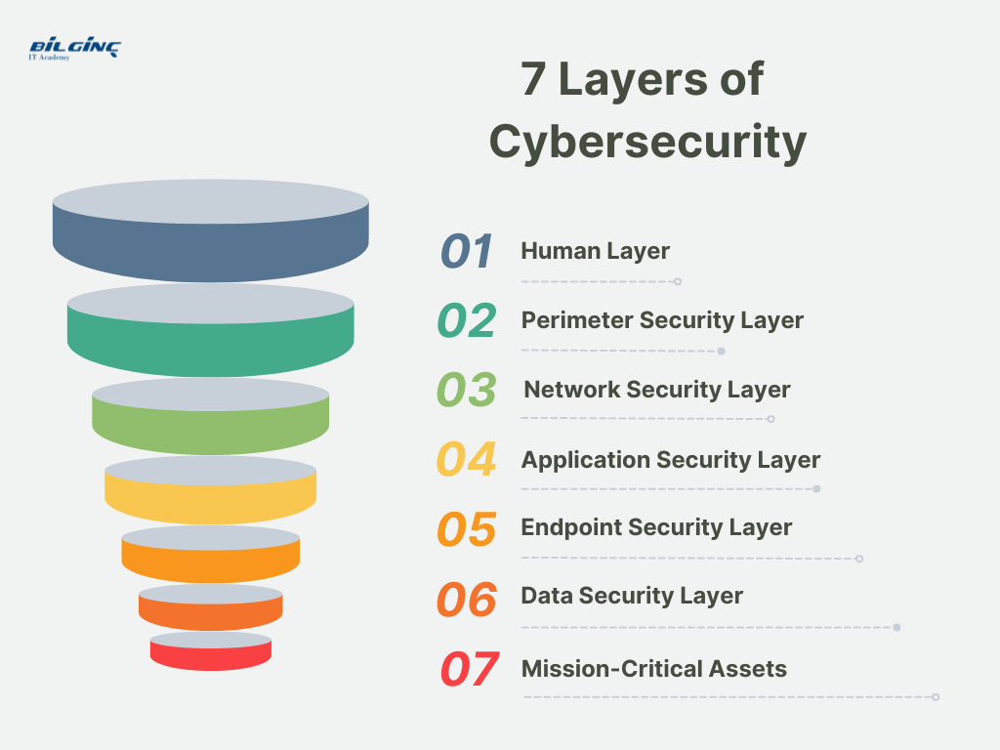

## Table of Contents

## What is seasoned security?

Seasoned security refers to stocks or bonds that have been around for a long time and are well-known in the market. These securities are considered stable and reliable because they have a history of performance that investors can look at. People often feel more comfortable investing in seasoned securities because they have less risk compared to new securities that don't have a track record yet.

For example, a company like Coca-Cola has been around for many years and its stock is considered a seasoned security. Investors know a lot about the company's past performance, its financial health, and how it has handled different economic situations. This makes it easier for investors to predict how the stock might do in the future, which can make them feel more confident about their investment decisions.

## Why is seasoned security important in cybersecurity?

Seasoned security in cybersecurity is important because it helps protect important information and systems from being hacked or attacked. When we talk about seasoned security in this context, we mean using security measures that have been around for a long time and have proven to work well. These could be things like firewalls, antivirus software, and encryption methods that have been tested and improved over many years. Because they have a long history of being effective, people trust them more and feel safer using them to protect their data.

Having seasoned security also means that there are many people who know how to use these security tools well. This is important because if something goes wrong, there are experts who can fix it quickly. It's like having a team of experienced doctors who know exactly what to do when someone gets sick. In cybersecurity, having seasoned security helps keep things running smoothly and reduces the chances of big problems happening.

## How does seasoned security differ from traditional security measures?

Seasoned security and traditional security measures can sometimes sound like the same thing, but they are a bit different. Traditional security measures are the basic tools and methods that people use to keep their information safe. These can include things like passwords, firewalls, and antivirus programs. They are the standard ways that everyone knows about and uses to protect their computers and data.

Seasoned security, on the other hand, refers to security measures that have been around for a long time and have proven to be reliable. These are the tried-and-true methods that have been tested over many years and have shown that they work well. While traditional security measures might include newer tools or methods, seasoned security focuses on the ones that have a long history of success. This makes seasoned security more trusted and dependable because people know they can count on them to keep their information safe.

## What are the basic principles of seasoned security?

Seasoned security is all about using security methods that have been around for a long time and have shown they work well. The first basic principle is reliability. When a security measure has been used for many years and has kept information safe, people trust it more. This is because it has a history of working well, even when new types of attacks come up. People feel safer using these seasoned methods because they know they can depend on them.

Another important principle is expertise. Because seasoned security methods have been around for a long time, there are a lot of experts who know how to use them well. This means if there's a problem, these experts can fix it quickly. It's like having a team of experienced doctors who know exactly what to do when someone gets sick. Having experts around makes seasoned security even more reliable and trusted.

The last principle is adaptability. Even though seasoned security methods are old, they can still be updated and improved over time. This means they can keep up with new threats and stay effective. For example, an old antivirus program can be updated to catch new viruses. This ability to adapt and stay strong makes seasoned security a good choice for keeping information safe.

## Can you provide examples of seasoned security in everyday applications?

One everyday example of seasoned security is the use of firewalls. Firewalls have been around for a long time and are used to protect computers and networks from unwanted access. When you connect to the internet, a firewall helps keep out harmful things that could hurt your computer. It's like a guard that checks who can come in and who can't. Because firewalls have been used for so many years and have been improved over time, people trust them to keep their computers safe.

Another example is antivirus software. Antivirus programs have been protecting computers from viruses for a long time. They work by looking for and removing harmful files that could damage your computer. When you download something from the internet, the antivirus program checks it to make sure it's safe. Because these programs have been around for so long and have gotten better at finding new viruses, people feel confident that their computers are protected.

A third example is encryption. Encryption has been used for many years to keep information safe when it's sent over the internet. It works by turning your information into a code that only someone with the right key can read. This is important when you're sending private information, like when you shop online or send an email. Because encryption has been used and improved for so long, it's a trusted way to keep your information private and secure.

## What are the common challenges faced when implementing seasoned security?

One common challenge when using seasoned security is keeping up with new technology. Even though seasoned security methods have been around for a long time and are trusted, new technology keeps changing. This means that the old methods might not work as well against new types of attacks. For example, a firewall that was great ten years ago might not be able to stop the newest kinds of hacking. To keep seasoned security working well, it needs to be updated and improved to match the new technology.

Another challenge is making sure everyone knows how to use seasoned security the right way. Just because a security method has been around for a long time doesn't mean everyone knows how to use it. People need to be trained and reminded about how to use things like firewalls, antivirus software, and encryption correctly. If people don't use these tools properly, they might not work as well as they should. This means that even seasoned security can fail if it's not used right.

## How can seasoned security be integrated into existing security systems?

Integrating seasoned security into existing security systems can be done by making sure the old, trusted methods work well with the new ones. For example, if you already have a newer antivirus program, you can add an older, seasoned antivirus program to work alongside it. This way, you get the benefits of both. The seasoned antivirus has a long history of finding and stopping viruses, and the newer one can catch the latest threats. By combining them, your computer gets stronger protection.

Another way to integrate seasoned security is by updating and improving the old methods to fit with your current security system. For example, if you have a seasoned firewall that has been protecting your network for years, you can update it to work with new technology. This means making sure it can stop the newest kinds of attacks while still using the reliable methods it's known for. By keeping the seasoned security methods up to date, you can keep using them safely and effectively alongside your other security tools.

## What tools and technologies are essential for seasoned security?

Seasoned security relies on tools and technologies that have been around for a long time and have proven to be reliable. One essential tool is the firewall. Firewalls have been used for many years to protect computers and networks from unwanted access. They act like a guard, checking who can come in and who can't. Because firewalls have been around for so long and have been improved over time, they are trusted to keep systems safe. Another important tool is antivirus software. Antivirus programs have been protecting computers from viruses for a long time. They work by looking for and removing harmful files that could damage your computer. Because these programs have been around for so long and have gotten better at finding new viruses, people feel confident that their computers are protected.

Encryption is another key technology for seasoned security. Encryption has been used for many years to keep information safe when it's sent over the internet. It works by turning your information into a code that only someone with the right key can read. This is important when you're sending private information, like when you shop online or send an email. Because encryption has been used and improved for so long, it's a trusted way to keep your information private and secure. These seasoned tools and technologies are essential because they have a long history of being effective and reliable, even as new threats and technologies emerge.

## How do seasoned security practices evolve with emerging threats?

Seasoned security practices evolve with emerging threats by being updated and improved over time. Even though these practices have been around for a long time, they can still be changed to deal with new dangers. For example, if a new type of virus comes out, the seasoned antivirus software can be updated to find and stop it. This means that even though the software is old, it can still protect against new threats. People who make these seasoned security tools keep working on them to make sure they stay strong and useful.

Another way seasoned security practices evolve is by working together with newer security methods. Sometimes, the old ways are not enough to stop new attacks, so they are used along with newer tools. For example, a seasoned firewall might be used with a new kind of security software that can catch the latest threats. By combining the old and the new, the overall security gets better. This way, seasoned security can keep up with the changing world of technology and stay effective against new dangers.

## What are advanced techniques used in seasoned security to protect against sophisticated attacks?

Seasoned security uses advanced techniques like intrusion detection systems to protect against sophisticated attacks. These systems have been around for a long time and are good at spotting unusual activity on a network. They work by watching the traffic on the network and looking for signs that someone might be trying to break in. If they see something strange, they can alert the people in charge so they can stop the attack before it causes any harm. Because these systems have been used and improved for many years, they are trusted to keep networks safe from even the smartest hackers.

Another advanced technique is using layered security, which means using different kinds of security methods together. For example, a seasoned firewall might be used along with encryption and antivirus software. This way, if one layer of security is not enough to stop an attack, the other layers can help. By combining these old but reliable methods, seasoned security can protect against complex attacks that might try to get through just one type of security. This approach makes it much harder for attackers to succeed because they have to get past many different kinds of protection.

## How can organizations measure the effectiveness of their seasoned security strategies?

Organizations can measure the effectiveness of their seasoned security strategies by looking at how well they stop attacks. They can keep track of how many times their systems are attacked and how many of those attacks are stopped by their seasoned security tools. For example, if they use a seasoned firewall and antivirus software, they can see if these tools are catching and blocking harmful attempts. If the number of successful attacks goes down over time, it shows that the seasoned security strategies are working well.

Another way to measure the effectiveness is by doing regular tests. Organizations can pretend to be hackers and try to break into their own systems to see if their seasoned security can stop them. This is called a penetration test. If the seasoned security tools like firewalls, antivirus programs, and encryption keep the testers out, it means they are strong and effective. By doing these tests often, organizations can make sure their seasoned security stays up to date and keeps working against new threats.

## What future trends are expected to influence the development of seasoned security?

Future trends like [artificial intelligence](/wiki/ai-artificial-intelligence) (AI) and [machine learning](/wiki/machine-learning) are expected to influence the development of seasoned security. These new technologies can help seasoned security tools get even better at stopping attacks. For example, AI can be used to make antivirus software smarter, so it can find new kinds of viruses that it hasn't seen before. This means that even though the antivirus is old, it can still protect against the latest threats. By adding AI and machine learning to seasoned security, it can keep up with the fast-changing world of technology and stay strong against new dangers.

Another trend that will affect seasoned security is the growing use of cloud computing. More and more, people are storing their information on the internet instead of on their own computers. This means that seasoned security tools like firewalls and encryption need to be able to protect information that is in the cloud. As cloud computing becomes more common, seasoned security will need to be updated to work well in this new environment. This way, even old security methods can keep information safe, no matter where it is stored.

## References & Further Reading

1. **Books**:
   - *Securitization: Structuring and Investment Analysis* by Andrew Davidson et al.: This book provides comprehensive insights into securitization structures and the analysis required for investment decisions.
   - *Principles of Financial Engineering* by Salih N. Neftci: An essential text that covers financial instruments, risk management, and the engineering of financial markets.

2. **Articles**:
   - "The Impact of Asset-Backed Securitization on Bailout Probability and Liquidity" published in the *Journal of Financial Markets* explores how securitization impacts liquidity and financial stability.
   - "Algorithmic Trading and Market Dynamics" from the *Global Finance Journal* investigates the effects of algorithmic trading on market volatility and efficiency.

3. **Papers**:
   - "Understanding the Risks and Benefits of Asset-Backed Securities" by the European Central Bank offers an analysis of ABS with respect to financial stability and economic impact.
   - "Algorithmic Trading in Practice" by the International Journal of Financial Studies, which provides an empirical overview of algorithmic trading strategies and their effectiveness.

4. **Online Resources**:
   - Investopedia's detailed guide on "Securitization" provides an accessible introduction and glossary of terms relevant to beginners and experts alike.
   - The SEC’s online educational resources offer explanations of algorithmic trading’s regulatory frameworks and associated risks.

5. **Professional Journals**:
   - The *Journal of Structured Finance*, which includes articles and case studies on the latest trends and techniques in securitization.
   - *Quantitative Finance* frequently publishes research on algorithmic trading, providing insights into the mathematical and technological aspects of modern trading strategies.

These resources offer a robust foundation for understanding the complexities of securitization, asset-backed securities, and [algorithmic trading](/wiki/algorithmic-trading), facilitating deeper engagement with the material.

