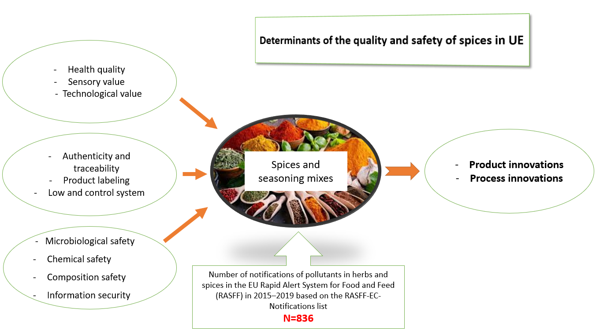

## Table of Contents

## What is seasoning?

Seasoning is something you add to food to make it taste better. It can be salt, pepper, herbs, or spices. People use seasoning to make their food more interesting and tasty. You can use it on meat, vegetables, or in soups and sauces.

There are many kinds of seasoning from different places around the world. For example, Italian seasoning might have basil and oregano, while Indian seasoning might have turmeric and cumin. Each type of seasoning can change the flavor of a dish in a special way. By trying different seasonings, you can find new flavors you like.

## What are the common types of seasoning used in cooking?

Some common types of seasoning are salt and pepper. Salt is used to bring out the flavors in food and make it taste better. It's one of the most basic seasonings and is used in almost every dish. Pepper adds a bit of spice and a sharp flavor. It can be used in many ways, like freshly ground or already ground.

Other common seasonings include herbs and spices. Herbs like basil, oregano, and thyme add fresh and sometimes sweet flavors to dishes. They are often used in Italian and Mediterranean cooking. Spices like cumin, turmeric, and paprika add warmth and depth to food. They are popular in many cuisines, including Indian and Middle Eastern dishes. Using a mix of herbs and spices can create complex and interesting flavors in your cooking.

There are also seasoning blends that combine different herbs and spices. For example, Italian seasoning usually has basil, oregano, rosemary, and thyme. This makes it easy to add a lot of flavor to a dish with just one seasoning. Another example is curry powder, which might have turmeric, cumin, coriander, and other spices. These blends can save time and help you try new flavors without having to buy many different seasonings.

## How does seasoning enhance the flavor of food?

Seasoning makes food taste better by adding different flavors to it. When you use salt, it helps bring out the natural tastes in the food. Pepper adds a bit of spice and can make the food more interesting. Herbs like basil and oregano give food a fresh taste, while spices like cumin and turmeric add warmth and depth. By using these seasonings, you can turn a simple dish into something special.

Mixing different seasonings can create new and exciting flavors. For example, Italian seasoning has a mix of herbs like basil, oregano, and thyme, which makes food taste like it came from Italy. Curry powder is another mix that includes spices like turmeric, cumin, and coriander, giving food a warm and rich flavor. Using these blends can make cooking easier and help you try new tastes without needing to buy many different seasonings.

## What are the basic mechanisms of seasoning?

Seasoning works by adding different flavors to food. Salt is a basic seasoning that helps bring out the natural tastes in food. It makes food taste better by enhancing the flavors that are already there. Pepper adds a bit of spice and a sharp taste, which can make food more interesting. When you use herbs like basil and oregano, they give food a fresh and sometimes sweet flavor. Spices like cumin and turmeric add warmth and depth, making food taste richer.

Mixing different seasonings can create new and exciting flavors. For example, Italian seasoning is a mix of herbs like basil, oregano, and thyme. When you use this, your food can taste like it came from Italy. Another example is curry powder, which is a mix of spices like turmeric, cumin, and coriander. This gives food a warm and rich flavor. Using these seasoning blends can make cooking easier and help you try new tastes without needing to buy many different seasonings.

## How do different seasonings interact with food at a molecular level?

Seasonings change how food tastes by mixing with its molecules. Salt, for example, is made of sodium and chloride ions. When you add salt to food, these ions mix with the water in the food. This helps the flavors spread out and makes the food taste better. Salt also makes the food's natural tastes stronger. Pepper has a molecule called piperine, which gives it a spicy taste. When you eat pepper, piperine touches your tongue and makes it feel a bit hot and spicy.

Herbs and spices work in different ways. Herbs like basil have molecules called essential oils. These oils give herbs their strong smells and tastes. When you cook with herbs, the heat helps the essential oils come out and mix with the food. This makes the food taste fresh and sometimes sweet. Spices like cumin and turmeric have molecules that add warmth and depth to food. For example, turmeric has a molecule called curcumin, which gives it a yellow color and a warm taste. When you use these spices, their molecules mix with the food and change its flavor in a special way.

## What are the health benefits and risks associated with various seasonings?

Seasonings like herbs and spices can be good for your health. For example, turmeric has a molecule called curcumin that can help reduce swelling and might help with heart health. Garlic can help lower blood pressure and improve your immune system. Herbs like basil and oregano have antioxidants that can protect your body from damage. Using these seasonings can add flavor to your food and also help keep you healthy.

But some seasonings can have risks too. Too much salt can lead to high blood pressure and heart problems. Pepper, when eaten in large amounts, can cause stomach problems for some people. Some spices like chili peppers can be too spicy for some people and might cause stomach pain or heartburn. It's important to use seasonings in the right amounts to enjoy their flavors and health benefits without the risks.

## How does the application of seasoning vary across different cuisines?

Different cuisines use seasoning in their own special ways. In Italian cooking, people often use herbs like basil, oregano, and rosemary. These herbs make the food taste fresh and a bit sweet. For example, they put basil on pizza and oregano in pasta sauce. In Indian cooking, they use a lot of spices like turmeric, cumin, and coriander. These spices make the food warm and rich. They mix these spices in dishes like curry and biryani.

In Mexican cuisine, chili peppers and cumin are very popular. Chili peppers make the food spicy and hot, while cumin adds a warm flavor. They use these in dishes like tacos and salsa. In Chinese cooking, they use soy sauce and ginger a lot. Soy sauce adds a salty and savory taste, and ginger adds a sharp, spicy flavor. They use these in dishes like stir-fries and dumplings. Each cuisine has its own special way of using seasonings to make their food taste unique.

## What are the traditional versus modern methods of seasoning?

In the past, people used traditional methods to season their food. They would use fresh herbs and spices they grew themselves or got from local markets. For example, they might crush fresh basil or grind peppercorns by hand. They often used simple tools like mortars and pestles to mix seasonings. These methods took more time but made the food taste very fresh and natural. People also used salt to preserve food, which was important before refrigerators were common.

Today, modern methods make seasoning easier and faster. You can buy pre-mixed seasoning blends in stores, like Italian seasoning or curry powder. These blends save time because you don't need to mix different herbs and spices yourself. Also, many people use salt shakers and pepper grinders, which are quick and easy to use. Some modern seasonings come in bottles with easy-to-use lids. While these methods are convenient, they can sometimes make the food taste less fresh than traditional methods.

## How can seasoning affect the texture and appearance of food?

Seasoning can change how food feels when you eat it. For example, salt can make meat more tender by pulling out some of its water. This makes the meat softer and easier to chew. Some seasonings, like pepper or chili flakes, can add a bit of crunch to food. When you sprinkle them on top, they don't melt away and give a different feel in your mouth. Also, if you use a lot of certain spices, like paprika or turmeric, they can make food feel thicker or creamier, especially in soups and sauces.

Seasoning can also make food look different. Some spices, like paprika and turmeric, have bright colors that can change the look of a dish. For example, turmeric can turn food yellow, and paprika can make it red. Salt can make food look a bit wetter or shinier, especially on the outside of meat. When you use fresh herbs like parsley or cilantro, they can add a pop of green color to your food. This makes the dish look more colorful and inviting.

## What role does seasoning play in food preservation?

Seasoning, especially salt, has been used for a long time to help keep food fresh. Salt pulls water out of food, which makes it hard for bacteria and mold to grow. This is called curing. People used to cure meat and fish with salt to keep them from going bad before they had refrigerators. This way, they could store food for a long time and eat it later.

Other seasonings like vinegar and spices can also help keep food fresh. Vinegar is acidic, and it can stop bacteria from growing. People use it to pickle vegetables and other foods. Spices like mustard seeds or peppercorns can also help preserve food because they have natural chemicals that fight bacteria. Using these seasonings can make food last longer and keep it safe to eat.

## How can one experiment with seasoning to develop new flavors?

You can experiment with seasoning by trying different mixes of herbs and spices. Start with small amounts of new seasonings and taste as you go. This way, you can see how each seasoning changes the flavor of your food. For example, you might add a little bit of cumin to your usual recipe and see if you like the warm taste it adds. If you want to try something new, mix different seasonings together. You could combine basil and oregano for an Italian flavor or use turmeric and coriander for an Indian taste. Keep trying new mixes until you find flavors you really like.

Another way to experiment is by using seasoning blends. These are mixes of different herbs and spices that you can buy at the store. They can save time and help you try new flavors without needing to buy many different seasonings. For example, you could use a curry powder blend to add a warm and rich flavor to your dishes. You can also make your own blends by mixing seasonings you already have. Write down what you use so you can make the same blend again if you like it. Experimenting with seasoning is fun and can help you find new and exciting flavors for your food.

## What advanced techniques are used in professional kitchens for seasoning?

In professional kitchens, chefs use special ways to season food to make it taste really good. One way is called "blooming" spices. This means they heat up spices in oil or butter before adding them to the food. This makes the spices' flavors stronger and more interesting. Chefs also use a technique called "layering" flavors. They add seasonings at different times while cooking. For example, they might add salt at the start to bring out the food's natural taste, then add herbs at the end to keep their fresh flavor.

Another advanced technique is "dry brining." This is when chefs rub salt and sometimes other seasonings all over meat and let it sit for a while before cooking. The salt pulls out some of the meat's water, then the water goes back into the meat with the salt, making the meat taste better and stay moist. Chefs also use "finishing salts," which are special salts they sprinkle on food right before serving. These salts add a nice crunch and a burst of flavor at the end. By using these techniques, professional chefs can make their dishes taste amazing.

## What is the Science of Seasoning in Culinary Arts?

Seasoning is a culinary technique critical for enhancing the flavor of food, achieved by the addition of ingredients such as salt, herbs, and spices. This method can dramatically alter a dish’s flavor profile, making it pivotal in culinary arts. Salt plays a key role as it enhances the inherent flavors of food, often by reducing bitterness and improving sweetness perception through a process known as threshold inhibition. It is argued that salt modifies the ionic strength of a dish, allowing for the distinct taste receptors to be more or less sensitive to certain flavors. This ion alteration can be mathematically represented as changes in concentration $C$ of the ions, where an optimal concentration helps balance flavor perception.

$$
C = \frac{n}{V}
$$

Where $n$ is the amount of substance (moles) and $V$ is the [volume](/wiki/volume-trading-strategy) of the mixture, impacting how taste receptors experience various flavors.

Moreover, spices contribute to complexity and depth, introducing aromatic compounds that interact with olfactory senses to enhance flavor perception. The application of spices—such as cinnamon, cloves, and pepper—varies across cuisines, adding unique characteristics to dishes. For instance, Mediterranean cooking often includes oregano and thyme, offering a fragrant herbaceousness, while Asian cuisines frequently incorporate soy sauce and spices like star anise and Sichuan peppercorns, providing umami and heat facets to dishes.

Chefs approach the planning of seasoning with precision, focusing on the proportion, timing, and application to achieve a harmonious blend of flavors. For instance, the timing of adding certain spices can prevent the loss of volatile aromatic compounds, crucial for the depth of flavor. This methodology aligns with the scientific understanding of Maillard reactions in caramelization, where temperature and timing significantly influence flavor output.

In culinary terminology, the balance of primary tastes—salty, sweet, sour, and bitter—is essential, engaging the palate to elevate the dish. This balance is akin to a culinary formula where each ingredient represents a variable influencing the final taste outcome. The orchestration of these variables enables chefs to achieve a desired sensory effect, transforming basic ingredients into a refined gastronomic experience.

## References & Further Reading

[1]: Bergstra, J., Bardenet, R., Bengio, Y., & Kégl, B. (2011). ["Algorithms for Hyper-Parameter Optimization."](https://dl.acm.org/doi/10.5555/2986459.2986743) Advances in Neural Information Processing Systems 24.

[2]: ["Advances in Financial Machine Learning"](https://www.amazon.com/Advances-Financial-Machine-Learning-Marcos/dp/1119482089) by Marcos Lopez de Prado

[3]: ["Evidence-Based Technical Analysis: Applying the Scientific Method and Statistical Inference to Trading Signals"](https://www.amazon.com/Evidence-Based-Technical-Analysis-Scientific-Statistical/dp/0470008741) by David Aronson

[4]: ["Machine Learning for Algorithmic Trading"](https://github.com/stefan-jansen/machine-learning-for-trading) by Stefan Jansen

[5]: ["Quantitative Trading: How to Build Your Own Algorithmic Trading Business"](https://www.amazon.com/Quantitative-Trading-Build-Algorithmic-Business/dp/1119800064) by Ernest P. Chan