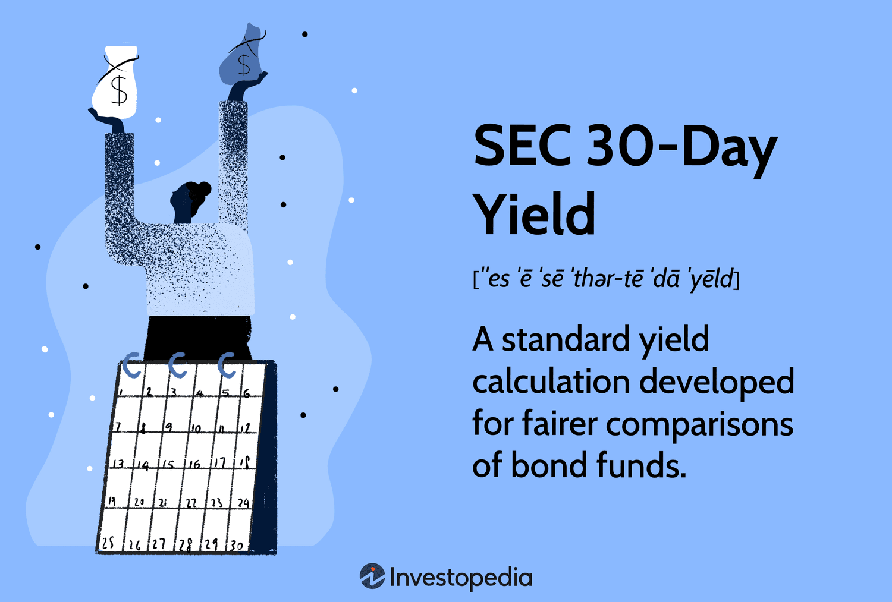

## Table of Contents

## What is the SEC 30-Day Yield?

The SEC 30-Day Yield is a standard measure used to show how much money an investment, like a mutual fund or an exchange-traded fund (ETF), has earned over the past 30 days. It is calculated by the U.S. Securities and Exchange Commission (SEC) and helps investors compare the performance of different funds. The yield is expressed as an annual percentage rate, which makes it easier to understand how much return you might expect from your investment over a year.

This yield is important because it gives a clear, standardized way to see how well a fund is doing. It takes into account the fund's income and expenses, but it does not include any capital gains or losses. This means it focuses on the income the fund generates, like dividends and interest, and subtracts the costs of running the fund. By using the SEC 30-Day Yield, investors can make better choices about where to put their money based on how much income a fund is likely to provide.

## Why is the SEC 30-Day Yield important for investors?

The SEC 30-Day Yield is important for investors because it helps them understand how much money they might earn from a fund. It's like a snapshot of the fund's recent performance, showing the income it made over the last 30 days. This number is shown as if it were for a whole year, which makes it easy to compare with other funds. When investors see this yield, they can get a good idea of how well the fund is doing in terms of generating income.

This yield is also important because it's a standard measure. This means that no matter which fund you're looking at, the SEC 30-Day Yield is calculated the same way. It takes into account the money the fund earns from things like dividends and interest, and it also subtracts the costs of running the fund. This gives investors a clear, fair way to compare different funds and see which ones might give them the best income for their investment.

## How is the SEC 30-Day Yield calculated?

The SEC 30-Day Yield is figured out by looking at the money a fund made over the last 30 days. It includes the income from things like dividends and interest that the fund earned during that time. Then, it takes away the costs of running the fund, like management fees. After that, it turns this 30-day number into a yearly rate. This is done by multiplying the net income by a [factor](/wiki/factor-investing) that changes the 30-day period into a whole year.

This way of calculating the yield makes it easy for people to see how much money they might get from a fund if they keep it for a year. It's like a standard way of measuring how well a fund is doing in terms of [earning](/wiki/earning-announcement) money. By using the same method for all funds, the SEC 30-Day Yield helps people compare different funds and see which ones might give them the best return on their investment.

## What are the key components needed to calculate the SEC 30-Day Yield?

To calculate the SEC 30-Day Yield, you need to know the income the fund made over the last 30 days. This income comes from things like dividends and interest that the fund earned. You also need to know the costs of running the fund, like the fees for managing it. These costs are subtracted from the income to find out the net income for those 30 days.

Once you have the net income for the 30 days, you turn it into a yearly rate. You do this by multiplying the net income by a special number that changes the 30-day period into a whole year. This special number is called an annualization factor. By doing this, the SEC 30-Day Yield shows how much money the fund might make in a year, based on the last 30 days.

## Can you provide a simple example of calculating the SEC 30-Day Yield for a mutual fund?

Let's say you have a mutual fund that made $100,000 from dividends and interest over the last 30 days. The cost of running the fund, like management fees, was $10,000 during that time. To find the SEC 30-Day Yield, you first subtract the costs from the income. So, $100,000 minus $10,000 gives you a net income of $90,000 for the 30 days.

Next, you need to turn this 30-day net income into a yearly rate. You do this by multiplying the net income by a special number called the annualization factor. This factor is about 12.167 (365 days divided by 30 days). So, you multiply $90,000 by 12.167, which gives you $1,095,030. To find the yield as a percentage, you divide this number by the total value of the fund. If the fund's total value is $100,000,000, then $1,095,030 divided by $100,000,000 is 0.0109503, or about 1.10%. So, the SEC 30-Day Yield for this fund would be around 1.10%.

## How does the SEC 30-Day Yield differ from other yield measures like the distribution yield?

The SEC 30-Day Yield and the distribution yield are two different ways to measure how much money a fund makes, but they look at different things. The SEC 30-Day Yield shows the income a fund earned over the last 30 days, after taking away the costs of running the fund. It then turns this number into a yearly rate, so you can see how much the fund might make in a year. This yield is calculated the same way for all funds, which makes it easy to compare them.

The distribution yield, on the other hand, looks at the money the fund paid out to investors over the last year. This includes dividends and interest that were actually given to the people who own the fund. Unlike the SEC 30-Day Yield, the distribution yield doesn't take away the costs of running the fund. It just shows what you got in your pocket from the fund over the past year. So, while the SEC 30-Day Yield gives you a standardized, forward-looking estimate, the distribution yield tells you about the actual payouts you received in the past.

## What are the common mistakes to avoid when calculating the SEC 30-Day Yield?

One common mistake to avoid when calculating the SEC 30-Day Yield is not subtracting the costs of running the fund. The yield looks at the income the fund made over the last 30 days, but you have to take away the fees and expenses to get the right number. If you forget to do this, your yield will be too high, and it won't give you a true picture of how well the fund is doing.

Another mistake is not using the correct annualization factor. The SEC 30-Day Yield turns the 30-day income into a yearly rate, and you do this by multiplying by a special number, about 12.167. If you use the wrong number, your yield will be off, and it won't show what the fund might earn in a year. Always make sure to use the right factor to get an accurate yield.

## How often should the SEC 30-Day Yield be updated for a fund?

The SEC 30-Day Yield for a fund should be updated every month. This means that once a month, the fund looks at the money it made over the last 30 days, subtracts the costs of running the fund, and then turns that number into a yearly rate. By doing this every month, investors can see the most recent performance of the fund and make better decisions about their investments.

Updating the SEC 30-Day Yield monthly helps keep the information fresh and useful. If it wasn't updated regularly, the yield wouldn't show what the fund is doing right now. It would be like looking at old news. So, by updating it every month, investors get a clear, up-to-date picture of how much money the fund might make in a year, based on the last 30 days.

## What impact do fees and expenses have on the SEC 30-Day Yield?

Fees and expenses have a big impact on the SEC 30-Day Yield because they lower the amount of money the fund makes. When you calculate the yield, you start with the income the fund got from things like dividends and interest over the last 30 days. But then, you have to take away the costs of running the fund, like management fees. These costs make the net income smaller, which means the yield will be lower too. So, if a fund has high fees and expenses, the SEC 30-Day Yield will be less than if the costs were low.

This is important for investors to understand because the SEC 30-Day Yield shows how much money they might get from the fund. If the fees and expenses are high, the yield goes down, and investors might think the fund is not doing as well as it could. By looking at the yield, investors can see how the costs affect the money the fund makes and decide if the fund is a good choice for them. It helps them compare different funds and pick the ones that give them the best return after all the costs are taken out.

## How can the SEC 30-Day Yield be used to compare different investment funds?

The SEC 30-Day Yield is a great way to compare different investment funds because it gives you a standard way to see how much money each fund might make in a year. When you look at the SEC 30-Day Yield for different funds, you're seeing how much income they made over the last 30 days, after taking away the costs of running the fund. This makes it fair to compare funds, no matter what they invest in or how they are managed. If one fund has a higher SEC 30-Day Yield than another, it means that fund might give you more money for your investment over the next year.

Using the SEC 30-Day Yield to compare funds helps you make smarter choices about where to put your money. For example, if you're looking at two funds and one has a yield of 2% and the other has a yield of 1%, the first fund might be a better choice if you're looking for more income. But remember, the yield is just one part of the picture. You should also think about other things like how risky the fund is and what it invests in. By looking at the SEC 30-Day Yield along with other information, you can pick the fund that fits your goals and how much risk you're okay with.

## What are the limitations of using the SEC 30-Day Yield as a performance metric?

The SEC 30-Day Yield is a helpful way to see how much money a fund might make, but it has some limits. One big limit is that it only looks at the income the fund made over the last 30 days. This means it doesn't show you the whole picture of how the fund is doing. It doesn't include any money the fund might have made or lost from changes in the value of its investments, like stocks going up or down. So, if you just look at the SEC 30-Day Yield, you might miss out on important information about the fund's overall performance.

Another limit is that the SEC 30-Day Yield can change a lot from month to month. Since it's based on just the last 30 days, if something big happens in the market during that time, the yield might not be a good guide for what the fund will do in the future. Also, the yield doesn't tell you about the risks of the fund. A fund might have a high yield, but it could also be very risky. So, when you're thinking about using the SEC 30-Day Yield to pick a fund, remember it's just one piece of the puzzle. You should look at other things like the fund's history, what it invests in, and how risky it is before making a choice.

## Can you discuss a complex case study where the SEC 30-Day Yield significantly impacted investment decisions?

Imagine there's a big fund called "Growth and Income Fund" that many people invest in. One month, the SEC 30-Day Yield for this fund jumped up to 3%, which was much higher than its usual yield of around 2%. This big change caught the eye of many investors. They saw the high yield and thought the fund was doing really well, so they started putting more money into it. But what they didn't know was that the high yield was because the fund had just gotten a big one-time payment from one of its investments. This payment made the yield look good for that month, but it wasn't something that would keep happening.

Soon after, the SEC 30-Day Yield went back down to 2% the next month. The investors who had put more money into the fund because of the high yield were now disappointed. They thought they were going to get more money from the fund, but it turned out the high yield was just a one-time thing. This case shows how the SEC 30-Day Yield can be tricky. It's good for comparing funds, but it can change a lot from month to month. So, it's important for investors to look at more than just the yield when they're making choices about where to put their money. They should also think about what the fund invests in, how risky it is, and its performance over a longer time.

## What is SEC Yield?

The SEC yield is a standardized metric formulated by the U.S. Securities and Exchange Commission to enable fair and objective comparisons of bond funds, such as mutual funds and exchange-traded funds (ETFs). This yield calculation specifically focuses on a 30-day period, reflecting the fund's income after expenses, offering transparency and consistency in evaluating performance.

### Calculation of SEC Yield

The SEC yield is based on the interest and dividends received by a fund over the most recent 30-day period. It accounts for the fund's operating expenses to present a clear view of the earnings that can be expected by investors. The formula to calculate the SEC yield is as follows:

$$
\text{SEC Yield} = \left(\frac{\text{Net Investment Income per Share}}{\text{Maximum Offering Price per Share}} \right) \times \frac{365}{30}
$$

Where:
- **Net Investment Income per Share** is the income received by the fund from its investments, minus any expenses incurred.
- **Maximum Offering Price per Share** is the share price at which the fund is offered to the public.

By annualizing the 30-day net investment income and considering it against the share price, the SEC yield provides an estimate of the annual earnings rate, assuming that the income remains constant.

### Importance of SEC Yield

The standardized nature of SEC yield makes it an invaluable tool for investors. It allows them to compare different bond funds on an equal footing, eliminating discrepancies caused by varying expense structures and income distribution policies. This transparency aids investors in making informed decisions when selecting funds that align with their financial objectives.

Additionally, the SEC yield caters to both novice and seasoned investors by simplifying complex fund performance indicators into a comprehensible and consistent yield calculation. This standardization ensures that investors can appropriately assess the potential income from a fund, providing a reliable basis for comparison across the diverse landscape of fixed-income investment options like mutual funds and ETFs.

In summary, the SEC yield is a critical measure designed to enhance the clarity and comparability of income-generating funds, fostering better financial decision-making among investors.

## What is the 30-Day Yield and how can it be understood?

The 30-day yield is a critical metric for investors assessing bond fund performance, providing a projection of what the fund could yield over a year if the returns remain uniform. It is essentially a standardized yield calculation method based on the net income and asset value observed over the past 30 days, offering a clear window into the bond fund's income-generating capabilities.

### Calculation Method

The calculation of the 30-day yield involves a straightforward formula, which integrates the fund's dividends and interest collected during the past 30 days, minus any associated expenses. The resultant figure is annualized and expressed as a percentage of the fund’s net asset value (NAV). The formula is:

$$
\text{30-Day Yield} = \left( \frac{\text{Distributions} - \text{Expenses}}{\text{Average Net Assets}} \right) \times \frac{365}{30}
$$

Here, "Distributions" refer to the dividends and interest payments the fund has received, and "Expenses" are the fees and costs incurred over the same period. "Average Net Assets" is the mean value of the fund’s assets during those 30 days. 

### Significance

The 30-day yield metric is significant for several reasons:

1. **Standardization**: It offers a consistent measure across different funds, allowing for more straightforward comparisons.
2. **Insightful Performance Measure**: Reflects the effective earning power of a fund post-expenses, aiding investors in evaluating whether a fund meets their income needs.
3. **Predictive Assessment**: Helps investors estimate the potential annual income they might gain from investing in the fund, assuming stable market conditions.

### Example Calculation

To illustrate, consider a bond fund that has collected $100,000 in interest and dividends over 30 days, with $2,000 in expenses and average net assets of $10 million. The 30-day yield calculation would proceed as follows:

$$
\text{30-Day Yield} = \left( \frac{100,000 - 2,000}{10,000,000} \right) \times \frac{365}{30}
$$

$$
\text{30-Day Yield} = \left( \frac{98,000}{10,000,000} \right) \times \frac{365}{30}
$$

$$
\text{30-Day Yield} = 0.0098 \times 12.1667 = 0.1192
$$

Expressed as a percentage, the 30-day yield of this bond fund would be approximately 1.192%.

Understanding and applying the 30-day yield calculation allows investors to better evaluate bond fund performance, making it an indispensable tool in the investment decision-making process.

## What is the performance of investments: A closer look?

Investment performance is a critical aspect of evaluating the effectiveness of a fund or portfolio. A thorough understanding of performance metrics such as SEC yield and 30-day yield can significantly aid investors in aligning their strategies with financial goals. Both of these metrics serve as valuable tools for assessing the potential returns and overall health of an investment product.

The SEC yield is a standardized measure developed by the U.S. Securities and Exchange Commission. It is designed to provide a fair basis for comparing the performance of bond funds and exchange-traded funds (ETFs). The calculation of the SEC yield is based on the net investment income earned over a 30-day period, which is then annualized and expressed as a percentage of the fund's net asset value (NAV). The formula is as follows:

$$
\text{SEC Yield} = \left( \frac{\text{Net Investment Income}}{\text{NAV}} \right) \times \left( \frac{365}{30} \right) \times 100
$$

This formula ensures that investors can effectively compare post-expense earnings across different funds, promoting transparency and consistency.

The 30-day yield also provides insight into a fund's potential returns by annualizing its returns over a 30-day period. Unlike the SEC yield, which standardizes post-expense earnings, the 30-day yield focuses on the income generated by the fund, assuming constant returns over a year. This metric allows investors to gauge what they might expect to earn over a year if the fund's current earnings rate continues. 

Both SEC yield and 30-day yield are integral in assessing fund performance; however, they serve slightly different purposes. While the SEC yield accounts for the expenses associated with managing a fund, the 30-day yield provides a glimpse of the income potential without factoring in those expenses. Together, they offer a comprehensive picture of a fund's performance, aiding investors in their decision-making process.

Investors should not limit themselves to yield metrics alone when evaluating investment performance. Other important considerations include historical total returns, risk-adjusted performance metrics such as Sharpe Ratio and Alpha, and the economic and market conditions that might impact future returns. By integrating these various metrics, investors can better understand a fund's performance dynamics and make informed decisions to meet their financial objectives.

## What are the implications for investors?

In the modern investment landscape, yield metrics such as SEC yield and 30-day yield play crucial roles in guiding investor decisions by providing clear indicators of fund performance and potential income. By understanding and utilizing these metrics, investors can make more informed choices about their investments, optimizing their portfolios to meet financial goals.

The SEC yield offers investors a standardized measure to compare mutual funds and ETFs by reflecting the earnings after expenses over a 30-day period. This yield metric is especially useful for bond funds, where it indicates the net income generated. By assessing SEC yields, investors can identify funds that consistently offer better post-expense returns relative to others, eliminating variations caused by differences in accounting practices. Thus, SEC yield serves as a reliable benchmark for investors looking to maximize their income potential while minimizing expense leakage.

On the other hand, the 30-day yield provides a snapshot of a fund's current return potential by projecting the income earned if the fund's current yield were maintained over a year. This measure helps investors assess whether a bond fund fits their income target while considering the impact of market fluctuations. By calculating the 30-day yield using the formula:

$$
\text{30-Day Yield} = \left( \frac{\text{Net Investment Income} - \text{Fees}}{\text{Net Asset Value}} \right) \times 365 \times 100\%
$$

investors gain insights into the income-generating capability of their chosen funds, which is crucial when constructing income-focused portfolios.

Moreover, [algorithmic trading](/wiki/algorithmic-trading) has emerged as a powerful tool for investors looking to enhance the precision and speed of their trades. Algorithmic systems can analyze vast amounts of data, including yield metrics, to execute trades under predefined conditions, capturing opportunities before they dissipate in fast-moving markets. By incorporating SEC yield and 30-day yield data into algorithmic trading strategies, investors can optimize transactions to capitalize on favorable yield trends while efficiently managing risks associated with market [volatility](/wiki/volatility-trading-strategies). 

For instance, an algorithm could be set to execute trades automatically when a fund’s 30-day yield exceeds a predetermined threshold, suggesting an attractive income opportunity. This approach allows investors to systematically exploit yield differentials across funds or rebalance portfolios dynamically to maintain desired income levels.

In conclusion, yield metrics and algorithmic trading offer investors a powerful combination for making informed and timely investment decisions. By leveraging these tools, investors can enhance fund performance assessment, optimize income potential, and effectively navigate market opportunities, thus driving towards their financial objectives with clarity and strategic foresight.

## References & Further Reading

[1]: ["SEC Yield"](https://www.investopedia.com/terms/s/secyield.asp), U.S. Securities and Exchange Commission

[2]: ["Algorithmic Trading: Winning Strategies and Their Rationale"](https://www.wiley.com/en-us/Algorithmic+Trading%3A+Winning+Strategies+and+Their+Rationale-p-9781118460146) by Ernie Chan

[3]: ["The Handbook of Fixed Income Securities"](https://www.amazon.com/Handbook-Fixed-Income-Securities-Ninth/dp/1260473899) by Frank J. Fabozzi

[4]: ["Design Patterns for Algorithmic Trading Strategies"](https://www.investopedia.com/articles/active-trading/101014/basics-algorithmic-trading-concepts-and-examples.asp) by Tomasini & Jaekle

[5]: ["Market Microstructure: The Organization of Trading and Short Term Price Dynamics"](https://books.google.com/books/about/Microstructure.html?id=Vq0UtAEACAAJ) by Larry Harris

[6]: ["Advances in Financial Machine Learning"](https://www.amazon.com/Advances-Financial-Machine-Learning-Marcos/dp/1119482089) by Marcos Lopez de Prado