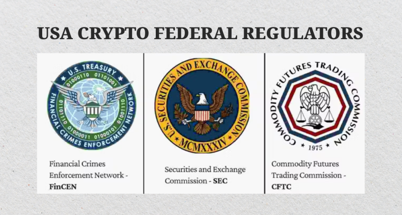

## Table of Contents

## What is the role of the SEC in regulating cryptocurrencies?

The SEC, or Securities and Exchange Commission, is a government agency in the United States that helps make sure that the stock market and other investments are fair and safe for everyone. When it comes to cryptocurrencies like Bitcoin and Ethereum, the SEC's job is to figure out if these digital coins are actually securities. Securities are like stocks or bonds that people invest in. If a cryptocurrency is a security, then it has to follow certain rules to protect investors.

The SEC looks at different cryptocurrencies to see if they should be treated as securities. They do this by checking if people who buy the cryptocurrency are expecting to make money from the efforts of others, like how you might expect a company's stock to grow because of the company's work. If a cryptocurrency is found to be a security, the people who created and sold it need to follow strict rules. These rules are there to make sure that investors get all the information they need to make good choices. The SEC also keeps an eye out for fraud and scams in the cryptocurrency world to protect people from losing their money to dishonest schemes.

## How do SEC regulations impact financial advisors dealing with cryptocurrencies?

SEC regulations can make things more complicated for financial advisors who want to work with cryptocurrencies. If a cryptocurrency is considered a security by the SEC, financial advisors have to follow special rules. They need to make sure they give their clients all the right information about the cryptocurrency, like how risky it is and what they might gain or lose. This means advisors have to do a lot of research and keep up with what the SEC says about different cryptocurrencies.

These rules can also limit what financial advisors can do with cryptocurrencies. For example, they might not be able to recommend certain cryptocurrencies to their clients if they're not sure if they're securities or not. This can be tricky because the rules can change, and what's okay one day might not be okay the next. So, financial advisors need to be careful and stay informed to help their clients make smart choices about investing in cryptocurrencies.

## What are the basic compliance requirements for financial advisors under SEC rules regarding cryptocurrencies?

When financial advisors want to deal with cryptocurrencies, they need to follow some rules from the SEC. If a [cryptocurrency](/wiki/cryptocurrency) is considered a security, advisors must give their clients all the important information about it. This includes explaining how risky the investment is and what the possible gains or losses might be. Advisors need to do their homework and make sure they know everything about the cryptocurrency before they talk to their clients about it.

These rules can make things a bit harder for financial advisors. They have to be careful about which cryptocurrencies they recommend to their clients. If they're not sure if a cryptocurrency is a security or not, they might not be able to suggest it. The rules can change, so advisors need to keep up with what the SEC says and be ready to change how they work if needed. This helps them keep their clients safe and make sure they're following the law.

## Can financial advisors legally offer cryptocurrency investment advice to their clients?

Financial advisors can legally offer cryptocurrency investment advice to their clients, but they need to be very careful. If a cryptocurrency is considered a security by the SEC, advisors have to follow strict rules. They must give their clients all the important information about the cryptocurrency, like how risky it is and what the possible gains or losses might be. This means advisors need to do a lot of research to make sure they understand the cryptocurrency well before they talk to their clients about it.

The rules can make things tricky for financial advisors. They might not be able to recommend certain cryptocurrencies if they're not sure whether they are securities or not. Since the SEC's rules can change, advisors have to keep up with the latest information and be ready to adjust their advice. By doing this, they can help their clients make smart choices about investing in cryptocurrencies while staying within the law.

## What are the risks associated with cryptocurrencies that financial advisors need to be aware of?

Financial advisors need to know that cryptocurrencies can be very risky. One big risk is that the value of cryptocurrencies can go up and down a lot, sometimes in just a few days. This means that someone who invests in them could lose a lot of money quickly. Also, cryptocurrencies are not backed by anything like a government or a bank, so there's no safety net if something goes wrong. This makes them different from traditional investments like stocks or bonds.

Another risk is that the rules around cryptocurrencies can change. Governments and agencies like the SEC might decide to make new laws or change old ones, which could affect how people can use or invest in cryptocurrencies. This can make it hard for financial advisors to give good advice because the rules might be different tomorrow. On top of that, there's a lot of fraud and scams in the world of cryptocurrencies. Bad people can try to trick investors, so advisors need to be very careful and make sure their clients know about these dangers.

## How should financial advisors disclose cryptocurrency investments to their clients according to SEC guidelines?

When financial advisors talk to their clients about investing in cryptocurrencies, they have to follow rules from the SEC. If a cryptocurrency is seen as a security, advisors need to tell their clients everything important about it. This means explaining how risky it is and what the possible gains or losses might be. They have to do a lot of research to make sure they know all about the cryptocurrency before they talk to their clients. This helps clients make smart choices and understand what they're getting into.

Advisors also need to be clear about any fees or costs that come with investing in cryptocurrencies. They should tell their clients if they get paid for recommending certain cryptocurrencies. This way, clients know if the advice might be influenced by money. By being open and honest, advisors can help their clients trust them and make good decisions about their investments.

## What are the specific SEC rules that apply to the custody of cryptocurrencies by financial advisors?

The SEC has rules about how financial advisors should handle their clients' cryptocurrencies. If a cryptocurrency is considered a security, advisors must keep it safe, just like they would with stocks or bonds. They need to use a qualified custodian, which is like a safe place approved by the SEC, to hold the cryptocurrencies. This helps make sure the cryptocurrencies are secure and that clients can get them back if something goes wrong.

Advisors also have to keep good records of the cryptocurrencies they are holding for their clients. They need to know exactly how much each client owns and make sure it's all accounted for. If there's ever a problem, like if a client thinks some of their cryptocurrency is missing, the advisor has to be able to show where it is and that it's safe. This helps build trust with clients and makes sure everything is done the right way.

## How does the SEC classify different types of cryptocurrencies, and what are the regulatory implications for financial advisors?

The SEC looks at different cryptocurrencies to see if they should be treated as securities. They do this by checking if people who buy the cryptocurrency are expecting to make money from the efforts of others, kind of like how you might expect a company's stock to grow because of the company's work. If a cryptocurrency is found to be a security, it has to follow strict rules to protect investors. Some cryptocurrencies, like Bitcoin and Ethereum, are often not seen as securities, but others, especially new ones that promise returns based on a project or company, might be classified as securities.

When a cryptocurrency is classified as a security, financial advisors have to follow special rules. They need to give their clients all the important information about the cryptocurrency, like how risky it is and what they might gain or lose. This means advisors have to do a lot of research and keep up with what the SEC says about different cryptocurrencies. If they're not sure if a cryptocurrency is a security or not, they might not be able to recommend it to their clients. This can make things tricky for advisors because the rules can change, and they need to stay informed to help their clients make smart choices about investing in cryptocurrencies.

## What steps must financial advisors take to ensure they are not involved in the sale of unregistered securities in the form of cryptocurrencies?

Financial advisors need to be careful not to sell unregistered securities when dealing with cryptocurrencies. To do this, they should first figure out if the cryptocurrency they are looking at is a security. The SEC says a cryptocurrency is a security if people who buy it are expecting to make money from the efforts of others, like how you might expect a stock to grow because of a company's work. Advisors need to do a lot of research to understand if a cryptocurrency fits this description. If it does, they should only recommend it if it is registered with the SEC or if it qualifies for an exemption from registration.

If a financial advisor finds out that a cryptocurrency is a security, they need to make sure it's registered with the SEC before they sell it to their clients. They also need to tell their clients all the important information about the cryptocurrency, like how risky it is and what the possible gains or losses might be. This helps clients make smart choices. Advisors should keep up with what the SEC says about different cryptocurrencies because the rules can change. By being careful and staying informed, advisors can avoid getting involved in selling unregistered securities.

## How can financial advisors stay updated on the evolving SEC regulations concerning cryptocurrencies?

Financial advisors need to keep up with the SEC's rules about cryptocurrencies because they can change a lot. One good way to stay updated is by regularly checking the SEC's website. The SEC puts out news, updates, and new rules there. Advisors can also sign up for email alerts from the SEC to get the latest information sent right to them. Another way is to join groups or associations that focus on financial advice and cryptocurrencies. These groups often share the latest news and help members understand new rules.

Another helpful thing for financial advisors is to go to workshops, webinars, or conferences about cryptocurrencies and SEC rules. These events can teach them about the latest changes and how to follow them. Advisors can also talk to lawyers who know a lot about securities laws. These lawyers can give advice on how to stay on the right side of the law when dealing with cryptocurrencies. By using these methods, financial advisors can make sure they know the latest rules and help their clients make smart choices about investing in cryptocurrencies.

## What are the potential penalties for financial advisors who fail to comply with SEC cryptocurrency regulations?

If financial advisors do not follow the SEC's rules about cryptocurrencies, they can get into big trouble. The SEC can fine them a lot of money. These fines can be really high, sometimes even millions of dollars, depending on how bad the mistake was. The SEC might also stop the advisor from working in the financial industry for a while or even forever. This can hurt their career a lot.

Besides fines and being banned from working, financial advisors might also have to go to court. If they broke the law on purpose, they could be charged with a crime. This means they might have to go to jail. Also, if their clients lose money because the advisor did not follow the rules, the clients might sue the advisor. This can lead to more money problems and a bad reputation for the advisor.

## How do international regulations intersect with SEC rules on cryptocurrencies for financial advisors operating globally?

Financial advisors who work around the world need to know about both the SEC rules and the rules from other countries when it comes to cryptocurrencies. The SEC has its own set of rules for cryptocurrencies that might be seen as securities. But other countries have their own rules too, and these can be different from what the SEC says. For example, some countries might have stricter rules about how to keep cryptocurrencies safe, or they might not see certain cryptocurrencies as securities at all. This can make things confusing for advisors because they have to follow the rules from the SEC and also the rules from wherever they are working.

To handle this, financial advisors need to learn about the rules in each country they work in. They might need to talk to lawyers who know about the laws in different places to make sure they are doing everything right. It's important for advisors to keep up with changes in rules from both the SEC and other countries. This way, they can help their clients make smart choices about investing in cryptocurrencies no matter where they are.

## References & Further Reading

[1]: Gandal, N., Hamrick, J. T., Moore, T., & Oberman, T. (2018). ["Price manipulation in the Bitcoin ecosystem."](https://www.sciencedirect.com/science/article/pii/S0304393217301666) Journal of Monetary Economics, 95, 86-96.

[2]: Nakamoto, S. (2008). ["Bitcoin: A Peer-to-Peer Electronic Cash System."](https://nakamotoinstitute.org/library/bitcoin/)

[3]: Yermack, D. (2017). ["Corporate governance and blockchains."](https://academic.oup.com/rof/article/21/1/7/2888422) Review of Finance, 21(1), 7-31.

[4]: Catalini, C., & Gans, J. S. (2016). ["Some Simple Economics of the Blockchain."](https://papers.ssrn.com/sol3/papers.cfm?abstract_id=2874598) MIT Sloan Research Paper No. 5191-16.

[5]: U.S. Securities and Exchange Commission. (2020). ["Statement on Digital Asset Securities."](https://www.sec.gov/newsroom/speeches-statements/joint-staff-statement-broker-dealer-custody-digital-asset-securities)

[6]: KPMG. (2020). ["Institutionalization of Cryptoassets."](https://assets.kpmg.com/content/dam/kpmg/us/pdf/2018/11/institutionalization-cryptoassets.pdf)

[7]: ["Advances in Financial Machine Learning"](https://www.amazon.com/Advances-Financial-Machine-Learning-Marcos/dp/1119482089) by Marcos Lopez de Prado

[8]: ["Quantitative Trading: How to Build Your Own Algorithmic Trading Business"](https://www.amazon.com/Quantitative-Trading-Build-Algorithmic-Business/dp/0470284889) by Ernest P. Chan