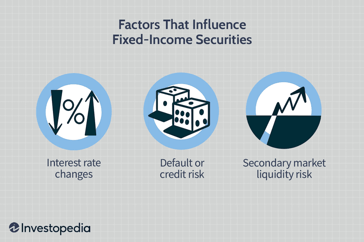

Transaction fees are a critical component of financial markets, influencing the dynamics of trading and investment decisions. These fees affect market liquidity, trading volumes, and ultimately, the returns of investment strategies. For investors engaging in algorithmic trading, understanding transaction costs, including those mandated by regulatory bodies like the Securities and Exchange Commission (SEC), is essential. Algorithmic trading, characterized by high-frequency and large-volume trades, is particularly sensitive to transaction costs. Even slight variations in fee structures can significantly impact the profitability of trading strategies. 

In recent years, the SEC fee has gained prominence among market participants. This fee, also referred to as the Section 31 Transaction Fee, is charged on the sale of exchange-listed equities and aims to cover the costs of regulation and oversight of financial markets. As trading volumes fluctuate, the SEC adjusts this fee to ensure that the total collected fees align with regulatory funding needs. 



This article provides a comprehensive overview of financial transaction fees, with a focus on the SEC rate and SEC fee, highlighting their importance in the context of algorithmic trading. By understanding these intricacies, traders and investors can make informed decisions, optimize trading strategies, and manage costs effectively to enhance their net returns.

## Table of Contents

## What is the SEC Fee?

The SEC fee, also known as the Section 31 Transaction Fee, is a nominal financial charge applied specifically to the sale of exchange-listed equities. Instituted by the Securities Exchange Act of 1934, this fee is an essential component of the regulatory framework governing U.S. financial markets. The legislative mandate requires brokers and exchanges to collect this fee, thereby incorporating it into the structure of equities transactions.

The rationale behind the SEC fee is to ensure adequate funding for the regulatory agency's activities. The Securities and Exchange Commission (SEC) utilizes the revenue generated from these fees to oversee and enforce compliance with federal securities laws. In essence, the fee contributes to the costs associated with monitoring securities transactions, ensuring market integrity, and protecting investors from fraudulent activities.

The fee structure is crafted to scale with the trading volume, thereby reflecting the dynamic nature of financial markets. By adhering to a systematic approach, the SEC can adjust the fee rate as required, usually on an annual basis, in response to the prevailing market conditions and trading volumes. This flexibility ensures that fee collection aligns with the operational and regulatory funding requirements of the SEC, thereby maintaining an equitable and efficient market environment.

## Understanding the SEC Rate

The SEC rate is a dynamic fee structure adapted annually to align with fluctuations in trading volumes. This adjustment mechanism ensures that the collected fees accurately reflect the Securities and Exchange Commission's (SEC) funding requirements for regulatory activities. When trading activity surges, the SEC may reduce the fee rate to avoid generating excess revenue beyond its budgetary needs. This practice prevents the over-collection of fees that could burden market participants without serving regulatory purposes.

Conversely, during periods of decreased trading [volume](/wiki/volume-trading-strategy), the SEC may increase the fee rate to maintain adequate funding. By doing so, the SEC ensures that sufficient resources are available to sustain its oversight and enforcement responsibilities regardless of market conditions. This balancing act allows the SEC to modulate its fee collection in a manner that supports its mission while considering the financial implications for traders and exchanges.

## Impact of SEC Fees on Algorithmic Trading

Algorithmic traders engage in high-frequency trading, executing numerous trades simultaneously based on pre-determined criteria. Due to their extensive transaction volumes, the inclusion of transaction fees, such as the SEC fee, can lead to significant cumulative costs, affecting overall profitability. One of the key challenges for these traders is the efficient management of transaction costs to ensure optimized trading outcomes.

Understanding the structure of SEC fees is crucial for algorithmic traders. The SEC fee, or Section 31 Transaction Fee, is applied to the sale of exchange-listed equities and varies with trading volumes. This variability means that algorithmic traders must continuously monitor any adjustments to the SEC rate to align their strategies accordingly. For instance, an increase in SEC fees could necessitate modifications to trade frequencies or volumes to maintain cost-effectiveness.

Effective fee management directly impacts the net returns of [algorithmic trading](/wiki/algorithmic-trading) portfolios. Traders can employ various strategies like minimizing trade execution costs or strategically timing trades to reduce fee implications. Algorithmic trading systems can be programmed to account for potential transaction costs, using algorithms that include cost estimates as part of their decision-making process. 

Here's a simplified Python example illustrating how transaction fees might be incorporated into a trading strategy:

```python
def calculate_net_profit(trade_volume, price_per_share, sec_fee_rate):
    gross_profit = trade_volume * price_per_share
    transaction_fees = trade_volume * price_per_share * sec_fee_rate
    net_profit = gross_profit - transaction_fees
    return net_profit

# Example parameters
trade_volume = 10000  # shares
price_per_share = 50  # dollars
sec_fee_rate = 0.0000927  # SEC fee rate per share (example rate)

net_profit = calculate_net_profit(trade_volume, price_per_share, sec_fee_rate)
print(f"Net Profit: ${net_profit:.2f}")
```

In this example, understanding and implementing SEC fees in the trade calculations allows traders to project their net profits accurately. By integrating such computations into their proprietary algorithms, traders can fine-tune their strategies to leverage fee structures that maximize returns. Thus, regular updates and adaptations to these algorithms are vital to capitalizing on prevailing market conditions and regulatory changes. This foresight helps algorithmic traders maintain a competitive edge and optimize the profitability of their trading operations.

## Examples of SEC Fee Adjustments

The Securities and Exchange Commission (SEC) fee, known formally as the Section 31 Transaction Fee, is subject to periodic adjustments based on trading volumes and other market conditions. These adjustments ensure that the fees collected match the funding requirements for the SEC's regulatory activities. 

For example, in 2018, a significant adjustment was made when the fee rate was reduced to $13 per million dollars in sales. This reduction was primarily a result of high trading volumes, which naturally increased the total fee collection even at a lower rate per transaction. The rationale behind this adjustment was to prevent over-accumulation of funds beyond what was necessary for regulatory purposes.

Similarly, in 2022, the SEC fee rate was adjusted to $92.70 per million dollars. This increase highlighted a shift in trading dynamics and the need for higher fee collection to meet regulatory funding needs. Changes in trading volumes can often necessitate such adjustments; when trading activity decreases, a higher fee per transaction may be required to support consistent regulatory oversight.

These historical adjustments underscore the SEC's approach of dynamically calibrating the fee rate to align with market conditions and regulatory objectives. Such flexibility ensures that the burden of financial oversight does not disproportionately impact market participants, while still providing the necessary resources for regulatory enforcement and market monitoring.

## Conclusion

Transaction fees, such as the SEC fee, significantly impact financial markets by affecting decision-making and strategy development. For algorithmic traders, recognizing and managing these fees is crucial for maintaining competitive advantage and profitability. The SEC fee, levied on the sale of exchange-listed equities, adds to trading costs and can influence the net returns of trading portfolios, especially for high-frequency traders. Algorithmic trading strategies often involve executing numerous transactions in rapid succession. Therefore, a deep understanding of fee structures and potential adjustments can lead to more accurate cost estimations and optimized trading models.

By staying informed about the SEC fee adjustments and their implications, traders can make timely decisions to adjust their strategies in response to evolving market conditions. This knowledge not only aids in predicting potential cost fluctuations but also in implementing risk management techniques to safeguard profitability. For example, a keen awareness of changes in the SEC rate enables algorithmic traders to optimize the timing of trades and adjust their trading algorithms to minimize fee-related expenses.

Furthermore, incorporating up-to-date fee information into trading algorithms can provide a competitive edge. This can be executed through automated systems that track and integrate fee changes in real-time, enabling dynamic adjustment of trading strategies. The ability to anticipate and respond to fee adjustments equips traders with tools to enhance trading performance and maintain a profitable operation in fluctuating market environments.

## Further Reading and References

Explore articles on the impact of transaction fees in financial markets on Investopedia for more detailed insights on how these fees influence trading strategies and market dynamics. The platform provides comprehensive articles and guides that can enhance your understanding of transaction costs, including the nuances of the SEC fee and its impact on trading environments.

For the latest updates on SEC fee rates and regulatory changes, visit the U.S. Securities and Exchange Commission's official website. This resource offers direct access to current fee structures, proposed changes, and detailed documentation on regulatory policies affecting transaction fees.

Additionally, for those interested in algorithmic trading, exploring content related to market microstructure and cost-efficient trading strategies on platforms like SSRN and Google Scholar may provide academic perspectives and research findings that could enrich your knowledge and practical approach to managing transaction fees in trading portfolios.

By consulting these resources, market participants can stay informed and make well-rounded decisions that consider both current regulations and academic insights, optimizing their trading strategies in line with evolving market conditions.

## References & Further Reading

[1]: U.S. Securities and Exchange Commission, ["Fee Rate Advisory"](https://www.sec.gov/newsroom/press-releases/2024-47) for details on current and historical SEC fee rates.

[2]: Investopedia, ["SEC Section 31 Transaction Fees"](https://www.sec.gov/rules-regulations/fee-rate-advisories/section-31-fees-basic-information-firms) for an overview of what SEC transaction fees are and how they are applied.

[3]: Hasbrouck, J. (2007). ["Empirical Market Microstructure: The Institutions, Economics, and Econometrics of Securities Trading"](https://academic.oup.com/book/52241) for insights into market microstructure and trading costs.

[4]: Aldridge, I. (2013). ["High-Frequency Trading: A Practical Guide to Algorithmic Strategies and Trading Systems"](https://onlinelibrary.wiley.com/doi/pdf/10.1002/9781119203803.fmatter) for a deeper understanding of algorithmic trading strategies and their sensitivity to transaction costs.

[5]: [SSRN](https://www.ssrn.com/index.cfm/en/) for research articles on transaction costs and their impact on algorithmic trading strategies.