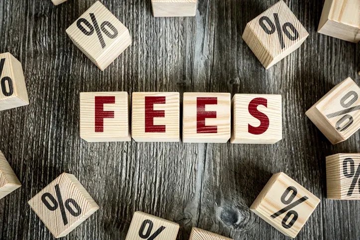

## Table of Contents

## What are SEC fees?

SEC fees are charges that investors have to pay when they buy or sell certain securities, like stocks. The SEC, which stands for the Securities and Exchange Commission, is a government agency that regulates the stock market and other financial markets. The fees help the SEC cover the costs of making sure the markets are fair and transparent. When you trade stocks, a small part of the transaction goes to the SEC.

The amount of the SEC fee can change, but it's usually very small compared to the total cost of the trade. For example, if you buy or sell a stock, the fee might be just a few cents for every $100,000 you trade. These fees are usually collected by your broker, who then sends the money to the SEC. Even though the fee is small, it's important because it helps the SEC do its job of protecting investors and keeping the market honest.

## Why does the SEC impose fees?

The SEC imposes fees to help pay for its work in keeping the stock market fair and safe for everyone. The SEC is like a watchdog that makes sure companies and people who sell stocks follow the rules. By collecting these fees, the SEC can keep an eye on the market and make sure that everyone plays by the same rules. This helps protect people who invest their money in stocks from being cheated or misled.

These fees are small and usually come out of the money you spend when you buy or sell stocks. They are not meant to make money for the SEC but to cover the costs of doing its important job. When you trade stocks, your broker takes a tiny part of the money and sends it to the SEC. This way, the SEC can keep working to make sure the market stays honest and trustworthy without asking for money directly from taxpayers.

## How are SEC fees calculated?

SEC fees are figured out based on how much money you are trading. If you are buying or selling stocks, the fee is a tiny part of the total amount of your trade. For example, if you trade $100,000 worth of stocks, you might pay a few cents in SEC fees. The exact amount can change, but it's always a very small percentage of your trade.

The SEC decides on the fee rate, and it can go up or down depending on what the SEC needs to do its job. Your broker, the company you use to buy and sell stocks, takes this fee out of your trade and sends it to the SEC. Even though it's a small amount, these fees add up and help the SEC keep the stock market fair and safe for everyone.

## What is the current SEC fee rate?

The current SEC fee rate is $5.10 for every $1 million in sales of securities. This means if you sell $1 million worth of stocks, you will pay $5.10 in SEC fees. The fee is very small, but it adds up when a lot of people are trading.

This rate can change over time, depending on what the SEC needs to do its job of watching over the stock market. The SEC uses these fees to make sure the market stays fair and safe for everyone who invests. Your broker takes this fee out of your trade and sends it to the SEC.

## Who is required to pay SEC fees?

People who buy or sell certain securities, like stocks, have to pay SEC fees. The SEC, which stands for the Securities and Exchange Commission, is a government group that makes sure the stock market is fair and safe. When you trade stocks, a tiny part of your trade goes to the SEC to help them do their job.

The fees are usually taken by your broker, the company you use to buy and sell stocks. They take a small amount from your trade and send it to the SEC. Even though the fee is very small, it helps the SEC keep an eye on the market and protect people who invest their money.

## How often are SEC fees collected?

SEC fees are collected every time you buy or sell certain securities, like stocks. This happens with each trade you make, so if you trade a lot, you'll pay the fee more often. The fee is very small, just a tiny part of your trade, but it adds up because so many people are trading all the time.

Your broker, the company you use to buy and sell stocks, takes the SEC fee out of your trade and sends it to the SEC. This way, the SEC can keep watching the market and making sure it's fair without asking for money directly from taxpayers. Even though you might not notice the fee because it's so small, it's important because it helps the SEC do its job of protecting investors.

## Can SEC fees be passed on to clients?

Yes, SEC fees can be passed on to clients. When you buy or sell stocks, your broker, the company you use to do the trading, takes a small part of your trade as the SEC fee. They then send this money to the SEC. This fee is very small, but your broker can add it to the cost of your trade, so you end up paying it.

This happens because the SEC fee is part of the cost of trading. Your broker might show it as a separate charge on your trading statement, or they might include it in the total cost of the trade. Either way, the SEC fee is something that clients usually have to pay when they trade stocks.

## What is the historical trend of SEC fee rates?

The SEC fee rate has changed over the years. It started out higher, but over time, it has gone down. For example, in the early 2000s, the fee rate was around $30.70 per million dollars of securities sold. This was a lot more than the current rate of $5.10 per million dollars. The SEC changes the fee rate based on how much money they need to do their job of watching the stock market and making sure it's fair.

These changes happen because the SEC needs to balance their budget. When they have enough money, they might lower the fee rate. If they need more money to do their work, they might raise it. The fee rate can also be affected by how much trading is happening in the market. More trading means more fees collected, so the SEC might adjust the rate to make sure they have enough money without making the fees too high for people who trade stocks.

## How do SEC fees impact financial markets?

SEC fees are small charges that people pay when they buy or sell stocks. These fees help the SEC, which is a government group, do its job of making sure the stock market is fair and safe. The fees are very tiny, just a few cents for every million dollars traded, but they add up because so many people trade stocks every day. When people know the SEC is watching and making sure the market is fair, they feel more confident about investing their money.

Even though SEC fees are small, they can affect how much it costs to trade stocks. If the fees go up, it might make trading a little more expensive for everyone. But the fees are usually so small that they don't change people's decisions about buying or selling stocks very much. The main goal of the fees is to help the SEC do its important work, which helps keep the whole market running smoothly and honestly.

## What are the differences between SEC fees and other regulatory fees?

SEC fees are charges that people pay when they buy or sell stocks. These fees help the Securities and Exchange Commission (SEC) do its job of making sure the stock market is fair and safe. The SEC is a government group that watches over the market to make sure everyone follows the rules. The fees are very small, just a few cents for every million dollars traded, but they add up because so many people trade stocks every day. 

Other regulatory fees can come from different places and have different purposes. For example, the Financial Industry Regulatory Authority (FINRA) also charges fees, but these are used to make sure brokers and dealers follow the rules. FINRA fees might be based on different things, like how many trades a broker does or how much money they handle. Unlike SEC fees, which are mainly about keeping the market fair, other regulatory fees might focus on different parts of the financial world, like making sure banks or insurance companies follow the rules.

## How can one estimate future SEC fee liabilities?

To estimate future SEC fee liabilities, you need to know how much you plan to trade in the stock market. The SEC fee is a small amount, currently $5.10 for every million dollars of stocks you sell. So, if you think you will sell $2 million worth of stocks next year, you can estimate your SEC fee liability by multiplying $2 million by the fee rate of $5.10 per million. That would be $10.20 in SEC fees.

Keep in mind that the SEC can change the fee rate. They might raise it if they need more money to do their job, or lower it if they have enough. You can check the current fee rate on the SEC's website or ask your broker. Also, if you trade a lot, your fees will add up faster. So, it's a good idea to keep an eye on how much you're trading and stay updated on any changes to the SEC fee rate.

## What are the potential reforms being discussed regarding SEC fees?

People are talking about changing how the SEC collects its fees. One idea is to make the fees simpler and easier to understand. Right now, the fees are based on how much money you trade, but some people think it would be better if everyone paid the same small fee, no matter how much they trade. This could make it easier for people to know how much they will have to pay.

Another idea is to use the fees for more than just watching the stock market. Some people think the SEC should use the money to help teach people about investing and how to stay safe in the market. This could help more people feel confident about investing their money. But, any changes would need to be carefully thought out to make sure the SEC can still do its important job of keeping the market fair and safe.

## References & Further Reading

[1]: U.S. Securities and Exchange Commission, ["Fee Rate Advisory"](https://www.sec.gov/newsroom/press-releases/2024-47) for details on current and historical SEC fee rates.

[2]: Investopedia, ["SEC Section 31 Transaction Fees"](https://www.sec.gov/rules-regulations/fee-rate-advisories/section-31-fees-basic-information-firms) for an overview of what SEC transaction fees are and how they are applied.

[3]: Hasbrouck, J. (2007). ["Empirical Market Microstructure: The Institutions, Economics, and Econometrics of Securities Trading"](https://academic.oup.com/book/52241) for insights into market microstructure and trading costs.

[4]: Aldridge, I. (2013). ["High-Frequency Trading: A Practical Guide to Algorithmic Strategies and Trading Systems"](https://onlinelibrary.wiley.com/doi/pdf/10.1002/9781119203803.fmatter) for a deeper understanding of algorithmic trading strategies and their sensitivity to transaction costs.

[5]: [SSRN](https://www.ssrn.com/index.cfm/en/) for research articles on transaction costs and their impact on algorithmic trading strategies.