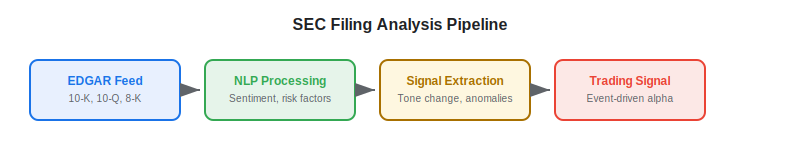
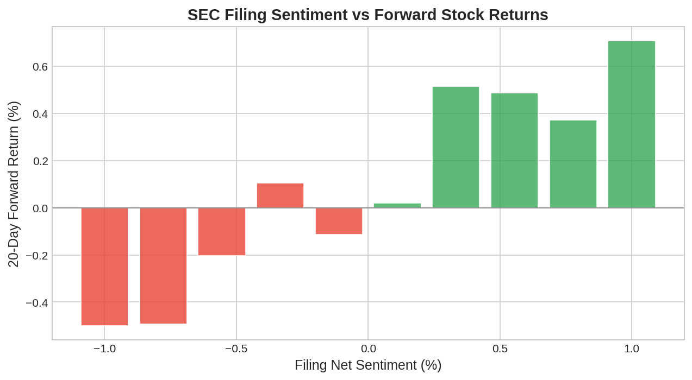

SEC filings are a goldmine of [alternative data](https://paperswithbacktest.com/wiki/best-alternative-data) hiding in plain sight. While every investor has access to 10-K, 10-Q, and 8-K filings through the EDGAR database, the alpha lies in **how quickly and systematically** you process them. Algo traders using [NLP](https://paperswithbacktest.com/wiki/nlp-sentiment-analysis-trading) to parse filings can extract sentiment shifts, risk factor changes, and accounting anomalies within seconds of publication — far faster than any human analyst.

## What Is EDGAR Data in Trading?

EDGAR (Electronic Data Gathering, Analysis, and Retrieval) is the SEC's system for receiving and distributing corporate filings. Key filing types for traders:

| Filing | Content | Frequency | Trading Signal |
|---|---|---|---|
| 10-K | Annual report with full financials | Annual | Tone changes, risk factor updates |
| 10-Q | Quarterly financials | Quarterly | Revenue surprises, guidance changes |
| 8-K | Material events | As needed | M&A, leadership changes, restatements |
| 13-F | Institutional holdings | Quarterly | Fund positioning, smart money flows |
| Form 4 | Insider transactions | Within 2 business days | Insider buying/selling signals |
| DEF 14A | Proxy statements | Annual | Governance, executive compensation |

The EDGAR system provides free, real-time access to all filings via its EDGAR Full-Text Search API and the SEC's structured data feeds (XBRL).

## How SEC Filing Data Creates Trading Signals

### Textual Sentiment Analysis

The tone of management's language in 10-K and 10-Q filings predicts future stock returns. Loughran and McDonald (2011) showed that the frequency of negative words in annual reports is associated with lower future returns, higher volatility, and larger earnings surprises. Algo traders systematically score every filing within seconds of publication.

### Risk Factor Changes

Companies are required to disclose material risks in their filings. When a new risk factor appears — or an existing one is significantly rewritten — it signals emerging threats. Tracking risk factor changes across consecutive filings reveals what management is newly worried about.

$$\text{Risk Change Score} = 1 - \text{cosine\_similarity}(\text{RF}_{t}, \text{RF}_{t-1})$$

### Filing Timing Anomalies

Companies that file late or file after hours are statistically more likely to contain bad news. Research shows that Friday evening filings tend to contain negative information that management hopes will be overlooked.

### Insider Transaction Patterns (Form 4)

Insider buying is one of the strongest single signals in equity markets. Cluster insider buying — multiple insiders purchasing simultaneously — is particularly predictive.



## Python Implementation: EDGAR Filing Analyzer

```python
import numpy as np
import pandas as pd
import re
from collections import Counter

# Loughran-McDonald negative word sample (abbreviated)
LM_NEGATIVE = {"loss", "losses", "decline", "declined", "adverse", "adversely",
    "impairment", "impaired", "risk", "risks", "uncertainty", "litigation",
    "lawsuit", "penalty", "penalties", "default", "breach", "failure",
    "terminate", "terminated", "restructuring", "downturn", "unfavorable"}

LM_POSITIVE = {"achieve", "achieved", "benefit", "benefits", "gain", "gains",
    "improve", "improved", "improvement", "profitable", "profitability",
    "success", "successful", "strength", "favorable", "innovation", "growth"}

def score_filing_sentiment(text: str) -> dict:
    """
    Score SEC filing text using Loughran-McDonald dictionary.
    
    Parameters:
    - text: Full text of SEC filing (10-K, 10-Q)
    """
    words = re.findall(r'\b[a-z]+\b', text.lower())
    total = len(words)
    
    neg_count = sum(1 for w in words if w in LM_NEGATIVE)
    pos_count = sum(1 for w in words if w in LM_POSITIVE)
    
    neg_pct = neg_count / total if total > 0 else 0
    pos_pct = pos_count / total if total > 0 else 0
    net_sentiment = pos_pct - neg_pct
    
    return {
        "total_words": total,
        "negative_pct": f"{neg_pct:.3%}",
        "positive_pct": f"{pos_pct:.3%}",
        "net_sentiment": f"{net_sentiment:+.3%}",
        "signal": "BULLISH" if net_sentiment > 0.002 else "BEARISH" if net_sentiment < -0.002 else "NEUTRAL",
    }

def detect_risk_factor_changes(current_rf: str, previous_rf: str) -> dict:
    """
    Detect meaningful changes in risk factor disclosures.
    """
    current_words = set(current_rf.lower().split())
    previous_words = set(previous_rf.lower().split())
    
    new_words = current_words - previous_words
    removed_words = previous_words - current_words
    
    # Jaccard similarity
    intersection = current_words & previous_words
    union = current_words | previous_words
    similarity = len(intersection) / len(union) if union else 1.0
    change_score = 1.0 - similarity
    
    return {
        "similarity": f"{similarity:.2%}",
        "change_score": f"{change_score:.2%}",
        "new_keywords": len(new_words),
        "removed_keywords": len(removed_words),
        "significant_change": change_score > 0.20,
    }

# Example
sample_text = """The company achieved strong revenue growth and improved profitability 
despite adverse market conditions. Risks include potential litigation and regulatory 
uncertainty. Management successfully restructured operations to reduce losses."""

result = score_filing_sentiment(sample_text)
for k, v in result.items():
    print(f"  {k}: {v}")
```



## Key Implementation Details

**EDGAR access**: The SEC provides a free API. Set a custom User-Agent header with your email as required by SEC fair access policies. The SEC EDGAR full-text search system allows real-time monitoring of new filings.

**XBRL parsing**: Financial data in SEC filings is increasingly available in structured XBRL format, allowing direct extraction of revenue, earnings, and balance sheet items without text parsing.

**Filing speed**: New filings appear on EDGAR within minutes of submission. For event-driven strategies (8-K filings), processing speed matters — the first algo to parse a material event filing has the largest informational edge.

## Limitations and Risks

**Boilerplate language**: Much of SEC filing text is standardized legal language that carries no informational content. Effective analysis requires filtering out boilerplate and focusing on year-over-year changes.

**Filing complexity**: Large 10-K filings can exceed 100,000 words. Processing requires robust NLP pipelines that handle tables, exhibits, and cross-references.

**Regulatory language drift**: The meaning of disclosure language evolves as SEC guidance changes. Models need periodic recalibration.

## Conclusion

SEC filing data is unique among alternative data sources: it is free, comprehensive, legally mandated, and rich with actionable information. For algo traders, the edge comes from speed (parsing within seconds of publication) and sophistication (using [NLP](https://paperswithbacktest.com/wiki/nlp-sentiment-analysis-trading) to extract nuanced sentiment and risk signals that simple keyword counting misses).

---

**Explore further on PapersWithBacktest:**
- Browse [backtested filing-based strategies](https://paperswithbacktest.com/strategies) with Python code and performance metrics
- Access [clean historical market data](https://paperswithbacktest.com/datasets) for equities, crypto, and futures
- Take the [algo trading course](https://paperswithbacktest.com/course) — 60+ video lessons and notebooks
- Related wiki pages: [NLP for Trading](https://paperswithbacktest.com/wiki/nlp-sentiment-analysis-trading) · [Best Alternative Data Sources](https://paperswithbacktest.com/wiki/best-alternative-data)
