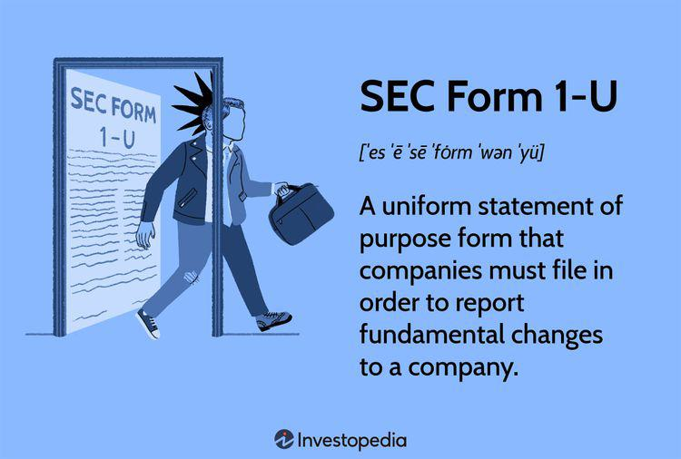

SEC Form 1-U is a critical regulatory document required by the U.S. Securities and Exchange Commission (SEC). It mandates that companies disclose significant changes affecting their operations or financial status. This form is paramount in maintaining transparency and protecting investors in financial markets. For firms engaged in algorithmic trading, understanding and complying with the requirements of SEC Form 1-U is of utmost importance. Algorithmic trading relies heavily on rapid execution and precision, which means any undisclosed material changes could have profound implications for trading strategies and investor trust.

The article will explore the financial disclosure requirements linked to SEC Form 1-U and assess their critical relevance to firms engaged in automated and algorithmic trading. Ensuring compliance with these disclosures not only protects stakeholder interests but also upholds the integrity of the financial markets. We will discuss practical approaches companies can take to adhere to these regulations effectively, emphasizing the importance of transparency and accurate reporting to safeguard stakeholder interests and maintain market confidence.



## Table of Contents

## Understanding SEC Form 1-U

SEC Form 1-U is designed to report significant changes in a company’s operations or financial status. These changes may encompass events such as bankruptcy, mergers, acquisitions, or changes in control, as well as the departure of key corporate officers. These are vital occurrences that can substantially affect a firm's trajectory and, by extension, its stakeholders.

For algorithmic trading firms, reporting such changes is particularly crucial. Given the rapid pace and high stakes of algo trading, any alterations in corporate structure or financial health could lead to ripple effects impacting not only investors but also the broader array of market participants engaged in this sector. Accurate and timely reporting through Form 1-U ensures that shareholders and potential investors remain informed about developments that might influence their investment decisions.

The requirements of Form 1-U also include detailed disclosures such as the total offering of shares, the list of states where securities are proposed for sale, and indications of any states that refuse to authorize the sale. This comprehensive level of disclosure helps maintain transparency and provides critical information for assessing the potential risks or benefits of continued or prospective investment.

Such disclosures are essential in ensuring that stakeholders are aware of material developments within a company. By keeping investors fully informed, companies align with regulatory standards designed to preserve market integrity and fairness. Ultimately, SEC Form 1-U serves as a vital mechanism for maintaining the flow of information necessary for the functioning of efficient and transparent financial markets.

## SEC Form 1-U and Small Corporate Offering Registration (SCOR)

SEC Form 1-U is an essential component of the Small Corporate Offering Registration (SCOR) process, which enables small companies, including [algorithmic trading](/wiki/algorithmic-trading) startups, to issue exempt securities. SCOR serves as a streamlined process that allows these firms to access capital markets, bypassing the extensive registration requirements typically associated with larger entities. The integration of Form 1-U within SCOR ensures that any significant changes occurring during the offering period are promptly communicated to investors, thereby maintaining a high level of transparency and accountability.

For algo trading firms, the ability to efficiently navigate the SCOR process and comply with Form 1-U reporting requirements is crucial. The dynamic nature of trading algorithms and market strategies means that material changes are likely to occur, whether they be shifts in corporate structure, financial status, or strategic direction. By using Form 1-U to report these changes, companies can keep investors informed and uphold the integrity of their operations, critical factors in ensuring investor confidence and market trust.

The regulations surrounding SCOR and SEC Form 1-U are designed to protect investors by enforcing disclosure of relevant information that could impact their decision-making. Failure to comply with these regulations can lead to legal complications and reputational damage, making adherence essential for small firms, particularly those involved in high-stakes sectors like algorithmic trading.

Thus, comprehensive compliance with SCOR in conjunction with SEC Form 1-U is not merely a legal obligation but a strategic advantage. By fostering transparency and accountability, algo trading firms can not only avoid legal pitfalls but also enhance their competitive standing in the financial markets. As such, these firms must prioritize the development and implementation of robust compliance strategies to navigate the complexities of these regulatory frameworks successfully.

## Role of SEC Form 1-U in Algo Trading

Algorithmic trading, a method of executing orders using automated and pre-programmed trading instructions, is an area constantly exposed to evolving regulations. SEC Form 1-U acts as a regulatory instrument for algo trading firms, ensuring they communicate significant operational changes to stakeholders. Given the high-frequency nature of algorithmic trading, any delay in compliance with regulatory disclosures can directly affect trading algorithms and strategies.

The necessity for rapid adaptation to regulatory requirements in algorithmic trading environments highlights the importance of Form 1-U. This form mandates disclosures of not only quantitative alterations but also strategic direction shifts that could influence the core trading model. For example, if an algorithmic trading firm makes a significant change in its risk management strategy or in a key algorithm, this must be reported through Form 1-U to inform investors and market participants promptly.

The risk of penalties due to non-compliance, such as fines or legal challenges, underscores the critical importance of accurate and timely Form 1-U filings. Maintaining investor confidence hinges on the transparency and reliability of the firm's regulatory compliance track record. Transparency is crucial when algorithmic strategies are heavily reliant on trust and precision.

Algorithmic trading firms should remain vigilant of any regulatory amendments that might influence trading strategies. Continuous monitoring of regulatory updates and timely execution of compliance tasks are imperative for maintaining competitiveness. For instance, if the SEC introduces new requirements linked to the disclosure of algorithmic trading models, firms must swiftly integrate these into their existing regulatory frameworks.

An effective compliance strategy involving Form 1-U should also include an automated system for monitoring and reporting significant organizational changes. Leveraging technology for compliance processes can ensure that filings are both timely and precise, reducing the administrative burden while enhancing the operational integrity of the firm’s trading activity. In doing so, algo trading firms can mitigate potential legal and financial drawbacks, preserving their operational viability and market position.

## Implications of Non-Compliance

Non-compliance with SEC Form 1-U presents significant risks for companies, particularly for algorithmic trading firms operating in an environment where precision and transparency are paramount. The failure to adhere to filing requirements can result in substantial financial penalties and legal consequences. Regulatory bodies, keen on maintaining market integrity, scrutinize firms that neglect these obligations, often leading to investigations and sanctions. Consequently, algo trading firms may face operational disruptions, with increased regulatory oversight hampering their ability to operate efficiently and potentially tarnishing their reputations.

Investor trust hinges on the availability of accurate, timely information. Companies that comply with Form 1-U ensure stakeholders are well-informed, which is crucial for informed investment decisions. In contrast, non-compliance can undermine investor confidence, translating to financial and credibility losses. Investors may perceive firms that fail to disclose material changes as high-risk, leading to reduced investment and a negative impact on stock prices.

To navigate these challenges, it's crucial for firms, especially those heavily reliant on algorithmic strategies, to implement robust compliance infrastructures. This involves integrating regulatory compliance into daily operations and strategic planning. A key aspect is the establishment of a comprehensive compliance program that emphasizes regular audits, training, and the employment of compliance officers to oversee adherence to SEC regulations.

Moreover, the fast-evolving nature of algo trading necessitates that firms continuously review and update their compliance strategies. Practices such as automated compliance checks can be integrated into trading systems, using tools like Python to create scripts that monitor for compliance-related triggers. For instance, by employing libraries like `pandas` and `numpy`, firms can develop data analysis tools to detect patterns or changes that might require disclosure under Form 1-U guidelines.

```python
import pandas as pd
import numpy as np

# Example: Detect significant changes in financial data that might trigger Form 1-U filing
def detect_changes(data, threshold):
    """
    Detects changes in data that exceed a specified threshold.

    Parameters:
    data : DataFrame
        Financial data with columns representing different metrics
    threshold : float
        Percent change threshold for triggering an alert

    Returns:
    changes : DataFrame
        Entries where changes exceed the threshold
    """
    changes = data.pct_change().abs() > threshold
    return data[changes.any(axis=1)]

# Sample data
financial_data = pd.DataFrame({
    'revenue': [100, 110, 98, 115],
    'expenses': [50, 55, 53, 60]
})

# Detect changes exceeding 10%
significant_changes = detect_changes(financial_data, 0.1)
print(significant_changes)
```

By utilizing such systems, algo trading firms can better manage the complexities of regulatory compliance, minimizing the risks associated with non-compliance and ensuring uninterrupted operations. Effective compliance strategies not only safeguard legal standing but also serve as a competitive advantage, fostering trust among investors and stakeholders.

## Conclusion

SEC Form 1-U serves not only as a regulatory obligation but also as a vital mechanism for fostering transparency and maintaining integrity in financial markets. Within the context of the algorithmic trading industry, adhering to the requirements of Form 1-U is critical for sustaining operational effectiveness and ensuring investor confidence. The fast-paced and evolving nature of algorithmic trading necessitates a thorough understanding of both the regulatory frameworks and the intricacies of trading systems. This dual focus enables algo trading firms to effectively manage potential legal and financial risks.

Compliance with Form 1-U allows algo trading firms to protect their operations from regulatory scrutiny and associated penalties. By consistently meeting disclosure requirements, companies not only avoid legal repercussions but also build trust with investors and other market participants. This trust is essential for retaining and attracting investment, thus supporting the firm's market presence and growth potential.

Furthermore, well-developed compliance strategies contribute significantly to a firm's competitive edge. By embedding robust compliance practices into their operational frameworks, algo trading firms can navigate regulatory landscapes more efficiently than their counterparts. This strategic advantage allows companies to concentrate on optimizing their trading algorithms and strategies, therefore enhancing their overall performance in the market. Ultimately, SEC Form 1-U not only ensures regulatory adherence but also acts as a cornerstone for establishing a resilient and credible presence in the complex world of algorithmic trading.

## References & Further Reading

[1]: U.S. Securities and Exchange Commission. ["Form 1-U: Current Report."](https://www.sec.gov/files/form1-u.pdf) sec.gov.

[2]: Chlistalla, M. (2011). ["Algorithmic Trading: Balancing the Benefits with the Risks."](https://c.mql5.com/forextsd/forum/168/high-frequency_trading_-_better_than_its_reputation.pdf) Deutsche Bank Research.

[3]: Lopez de Prado, M. (2018). ["Advances in Financial Machine Learning."](https://www.amazon.com/Advances-Financial-Machine-Learning-Marcos/dp/1119482089) John Wiley & Sons.

[4]: Patton, A. J., & Ramirez, O. (2018). ["Algorithmic Trading: The Basics and Beyond."](https://just-tech.ssrc.org/field-reviews/impact-assessment-of-human-algorithm-feedback-loops/) Review of Economic Studies.

[5]: U.S. Securities and Exchange Commission. ["Small Business and the SEC."](https://www.sec.gov/about/reports-publications/infosmallbusqasbsechtm) sec.gov.