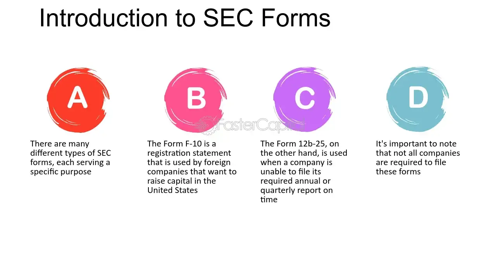

## Table of Contents

## What is SEC Form 10-12B?

SEC Form 10-12B is a document that companies need to file with the Securities and Exchange Commission (SEC) when they want to list their stocks on a stock exchange for the first time. This form is important because it gives investors a lot of information about the company, like how it makes money, who its leaders are, and any risks involved in buying its stock.

When a company fills out Form 10-12B, it has to include detailed financial statements and other important facts. This helps investors make smart choices about whether to buy the company's stock. By making this information public, the SEC helps make sure that the stock market is fair and transparent for everyone.

## Who needs to file SEC Form 10-12B?

SEC Form 10-12B needs to be filed by companies that want to list their stocks on a stock exchange for the very first time. This is usually done when a company wants to go public, meaning they want to sell their stocks to the general public. By filing this form, the company is asking the SEC for permission to have their stocks traded on a public exchange.

The form is important because it makes sure that the company shares all the necessary information with potential investors. This includes details about the company's finances, its leaders, and any risks that come with buying its stock. This helps investors make informed decisions and keeps the stock market fair and transparent.

## What is the purpose of filing SEC Form 10-12B?

The purpose of filing SEC Form 10-12B is to help a company go public and list its stocks on a stock exchange for the first time. When a company wants to sell its stocks to the public, it needs to ask the SEC for permission. This form is the way the company does that. By filing Form 10-12B, the company is showing the SEC that it wants its stocks to be traded on a public exchange.

The main goal of this form is to make sure that the company shares all the important information with potential investors. This includes details about how the company makes money, who runs it, and any risks that come with buying its stock. By making this information public, the SEC helps investors make smart choices and keeps the stock market fair and open for everyone.

## What are the key components of SEC Form 10-12B?

SEC Form 10-12B has several key parts that help investors understand a company better. The form includes detailed financial statements that show how much money the company makes and spends. It also has information about the company's business, like what it does and how it plans to make money in the future. This part helps investors see if the company's business makes sense and if it can grow.

Another important part of the form is the section about the company's leaders. It lists who runs the company and gives details about their experience and background. This helps investors decide if they trust the people in charge. The form also talks about any risks that come with buying the company's stock. This could be things like competition or changes in the market that might affect the company's success. By sharing all this information, the form helps investors make smart choices about whether to buy the stock.

## How does SEC Form 10-12B differ from other SEC forms?

SEC Form 10-12B is different from other SEC forms because it's used specifically when a company wants to list its stocks on a stock exchange for the first time. This form is important for companies going public, as it helps them share all the necessary information with the SEC and potential investors. Unlike other forms that might be used for regular updates or specific events, Form 10-12B is all about getting the green light to go public.

For example, SEC Form 10-K is used by companies that are already public to give a detailed annual report of their financial performance and business activities. This form is more about keeping investors updated on how the company is doing each year. On the other hand, Form 10-12B focuses on giving investors the initial information they need to decide if they want to buy the company's stock when it first goes public. So, while Form 10-K is about ongoing transparency, Form 10-12B is about starting that transparency from the very beginning.

## What are the deadlines for filing SEC Form 10-12B?

When a company wants to file SEC Form 10-12B, there isn't a strict deadline like you might see with other SEC forms. Instead, the company needs to file it before they can start trading their stocks on a public exchange. This means they have to get all the information together and submit the form whenever they're ready to go public.

The process can take some time because the company needs to make sure all the details are correct and complete. Once they file the form, the SEC will review it to make sure everything is in order. If the SEC approves the form, the company can then move forward with listing their stocks on the exchange.

## What are the consequences of not filing SEC Form 10-12B on time?

If a company doesn't file SEC Form 10-12B before they want to list their stocks on a public exchange, they won't be able to go public. This means they can't sell their stocks to the general public until they file the form and it gets approved by the SEC. Not filing on time can delay their plans and keep them from raising money through the stock market.

The delay can be a big problem for the company. They might have to wait longer to get the money they need to grow their business. It can also make investors worried, because if the company can't follow the rules, investors might not trust them as much. So, it's really important for the company to file the form as soon as they're ready to go public.

## How can a company prepare to file SEC Form 10-12B?

To get ready to file SEC Form 10-12B, a company needs to gather a lot of information about its business. This includes putting together detailed financial statements that show how much money the company makes and spends. They also need to write about what the company does, how it plans to make money in the future, and any risks that might affect the business. It's important to make sure all this information is correct and complete because the SEC will check it carefully.

Once the company has all the information ready, they should work with lawyers and accountants who know about SEC rules. These experts can help make sure the form is filled out the right way and that nothing important is left out. After everything is ready, the company can send the form to the SEC. Then, they wait for the SEC to review it and give them the okay to list their stocks on a public exchange.

## What are some common mistakes to avoid when filing SEC Form 10-12B?

One common mistake when filing SEC Form 10-12B is not including all the required information. The form needs detailed financial statements and a clear description of the company's business, plans, and risks. If anything is missing or incomplete, the SEC might not approve the form, which can delay the company's plans to go public.

Another mistake is not working with experts like lawyers and accountants who know about SEC rules. These professionals can help make sure the form is filled out correctly and that all the rules are followed. Without their help, the company might make errors that could lead to the SEC rejecting the form or asking for more information, causing more delays.

Lastly, companies sometimes rush to file the form without double-checking everything. It's important to take the time to review all the details carefully before submitting the form. Mistakes or missing information can be costly and slow down the process of going public.

## How has the filing process for SEC Form 10-12B evolved over time?

The filing process for SEC Form 10-12B has changed a lot over the years to make it easier and faster for companies to go public. In the past, companies had to send in a lot of paper documents, which took a long time to prepare and send. Now, thanks to technology, companies can file the form online through the SEC's Electronic Data Gathering, Analysis, and Retrieval (EDGAR) system. This means they can get their information to the SEC much quicker and it's easier to keep everything organized.

Also, the SEC has updated the rules and requirements for Form 10-12B to make sure it gives investors the most important information they need. They've added new sections and changed some of the old ones to focus on things like how the company makes money, who runs it, and any risks that come with buying its stock. These changes help make the form more useful for investors and keep the stock market fair and open for everyone.

## What role does technology play in the filing of SEC Form 10-12B?

Technology has made a big difference in how companies file SEC Form 10-12B. Before, companies had to send in a lot of paper documents, which took a long time and could get messy. Now, they can use the SEC's online system called EDGAR to file the form. This means they can send all their information to the SEC quickly and easily, without having to mail anything.

Using technology also helps companies make sure their forms are correct and complete. They can use special software to check their financial statements and other information before they send it in. This can help them avoid mistakes that might cause delays. Plus, the SEC can review the forms faster because everything is digital, which speeds up the whole process of going public.

## How can investors use the information disclosed in SEC Form 10-12B for decision-making?

Investors can use the information in SEC Form 10-12B to learn a lot about a company before deciding to buy its stock. The form includes detailed financial statements that show how much money the company makes and spends. This helps investors see if the company is doing well and if it's making a profit. The form also explains what the company does and how it plans to make money in the future. This can help investors decide if they believe in the company's business and if it has a good chance to grow.

Another important part of the form is the section about the company's leaders and any risks involved with buying the stock. Investors can read about who runs the company and their experience, which can help them decide if they trust the people in charge. The form also lists any risks, like competition or changes in the market, that might affect the company's success. By understanding these risks, investors can make smarter choices about whether the stock is a good investment for them.

## References & Further Reading

[1]: ["SEC Form 10-12B"](https://www.investopedia.com/terms/s/sec-form-f-10-12b.asp) - U.S. Securities and Exchange Commission

[2]: Bergstra, J., Bardenet, R., Bengio, Y., & Kégl, B. (2011). ["Algorithms for Hyper-Parameter Optimization."](https://dl.acm.org/doi/10.5555/2986459.2986743) Advances in Neural Information Processing Systems 24.

[3]: ["Advances in Financial Machine Learning"](https://www.amazon.com/Advances-Financial-Machine-Learning-Marcos/dp/1119482089) by Marcos Lopez de Prado

[4]: ["Quantitative Trading: How to Build Your Own Algorithmic Trading Business"](https://www.amazon.com/Quantitative-Trading-Build-Algorithmic-Business/dp/1119800064) by Ernest P. Chan

[5]: ["Form 10-K"](https://www.sec.gov/about/forms/form10-k.pdf) - U.S. Securities and Exchange Commission

[6]: ["Form 10-Q"](https://www.sec.gov/about/forms/form10-q.pdf) - U.S. Securities and Exchange Commission