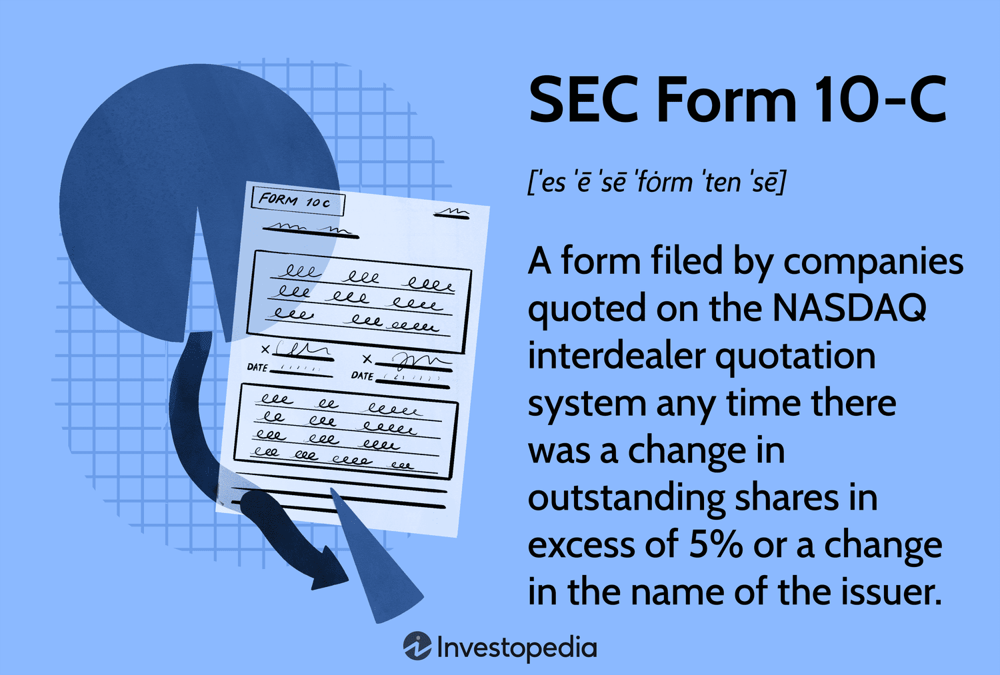

## Table of Contents

## What is SEC Form 10-C?

SEC Form 10-C is a document that companies must file with the U.S. Securities and Exchange Commission (SEC). It is used to report the issuance of new securities. This form helps the SEC keep track of all the new stocks or bonds that companies are creating and selling to investors.

When a company decides to issue new securities, like stocks or bonds, they need to let the SEC know by filling out Form 10-C. This helps the SEC make sure that the company is following the rules and that investors have all the information they need. By keeping this information public, the SEC helps maintain fairness and transparency in the market.

## Who is required to file SEC Form 10-C?

SEC Form 10-C must be filed by companies that are issuing new securities. This means if a company wants to create and sell new stocks or bonds, they need to tell the SEC about it by using this form. The SEC uses this information to keep an eye on what companies are doing and to make sure they are following the rules.

The form helps the SEC keep the market fair and open. When companies issue new securities, it's important for everyone to know about it. This way, investors can make smart choices with their money. By making companies fill out Form 10-C, the SEC makes sure that all the information is out in the open for everyone to see.

## What is the purpose of filing SEC Form 10-C?

The main purpose of filing SEC Form 10-C is to let the U.S. Securities and Exchange Commission (SEC) know when a company is issuing new securities, like stocks or bonds. When a company wants to create and sell these new securities, they have to fill out this form and send it to the SEC. This helps the SEC keep track of all the new securities that are being made and sold to people.

By requiring companies to file Form 10-C, the SEC can make sure that everything is done fairly and openly. This is important because it helps investors make good choices with their money. When all the information about new securities is shared with the public, it keeps the market honest and helps everyone trust that they are getting a fair deal.

## How often must SEC Form 10-C be filed?

SEC Form 10-C must be filed every time a company wants to issue new securities. This means if a company decides to create and sell new stocks or bonds, they need to fill out and send this form to the SEC. It's not something that happens on a regular schedule like once a year or once a month. Instead, it happens whenever there are new securities to report.

This way, the SEC can keep up with all the new securities that companies are putting out into the market. By making companies file Form 10-C each time they issue new securities, the SEC can make sure that everything is done fairly and openly. This helps investors know about new securities and make good choices with their money.

## What information is required on SEC Form 10-C?

SEC Form 10-C asks for basic information about the company that's issuing new securities. This includes the company's name, address, and a description of the new securities they want to sell. The form also needs to say how many new securities the company plans to issue and what kind they are, like stocks or bonds.

Besides that, the form needs details about the price of the new securities and when they will be available for people to buy. It's important for the company to explain why they are issuing these new securities and what they plan to do with the money they get from selling them. This helps the SEC and investors understand the company's plans and make sure everything is done fairly.

## How can one access SEC Form 10-C filings?

You can access SEC Form 10-C filings by going to the SEC's main website, which is called EDGAR. EDGAR stands for Electronic Data Gathering, Analysis, and Retrieval. On the EDGAR website, you can search for any company that has filed a Form 10-C. Just type in the company's name or the ticker symbol of their stock, and you'll be able to see all the forms they've filed, including the 10-C.

Once you find the company, you can click on the Form 10-C to read it. The form will show you all the details about the new securities the company is planning to issue, like how many there are, what kind they are, and how much they will cost. This information is important for anyone who wants to invest in the company or just wants to know more about what the company is doing.

## What are the consequences of not filing SEC Form 10-C on time?

If a company doesn't file SEC Form 10-C on time, they can get into trouble with the SEC. The SEC has rules to make sure companies follow the law and keep the market fair. If a company misses the deadline for filing Form 10-C, the SEC might start an investigation. This could lead to fines or other punishments for the company.

Not filing on time can also hurt the company's reputation. Investors might lose trust in the company if they see that it's not following the rules. This could make it harder for the company to sell its new securities or raise money in the future. Keeping everything open and honest is important for a company's success, and missing a filing deadline can make things more difficult.

## How does SEC Form 10-C relate to other SEC forms?

SEC Form 10-C is one of many forms that companies need to file with the SEC. It's specifically used to report when a company is issuing new securities, like stocks or bonds. This is different from other forms like Form 10-K, which is an annual report that gives a detailed look at the company's financial health and operations over the past year. Another form, Form 10-Q, is a quarterly report that updates investors on the company's progress every three months.

While Form 10-C focuses on new securities, these other forms give a broader picture of the company's overall performance and financial situation. For example, if a company files a Form 10-C to issue new stocks, investors might look at the latest Form 10-K or 10-Q to understand how the company is doing financially before deciding to buy the new securities. This way, all the forms together help keep the market transparent and help investors make informed decisions.

## Can amendments be made to SEC Form 10-C, and if so, how?

Yes, amendments can be made to SEC Form 10-C if a company needs to change or update the information they originally filed. If something important changes about the new securities they are issuing, like the number of securities or the price, the company needs to let the SEC know by filing an amendment. This keeps everything up to date and helps investors have the right information.

To make an amendment, the company fills out a new Form 10-C with the updated information and sends it to the SEC. They need to clearly say that it's an amendment to the original filing and explain what has changed. This way, the SEC and investors can see the new details and understand how they might affect the company's plans for issuing new securities.

## What are some common mistakes to avoid when filing SEC Form 10-C?

When filing SEC Form 10-C, one common mistake to avoid is missing the deadline. Companies need to file this form on time to let the SEC know about new securities they are issuing. If they don't, they could face fines or other punishments. Another mistake is not providing all the required information. The form asks for details like the company's name, the type and number of new securities, their price, and the reason for issuing them. Leaving out any of this can cause problems and delay the process.

Another common error is making mistakes in the information provided. For example, if a company gets the number of securities wrong or lists the wrong price, it can confuse investors and lead to trouble with the SEC. It's important to double-check all the details before sending the form. Also, companies should be clear and honest about why they are issuing new securities. If they aren't, it can harm their reputation and make investors lose trust in them.

## How has the requirement for SEC Form 10-C evolved over time?

The requirement for SEC Form 10-C has changed over time to keep up with new laws and ways of doing things. When the SEC first started, they needed ways to keep track of new securities that companies were making. Form 10-C was one of the ways they did this. As time went on, the SEC made changes to the form to make it easier to use and to include more details that investors and the SEC need to know.

These changes help make sure that the market stays fair and open for everyone. For example, the SEC might update the form to ask for more information about the reasons a company is issuing new securities or to include new types of securities that companies are creating. By keeping the form up to date, the SEC can better watch over the market and help investors make smart choices with their money.

## What are the best practices for efficiently completing and submitting SEC Form 10-C?

When you need to fill out and send in SEC Form 10-C, it's a good idea to start early. This gives you plenty of time to gather all the information you need, like the number of new securities, their price, and why your company is issuing them. Make sure everything you write down is correct and matches what your company is really planning to do. It's easy to make mistakes if you're in a hurry, so taking your time can help you avoid problems later on.

Once you have all the details right, double-check everything before you send it to the SEC. You can use the SEC's EDGAR system to file the form online. Make sure you follow all the steps carefully so your form gets to the SEC on time. If anything changes after you file, like the number of securities or the price, you'll need to file an amendment to keep everything up to date. Keeping good records and staying organized will make the whole process smoother and help you avoid any trouble with the SEC.

## What is the relationship between Form 10-C and Algorithmic Trading?

SEC Form 10-C, though no longer in use, played a crucial role in maintaining transparency and reliable data dissemination in financial markets, which is pivotal for modern [algorithmic trading](/wiki/algorithmic-trading) systems. Algorithmic trading, or algo trading, relies on fast, accurate data to make automated transaction decisions. Forms like 10-C ensured that substantial changes in a company's share structure were promptly communicated, thereby guaranteeing data freshness and accuracy — essential components for algo trading.

Accurate information is the bedrock upon which algorithms analyze patterns and execute trades, often within fractions of a second. Algorithmic strategies might incorporate complex models—such as moving averages or regression analysis—that require real-time or near-real-time data to perform optimally. Thus, transparency and integrity in reporting, previously supported by mandates like Form 10-C, remain vital. Consider an example where an algorithm uses the formula for moving average:

$$

\text{Moving Average}(n) = \frac{P_1 + P_2 + ... + P_n}{n} 
$$

where $P_i$ represents the stock price at time $i$ and $n$ is the number of periods. The accuracy of $P_i$ directly impacts trading decisions and outcomes, emphasizing the importance of data integrity enforced by regulatory requirements akin to what Form 10-C provided.

Adherence to existing SEC regulations by algorithmic trading firms is not just about compliance but also about ensuring market integrity. These regulations assure that even in a digital trading environment, firms act fairly and equitably, preventing market manipulation or unfair trading advantages. This compliance protects both the market's stability and investor interests.

In summary, while SEC Form 10-C is obsolete, the values it embodied continue to influence how algorithmic trading operates, underscoring the everlasting need for transparency and precision in securities trading.

## References & Further Reading

[1]: Macey, J. R., & O’Hara, M. (1997). ["The Law and Economics of Best Execution."](https://www.sciencedirect.com/science/article/pii/S1042957397902199) Journal of Financial Intermediation, 6(3), 188-223.

[2]: Gomber, P., Arndt, B., Lutat, M., & Uhle, T. (2011). ["High-Frequency Trading."](https://papers.ssrn.com/sol3/papers.cfm?abstract_id=1858626) Wirtschaftsinformatik, 53(1), 43-51.

[3]: Hasbrouck, J., & Saar, G. (2013). ["Low-Latency Trading."](https://www.sciencedirect.com/science/article/abs/pii/S1386418113000165) The Review of Financial Studies, 26(9), 2091-2138.

[4]: Securities and Exchange Commission. (1997). ["Final Rule: Elimination of the Requirement for Securities Traded on the Nasdaq Stock Market to File Form 10-C."](https://business.inquirer.net/498654/benguet-corp-set-to-raise-authorized-capital-stock)

[5]: Securities Exchange Act of 1934, Rule 13a-17 and 15d-17. ["Electronic Code of Federal Regulations."](https://www.law.cornell.edu/cfr/text/17/240.13a-15)