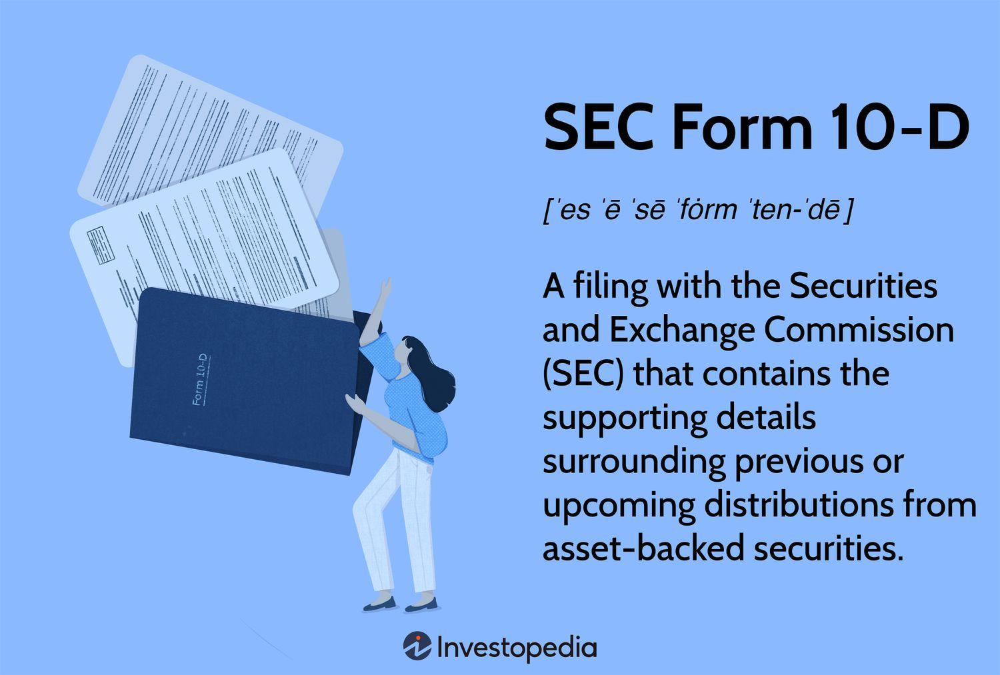

## Table of Contents

## What is SEC Form 10-D?

SEC Form 10-D is a document that companies have to file with the U.S. Securities and Exchange Commission (SEC). It is used for companies that have issued certain types of securities called asset-backed securities. These securities are backed by assets like loans, leases, or receivables. The form helps investors stay informed about how these securities are performing.

The main purpose of Form 10-D is to provide regular updates on the performance of the asset-backed securities. Companies must file this form every month. It includes important information like the amount of payments received, any changes in the assets backing the securities, and other details that can affect the value of the securities. This helps investors make better decisions about their investments.

## What is the purpose of filing SEC Form 10-D?

The main reason companies file SEC Form 10-D is to keep investors updated on how their asset-backed securities are doing. Asset-backed securities are investments that are supported by things like loans, leases, or receivables. By filing Form 10-D, companies give investors important information about these securities every month.

This form helps investors know how much money is coming in from the securities, if there are any changes in the assets backing them, and other details that might affect their value. By getting this information regularly, investors can make smarter choices about their investments. It's a way for companies to be open and honest with the people who have put money into their securities.

## Who is required to file SEC Form 10-D?

Companies that have issued asset-backed securities need to file SEC Form 10-D. These securities are investments that are backed by things like loans, leases, or receivables. The companies have to file this form because it's a rule set by the U.S. Securities and Exchange Commission (SEC).

The main goal of filing Form 10-D is to keep investors informed about how well the asset-backed securities are doing. The companies must file this form every month. It helps investors know important details like how much money is coming in from the securities and if there are any changes in the assets backing them.

## How often must SEC Form 10-D be filed?

Companies that have issued asset-backed securities need to file SEC Form 10-D every month. This form helps keep investors informed about how these securities are doing. Asset-backed securities are investments backed by things like loans, leases, or receivables.

By filing Form 10-D monthly, companies give investors regular updates. This includes details like the amount of money coming in from the securities and any changes in the assets backing them. It's important because it helps investors make smart decisions about their investments.

## What information is included in SEC Form 10-D?

SEC Form 10-D includes important details about asset-backed securities. These securities are investments that are backed by things like loans, leases, or receivables. The form tells investors how much money is coming in from these securities each month. It also shows any payments that have been made to investors.

The form also includes information about any changes in the assets that back the securities. This can be important because it might affect the value of the securities. The company also has to report any other details that could impact the securities, like legal issues or changes in how the securities are managed. This helps investors stay informed and make better decisions about their investments.

## How does SEC Form 10-D benefit investors?

SEC Form 10-D helps investors by giving them important information about asset-backed securities every month. These securities are investments backed by things like loans or leases. By reading Form 10-D, investors can see how much money is coming in from these securities. This helps them know if their investment is doing well or not.

The form also tells investors about any changes in the assets that back the securities. This is important because it can affect the value of their investment. If there are any legal issues or changes in how the securities are managed, the company has to report that too. This way, investors can make smart choices about their money and feel more confident in their investments.

## What are the common criticisms of SEC Form 10-D?

Some people think that SEC Form 10-D can be hard to understand. It has a lot of details about asset-backed securities, like how much money is coming in and any changes in the assets. For people who don't know much about finance, this can be confusing. They might need help from experts to make sense of the information.

Another criticism is that the monthly updates might not be enough for some investors. They want to know more often if there are any big changes that could affect their money. Waiting a whole month for an update can feel too long, especially if the value of the securities goes up or down a lot.

## How has SEC Form 10-D evolved over time?

Over the years, SEC Form 10-D has changed to make it more helpful for investors. When it first started, it had less information than it does now. But as people wanted to know more about their investments, the form got bigger. It now includes more details about the money coming in from asset-backed securities and any changes in the assets backing them. This helps investors understand how their money is doing better than before.

The SEC also listens to what investors and companies say about the form. If people find it hard to understand or want more information, the SEC might change the form. For example, they might add new sections or make the language easier. This way, the form keeps getting better and more useful for everyone who uses it.

## What are the penalties for failing to file SEC Form 10-D on time?

If a company does not file SEC Form 10-D on time, they can get in big trouble. The SEC can fine them a lot of money. The fines can be different depending on how late the form is and how bad the mistake is. The company might also have to pay for any harm that happens to investors because they didn't get the information on time.

Besides fines, the company could face other problems. The SEC might start an investigation to see if the company did something wrong on purpose. This can hurt the company's reputation and make investors lose trust in them. It's important for companies to file Form 10-D on time to avoid these penalties and keep their investors happy.

## How does SEC Form 10-D compare to other SEC forms like 10-K and 10-Q?

SEC Form 10-D is different from SEC Forms 10-K and 10-Q because it focuses on asset-backed securities. These securities are investments backed by things like loans or leases. Companies that issue these securities have to file Form 10-D every month to tell investors how much money is coming in and any changes in the assets. This helps investors keep track of their investments and make smart choices.

On the other hand, SEC Form 10-K is a yearly report that all public companies have to file. It gives a detailed look at the company's financial health, including its income, expenses, and any big changes that happened during the year. Form 10-Q is a quarterly report that gives updates on the company's finances every three months. While Form 10-D is all about asset-backed securities, Forms 10-K and 10-Q cover the whole company and are important for all investors, not just those with asset-backed securities.

## What are the best practices for preparing and submitting SEC Form 10-D?

When preparing SEC Form 10-D, it's important to gather all the right information about the asset-backed securities. Make sure to include how much money is coming in from the securities and any changes in the assets that back them. Double-check all the numbers and details to make sure they are correct. It's a good idea to have someone else look over the form too, to catch any mistakes. Using clear and simple language can help investors understand the information better.

When it's time to submit the form, make sure to do it on time. The SEC wants Form 10-D every month, so set reminders to help you remember. Use the SEC's online system, called EDGAR, to file the form. It's important to follow all the rules and guidelines from the SEC. If you're not sure about anything, it's okay to ask for help from a professional who knows about these things. Keeping good records of everything you file can also help if there are any questions later on.

## How can technology and automation assist in the filing of SEC Form 10-D?

Technology and automation can make it a lot easier to file SEC Form 10-D. Special software can collect all the information you need about the asset-backed securities, like how much money is coming in and any changes in the assets. This software can check the numbers to make sure they are right and help put the form together quickly. It can also send reminders so you don't forget to file the form on time every month. This way, you can focus on other important work instead of spending a lot of time on the form.

Using automation also helps make sure the form is correct and complete. The software can look for any mistakes or missing information before you send it to the SEC. It can also help you file the form through the SEC's online system, called EDGAR, without any problems. This can save you time and reduce the chance of making mistakes that could lead to penalties. By using technology, you can make the whole process of filing Form 10-D easier and more reliable.

## References & Further Reading

[1]: Securities and Exchange Commission (SEC). ["Form 10-D."](https://www.sec.gov/files/form10d.pdf) Accessed October 2023.

[2]: Donovan, Thomas. (2019). ["Asset-Backed Securities and the Role of the SEC Form 10-D."](https://www.cdhowe.org/publication/better-braking-abs-why-reforms-asset-backed-securities-market-should-include-role-third-party/) Strategic Finance Magazine.

[3]: Lopez de Prado, Marcos. (2018). ["Advances in Financial Machine Learning."](https://www.amazon.com/Advances-Financial-Machine-Learning-Marcos/dp/1119482089) Wiley.

[4]: Jansen, Stefan. (2020). ["Machine Learning for Algorithmic Trading."](https://github.com/stefan-jansen/machine-learning-for-trading) Packt Publishing.

[5]: Chan, Ernest P. (2009). ["Quantitative Trading: How to Build Your Own Algorithmic Trading Business."](https://github.com/ftvision/quant_trading_echan_book) Wiley.