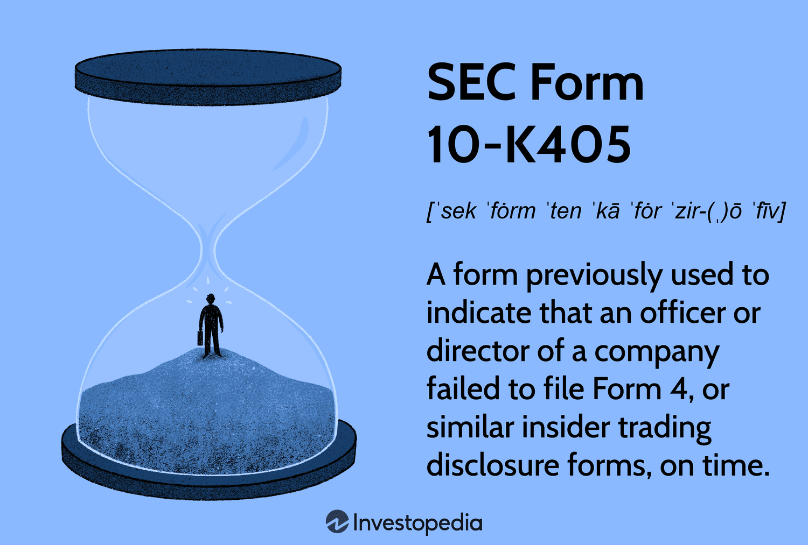

## Table of Contents

## What is SEC Form 10-K405?

SEC Form 10-K405 is a special version of the annual report that companies file with the Securities and Exchange Commission (SEC). This form is used when a company fails to include the required information about its officers' and directors' transactions in its regular Form 10-K. Essentially, it's a way for the company to tell the SEC that it didn't follow the rules about reporting these important details.

Filing Form 10-K405 is important because it helps keep the market transparent. Investors rely on knowing about the stock transactions of a company's top people to make smart choices. If a company misses this information, using Form 10-K405 lets everyone know, and the company can fix the problem. This form was used until it was replaced by a different version in 2003.

## Who is required to file SEC Form 10-K405?

Any company that is publicly traded in the United States and has to file an annual report with the SEC might need to use Form 10-K405. This form is specifically for when a company misses out on reporting important details about the stock transactions of its top executives and directors in their regular annual report, which is called Form 10-K.

If a company realizes it forgot to include this information in its Form 10-K, it has to file Form 10-K405 instead. This tells the SEC and investors that the company didn't follow the rules about reporting these transactions. It's a way to be honest about the mistake and fix it. Form 10-K405 was used until 2003, when it was replaced by a new version of the form.

## What is the purpose of filing SEC Form 10-K405?

The main reason for filing SEC Form 10-K405 is to let the Securities and Exchange Commission (SEC) and investors know that a company missed out on reporting important details about the stock transactions of its top executives and directors. When a company is supposed to file its annual report, called Form 10-K, it has to include information about these transactions. If it doesn't, it has to file Form 10-K405 instead. This form helps keep things transparent and honest in the market.

By filing Form 10-K405, a company admits that it didn't follow the rules about reporting these transactions. This gives investors a chance to know about the mistake and understand the company better. It's important because investors use this information to make smart choices about buying or selling stocks. Form 10-K405 was used until 2003, after which it was replaced by a new version of the form.

## How does SEC Form 10-K405 differ from other SEC forms?

SEC Form 10-K405 is different from other SEC forms because it's used when a company forgets to include important information about its top executives' and directors' stock transactions in its regular annual report, which is called Form 10-K. Instead of just filing Form 10-K, the company has to use Form 10-K405 to let everyone know about the missing information. This helps keep things honest and clear for investors, who need to know about these transactions to make good choices about buying or selling stocks.

While Form 10-K is a detailed report about a company's yearly performance, Form 10-K405 is specifically for when the company misses out on reporting the required details about its executives' and directors' transactions. Other forms, like Form 10-Q for quarterly reports or Form 8-K for major events, serve different purposes and don't focus on this particular issue. Form 10-K405 was used until 2003, when it was replaced by a new version of the form, but its purpose was to highlight and fix the reporting mistake.

## What are the key components included in SEC Form 10-K405?

SEC Form 10-K405 includes all the same information as the regular Form 10-K, which is a detailed report about a company's yearly performance. This includes financial statements, a description of the business, risk factors, and management's discussion and analysis of the company's financial condition. The key difference is that Form 10-K405 also has a special section where the company admits that it didn't include the required information about its top executives' and directors' stock transactions.

This special section is important because it tells the Securities and Exchange Commission (SEC) and investors that the company made a mistake in its reporting. By filing Form 10-K405, the company is being honest about the missing information and giving investors a chance to know about it. This helps keep the market transparent and fair, which is important for everyone involved.

## What are the deadlines for filing SEC Form 10-K405?

The deadline for filing SEC Form 10-K405 is the same as for the regular Form 10-K. Companies have to file their annual report within 60 days after the end of their fiscal year if they are a large accelerated filer, 75 days if they are an accelerated filer, and 90 days if they are a non-accelerated filer. This means that if a company realizes it missed out on reporting important details about its top executives' and directors' stock transactions, it has to file Form 10-K405 by the same deadline as the regular Form 10-K.

Filing Form 10-K405 on time is important because it helps keep the market honest and clear. If a company doesn't file on time, it might have to pay fines or face other problems. So, it's a good idea for companies to check their reports carefully and make sure they include all the required information before the deadline.

## What are the consequences of not filing SEC Form 10-K405 on time?

If a company doesn't file SEC Form 10-K405 on time, it can get into trouble. The Securities and Exchange Commission (SEC) might make the company pay fines. These fines can be a lot of money, and they can hurt the company's finances. The SEC might also look more closely at the company to see if it's following the rules. This can take a lot of time and money for the company to deal with.

Not filing on time can also make investors worried. When a company misses a deadline, it can make people think the company isn't being honest or careful. This can make the company's stock price go down, which can hurt the company and its investors. So, it's really important for companies to file Form 10-K405 on time to avoid these problems.

## How has the requirement for filing SEC Form 10-K405 changed over time?

The requirement for filing SEC Form 10-K405 was important for companies to use when they missed out on reporting important details about their top executives' and directors' stock transactions in their regular annual report, called Form 10-K. If a company forgot to include this information, it had to file Form 10-K405 instead. This form helped keep the market honest by letting the Securities and Exchange Commission (SEC) and investors know about the mistake. The company had to file Form 10-K405 within the same deadline as the regular Form 10-K, which is 60 days after the end of the fiscal year for large accelerated filers, 75 days for accelerated filers, and 90 days for non-accelerated filers.

In 2003, the SEC made changes to how companies report this kind of information. They stopped using Form 10-K405 and started using a new version of Form 10-K instead. Now, companies just check a box on the new Form 10-K to say if they missed out on reporting the required details about their executives' and directors' transactions. This change made things simpler for companies and still helped keep the market transparent. Even though Form 10-K405 isn't used anymore, the idea behind it is still important for making sure companies are honest about their reporting.

## What specific disclosures are required in SEC Form 10-K405 that are not in a standard 10-K?

SEC Form 10-K405 includes all the same information as the regular Form 10-K, like the company's yearly financial statements, a description of the business, risk factors, and management's discussion about the company's financial condition. The big difference is that Form 10-K405 has an extra part where the company has to say it didn't include the required details about its top executives' and directors' stock transactions. This special section is important because it tells the Securities and Exchange Commission (SEC) and investors that the company made a mistake in its reporting.

By filing Form 10-K405, the company is being honest about the missing information and giving investors a chance to know about it. This helps keep the market transparent and fair, which is good for everyone involved. Even though Form 10-K405 isn't used anymore since 2003, the idea behind it is still important. Now, companies just check a box on the new Form 10-K to say if they missed out on reporting these transactions, making the process simpler but still keeping the market honest.

## How can companies ensure compliance when preparing SEC Form 10-K405?

Companies can make sure they follow the rules when getting ready to file SEC Form 10-K405 by setting up good systems for keeping track of information. They should have clear rules about how to report the stock transactions of their top executives and directors. It's also a good idea for them to double-check their reports before sending them in. They can do this by having different people in the company look over the reports to make sure all the needed information is there.

It's also important for companies to stay up to date with the rules from the Securities and Exchange Commission (SEC). They should know that since 2003, they don't use Form 10-K405 anymore. Instead, they check a box on the new Form 10-K if they missed out on reporting the required details about their executives' and directors' transactions. By keeping these things in mind and being careful, companies can avoid mistakes and make sure they are honest with the SEC and investors.

## What are some common mistakes to avoid when filing SEC Form 10-K405?

When filing SEC Form 10-K405, one common mistake companies make is missing the deadline. They need to file it within the same time as the regular Form 10-K, which is 60 days after the end of the fiscal year for large accelerated filers, 75 days for accelerated filers, and 90 days for non-accelerated filers. If they don't file on time, they might have to pay fines or face other problems from the Securities and Exchange Commission (SEC). Another mistake is not including all the needed information about the stock transactions of their top executives and directors. This is important because it helps keep the market honest and clear for investors.

It's also easy for companies to forget that since 2003, they don't use Form 10-K405 anymore. Instead, they check a box on the new Form 10-K to say if they missed out on reporting these transactions. If a company tries to file the old Form 10-K405, it will cause confusion and delays. To avoid these mistakes, companies should have good systems for keeping track of information and double-checking their reports before sending them in. By being careful and staying up to date with the rules, they can make sure they follow the rules and keep everything honest with the SEC and investors.

## How do investors use the information provided in SEC Form 10-K405 for decision-making?

Investors use the information in SEC Form 10-K405 to make smart choices about buying or selling stocks. When a company files Form 10-K405, it tells investors that the company missed out on reporting important details about its top executives' and directors' stock transactions. This can help investors understand if the company is being honest and careful with its reporting. If a company admits to missing this information, it might make investors think twice about trusting the company. They might see it as a sign that the company needs to be more careful or that there could be other problems they don't know about.

By knowing about these missing details, investors can decide if they want to keep their money in the company or take it out. If they see that the company made a mistake but is trying to fix it by filing Form 10-K405, they might feel better about the company's honesty. On the other hand, if they think the mistake is a big problem, they might choose to sell their stocks to avoid risk. This information helps investors make better choices and keep the market fair and clear for everyone.

## References & Further Reading

For more information on SEC filings, please refer to the SEC's official website. The site offers comprehensive resources about various SEC forms, including the 10-K, which is crucial for understanding the financial health and disclosures of publicly traded companies. Official guidelines and documents are essential for investors to ensure compliance and informed decision-making.

"Advances in Financial Machine Learning" by Marcos López de Prado offers valuable insights into the application of machine learning techniques in financial markets, particularly for algorithmic trading. The book discusses algorithms, data structures, and machine learning models that can be employed to harness financial disclosures for predictive analysis and developing trading strategies. It serves as an informative resource for those looking to leverage advanced technological solutions in trading.

"Quantitative Trading" by Ernest P. Chan provides practical guidance on crafting and implementing algorithmic trading strategies. Through its comprehensive approach, it highlights essential strategies and potential pitfalls, making it an excellent read for traders interested in optimizing their methodologies. The book offers a step-by-step introduction to critical concepts necessary for constructing successful quantitative trading models.

These resources collectively provide a foundational understanding for stakeholders interested in SEC disclosures and the integration of technological advancements in the financial trading landscape.

