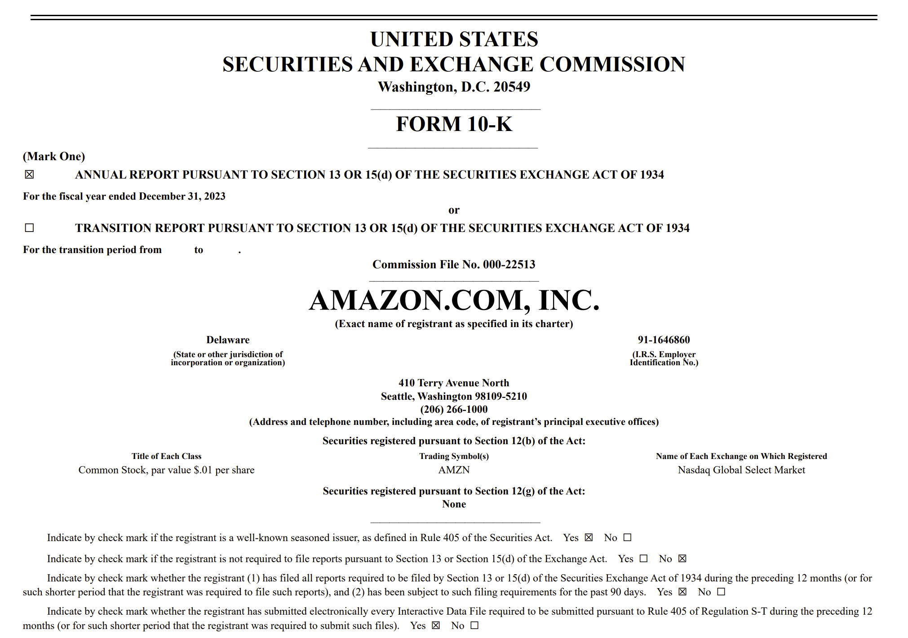

## Table of Contents

## What is SEC Form 10-KT?

SEC Form 10-KT is a special report that companies file with the U.S. Securities and Exchange Commission (SEC). It's used when a company changes its fiscal year-end date. Instead of the usual annual report (Form 10-K), the company files a Form 10-KT to cover the period from the old fiscal year-end to the new one. This helps keep financial reporting clear and consistent.

For example, if a company used to end its fiscal year on December 31 but decides to change it to March 31, it would file a Form 10-KT for the period from January 1 to March 31. This form includes all the important financial details and disclosures that are normally in a 10-K, but for this special transition period. It helps investors and the SEC understand the company's financial situation during the change.

## Why is SEC Form 10-KT important for investors?

SEC Form 10-KT is important for investors because it gives them a clear picture of a company's finances during a change in its fiscal year-end. When a company decides to shift its fiscal year-end, it needs to report the financial performance for the period between the old and new year-ends. This form helps investors understand how the company is doing during this transition, which can be crucial for making informed investment decisions.

Additionally, the Form 10-KT includes all the detailed financial information and disclosures that are usually found in a regular annual report (Form 10-K). This means investors can see the company's revenues, expenses, assets, liabilities, and any other important financial data for the transition period. By having this information, investors can better assess the company's health and performance, even when the company is going through a change in its reporting cycle.

## How does SEC Form 10-KT differ from SEC Form 10-K?

SEC Form 10-KT and SEC Form 10-K are both reports that companies file with the SEC, but they serve different purposes. The main difference is that Form 10-KT is used when a company changes its fiscal year-end date. It covers the period from the old fiscal year-end to the new one. On the other hand, Form 10-K is the regular annual report that covers a full fiscal year.

Both forms include similar types of financial information, like revenues, expenses, and other important details about the company's performance. However, Form 10-KT is specifically for the transition period, so it might not cover a full year. This helps investors understand the company's financial situation during the change, while Form 10-K gives a complete picture of the company's annual performance.

## When is a company required to file a Form 10-KT?

A company is required to file a Form 10-KT when it changes its fiscal year-end date. This form helps cover the period between the old fiscal year-end and the new one. For example, if a company used to end its fiscal year on December 31 but decides to change it to June 30, it would file a Form 10-KT for the period from January 1 to June 30.

Filing a Form 10-KT is important because it keeps the financial reporting clear and consistent during the transition. It helps investors and the SEC understand how the company is doing financially during the change. Without this form, there could be gaps in the financial information, making it harder for investors to make informed decisions.

## What kind of information is included in a Form 10-KT?

A Form 10-KT includes all the important financial information that you would find in a regular annual report, but it covers the period when a company changes its fiscal year-end. This means you'll see details about the company's revenues, expenses, assets, and liabilities for the transition period. It also includes information about any big changes or events that happened during this time, like mergers or acquisitions.

The form also has sections where the company talks about its business, the risks it faces, and how it's doing compared to its goals. This helps investors understand what's going on with the company during the change. By reading a Form 10-KT, investors can get a clear picture of the company's financial health and performance during the transition, which is important for making smart investment choices.

## How can one access a company's Form 10-KT?

You can find a company's Form 10-KT on the U.S. Securities and Exchange Commission's (SEC) website. Just go to the SEC's website and use their search tool called EDGAR. Type in the company's name or its ticker symbol, and you can look through all the documents they've filed, including the Form 10-KT.

Sometimes, companies also put their Form 10-KT on their own websites. They usually have a section called "Investor Relations" or "Financials" where you can find these reports. If you're having trouble finding it, you can always call the company's investor relations department and ask for help.

## What are the key sections to focus on in a Form 10-KT for financial analysis?

When looking at a Form 10-KT for financial analysis, it's important to focus on the financial statements. These include the income statement, balance sheet, and cash flow statement. The income statement shows how much money the company made and spent during the transition period. The balance sheet gives a snapshot of what the company owns and owes at the end of that period. The cash flow statement explains how the company's cash position changed, which can tell you if the company is generating enough cash to keep running smoothly.

Another key section to pay attention to is the Management's Discussion and Analysis (MD&A). This part explains what's happening in the company's business, any big changes or events, and how these might affect future performance. It's like getting a story behind the numbers, which can help you understand the company's situation better. Also, don't skip the notes to the financial statements. These notes give more details about the numbers in the financial statements, like how they were calculated or any special accounting rules used.

Lastly, the risk factors section is crucial. It lists all the things that could go wrong for the company, like competition, regulations, or economic changes. Knowing these risks can help you see if the company is prepared for challenges and if it's a good investment. By focusing on these sections, you can get a good understanding of the company's financial health during the transition period.

## How does the transition period affect the reporting in Form 10-KT?

The transition period affects the reporting in Form 10-KT because it covers a different time frame than a regular annual report. Instead of a full year, Form 10-KT only includes the time between the old fiscal year-end and the new one. This means the numbers and information in the report might not be as complete as in a normal annual report, but they still give a clear picture of what happened during the change.

During the transition period, the company might have different financial results because the time frame is shorter. This can make it harder to compare the company's performance to other years. But the Form 10-KT still has all the important financial statements, like the income statement, balance sheet, and cash flow statement, so investors can see how the company is doing. It also includes explanations from management about any big changes or events that happened during the transition, which helps everyone understand the company's situation better.

## Can you explain the significance of the 'Management’s Discussion and Analysis' section in Form 10-KT?

The 'Management’s Discussion and Analysis' (MD&A) section in Form 10-KT is very important because it helps investors understand what's going on with the company during the change in its fiscal year-end. This section is like a story that explains the numbers in the financial statements. It tells you about the company's business, any big changes or events that happened, and how these things might affect the company's future. By reading the MD&A, you can get a better idea of what the company is doing and why the numbers look the way they do.

This section is also helpful because it gives you insights into the company's plans and how they're doing compared to their goals. It's not just about the past; it also talks about what the company thinks will happen in the future. For investors, this is really useful because it helps them decide if the company is a good investment. Even though the Form 10-KT covers a shorter time than a regular annual report, the MD&A makes sure you still get a full picture of the company's situation during the transition period.

## What are some common challenges companies face when preparing a Form 10-KT?

When a company prepares a Form 10-KT, one of the main challenges is dealing with the shorter time frame. Unlike a regular annual report, the Form 10-KT only covers the period between the old and new fiscal year-ends. This can make it harder to compare the company's performance to other years because the numbers are for a different length of time. Companies need to explain these differences clearly in their reports so that investors can understand what's going on.

Another challenge is making sure all the important information is included, even though the report covers a shorter period. Companies have to gather and present financial data like revenues, expenses, and cash flows for the transition period. They also need to write the Management's Discussion and Analysis (MD&A) section, which explains what happened during the change and how it might affect the future. This can be tricky because they have to give a full picture of the company's situation in a shorter time frame, but it's important for keeping investors informed.

## How do changes in accounting policies disclosed in Form 10-KT impact financial statements?

When a company changes its accounting policies, it has to tell everyone about it in the Form 10-KT. This is important because it can change how the company's financial statements look. For example, if a company starts using a different way to figure out how much its inventory is worth, the numbers on the balance sheet and income statement might be different. This can make it harder for investors to compare the company's performance to previous years because the numbers aren't calculated the same way anymore.

The company needs to explain these changes clearly in the Form 10-KT so that investors understand why the numbers are different. They usually do this in the notes to the financial statements and in the Management's Discussion and Analysis (MD&A) section. By knowing about these changes, investors can better understand the company's financial health during the transition period and make smarter decisions about their investments.

## What advanced analytical techniques can be applied to the data in Form 10-KT to predict company performance?

One advanced analytical technique that can be used with the data in Form 10-KT is trend analysis. This involves looking at the financial numbers over time to see if there are any patterns. For example, if a company's revenues are growing steadily during the transition period, it might mean the company is doing well and could keep growing in the future. By comparing the numbers in the Form 10-KT to previous years, investors can spot trends that might not be obvious just by looking at one year's data. This can help them predict how the company might perform in the coming years.

Another technique is ratio analysis, which involves calculating different financial ratios from the data in the Form 10-KT. Ratios like the debt-to-equity ratio or the return on assets can give investors a better idea of the company's financial health. For instance, if the debt-to-equity ratio is high, it might mean the company is taking on a lot of debt, which could be risky. By looking at these ratios, investors can get a clearer picture of the company's strengths and weaknesses during the transition period and use this information to predict future performance.

## References & Further Reading

[1]: U.S. Securities and Exchange Commission. ["Form 10-KT."](https://www.investopedia.com/terms/s/sec-form-10-kt.asp) Accessed on [SEC Official Website](https://www.investopedia.com/terms/s/sec-form-10-kt.asp).

[2]: Bragg, Steven M. (2019). ["Construction Guide for New Fiscal Years: From 10-KT to Annual Report."](https://www.amazon.com/Construction-Accounting-Practitioners-Steven-Bragg/dp/1938910753) Published by Accounting Tools.

[3]: Lopez de Prado, Marcos (2018). ["Advances in Financial Machine Learning."](https://www.amazon.com/Advances-Financial-Machine-Learning-Marcos/dp/1119482089) Wiley.

[4]: Chan, Ernest P. (2008). ["Quantitative Trading: How to Build Your Own Algorithmic Trading Business."](https://github.com/ftvision/quant_trading_echan_book) Wiley.

[5]: Jansen, Stefan (2020). ["Machine Learning for Algorithmic Trading."](https://github.com/stefan-jansen/machine-learning-for-trading) Packt Publishing.

[6]: Aronson, David R. (2006). ["Evidence-Based Technical Analysis: Applying the Scientific Method and Statistical Inference to Trading Signals."](https://www.amazon.com/Evidence-Based-Technical-Analysis-Scientific-Statistical/dp/0470008741) Wiley.