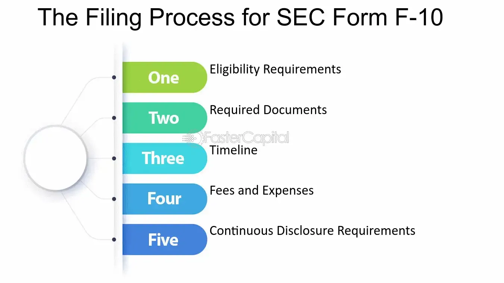

## Table of Contents

## What is SEC Form 10?

SEC Form 10 is a document that companies file with the Securities and Exchange Commission (SEC) when they want to register their securities for trading on a stock exchange. This form is important because it gives investors detailed information about the company, including its financial health, business operations, and risks involved in investing in it. By making this information public, the form helps ensure that investors can make informed decisions.

The form is typically used by companies that are already public but want to register additional securities or by companies that are going public for the first time through a process called an initial public offering (IPO). It includes sections on the company's history, its organizational structure, financial statements, and any legal proceedings it might be involved in. This comprehensive disclosure helps maintain transparency in the market and protects investors by providing them with all the necessary information to assess the company's value and potential risks.

## Why was SEC Form 10 created?

SEC Form 10 was created to help investors make better decisions. Before it existed, people buying stocks often didn't have enough information about the companies they were investing in. This could lead to bad investments and even fraud. The SEC wanted to fix this problem by making companies share important details about their business and finances.

By requiring companies to fill out Form 10, the SEC makes sure that anyone thinking about buying a company's stocks can see the full picture. This includes things like how the company makes money, its debts, and any legal troubles it might have. This way, investors can decide if the company is a good investment or not. Form 10 helps keep the stock market fair and honest, protecting people who invest their money.

## Who needs to file SEC Form 10?

Companies that want to sell their stocks on a stock exchange need to file SEC Form 10. This includes companies that are already public but want to sell more stocks, and companies that are going public for the first time. When a company goes public, it means they are selling their stocks to the public for the first time, which is called an initial public offering or IPO.

Filing Form 10 is important because it tells the public a lot about the company. The form has details like how the company makes money, how much money it has, and any problems it might have. This helps people who want to buy the stocks understand if it's a good idea to invest in the company.

## What information is required in SEC Form 10?

SEC Form 10 is a document that companies need to fill out when they want to sell their stocks on a stock exchange. It includes a lot of important information that helps people understand the company better. The form has details about the company's history, how it's organized, and who the main people running it are. It also explains what the company does to make money, what its goals are, and any big changes that have happened recently.

Another important part of SEC Form 10 is the financial information. This section shows the company's financial statements, like how much money it has made and spent over the last few years. It also includes information about any debts the company has and how it plans to use the money it raises from selling stocks. The form also talks about any legal problems the company might be facing, which is important for people to know before they decide to invest.

Overall, SEC Form 10 is designed to give a clear and honest picture of the company. By sharing this information, the company helps investors make smart choices about whether to buy its stocks. This helps keep the stock market fair and protects people who are thinking about investing their money.

## How often must SEC Form 10 be filed?

SEC Form 10 is not a form that companies need to file regularly. Instead, it's a one-time filing that a company does when it wants to register its securities to be sold on a stock exchange. This means that if a company is going public for the first time or if it wants to sell more stocks after already being public, it will file Form 10 just once for that specific purpose.

After filing Form 10, the company doesn't need to file it again unless it wants to register more securities in the future. However, once a company is public, it has to keep the public updated with other forms, like Form 10-K and Form 10-Q, which provide ongoing financial information. These forms are filed annually and quarterly, respectively, to keep investors informed about the company's ongoing performance and financial health.

## What are the deadlines for filing SEC Form 10?

When a company wants to sell its stocks on a stock exchange, it has to file SEC Form 10. There's no specific deadline for filing this form because it's not something a company does regularly. Instead, a company files it when it wants to go public or sell more stocks. This means they can file it whenever they're ready, but they usually want to do it quickly to start selling their stocks.

Once the form is filed, the SEC has to review it. The SEC usually takes about 30 days to review the form, but this can take longer if they have questions or need more information. It's important for companies to file their Form 10 carefully and accurately so that the review process goes smoothly and they can start selling their stocks as soon as possible.

## What is the process for filing SEC Form 10?

When a company wants to sell its stocks on a stock exchange, it needs to file SEC Form 10. The first step is to gather all the information needed for the form. This includes details about the company's history, how it's organized, who the main people running it are, what the company does to make money, and its financial statements. The company also needs to include information about any debts, how it plans to use the money it raises, and any legal problems it might have. Once all this information is collected, the company puts it all into the Form 10 document.

After the company fills out the form, it submits it to the Securities and Exchange Commission (SEC) electronically through the SEC's Electronic Data Gathering, Analysis, and Retrieval (EDGAR) system. The SEC then reviews the form to make sure all the information is correct and complete. This review process usually takes about 30 days, but it can take longer if the SEC has questions or needs more information. Once the SEC approves the form, the company can start selling its stocks on the stock exchange.

## How can companies prepare for filing SEC Form 10?

To prepare for filing SEC Form 10, a company should start by gathering all the important information about its business. This includes details about how the company started, who runs it, what it does to make money, and any big changes that have happened. The company also needs to collect its financial statements, which show how much money it has made and spent over the last few years. It's also important to include information about any debts the company has and how it plans to use the money it raises from selling stocks. Making sure all this information is accurate and complete will help the filing process go smoothly.

Once the company has all the information ready, it should put it into the Form 10 document. It's a good idea to have lawyers and accountants check the form to make sure everything is correct. After that, the company can submit the form to the Securities and Exchange Commission (SEC) through their online system called EDGAR. The SEC will then review the form, and this can take about 30 days or longer if they need more information. By preparing carefully, the company can make sure it gets approval to start selling its stocks on the stock exchange as quickly as possible.

## What are common mistakes to avoid when filing SEC Form 10?

When filing SEC Form 10, one common mistake companies make is not including all the required information. The form needs details about the company's history, how it's organized, who runs it, what it does to make money, and its financial statements. If any of these are missing or not clear, the SEC might send the form back, which can delay the whole process. Companies should make sure they double-check everything and maybe even have lawyers and accountants look it over to avoid this mistake.

Another mistake is not being accurate with the financial information. The financial statements need to be correct and complete, showing how much money the company has made and spent. If there are any errors or if the numbers don't add up, the SEC will notice and might ask for more information or reject the form. It's important for companies to take their time and make sure all the numbers are right before they submit the form. This helps the process go smoothly and quickly.

## How does SEC Form 10 differ from other SEC forms like Form 10-K?

SEC Form 10 is a one-time filing that a company uses when it wants to sell its stocks on a stock exchange for the first time or sell more stocks after being public. It includes a lot of information about the company, like its history, what it does, who runs it, and its financial statements. This form helps investors understand the company before they decide to buy its stocks. Companies file Form 10 when they're ready to go public or issue more securities, and there's no specific deadline for filing it.

On the other hand, SEC Form 10-K is an annual report that public companies have to file every year. It gives an update on the company's financial performance and any important changes that happened during the year. Unlike Form 10, which is a one-time filing, Form 10-K is filed regularly to keep investors informed about the company's ongoing health and operations. Both forms are important, but they serve different purposes: Form 10 is for registering securities, while Form 10-K is for annual reporting.

## What are the consequences of not filing SEC Form 10 on time?

If a company doesn't file SEC Form 10 on time, it can face some serious problems. The main issue is that the company won't be able to sell its stocks on the stock exchange until the form is filed and approved. This can delay the company's plans to go public or raise more money, which can be a big setback. The company might also get in trouble with the SEC, which could lead to fines or other penalties.

Another consequence is that investors might lose trust in the company. If a company can't get its paperwork in on time, people might think it's not well-organized or that it's hiding something. This can make it harder for the company to attract investors in the future. So, it's really important for companies to file SEC Form 10 as soon as they're ready and make sure everything is correct to avoid these problems.

## How has the filing process for SEC Form 10 evolved with technological advancements?

The filing process for SEC Form 10 has changed a lot because of technology. Before, companies had to fill out the form by hand and send it through the mail. This took a long time and was easy to make mistakes. Now, companies can file the form online using the SEC's EDGAR system. This makes it faster and easier to submit the form, and it's less likely to have errors because the system checks for some mistakes automatically.

Technology has also made it easier for the SEC to review the forms. They can now use computers to look at the information more quickly and find any problems faster. This means the whole process from filing to approval can happen more smoothly and in less time. Overall, technology has made filing SEC Form 10 a lot simpler and more efficient for everyone involved.

## References & Further Reading

[1]: ["SEC EDGAR Database"](https://www.sec.gov/search-filings), U.S. Securities and Exchange Commission.

[2]: Hansen, P.R., & Lunde, A. (2005). ["A Forecast Comparison of Volatility Models: Does Anything Beat a GARCH(1,1)?"](https://onlinelibrary.wiley.com/doi/full/10.1002/jae.800) The Review of Financial Studies, 20(3), 873-889.

[3]: Lopez de Prado, M. (2018). ["Advances in Financial Machine Learning"](https://www.amazon.com/Advances-Financial-Machine-Learning-Marcos/dp/1119482089). Wiley.

[4]: Hendershott, T., Jones, C.M., & Menkveld, A.J. (2011). ["Does Algorithmic Trading Improve Liquidity?"](https://onlinelibrary.wiley.com/doi/full/10.1111/j.1540-6261.2010.01624.x) The Review of Financial Studies, 24(8), 2429-2454.

[5]: Chan, E.P. (2008). ["Quantitative Trading: How to Build Your Own Algorithmic Trading Business"](https://github.com/ftvision/quant_trading_echan_book). Wiley.
