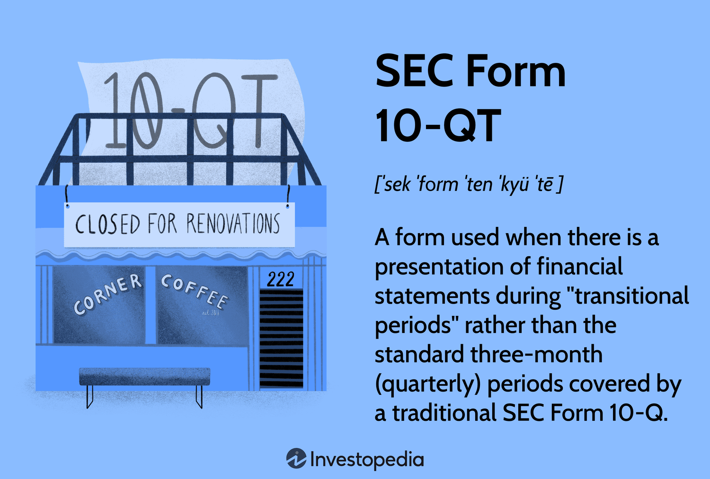

The SEC Form 10 is a critical document within the United States' financial regulatory framework, serving as a fundamental tool for ensuring transparency and trust in the public markets. Its primary purpose is to register securities with the U.S. Securities and Exchange Commission (SEC) following the Securities Exchange Act of 1934. Public companies employ Form 10 for official filings to provide comprehensive details about their financial condition, management, and business operations. This ensures that investors have access to relevant, timely, and accurate information for making informed investment decisions.

Algorithmic trading has revolutionized the financial markets by leveraging computer algorithms to execute trades at speeds and frequencies humans cannot achieve. These algorithms can process vast amounts of data, including historical prices, current market conditions, and economic indicators, to identify trading opportunities and execute strategies automatically. The integration of algorithmic trading in financial markets has significantly increased efficiency and liquidity while also presenting unique challenges and risks.



The connection between SEC filings, such as Form 10, and trading strategies is becoming increasingly prominent. Traders and investment firms utilize data from these filings to shape their trading algorithms. The information offered by Form 10 filings can influence stock prices and market sentiment, establishing a critical link between regulatory compliance and market behavior. Analyzing these filings allows traders to adjust their strategies in response to new disclosures and market trends, leveraging this data to gain a competitive edge.

This article aims to explore the intersection of SEC Form 10 and algorithmic trading. By examining the role of these filings in public companies and their impact on market strategies, it seeks to provide insights into how modern finance manages the balance between regulation and trading innovation. Additionally, it will discuss how algorithmic traders incorporate SEC data into their models, highlighting the technological advancements that facilitate this process and potential future trends in regulations and trading strategies.

## Table of Contents

## Understanding SEC Form 10

SEC Form 10 is a critical filing with the U.S. Securities and Exchange Commission (SEC) that public companies use to register a class of securities for trading on U.S. exchanges. This document serves as a comprehensive disclosure tool, providing essential information about a company's financial health, organizational structure, and operational strategy.

### Key Components of SEC Form 10

Form 10 is an extensive document divided into several key sections that collectively offer a detailed picture of a company. The primary components include:

1. **Business Overview**: This section gives an in-depth view of the company’s business operations, its products or services, market conditions, and competitive landscape.

2. **Financial Information**: Detailed financial statements, including balance sheets, income statements, and cash flow statements, are provided. This data is crucial for analyzing the company's financial performance and stability.

3. **Risk Factors**: Companies must disclose any potential risks that could impact their financial health or operations. This includes market risks, regulatory challenges, and other economic factors.

4. **Legal Proceedings**: Any ongoing or potential legal issues and their implications are detailed to ensure shareholders are aware of all potential liabilities.

5. **Management and Governance**: Information on the company’s executive team, directors, and corporate governance practices are included to provide transparency on leadership effectiveness and company oversight.

### Filing Requirements and Criteria

SEC regulations require any company with more than $10 million in total assets and 750 or more shareholders to file Form 10. This threshold ensures that companies have significant economic presence and public interest. Filing involves meeting specific disclosure standards set by the SEC to maintain high levels of transparency and protect investor interests.

### Importance of Compliance

Adherence to SEC regulations through accurate and timely submission of Form 10 is vital for maintaining investor confidence and the integrity of the financial markets. Transparency is essential to enable investors to make informed decisions, thereby upholding the credibility of the market. Non-compliance can lead to penalties, legal challenges, and a loss of investor trust.

### Timelines and Filing Process

The process for filing a Form 10 typically involves several phases. Initially, companies prepare their financial statements and relevant disclosures. This is often followed by internal reviews and audits to ensure accuracy and compliance with all reporting standards. Once prepared, the Form 10 is submitted to the SEC, where it undergoes a review process.

Timelines can vary depending on the company's size and complexity, but generally, companies aim to complete the filing process swiftly to avoid delays in trading activities. Amendments or additional information may be requested by the SEC, requiring companies to respond promptly to move the process forward.

In summary, SEC Form 10 plays a pivotal role in the U.S. financial regulatory framework, providing a structured means for companies to disclose critical information. Compliance is not only a legal requirement but also a cornerstone in fostering market integrity and investor trust.

## The Role of Form 10 in Public Companies

SEC Form 10 plays a significant role in shaping the public image of companies and influencing investor confidence. This form, filed with the U.S. Securities and Exchange Commission (SEC), offers a comprehensive overview of a company's business operations, financial condition, and risk factors. By providing this critical information, Form 10 enhances transparency, enabling investors to make informed decisions based on a company's disclosed data.

The data contained within Form 10 is crucial for various stakeholders, including investors, analysts, and regulatory bodies. Key components typically include a detailed description of the company's operations, financial statements, management's discussion and analysis, and information on corporate governance practices. This data serves as a benchmark for assessing a company's performance and future prospects, offering insights into how the company is managed and its potential for growth or risk.

Companies must undertake meticulous preparation for a Form 10 filing. This involves gathering comprehensive financial data, ensuring compliance with SEC regulations, and crafting accurate disclosures. Challenges often arise from the intricacy of regulatory requirements and the need to present a clear and truthful account of the company's status. Companies may face difficulties in coordinating among various departments to collate necessary information and in ensuring that all disclosures comply with legal standards. Failure to meet these challenges can lead to penalties, legal issues, or damage to the company's reputation.

Historical case studies illustrate the impact of Form 10 filings on companies' stock performances. Notable examples include instances where filing inaccuracies or the revelation of significant liabilities have led to stock price [volatility](/wiki/volatility-trading-strategies). Conversely, a well-received Form 10, indicating strong financial health and transparent management, can boost investor confidence and positively influence a company's market valuation.

Overall, SEC Form 10 is instrumental in shaping perceptions about a company in the public domain, directly impacting its investor relations and market presence. By ensuring the accuracy and completeness of the information disclosed, companies can maintain trust with investors and establish a stable platform for financial growth.

## Algorithmic Trading: An Overview

Algorithmic trading has become an integral part of modern financial markets, representing a major shift from traditional trading practices. This form of trading involves the use of complex algorithms to automate the decision-making process in financial markets. By leveraging quantitative models and computer programs, [algorithmic trading](/wiki/algorithmic-trading) can execute transactions at speeds and volumes that exceed human capabilities.

Algorithms function by analyzing vast amounts of market data to identify trading opportunities based on predefined criteria such as price, timing, and [volume](/wiki/volume-trading-strategy). This process involves various types of algorithms, including statistical [arbitrage](/wiki/arbitrage), market-making, and trend-following algorithms. These programs can parse through historical and real-time data to identify patterns and trends, reacting almost instantly to capitalize on potential market movements.

Compared to traditional trading methods, algorithmic trading offers numerous advantages. Its primary benefit is speed; algorithms can execute trades in fractions of a second, significantly reducing the time it takes to respond to market changes. This rapid execution minimizes the risk of price fluctuations between the decision-making process and trade execution. Another key advantage is the ability to process and analyze vast datasets, leading to more informed trading decisions. Moreover, algorithms eliminate human emotions from trading strategies, thus reducing errors associated with psychological factors such as fear and greed.

Technological advancements have further propelled the growth of algorithmic trading. The introduction of high-frequency trading platforms, the proliferation of big data, and enhancements in computational power have all played critical roles. High-frequency trading ([HFT](/wiki/high-frequency-trading-strategies)), a subset of algorithmic trading, capitalizes on small price discrepancies across markets at extremely high speeds. The availability of sophisticated software and improved telecommunications technology has allowed firms to operate in multiple markets around the world, optimizing trading strategies and increasing profitability.

Implications of these technological developments are profound. The ability to execute trades quickly and efficiently has increased competition among market participants, leading to narrower bid-ask spreads and reduced transaction costs. However, this rapid execution and the complexity of algorithms also pose significant challenges, including the risk of systemic market disruptions exemplified by events such as the 2010 Flash Crash. This has prompted regulatory scrutiny and a demand for robust risk management systems to mitigate potential adverse effects on market stability.

In summary, algorithmic trading uses technology to execute trades with increased speed, efficiency, and data-driven precision. Its rise reflects the broader trend of digitization in financial markets, with continuous innovations shaping the landscape of trading and market dynamics.

## Impact of SEC Filings on Algorithmic Trading Strategies

SEC Form 10 filings play a critical role in shaping stock prices and market sentiment, impacting the strategies employed by algorithmic traders. These filings provide essential financial information and periodic updates about public companies, which can signal potential investment opportunities or risks to the market. When Form 10 filings are released, they can trigger immediate reactions in stock prices based on the disclosed information's perceived implications on a company's future performance.

Algorithmic traders leverage the data contained in Form 10 filings to create and refine trading strategies. By employing programmed trading algorithms, these traders can swiftly analyze large volumes of quantitative data to identify patterns and trends. For instance, if a Form 10 filing reveals unexpected earnings results or significant changes in management, algorithmic systems can automatically adjust positions in affected stocks to exploit these insights.

An example of algorithms adjusted in response to new filings could involve sentiment analysis. Algorithms can process the textual data within Form 10 filings to gauge market sentiment. If positive language is detected regarding financial performance or strategic initiatives, algorithms may increase buying activity in anticipation of a bullish market reaction. Conversely, if negative sentiment is identified, selling algorithms may be activated to protect against potential declines.

Despite their advantages, trading based on regulatory filings is not without its challenges and risks. The timing of information release is critical; a delay in accessing or processing filings can lead to missed opportunities or outdated decisions. Algorithmic traders must ensure that their systems have robust data feeds and efficient processing capabilities to act on filings promptly.

Moreover, not all information in Form 10 filings is straightforward, and misinterpretation can lead to erroneous trading actions. Complex financial disclosures require careful analysis to distinguish between temporary anomalies and long-term trends. For example, a sudden drop in reported earnings might reflect one-time expenses rather than ongoing operational issues. Misjudging such nuances can result in inappropriate algorithmic responses.

To navigate these challenges, algorithmic trading models integrate advanced technologies like [machine learning](/wiki/machine-learning) to improve data interpretation and decision-making processes. These systems learn from historical data to make more accurate predictions about how new filings may impact stock prices, allowing traders to maintain a competitive edge in the volatile financial markets.

## Integrating SEC Filings in Algorithmic Trading Models

Integrating SEC Form 10 data into algorithmic trading models involves leveraging various strategies and technological tools to enhance trading decisions. The primary objective is to ensure that the data extracted from these filings is utilized effectively in making timely and informed trading actions.

### Strategies for Incorporating SEC Form 10 Data:
1. **Automated Data Retrieval and Processing**: Developing scripts using Python libraries such as `requests`, `BeautifulSoup`, or `Selenium` can automate the retrieval of SEC Form 10 filings. These scripts can be scheduled to run regularly to capture the latest filings as they become publicly available.

   ```python
   import requests
   from bs4 import BeautifulSoup

   # URL of SEC Edgar for a specific company
   url = 'https://www.sec.gov/edgar/search/'
   response = requests.get(url)
   soup = BeautifulSoup(response.content, 'html.parser')

   # Parse table for Form 10 filings
   filings = soup.find_all('div', {'class': 'doc table'})
   ```

2. **Natural Language Processing (NLP) for Text Analysis**: Once the data is procured, using NLP techniques to extract meaningful information is crucial. Libraries like `NLTK` or `spaCy` can process qualitative data to quantify sentiment or identify key thematic elements in the filings that may impact trading strategies.

   ```python
   import spacy

   nlp = spacy.load('en_core_web_sm')
   text_content = "SEC Form 10 content here"
   doc = nlp(text_content)

   # Extract named entities
   for entity in doc.ents:
       print(entity.text, entity.label_)
   ```

3. **Quantitative Data Integration**: Integration of extracted numerical data, such as financial metrics, can be achieved through dataframes using `pandas`. This allows for seamless merging with existing datasets and feeding into algorithmic models.

   ```python
   import pandas as pd

   # Example hypothetical data
   form_10_data = {'Metric': ['Total Assets', 'Revenue'], 'Value': [1000000, 500000]}
   df = pd.DataFrame(form_10_data)
   ```

### Technological Tools and Software:
Utilizing software platforms such as QuantConnect or Quantlib can aid in the operational deployment of these strategies. Additionally, cloud-based platforms can offer scalable solutions for data storage and processing.

### Accuracy and Timeliness:
Ensuring accuracy requires robust data validation protocols using cross-verification against trusted data sources. Timeliness, on the other hand, is crucial in algorithmic trading; hence, real-time data integration and processing pipelines should be established, employing tools like Apache Kafka or RabbitMQ.

### Role of AI and Machine Learning:
AI and machine learning (ML) significantly enhance the integration process. Machine learning models can learn from historical data to predict how new SEC filings might impact stock prices. Techniques such as supervised learning can train models to recognize patterns or anomalies within filing data, leading to better-informed trading decisions.

   ```python
   from sklearn.ensemble import RandomForestClassifier
   import numpy as np

   # Hypothetical features and labels
   X = np.array([[5, 3], [10, 15], [20, 25]])
   y = np.array([0, 1, 1])

   # Instantiate and train the model
   model = RandomForestClassifier()
   model.fit(X, y)

   # Predict with new data
   prediction = model.predict([[15, 10]])
   ```

Utilizing machine learning for predictive analysis and NLP for sentiment evaluation can provide a comprehensive approach to adapting SEC Form 10 filings into trading systems. This approach not only enhances decision-making but also supports the continuous evolution and optimization of trading models.

## The Future of SEC Filings and Algorithmic Trading

The future of SEC filings and algorithmic trading is set to be shaped by several anticipated trends and technological advancements that will significantly alter current market dynamics. In terms of SEC regulations, one can expect an increased focus on real-time filing requirements and enhanced transparency measures. The rapid evolution of technology, including blockchain and distributed ledger systems, could facilitate these changes, allowing for timelier access to financial information and reducing the lag between information availability and market impact. This immediacy could improve market efficiency and stabilize volatile reactions to newly released data.

As algorithmic trading continues to evolve, its influence on SEC filing strategies might also become more pronounced. Algorithms that are designed to rapidly parse and react to newly filed SEC documents, such as Form 10, can be optimized to anticipate the likelihood of specific regulatory impacts on stock performance. This could result in more proactive financial strategies where traders adjust their positions based on predictive models rather than historical data. Moreover, machine learning and AI can enhance these models, improving their predictive accuracy and robustness.

Technological innovations, particularly advancements in data processing and [artificial intelligence](/wiki/ai-artificial-intelligence), will likely reshape the landscape in which SEC filings and algorithmic trading operate. Natural language processing (NLP) techniques can be employed to analyze qualitative aspects of documents, extracting sentiments or potential risks that numerical data alone might not reveal. Additionally, improvements in big data analytics will enable traders to handle vast amounts of financial data efficiently, leading to more informed decision-making processes.

Finally, despite the transformative potential of these innovations, the importance of maintaining transparency and fostering innovation in the market remains paramount. As technologies advance, ensuring that all market participants have equal access to information becomes an ethical and regulatory necessity. Transparency, alongside technological progress, can support a fair trading environment, promoting investor confidence and market integrity. The dual focus on cutting-edge technology and ethical responsibility will likely continue to define the interplay between SEC filings and algorithmic trading strategies.

## Conclusion

SEC Form 10 is pivotal in maintaining transparency and ensuring informed decision-making in financial markets. This regulatory filing, which public companies use to officially report various aspects of their operations, has a recognized influence on market behavior. By providing a comprehensive overview of a company's financial health, business operations, and potential risks, Form 10 allows investors to make more informed decisions. Its significance is further magnified when algorithmic trading strategies are considered. These strategies often integrate data from SEC filings to adjust trading activities dynamically based on new information.

The synergy between regulatory filings and algorithmic trading is evident in how automated systems can parse vast amounts of data, such as those found in SEC Form 10, and execute trades with precision and speed. The integration of such regulatory data ensures that trading strategies can reflect real-time market conditions and investor sentiment. Moreover, the automated nature of algorithmic trading allows for rapid adaptation to changes, thereby enhancing market responsiveness.

For investors and traders, staying informed about regulatory changes like those reflected in SEC Form 10 filings is crucial. As regulatory landscapes evolve, understanding these changes ensures that market participants remain compliant and capitalize on potential opportunities. This attentiveness prevents costly oversights and aligns trading strategies with current regulations.

Continuous learning and adaptation remain essential in the fast-evolving financial ecosystem. As technological innovations continue to influence both regulatory frameworks and trading methodologies, market participants must remain agile. Embracing educational resources, engaging with emerging trends in financial technology, and continuously updating knowledge about regulatory requirements are key strategies for maintaining a competitive edge. In summary, the interplay between SEC Form 10, algorithmic trading, and regulatory awareness underscores the critical role of informed decision-making in contemporary financial markets.

## References & Further Reading

[1]: ["SEC EDGAR Database"](https://www.sec.gov/search-filings), U.S. Securities and Exchange Commission.

[2]: Hansen, P.R., & Lunde, A. (2005). ["A Forecast Comparison of Volatility Models: Does Anything Beat a GARCH(1,1)?"](https://onlinelibrary.wiley.com/doi/full/10.1002/jae.800) The Review of Financial Studies, 20(3), 873-889.

[3]: Lopez de Prado, M. (2018). ["Advances in Financial Machine Learning"](https://www.amazon.com/Advances-Financial-Machine-Learning-Marcos/dp/1119482089). Wiley.

[4]: Hendershott, T., Jones, C.M., & Menkveld, A.J. (2011). ["Does Algorithmic Trading Improve Liquidity?"](https://onlinelibrary.wiley.com/doi/full/10.1111/j.1540-6261.2010.01624.x) The Review of Financial Studies, 24(8), 2429-2454.

[5]: Chan, E.P. (2008). ["Quantitative Trading: How to Build Your Own Algorithmic Trading Business"](https://github.com/ftvision/quant_trading_echan_book). Wiley.