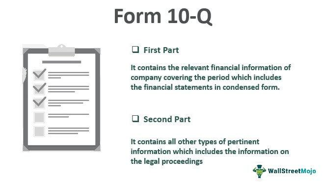

The SEC Form 10-Q is a fundamental financial document that public companies must file each quarter. It provides investors with a detailed snapshot of a company's financial condition and operational results over the most recent three-month period. This unaudited report plays a critical role in maintaining transparency and ensuring timely disclosure of a company’s performance, enabling investors to make informed decisions about their financial engagements.

Comprehending the structure and timelines associated with the 10-Q can significantly benefit investors and specialists in algorithmic trading. These documents contain vital insights into a company's operations, financial health, and future opportunities that are invaluable when evaluating investment risks and potential returns. Investors can discern trends, assess performance against competitors, and identify possible red flags that could affect future valuations.



Algorithmic traders, in particular, find the 10-Q indispensable as it allows for the construction of predictive models and informed trading strategies. By analyzing key financial metrics such as revenue, profit margins, and cash flow from these reports, traders can enhance the precision of their algorithms. This leads to optimized trading strategies that align closely with market dynamics, potentially improving their competitive edge.

This article will detail the essential elements of the SEC Form 10-Q, discuss the critical compliance deadlines companies must adhere to, and examine the strategic advantages these filings offer to algorithmic traders. Whether you're an individual investor or a professional trader, understanding these aspects of the 10-Q can contribute to more robust financial strategies and decision-making processes.

## Table of Contents

## Understanding SEC Form 10-Q

SEC Form 10-Q is an essential quarterly report that publicly traded companies in the United States must file with the Securities and Exchange Commission (SEC). This report is submitted after the conclusion of each of the first three quarters of a company's fiscal year, providing crucial insights into the financial health and operational activities of the company during these periods. Unlike SEC Form 10-K, which is filed annually, the 10-Q is typically unaudited, offering a more immediate but less comprehensive snapshot of financial data and business operations.

The SEC Form 10-Q is divided into distinct sections, each containing vital information pertinent to stakeholders. Key components include:

1. **Financial Data**: The 10-Q presents condensed financial statements, including income statements, balance sheets, and cash flow statements. These financial data points are critical for evaluating the performance of a company in generating revenue, managing expenses, and utilizing assets efficiently. While the data is condensed compared to the annual 10-K, it still serves as a foundational resource for understanding a company’s quarterly financial dynamics.

2. **Management’s Discussion and Analysis (MD&A)**: This section provides a narrative account by the company’s management about the financial condition and operational results. The MD&A aims to offer context around the financial data, discussing trends, risks, and uncertainties that may impact future performance. This analysis assists investors and analysts in gaining transparency into management's perspective on their company's operational trajectory and strategy execution.

3. **Material Changes and Disclosures**: The 10-Q also highlights significant changes in accounting policies, legal proceedings, and other essential disclosures that may affect the company's financial situation. This includes updates on contingencies, risk factors, or any unusual occurrences that have had, or are expected to have, a substantial impact on the financial statements.

In contrast to the more detailed and audited Form 10-K, which provides a comprehensive overview of a company’s annual performance, the Form 10-Q reflects interim financial updates and operational oversight. As such, the 10-Q is critical for monitoring a company's ongoing progress and for identifying issues or opportunities that may not be apparent from annual reports alone.

For investors and financial analysts, navigating the information presented in the 10-Q requires attention to detail and an understanding of both the raw financial data provided and the contextual insights shared by management. Despite its unaudited nature, the timeliness and periodic nature of the 10-Q offer invaluable snapshots of a company's financial health, serving as an instrumental tool for continually assessing corporate performance and strategizing investment decisions throughout the year.

## Components of SEC Form 10-Q

The SEC Form 10-Q is structured to provide a detailed snapshot of a company's quarterly financial and operational status, divided into two primary parts: financial information and other pertinent disclosures. This bifurcation ensures that stakeholders receive comprehensive insights into a company's performance and potential risks.

**Part 1: Financial Information**

Part 1 of Form 10-Q contains condensed financial statements that deliver a succinct overview of a company's financial position and performance over the quarter. These statements generally include:

- **Balance Sheets**: Presenting the company's assets, liabilities, and shareholders' equity at the end of the quarter. This section highlights changes from the previous quarter, helping determine the company's financial stability.

- **Income Statements**: These detail the company's revenues, expenses, and profits for the quarter, offering insight into profitability and operational efficiency. Comparing different quarters' income statements can reveal growth patterns or emerging issues.

- **Cash Flow Statements**: Illustrating cash inflows and outflows, these statements provide a view of the company's liquidity and cash management practices over the period in question.

- **Statement of Stockholders' Equity**: Showing changes in equity, which include retained earnings, share issuance, or buyback activities, this statement offers insights into decisions impacting shareholder value.

Furthermore, Part 1 includes Management’s Discussion and Analysis of Financial Condition and Results of Operations (MD&A). This narrative component assesses the qualitative aspects of the financial statements, offering context about operational strategies, market conditions, and possible future directives. This section is often pivotal for understanding management’s perception of the company's current and future landscape, providing clues about how external factors and strategic decisions might impact financial results.

**Part 2: Other Pertinent Disclosures**

Part 2 of Form 10-Q encompasses additional information necessary for regulatory compliance and investor awareness. Key components include:

- **Legal Proceedings**: Details of any significant ongoing litigation or regulatory issues facing the company. This information is crucial for understanding potential risks that could affect financial outcomes.

- **Risk Factors**: Updates on risks that could influence the company’s future financial health. While many of these risks are initially covered in the annual 10-K, the 10-Q reflects any changes or new risks that have arisen during the quarter.

- **Unregistered Sales of Equity Securities and Use of Proceeds**: Information on any new stock issuances not yet registered with the SEC can affect stock price and shareholder value.

- **Defaults on Senior Securities**: Reporting defaults or breaches on credit agreements, which may signal financial distress.

Understanding the components of the 10-Q is essential for accurate financial analysis and prediction. For instance, shifts in the balance sheet ratios—such as the current ratio or debt-to-equity ratio—can provide early indicators of changing financial conditions. Analysts and algorithmic traders often utilize this wealth of data to identify trading opportunities and hedge against potential risks. Insights gained from Part 1 and Part 2 allow for a comprehensive assessment of the company's current financial health and strategic outlook, enabling more precise forecasting and investment decisions.

## SEC Form 10-Q Filing Deadlines

The filing deadlines for SEC Form 10-Q are intrinsically linked to a company's classification based on its public float. Public float, defined as the total market value of a company’s outstanding shares available for trading, influences whether a company is categorized as a large accelerated filer, an accelerated filer, or a non-accelerated filer, each with distinct filing requirements.

1. **Large Accelerated Filers**: Companies with a public float of $700 million or more at the end of their second fiscal quarter are classified as large accelerated filers. These companies are mandated to submit their Form 10-Q within 40 days after the close of each quarter.

2. **Accelerated Filers**: Companies categorized as accelerated filers possess a public float ranging from $75 million to less than $700 million. The filing deadline for these entities is similarly set at 40 days post-quarter-end.

3. **Non-Accelerated Filers**: Companies with a public float below $75 million fall into the non-accelerated filer category. They benefit from a slightly extended filing period, with a requirement to submit Form 10-Q within 45 days following the end of their fiscal quarter.

Adhering to these deadlines is imperative for companies, as it ensures compliance with SEC regulations and maintains transparency for investors. Failure to conform to these schedules can result in various penalties, including fines and potential delisting from stock exchanges, emphasizing the need for precise and timely financial reporting. 

For algorithmic traders and investors, staying updated with these filing timelines is crucial so they can timely access the latest financial data and adjust their strategies accordingly.

## Missed Deadlines and Consequences

Companies that do not meet the filing deadline for the SEC Form 10-Q are required to submit Form NT 10-Q, also known as a Notice of Late Filing. This submission must detail the reasons for the delay and serve as a formal request for an extension. The Securities and Exchange Commission (SEC) grants an additional five calendar days for the completion of the Form 10-Q, provided the explanation given is deemed reasonable and justifiable.

The necessity of timely filing cannot be overstated, as failing to comply with the deadline can result in severe repercussions. Such non-compliance may subject the company to various penalties imposed by the SEC, which can range from fines to additional regulatory scrutiny. The most severe consequence is the potential delisting of the company’s stock from major stock exchanges. Delisting can significantly diminish a company's market credibility, reduce [liquidity](/wiki/liquidity-risk-premium) for its shares, and lead to a decline in investor confidence.

Furthermore, a late filing without a satisfactory explanation can signal to investors and market analysts that a company may be experiencing operational or financial distress. This perception can negatively impact the company’s stock price and investor relations. Therefore, maintaining adherence to the filing schedule is crucial for safeguarding the company's market position and reputation.

Companies typically take extensive measures to ensure compliance with SEC deadlines, often involving detailed internal processes and rigorous timelines for preparing financial statements and related disclosures. These procedures are essential not only for regulatory compliance but also for maintaining investor trust and market stability.

## The Role of Algorithmic Trading in SEC Form 10-Q Analysis

Algorithmic trading leverages advanced computational techniques to analyze financial documents like the SEC Form 10-Q, offering traders opportunities to develop predictive models and trading strategies. The Form 10-Q contains critical financial metrics—such as revenue, profit margins, and cash flow—that can serve as the foundation for sophisticated trading algorithms.

### Key Financial Metrics for Algorithmic Trading

1. **Revenue**: This metric reflects the total income generated by a company before expenses. Algorithmic traders analyze revenue trends to predict future performance. Python libraries like Pandas can be used to process this data:

   ```python
   import pandas as pd

   # Assuming financial_data is a DataFrame with columns 'Quarter' and 'Revenue'
   financial_data['Revenue_Growth'] = financial_data['Revenue'].pct_change()
   ```

2. **Profit Margins**: These provide insights into a company’s efficiency in converting sales into actual profit. By analyzing margins, traders can assess the operational efficiency and identify potential for future growth:
$$
   \text{Profit Margin} = \left( \frac{\text{Net Profit}}{\text{Total Revenue}} \right) \times 100

$$

   Python code can compute this efficiently for large datasets:

   ```python
   financial_data['Profit_Margin'] = (financial_data['Net_Profit'] / financial_data['Revenue']) * 100
   ```

3. **Cash Flow**: A vital indicator of a company’s financial health, cash flow highlights the liquidity and operational efficiency. Traders can forecast potential stock price movements by assessing cash flow statements, identifying discrepancies or trends that could affect valuation.

### Integration into Algorithms

For algorithmic traders, integrating Form 10-Q data involves developing models that consider financial statements and market conditions. Machine learning models, such as regression analysis or time series forecasting, can predict stock price movements based on historical data from 10-Q reports.

Here's a basic example using Python and Scikit-learn to create a predictive model:

```python
from sklearn.model_selection import train_test_split
from sklearn.linear_model import LinearRegression

# Sample dataset with features extracted from 10-Q
X = financial_data[['Revenue', 'Profit_Margin', 'Cash_Flow']]
y = financial_data['Stock_Price']

# Splitting the data into training and testing sets
X_train, X_test, y_train, y_test = train_test_split(X, y, test_size=0.3, random_state=42)

# Create and train the model
model = LinearRegression()
model.fit(X_train, y_train)

# Predict stock prices
predictions = model.predict(X_test)
```

These predictive models enable algorithmic traders to optimize their trading strategies by providing a data-driven approach to predicting market movements. By continuously refining inputs from each quarterly Form 10-Q filing, traders can adapt to market changes and leverage [artificial intelligence](/wiki/ai-artificial-intelligence) for enhanced decision-making and trading accuracy.

## Importance of SEC Form 10-Q for Investors

The SEC Form 10-Q is an essential resource for investors seeking to understand a company's quarterly financial status and operational progress. This form provides a detailed view of a company's financial performance and can be used as a powerful tool to make informed investment decisions.

One of the primary benefits of the 10-Q is its ability to facilitate performance comparison across different quarters. By examining this quarterly data, investors can identify trends, such as consistent revenue growth, improving profit margins, or stable cash flows, which may indicate a sound investment decision. Conversely, the form can also highlight potential red flags, such as declining sales or increasing liabilities, which might warrant further analysis or caution.

The transparency provided by the 10-Q allows investors to evaluate key financial metrics such as revenue, net income, earnings per share (EPS), and operating expenses. For instance, if a company's quarterly EPS shows significant growth over several periods, it may suggest strong management and business strategies, prompting investors to consider buying or holding the stock. On the other hand, if the EPS consistently falls short of projections, it might lead investors to reevaluate their positions and consider selling.

Additional components such as the management's discussion and analysis (MD&A) section offer insights into the operational aspects of the company, providing qualitative data that complements the quantitative financial statements. The MD&A can reveal the company's future strategies, market conditions impacting the business, and management's perspective on past performance and future challenges.

Investors may also employ quantitative methods and financial ratios derived from 10-Q data for more comprehensive analysis. For example, calculating the current ratio (Current Assets / Current Liabilities) from the data helps ascertain the company's short-term liquidity position.

Moreover, the 10-Q serves as a benchmark for setting expectations and measuring performance. If a company's financial results align well with or exceed the expectations set in the 10-Q, this can boost investor confidence and potentially lead to positive stock price movement.

In summary, the SEC Form 10-Q is indispensable for investors aiming to make informed choices about buying, holding, or selling stocks. It offers detailed quarterly insights that help in identifying financial trends and potential risks, ensuring that investors have a well-rounded understanding of a company's financial health.

## Comparing SEC Form 10-Q with Other Important Filings

The SEC Form 10-Q, Form 10-K, and Form 8-K are integral components of the reporting requirements for publicly traded companies, each serving distinct roles outlined by the Securities and Exchange Commission (SEC) to ensure transparency and inform investors.

**Form 10-Q vs. Form 10-K**

Form 10-Q is a quarterly report that provides an overview of a company's financial health during the first three quarters of the fiscal year. It includes unaudited financial statements, management discussions, and analysis sections. In contrast, Form 10-K is an annual report that provides audited annual financial statements and a comprehensive summary of the company's performance. It includes detailed narratives about the business, risk factors, financial data, and executive compensation. The 10-K offers more extensive information compared to the 10-Q due to its audited nature and its role in providing a full-year overview.

**Form 10-Q vs. Form 8-K**

Form 8-K is used for current reporting and serves a different function than the 10-Q. A Form 8-K is submitted to notify investors of significant events or changes that might have occurred between scheduled filings. These events could include mergers, acquisitions, leadership changes, or any other major occurrences that could affect an investor’s decision-making process. Unlike the 10-Q, which is filed quarterly, the 8-K is filed as needed, depending on the occurrence of such noteworthy events.

**Interrelation and Strategic Planning**

Understanding how these forms interconnect is crucial for complete financial analysis and strategic decision-making. While the 10-Q provides regular updates on a company's operational performance, the 10-K gives a thorough annual review, often used in preparing annual strategic assessments. The 8-K ensures that investors have timely access to important developments, aiding in day-to-day investment decisions. 

By synthesizing information from the 10-Q, 10-K, and 8-K, investors and analysts can construct a comprehensive view of a company's financial optics, enabling more accurate forecasting and strategic financial planning.

## Challenges in Utilizing SEC Form 10-Q Data

Extracting actionable insights from the SEC Form 10-Q presents several challenges that require skill and expertise. These challenges stem from the nature of the data, the complexity of financial terms, and the necessity to correlate this data with broader market conditions.

One primary challenge is dealing with unaudited data. Unlike the annual Form 10-K, which provides audited financial statements, the quarterly 10-Q relies on unaudited figures. This lack of external validation may lead to discrepancies or adjustments in later filings. Therefore, investors and analysts must approach 10-Q data with a critical eye, considering potential revisions that could impact their analysis.

Understanding complex industry terms is another obstacle. The 10-Q is replete with jargon pertinent to specific sectors, which could confuse those unfamiliar with the terminology. To overcome this, stakeholders should continuously educate themselves on industry-specific language, perhaps utilizing glossaries or consulting with experts to ensure accurate interpretation.

Aligning financial data with prevailing market conditions requires additional analytical capabilities. Market dynamics can heavily influence a company's reported outcomes, and the ability to contextualize financial performance relative to economic events is crucial. This can involve quantitative analysis techniques, including statistical models or algorithms, to draw correlations between market indicators and reported figures in the 10-Q. Here is a simple example using Python that demonstrates how to correlate quarterly revenue data from a 10-Q with a market index:

```python
import pandas as pd
import numpy as np
import matplotlib.pyplot as plt
from scipy.stats import pearsonr

# Sample data: Quarterly revenues and market index values
revenue_data = [200, 210, 190, 215]
market_index = [1000, 1025, 980, 1050]

# Calculating the Pearson correlation coefficient
correlation_coefficient, _ = pearsonr(revenue_data, market_index)
print(f"Pearson Correlation Coefficient: {correlation_coefficient}")

# Visualizing the relationship
plt.scatter(market_index, revenue_data)
plt.xlabel('Market Index')
plt.ylabel('Quarterly Revenue')
plt.title('Correlation between Market Index and Quarterly Revenue')
plt.show()
```

In this example, the Pearson correlation coefficient provides a measure of the linear relationship between the two sets of data, aiding in the assessment of market impact on company performance.

To effectively leverage Form 10-Q data, it's essential to remain current with evolving accounting standards and regulations. Utilizing analytic tools and software designed for financial performance analysis can significantly enhance the ability to glean insights. Moreover, maintaining a network of industry contacts for discussion and validation of findings can help mitigate the inherent challenges of working with 10-Q data.

## Conclusion

The SEC Form 10-Q is essential for ensuring transparency in the financial reporting of public companies. It offers a detailed quarterly view into a company's financial performance and operational status, serving as a critical resource for both investors and algorithmic traders. By understanding the structure and contents of the 10-Q, these stakeholders can extract valuable insights that inform investment decisions and refine trading strategies.

For investors, the 10-Q allows for a robust analysis of a company's financial health and progress across quarters. This capability is crucial for identifying trends, evaluating management performance, and recognizing potential red flags. Armed with this information, investors can make informed decisions regarding stock purchases, sales, or holdings.

Algorithmic traders, on the other hand, can leverage the quantitative data in the 10-Q, such as revenue figures, profit margins, and cash flows, to build models and strategies that improve trading accuracy. By integrating these financial metrics into their algorithms, traders can anticipate market movements and capitalize on short-term and long-term market opportunities.

Additionally, keeping track of the filing deadlines associated with the SEC Form 10-Q is important for maintaining compliance and timely decision-making. Meeting these deadlines ensures that the most recent and relevant data is used, thereby enhancing market efficiency and aiding in effective risk management. By recognizing patterns and anomalies in company performance, stakeholders can position themselves to respond swiftly to market changes and mitigate potential risks.

Overall, the SEC Form 10-Q is more than a regulatory requirement—it is a tool that, when used effectively, can significantly enhance market understanding and strategy development. Understanding its components and staying updated with filing timelines are foundational practices for optimizing investment strategies and improving market responsiveness.

## References & Further Reading

[1]: ["SEC.gov | Form 10-Q"](https://www.sec.gov/about/forms/form10-q.pdf)

[2]: Lopez de Prado, M. (2018). ["Advances in Financial Machine Learning"](https://www.amazon.com/Advances-Financial-Machine-Learning-Marcos/dp/1119482089). Wiley.

[3]: Jansen, S. (2018). ["Machine Learning for Algorithmic Trading: Predictive models to extract signals from market and alternative data for systematic trading strategies with Python"](https://www.amazon.com/Machine-Learning-Algorithmic-Trading-alternative/dp/1839217715). Packt Publishing.

[4]: Chan, E. P. (2009). ["Quantitative Trading: How to Build Your Own Algorithmic Trading Business"](https://github.com/ftvision/quant_trading_echan_book). Wiley.

[5]: Aronson, D. R. (2006). ["Evidence-Based Technical Analysis: Applying the Scientific Method and Statistical Inference to Trading Signals"](https://www.amazon.com/Evidence-Based-Technical-Analysis-Scientific-Statistical/dp/0470008741). Wiley.

[6]: ["SEC Report: 10-Q and 10-K Reports Compared"](https://finance.yahoo.com/news/8-ks-10-qs-10-182234174.html). Investopedia.

[7]: ["Regulatory Insight: Understanding 10-K and 10-Q Reports"](https://scarincihollenbeck.com/law-firm-insights/understanding-10-k-10-q-and-8-k-reports-whats-the-big-difference-for-investors). Investopedia.