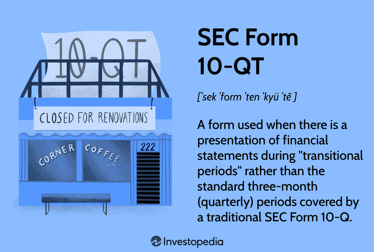

## Table of Contents

## What is SEC Form 10-QT?

SEC Form 10-QT is a special version of the regular SEC Form 10-Q. It is used by companies to report their quarterly financial performance to the Securities and Exchange Commission (SEC). The "T" in 10-QT stands for "transition," which means this form is used during a change in a company's fiscal year. This change might happen if a company decides to switch its fiscal year-end date.

When a company files a Form 10-QT, it includes similar information to the regular 10-Q, such as financial statements, management's discussion and analysis, and disclosures about the company's performance and any significant events. However, the 10-QT focuses on the transition period, which might not align with the usual quarterly reporting periods. This form helps investors and the SEC understand the company's financial health during this specific time of change.

## Who is required to file SEC Form 10-QT?

Companies that are publicly traded and registered with the Securities and Exchange Commission (SEC) need to file a Form 10-QT if they are changing their fiscal year. This form is important because it helps the company report its financial performance during the time when the fiscal year is being changed. Only companies going through this specific change need to use the 10-QT instead of the regular 10-Q.

The SEC requires this form to make sure that investors and the public have clear information about the company's finances, even during a transition period. If a company decides to switch its fiscal year-end, it must file a 10-QT to cover the period that doesn't fit into the usual quarterly reporting schedule. This way, everyone stays informed about the company's financial health during the change.

## How often must SEC Form 10-QT be filed?

SEC Form 10-QT is filed when a company changes its fiscal year. It's not something that happens regularly like the normal Form 10-Q, which is filed every three months. The 10-QT is only needed during the time when the company is switching its fiscal year-end date.

So, if a company decides to change when its financial year ends, it will file a 10-QT to report the financial performance for the period that doesn't fit into the usual quarterly reports. After the transition period is over, the company goes back to filing the regular 10-Q every quarter.

## What is the difference between SEC Form 10-Q and SEC Form 10-QT?

SEC Form 10-Q and SEC Form 10-QT are both used by publicly traded companies to report their quarterly financial performance to the Securities and Exchange Commission (SEC). The main difference is that Form 10-Q is used for regular quarterly reports, while Form 10-QT is used during a transition period when a company changes its fiscal year-end date. This means that if a company decides to switch when its financial year ends, it will use the 10-QT to report the financial performance for the period that doesn't fit into the usual quarterly schedule.

Both forms include similar information, such as financial statements, management's discussion and analysis, and disclosures about the company's performance. However, the 10-QT focuses specifically on the transition period, which might be shorter or longer than a typical quarter. This helps investors and the SEC understand the company's financial health during the time of change. After the transition period is over, the company goes back to filing the regular 10-Q every three months.

## What kind of financial information is included in SEC Form 10-QT?

SEC Form 10-QT includes financial information about a company during a time when it is changing its fiscal year. This form has financial statements like the balance sheet, income statement, and cash flow statement. These statements show how much money the company has, how much it has earned or lost, and how it has been spending or saving money during the transition period.

The form also has a section called Management's Discussion and Analysis (MD&A). This part explains what the numbers in the financial statements mean and how the company is doing overall. It talks about any big changes or events that happened during the transition period and how they might affect the company's future. This helps investors and the SEC understand the company's financial health during the time of change.

## How can one access SEC Form 10-QT filings?

You can access SEC Form 10-QT filings by going to the SEC's official website, which is called EDGAR (Electronic Data Gathering, Analysis, and Retrieval). On the EDGAR website, you can search for a company by its name or its ticker symbol. Once you find the company, you can look through its filings and find the 10-QT form if it has been filed. The website is easy to use and lets you view or download the filings for free.

Another way to access these filings is through financial websites and databases that offer SEC filings. Websites like Bloomberg, Yahoo Finance, or Morningstar often have sections where you can search for and view a company's SEC filings, including the 10-QT. These platforms might require a subscription or account, but many offer free access to basic documents like the 10-QT.

## What are the penalties for not filing SEC Form 10-QT on time?

If a company does not file its SEC Form 10-QT on time, it can face penalties from the Securities and Exchange Commission (SEC). The company might have to pay a fine, which can be a lot of money depending on how late the filing is and how big the company is. The SEC can also stop the company from trading its stock until the filing is done, which can hurt the company's business and make investors unhappy.

Not filing on time can also make the company look bad to investors and the public. People might think the company is hiding something or not managing its money well. This can make the company's stock price go down and make it harder for the company to get loans or do business with others. It's important for companies to file their 10-QT on time to avoid these problems.

## What are the key components of SEC Form 10-QT?

SEC Form 10-QT is a document that companies file when they change their fiscal year. It includes important financial information about the company during the time of this change. The main part of the form is the financial statements, which show the company's balance sheet, income statement, and cash flow statement. These statements help people see how much money the company has, how much it has made or lost, and how it has been spending or saving money during the transition period.

Another key part of the 10-QT is the Management's Discussion and Analysis (MD&A) section. This part explains what the numbers in the financial statements mean and gives an overview of how the company is doing. It talks about any big changes or events that happened during the transition and how they might affect the company's future. This helps investors and the SEC understand the company's financial health during the time of change.

## How does SEC Form 10-QT impact investment decisions?

SEC Form 10-QT can help investors make better choices about buying or selling a company's stock. When a company changes its fiscal year, it uses the 10-QT to show how it's doing during that time. Investors can look at the financial statements in the form to see how much money the company has, how much it's making or losing, and how it's spending or saving money. This information is important because it shows the company's financial health during a time of change, which can affect its value and future performance.

The Management's Discussion and Analysis (MD&A) section in the 10-QT is also very helpful for investors. It explains what the numbers in the financial statements mean and talks about any big changes or events that happened during the transition. By reading this part, investors can understand how these changes might affect the company's future. This helps them decide if the company is a good investment or if they should sell their shares. Knowing about the 10-QT can make investors more confident in their decisions.

## Can amendments be made to SEC Form 10-QT, and if so, how?

Yes, amendments can be made to SEC Form 10-QT. If a company finds a mistake or needs to update information in the form, it can file an amendment. This is done by using Form 10-Q/A, which stands for "amendment." The company fills out the Form 10-Q/A with the correct or new information and sends it to the SEC.

Filing an amendment is important because it makes sure that the information given to investors and the SEC is accurate and up to date. If a company doesn't fix mistakes or update important details, it could face penalties or lose the trust of investors. So, it's good for companies to check their filings carefully and make amendments when needed.

## What role does the SEC play in overseeing SEC Form 10-QT filings?

The Securities and Exchange Commission (SEC) is in charge of making sure that companies follow the rules about filing SEC Form 10-QT. When a company changes its fiscal year, it has to file this form to show its financial situation during that time. The SEC checks these filings to make sure the information is correct and complete. If a company does not file on time or if the information is wrong, the SEC can give out fines or stop the company from trading its stock.

The SEC also makes sure that the information in the 10-QT is available to the public. They do this by putting the filings on their website called EDGAR, where anyone can look at them for free. This helps investors make smart choices about buying or selling stocks. The SEC's job is to keep the market fair and honest, so they watch over these filings to protect investors and make sure companies are telling the truth about their money.

## How do changes in accounting standards affect SEC Form 10-QT reporting?

When accounting standards change, it can affect how companies report their financial information in SEC Form 10-QT. If a new rule comes into play during the time a company is changing its fiscal year, the company has to follow that new rule when filling out the 10-QT. This might mean the company has to change how it shows its money, like how it counts its income or expenses. These changes can make the financial statements look different from what they would have looked like under the old rules.

Because of these changes, it's important for the company to explain them clearly in the Management's Discussion and Analysis (MD&A) section of the 10-QT. This helps investors understand why the numbers might look different and how the new accounting standards affect the company's financial health. By doing this, the company makes sure that everyone has the right information to make good choices about investing in the company.

## References & Further Reading

[1]: SEC. ["Form 10-QT: Transitional Report Pursuant to Section 13 or 15(d) of the Securities Exchange Act of 1934."](https://www.investopedia.com/terms/s/sec-form-10-qt.asp)

[2]: U.S. Securities and Exchange Commission. ["Division of Corporation Finance Financial Reporting Manual."](https://www.sec.gov/about/divisions-offices/division-corporation-finance/financial-reporting-manual)

[3]: U.S. Securities and Exchange Commission. ["SEC Rule 15c3-5 Risk Management Controls for Brokers or Dealers with Market Access."](https://www.sec.gov/files/rules/final/2010/34-63241.pdf)

[4]: Aldridge, I. (2013). ["High-Frequency Trading: A Practical Guide to Algorithmic Strategies and Trading Systems"](https://www.amazon.com/High-Frequency-Trading-Practical-Algorithmic-Strategies/dp/1118343506). Wiley.

[5]: Lewis, M. (2014). ["Flash Boys: A Wall Street Revolt"](https://en.wikipedia.org/wiki/Flash_Boys). W. W. Norton & Company.

[6]: Wah, E., & Wellman, M. P. (2013). ["Latency Arbitrage, Market Fragmentation, and Efficiency: A Two-Market Model."](http://strategicreasoning.org/wp-content/uploads/2013/02/ec38-wah.pdf) Proceedings of the Fourteenth ACM Conference on Electronic Commerce. 

[7]: Hasbrouck, J., & Saar, G. (2013). ["Low-latency trading."](https://www.sciencedirect.com/science/article/abs/pii/S1386418113000165) The Review of Financial Studies, 26(9), 2091-2125.