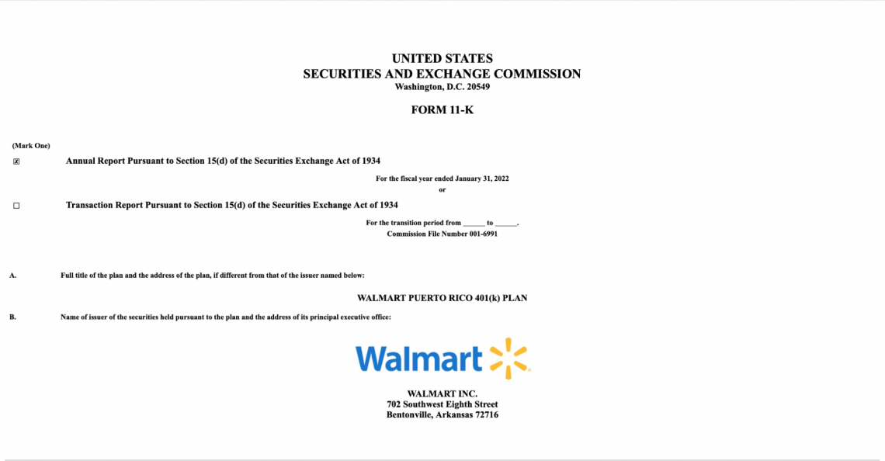

## Table of Contents

## What is SEC Form 11-K?

SEC Form 11-K is a special form that companies have to file with the U.S. Securities and Exchange Commission (SEC). It's used for reporting the financial details of employee benefit plans, like retirement or pension plans, that involve the company's stock. Companies need to file this form every year if their employee benefit plan holds their stock and has more than 100 participants.

The form includes an annual report and audited financial statements for the plan. This helps make sure that the plan is being managed properly and that the participants' investments are safe. By filing Form 11-K, companies show that they are following the rules set by the SEC and are being open about how they manage their employee benefit plans.

## Why is SEC Form 11-K important for companies?

SEC Form 11-K is important for companies because it helps them follow the rules set by the SEC. When a company has an employee benefit plan that includes its own stock and has over 100 participants, it must file this form every year. This makes sure that the company is being open about how it manages the plan and keeps the investments safe for the employees.

Filing Form 11-K also shows that the company is taking care of its employees' retirement plans. It includes important financial details and audited statements that help everyone see if the plan is being managed well. This builds trust with employees and shows that the company is responsible and cares about their future.

## Who is required to file SEC Form 11-K?

Companies need to file SEC Form 11-K if they have an employee benefit plan that includes their own stock and has more than 100 people in it. This form is important because it helps the company follow the rules set by the U.S. Securities and Exchange Commission (SEC).

Filing Form 11-K means the company has to share details about the plan every year. This includes financial reports and other information that shows how well the plan is being managed. It helps make sure that the employees' investments are safe and that the company is being honest about how it handles the plan.

## What types of employee benefit plans are covered by SEC Form 11-K?

SEC Form 11-K covers employee benefit plans that include the company's own stock. These plans are often retirement or pension plans where employees can invest in the company they work for. If the plan has more than 100 participants, the company has to file this form every year.

These plans are important because they help employees save for the future. By filing Form 11-K, the company shows that it is taking care of these plans and making sure the investments are safe. This helps build trust with employees and shows that the company is following the rules set by the SEC.

## What information must be included in SEC Form 11-K?

SEC Form 11-K must include an annual report for the employee benefit plan. This report shows how the plan is doing and if it is being managed well. It also has to have audited financial statements. These statements are checked by an outside group to make sure the numbers are right. The form needs to show how much money is in the plan, how it is invested, and how it has changed over the year.

The form also needs to include information about the plan's participants. This means how many people are in the plan and how their investments are doing. It helps everyone see if the plan is helping employees save for the future. By including all this information, the company shows that it is being honest and careful with the employees' money.

## How does a company prepare to file SEC Form 11-K?

To prepare for filing SEC Form 11-K, a company first needs to gather all the financial information about its employee benefit plan. This includes looking at how much money is in the plan, how it is invested, and how it has changed over the year. The company also needs to make sure that the plan's financial statements are audited. This means an outside group checks the numbers to make sure they are correct. The company should work with its accountants and auditors to get all this information ready.

Once the financial information is ready, the company needs to put it all together in the annual report for the plan. This report should clearly show how the plan is doing and if it is being managed well. The company then files this report with the SEC using Form 11-K. It's important to do this on time and make sure all the information is correct. This helps the company follow the rules and show that it is taking care of its employees' investments.

## What are the deadlines for filing SEC Form 11-K?

Companies need to file SEC Form 11-K within 180 days after the end of the plan's fiscal year. This means if the plan's year ends on December 31, the form needs to be filed by June 28 of the next year. It's important for companies to meet this deadline to follow the rules set by the SEC.

If a company misses the deadline, they might have to pay a fine or face other problems. So, it's a good idea for companies to start preparing early. They should gather all the financial information and make sure everything is ready well before the deadline.

## What are the penalties for not filing SEC Form 11-K on time?

If a company does not file SEC Form 11-K on time, they might have to pay a fine. The SEC can give a fine for each day the form is late. This can add up to a lot of money if the form is very late. The company might also have to explain why they were late, which can take more time and money.

Not filing on time can also make people trust the company less. Employees might worry about their retirement plans if the company does not follow the rules. This can make it harder for the company to keep good employees and can hurt their reputation. So, it is important for companies to file SEC Form 11-K on time to avoid these problems.

## How can a company ensure compliance with SEC Form 11-K requirements?

To make sure a company follows the rules for SEC Form 11-K, they need to start preparing early. They should gather all the financial information about their employee benefit plan, like how much money is in the plan and how it is invested. The company should also work with their accountants and auditors to make sure the financial statements are correct. It's important to keep good records and make sure all the numbers are right before filing the form.

Once the information is ready, the company should put it all together in the annual report for the plan. This report needs to show how the plan is doing and if it is being managed well. The company should file this report with the SEC within 180 days after the end of the plan's fiscal year. By doing all these things on time and carefully, the company can follow the rules and show that they are taking care of their employees' investments.

## What are the common challenges companies face when filing SEC Form 11-K?

One of the main challenges companies face when filing SEC Form 11-K is gathering all the right financial information about their employee benefit plan. This can be hard because it involves looking at a lot of numbers and making sure they are all correct. Companies need to work with their accountants and auditors to make sure the financial statements are right. This takes time and can be tricky if the company has a lot of employees or if the plan is very big.

Another challenge is meeting the deadline. Companies have to file the form within 180 days after the end of the plan's fiscal year. This means they need to start preparing early and make sure everything is ready on time. If they miss the deadline, they might have to pay a fine, which can be expensive. So, it's important for companies to plan ahead and keep good records to make sure they can file the form on time.

## How has the filing process for SEC Form 11-K evolved over time?

Over the years, the way companies file SEC Form 11-K has changed a lot. In the past, companies had to send in paper forms, which was slow and hard to keep track of. But now, thanks to the internet and new technology, companies can file the form online through the SEC's Electronic Data Gathering, Analysis, and Retrieval (EDGAR) system. This makes it easier and faster to send in the form, and it helps the SEC keep better records.

The rules for what needs to be in the form have also changed over time. The SEC has made the rules clearer and more detailed to make sure companies are being honest about how they manage their employee benefit plans. This means companies need to include more information in their reports, like audited financial statements and details about the plan's participants. These changes help make sure the plans are being managed well and that employees' investments are safe.

## What advanced strategies can companies use to optimize their SEC Form 11-K filings?

To optimize their SEC Form 11-K filings, companies can start by using technology to make the process easier. They can use special software to keep track of all the financial information about their employee benefit plan. This software can help them gather the right numbers and make sure they are correct. It can also help them put all the information together in the annual report. By using technology, companies can save time and make sure they file the form on time.

Another strategy is to work closely with their accountants and auditors. These experts can help the company make sure the financial statements are right and that they follow all the rules. Companies can also ask their accountants for advice on how to make their reports better. By working together, the company can make sure their SEC Form 11-K is clear and easy to understand. This helps build trust with employees and shows that the company is taking care of their investments.

## References & Further Reading

[1]: ["SEC Financial Reporting Manual"](https://www.sec.gov/about/divisions-offices/division-corporation-finance/financial-reporting-manual) by the U.S. Securities and Exchange Commission

[2]: ["Employee Stock Ownership Plans (ESOPs)"](https://www.investopedia.com/terms/e/esop.asp) by The National Center for Employee Ownership

[3]: ["Algorithmic Trading: Winning Strategies and Their Rationale"](https://books.google.com/books/about/Algorithmic_Trading.html?id=WAlFDwAAQBAJ) by Ernest P. Chan

[4]: ["Algorithms for High-Dimensional Data"](https://dataheadhunters.com/academy/high-dimensional-data-challenges-and-strategies-for-analysis/) by Amit Deshpande et al.

[5]: ["The Employee Retirement Income Security Act (ERISA)"](https://www.dol.gov/general/topic/retirement/erisa) by the U.S. Department of Labor