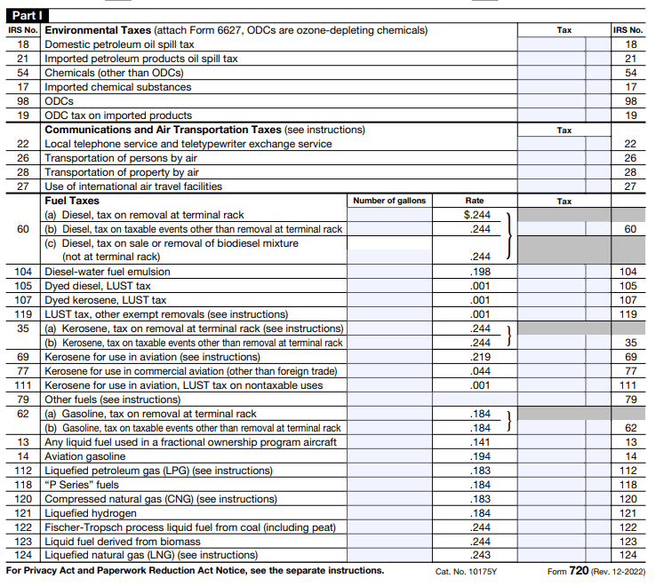

## Table of Contents

## What is SEC Form 12b-25?

SEC Form 12b-25 is a document that companies file with the U.S. Securities and Exchange Commission (SEC) when they need more time to submit their quarterly or annual reports. These reports, like the 10-Q and 10-K, are important because they tell investors how the company is doing financially. If a company can't file these reports on time, they use Form 12b-25 to ask for an extra 15 days to finish their work.

When a company files Form 12b-25, they have to explain why they need the extra time. Common reasons include problems with their accounting systems or waiting for important information. It's important for companies to be honest and clear about why they need more time. This form helps keep investors informed and maintains trust in the company, even if they are running a bit late with their reports.

## Who needs to file SEC Form 12b-25?

Any company that is publicly traded and listed on a stock exchange in the United States needs to file SEC Form 12b-25 if they can't submit their quarterly or annual financial reports on time. These reports are really important because they tell investors how the company is doing financially. If a company misses the deadline for these reports, they need to let the SEC know by filing Form 12b-25.

The form gives the company an extra 15 days to finish their reports. Companies might need this extra time for different reasons, like problems with their accounting systems or waiting for important information. By filing Form 12b-25, the company keeps investors informed and shows that they are working to get their reports done as soon as possible.

## What is the purpose of filing SEC Form 12b-25?

The purpose of filing SEC Form 12b-25 is to let the U.S. Securities and Exchange Commission (SEC) know that a company needs more time to submit their quarterly or annual financial reports. These reports are important because they tell investors how the company is doing financially. If a company can't file these reports on time, they use Form 12b-25 to ask for an extra 15 days to finish their work.

When a company files Form 12b-25, they have to explain why they need the extra time. Common reasons include problems with their accounting systems or waiting for important information. This form helps keep investors informed and maintains trust in the company, even if they are running a bit late with their reports. It shows that the company is working to get their reports done as soon as possible.

## How does SEC Form 12b-25 differ from other SEC forms?

SEC Form 12b-25 is different from other SEC forms because it's used specifically when a company needs more time to file their quarterly or annual financial reports. These reports, like the 10-Q and 10-K, are important because they tell investors how the company is doing financially. If a company can't file these reports on time, they use Form 12b-25 to ask for an extra 15 days. This form helps keep investors informed and maintains trust in the company, even if they are running a bit late with their reports.

Other SEC forms serve different purposes. For example, Form 10-K is used for the annual report, which gives a detailed look at the company's financial health over the past year. Form 10-Q is for the quarterly report, which updates investors on the company's progress every three months. Unlike Form 12b-25, these forms don't ask for more time; they are the actual financial reports. Form 12b-25 is more like a notification that says, "We need a little more time, and here's why," which helps keep everything transparent and honest with investors.

## What are the deadlines for filing SEC Form 12b-25?

A company must file SEC Form 12b-25 within five days after the original deadline for their quarterly or annual financial reports. For example, if a company's 10-Q report is due on May 15th, they need to file Form 12b-25 by May 20th if they can't meet that deadline.

Filing Form 12b-25 gives the company an extra 15 days to finish their reports. This means that after filing the form, they have until June 4th to submit their 10-Q report in the example above. This extra time helps the company make sure their financial information is accurate and complete before sharing it with investors.

## What information is required on SEC Form 12b-25?

When a company files SEC Form 12b-25, they need to include some important information. First, they have to say which report they can't file on time, like the 10-Q or 10-K. They also need to explain why they need more time. This could be because of problems with their accounting systems or waiting for important information. It's important for the company to be honest and clear about the reason.

The company also has to say if they expect any changes in their financial situation because of the delay. They need to tell the SEC if they think their financial results will be different from what people expected. This helps investors understand what might happen next. By giving all this information, the company keeps everyone informed and shows they are working to get their reports done as soon as possible.

## What are the consequences of not filing SEC Form 12b-25 on time?

If a company doesn't file SEC Form 12b-25 on time, they could face some serious problems. The SEC might see this as a big deal because it means the company isn't following the rules. This could lead to fines or other punishments from the SEC. The company might also get in trouble with the stock exchange where their shares are traded, which could affect their stock price.

Not filing on time can also hurt the company's reputation. Investors might start to worry about the company's financial health and lose trust in them. This can make the company's stock price go down and make it harder for them to get money from investors in the future. So, it's really important for companies to file Form 12b-25 on time if they need more time to finish their financial reports.

## How can a company request an extension using SEC Form 12b-25?

A company can request an extension for filing their quarterly or annual financial reports by using SEC Form 12b-25. They need to file this form within five days after the original deadline for their report. For example, if a company's 10-Q report is due on May 15th, they must file Form 12b-25 by May 20th if they can't meet that deadline. Filing this form gives the company an extra 15 days to finish their reports.

When filling out Form 12b-25, the company needs to clearly state which report they can't file on time, like the 10-Q or 10-K, and explain why they need more time. They should be honest about the reasons, which could include problems with their accounting systems or waiting for important information. The company also has to mention if they expect any changes in their financial situation because of the delay. This helps keep investors informed and maintains trust in the company, even if they are running a bit late with their reports.

## What are the advantages of filing SEC Form 12b-25?

Filing SEC Form 12b-25 gives a company more time to finish their financial reports. This extra time is really helpful because it lets the company make sure their financial information is correct and complete. Sometimes, a company might need more time because of problems with their accounting systems or because they are waiting for important information. By filing Form 12b-25, the company can avoid rushing and making mistakes in their reports.

Another advantage is that it keeps investors informed and maintains trust. When a company files Form 12b-25, they have to explain why they need more time. This transparency helps investors understand what's going on and why the reports are delayed. It shows that the company is working to get their reports done as soon as possible, which can help keep their reputation strong and their relationship with investors positive.

## How does SEC Form 12b-25 impact a company's financial reporting?

SEC Form 12b-25 gives a company more time to finish their financial reports. If a company can't meet the original deadline for their quarterly or annual reports, they can file this form to get an extra 15 days. This extra time helps the company make sure their financial information is correct and complete. Sometimes, a company might need more time because of problems with their accounting systems or because they are waiting for important information. By filing Form 12b-25, the company can avoid rushing and making mistakes in their reports.

Filing Form 12b-25 also keeps investors informed and maintains trust. When a company files this form, they have to explain why they need more time. This transparency helps investors understand what's going on and why the reports are delayed. It shows that the company is working to get their reports done as soon as possible, which can help keep their reputation strong and their relationship with investors positive. By being honest and clear about the delay, the company can avoid bigger problems and keep everything running smoothly.

## What are some common mistakes to avoid when filing SEC Form 12b-25?

When filing SEC Form 12b-25, one common mistake to avoid is missing the filing deadline. Companies must file this form within five days after the original deadline for their quarterly or annual financial reports. If they miss this window, they could face fines or other penalties from the SEC, which can harm their reputation and stock price. It's important to keep track of the deadlines and make sure to file Form 12b-25 on time if more time is needed.

Another mistake to avoid is not being clear and honest about why more time is needed. When a company files Form 12b-25, they have to explain the reason for the delay. If the explanation is vague or misleading, it can lead to more problems with the SEC and make investors lose trust in the company. Being transparent and specific about the reasons, like issues with accounting systems or waiting for important information, helps keep everything smooth and maintains good relationships with investors.

## How has the use of SEC Form 12b-25 evolved over time?

Over the years, the use of SEC Form 12b-25 has become more common as companies have faced increasing complexity in their financial reporting. In the past, fewer companies needed to use this form because their reporting processes were simpler and less prone to delays. But as businesses grew and regulations got stricter, companies started to need more time to make sure their financial information was accurate and complete. This led to an increase in the use of Form 12b-25 as a way to ask for more time without facing penalties.

Today, the SEC and investors pay close attention to companies that file Form 12b-25. They want to make sure that the reasons for needing more time are honest and clear. If a company uses this form often, it can make investors worried about the company's financial health. But when used properly, Form 12b-25 helps companies avoid rushing their reports and making mistakes, which is good for everyone involved. It shows that the company is trying to be as accurate and transparent as possible, even if they need a little extra time.

## References & Further Reading

[1]: ["Advances in Financial Machine Learning"](https://www.amazon.com/Advances-Financial-Machine-Learning-Marcos/dp/1119482089) by Marcos Lopez de Prado

[2]: ["Machine Learning for Algorithmic Trading"](https://www.amazon.com/Machine-Learning-Algorithmic-Trading-alternative/dp/1839217715) by Stefan Jansen

[3]: ["Quantitative Trading: How to Build Your Own Algorithmic Trading Business"](https://www.amazon.com/Quantitative-Trading-Build-Algorithmic-Business/dp/1119800064) by Ernest P. Chan

[4]: Hertzel, M., & Smith, R. L. (1993). ["Market discounts and shareholder gains for placing equity privately."](https://www.jstor.org/stable/2328908)90049-U) Journal of Financial Economics, 35(3), 303-334.

[5]: Brownlees, C. T., & Engle, R. F. (2012). ["Volatility, Correlation and Tails for Systemic Risk Measurement."](https://www.researchgate.net/publication/228232087_Volatility_Correlation_and_Tails_for_Systemic_Risk_Measurement) National Bureau of Economic Research.