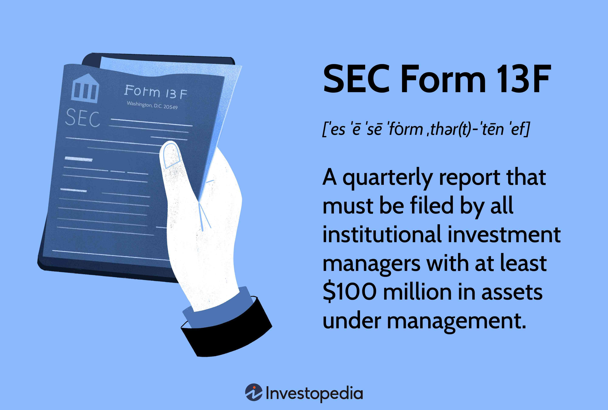

## Table of Contents

## What is SEC Form 13F?

SEC Form 13F is a report that big investors have to file with the U.S. Securities and Exchange Commission (SEC). These investors, called institutional investment managers, must file this form if they manage over $100 million in certain types of securities. The form shows what stocks and other securities these investors own at the end of each quarter.

The main goal of Form 13F is to give the public information about what big investors are buying and selling. This helps people see trends in the market and understand what big players are doing. The form is due 45 days after the end of each quarter, and it's available for anyone to look at on the SEC's website.

## Who is required to file SEC Form 13F?

Institutional investment managers are required to file SEC Form 13F. These are big investors who manage at least $100 million in what the SEC calls "Section 13(f) securities." These securities include stocks, options, and other similar investments traded on U.S. markets.

The rule is to make sure the public knows what these big investors are doing with their money. If an investor meets the $100 million threshold, they have to file the form every three months. This helps everyone see what the big players are buying and selling, which can be useful for understanding market trends.

## What is the purpose of SEC Form 13F?

The main purpose of SEC Form 13F is to give the public a clear view of what big investors are doing with their money. Big investors, who are called institutional investment managers, have to file this form if they manage over $100 million in certain types of investments. This helps everyone see which stocks and other securities these big investors are buying and selling.

By making this information public, people can spot trends in the market and understand what the big players are doing. The form is filed every three months, and it's available for anyone to see on the SEC's website. This transparency helps keep the market fair and open for everyone.

## How often must SEC Form 13F be filed?

SEC Form 13F needs to be filed every three months. This means big investors who manage over $100 million in certain types of investments have to report what they own at the end of each quarter.

The form is due 45 days after the end of each quarter. This regular reporting helps everyone see what big investors are buying and selling, which can show market trends and keep things open and fair.

## What information is required on SEC Form 13F?

SEC Form 13F requires big investors to list the stocks and other investments they own at the end of each quarter. They need to include the name of each company they have invested in, how many shares they own, and the total value of those shares. This helps everyone see exactly what these big investors are holding in their portfolios.

The form also asks for some basic information about the investor, like their name and the date of the report. This makes it easy to track who is reporting and when. By sharing this information, the public can see trends in the market and understand what big investors are doing with their money.

## How does one file SEC Form 13F?

To file SEC Form 13F, big investors, or institutional investment managers, need to use the SEC's Electronic Data Gathering, Analysis, and Retrieval (EDGAR) system. First, they have to sign up for an EDGAR account if they don't already have one. Once they're signed up, they can log in and start filling out the form. They need to list all the stocks and other investments they own at the end of the quarter, including the name of each company, the number of shares they own, and the total value of those shares.

After filling out all the required information, the investor submits the form through EDGAR. The form is due 45 days after the end of each quarter, so it's important to keep track of the deadlines. Once submitted, the form becomes public and anyone can look at it on the SEC's website. This helps everyone see what big investors are doing and can show trends in the market.

## What are the penalties for not filing SEC Form 13F on time?

If big investors don't file SEC Form 13F on time, they can get in trouble. The SEC can fine them for not following the rules. The fines can be a lot of money, depending on how late the form is and how often they've been late before. The SEC wants to make sure everyone follows the rules to keep the market fair.

Besides fines, the SEC might also look into the investor's other activities. They could find more problems and give even bigger penalties. It's really important for big investors to file their Form 13F on time to avoid these problems and keep everything open and honest.

## How can the data from SEC Form 13F be used for investment analysis?

Data from SEC Form 13F can be very helpful for people who want to understand what big investors are doing. By looking at these forms, you can see which stocks and other investments big investors are buying and selling. This can give you ideas about which companies might be good to invest in. If many big investors are buying a certain stock, it might mean they think the stock will go up in value. You can also see if big investors are selling a lot of a certain stock, which might mean they think the stock will go down.

Using this information, you can spot trends in the market. For example, if a lot of big investors are investing in technology companies, it might be a sign that the tech industry is doing well. You can also compare what different big investors are doing. If one investor is buying a lot of a stock that others are selling, it might be interesting to look into why they have different views. This can help you make smarter choices about your own investments by following what the big players are doing or even going against them if you think they're wrong.

## What are common errors or issues encountered when filing SEC Form 13F?

When big investors file SEC Form 13F, they sometimes make mistakes. A common error is not filing on time. The form is due 45 days after the end of each quarter, and missing this deadline can lead to fines from the SEC. Another issue is not reporting all the right information. Big investors need to list every stock and investment they own, along with the number of shares and their value. If they leave something out or get the numbers wrong, it can cause problems.

Another frequent mistake is not using the right format when filing through the EDGAR system. The SEC has specific rules about how the form should look, and if it's not done correctly, it can be rejected. Technical issues with the EDGAR system can also cause trouble. Sometimes the system might be down or not working right, which can make it hard to file on time. It's important for big investors to double-check everything and make sure they follow all the rules to avoid these common errors.

## How has SEC Form 13F evolved over time, and what changes have been proposed?

SEC Form 13F has changed a bit since it started in 1978. At first, it was just a way to make sure big investors told everyone what stocks they owned. Over the years, the SEC made some changes to make the form easier to fill out and read. They added rules about how to list the stocks and how to use the EDGAR system to file the form. They also made it clear that big investors have to file the form every three months, no matter what.

There have been talks about changing SEC Form 13F even more. Some people think big investors should have to share more details about what they're doing, like why they're buying or selling certain stocks. Others worry that too much information could give some people an unfair advantage. The SEC has been looking at these ideas, but they haven't made big changes yet. They want to keep the market fair and open, so they're thinking carefully about what to do next.

## What are the implications of SEC Form 13F for market transparency and regulatory oversight?

SEC Form 13F helps make the stock market more open and honest. Big investors have to tell everyone what stocks they own every three months. This means anyone can see what these big players are doing, which helps people understand market trends. If a lot of big investors are buying the same stock, it might mean that stock is a good investment. This openness helps everyone make better choices about where to put their money.

The SEC uses Form 13F to keep an eye on what big investors are doing. If an investor doesn't file the form on time or makes mistakes, the SEC can give them fines. This makes sure big investors follow the rules and helps the SEC spot any problems early. By watching what big investors are doing, the SEC can make sure the market stays fair for everyone.

## How do institutional investors strategize around the disclosure requirements of SEC Form 13F?

Institutional investors often think carefully about how to handle the information they have to share on SEC Form 13F. They know that everyone can see what they're buying and selling, so they might try to keep some of their moves secret until the last minute. For example, they might wait until the end of the quarter to make big trades, so they don't have to show their plans too early. This way, other people can't copy their moves or try to take advantage of what they're doing.

Some investors also use the information from other big investors' Form 13F filings to help them make their own decisions. They look at what stocks other big investors are buying and selling and think about whether they should do the same. But they also have to be careful not to just follow what everyone else is doing, because sometimes it's better to go against the crowd if they think the market is wrong. By being smart about when and how they share their information, institutional investors try to keep an edge in the market.

## References & Further Reading

[1]: ["FAQs About Form 13F"](https://www.sec.gov/rules-regulations/staff-guidance/division-investment-management-frequently-asked-questions/frequently-asked-questions-about-form-13f) U.S. Securities and Exchange Commission

[2]: Jagannathan, R., & Ma, T. (2003). ["Risk Reduction in Large Portfolios: Why Imposing the Wrong Constraints Helps."](https://www.nber.org/papers/w8922) The Journal of Finance, 58(4), 1651-1684.

[3]: ["Oversight of Large Investment Advisers and Investment Companies"](https://www.forbes.com/lists/top-ria-firms/) U.S. Securities and Exchange Commission

[4]: Kreps, D. M. (1990). ["A Course in Microeconomic Theory"](https://www.jstor.org/stable/j.ctv12fw7z7) Princeton University Press.

[5]: Wermers, R. (2000). ["Mutual Fund Performance: An Empirical Decomposition into Stock-Picking Talent, Style, Transactions Costs, and Expenses."](https://www.jstor.org/stable/222375) The Journal of Finance, 55(4), 1655-1695.