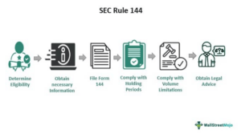

The world of securities trading is inherently complex, characterized by an intricate web of regulatory compliance requirements aimed at ensuring transparency and fairness in the financial markets. Among these regulations, SEC Form 144 plays a pivotal role for individuals and entities involved in selling restricted or control securities. SEC Form 144 is a notification filed with the U.S. Securities and Exchange Commission (SEC) by insiders of a company—such as directors, officers, or significant shareholders—who wish to sell securities that are not freely tradable, often due to holding restrictions imposed by the securities laws.

Filing SEC Form 144 is essential for compliance with the SEC's regulatory framework, which strives to safeguard the interests of public investors and maintain orderly market activities. This form is mandatory when the proposed sale of restricted or control securities surpasses specified thresholds: either exceeding 5,000 shares or attaining an aggregate sales price above $50,000 within a three-month period. By mandating such disclosures, the SEC ensures that the trading of significant quantities of restricted securities is conducted within the bounds of legality and transparency, thereby fostering confidence in the securities markets.

Moreover, understanding the intricacies of SEC Form 144 is particularly significant for traders employing algorithmic trading strategies, which are heavily reliant on speed, precision, and regulatory compliance. Algorithmic trading, characterized by the use of automated systems to execute trades at high frequencies, necessitates adherence to regulatory requirements to mitigate potential risks associated with non-compliance, such as trading restrictions or financial penalties.

This article examines the critical aspects of SEC Form 144, including its filing requirements and implications for algorithmic trading. A thorough understanding of these elements is indispensable for traders and companies aiming to navigate the complex landscape of securities trading while ensuring adherence to regulatory standards, ultimately contributing to the integrity and stability of the financial markets.

## Table of Contents

## Understanding SEC Form 144

SEC Form 144 is a mandatory filing for company affiliates who are planning to sell restricted or control securities, under the regulation of the Securities and Exchange Commission (SEC). The need for this form arises predominantly when the sale occurs within any three-month period surpassing 5,000 shares or units, or when the aggregate sales price exceeds $50,000. This requirement applies to individuals classified as affiliates, which generally includes insiders such as directors, officers, or substantial shareholders of a company.

The primary purpose of SEC Form 144 is to ensure transparency in the sale of restricted securities by company insiders, which is crucial for maintaining market integrity. As a compliance measure, this form aids in protecting the interests of investors and the general market by preventing sudden fluctuations or manipulations that could arise from large volume sales by insiders without prior notice. 

SEC rules stipulate that restricted and control securities cannot be sold to the public without an effective registration statement or an applicable exemption. Form 144 serves as a notification of proposed sale of securities, allowing the SEC to oversee these transactions and ensure they adhere to regulations established under the Securities Act of 1933. The filing of this form is a procedural step that enables the SEC to monitor the intentions of company affiliates, thereby allowing them to act if these sales could potentially impact the market negatively.

Given its regulatory significance, preparing and filing SEC Form 144 accurately and timely is not just a procedural compliance but also a critical step for affiliates in signaling legitimate trading activity. This transparency helps uphold lawful trading practices and safeguards market participants from potential exploitation or misinformation.

## Key Filing Rules for SEC Form 144

SEC Form 144 is a critical regulatory requirement for individuals classified as corporate insiders, which includes directors, officers, or shareholders with significant stakes in the company. These insiders are obligated to file this form with the Securities and Exchange Commission (SEC) when they propose to sell restricted or control securities. The filing requirement serves as a mechanism to ensure that the proposed sale is conducted transparently and in accordance with federal securities laws.

The primary condition for submitting SEC Form 144 is that the insiders must express a bona fide intention to sell the securities within a reasonable time frame after the filing. This condition is in place to prevent any circumvention of securities regulations and to maintain market integrity.

Regarding the submission process, Form 144 can be filed in two ways: either as a physical printed document or electronically through the SEC's Electronic Data Gathering, Analysis, and Retrieval system, commonly known as EDGAR. The electronic submission via EDGAR has become increasingly popular as it streamlines the filing process, offering a more efficient and accessible method for insiders to comply with regulatory requirements. This transition to electronic filing reflects the SEC's ongoing efforts to modernize the compliance process and reduce the administrative burden on filers. 

Overall, adherence to these filing rules is essential for corporate insiders to legally execute their proposed sales and avoid potential penalties for non-compliance.

## Special Considerations Under Rule 144

SEC Rule 144 provides guidelines and conditions for the sale of restricted or control securities, aimed at protecting the market from unfair trading practices and ensuring transparency. One of the primary considerations under Rule 144 is the imposition of minimum holding periods. For public companies, sellers must hold the securities for a minimum of six months; for companies that are not subject to the reporting requirements of the Securities Exchange Act of 1934, the holding period extends to one year. These holding periods are designed to discourage short-term trading on inside information and to align with long-term investment strategies.

Another significant stipulation of Rule 144 is the [volume](/wiki/volume-trading-strategy) limitations placed on sellers. During the filing period, which typically spans over three months, the seller must not exceed selling more than 1% of the total outstanding shares. This restriction helps maintain market stability by preventing large-scale dumping of securities, which can adversely affect stock prices.

Furthermore, there is a requirement for adequate public disclosure of the company’s financial conditions and management structure. Public disclosure ensures that all investors have access to equivalent information regarding a company’s financial health and corporate governance, allowing for informed investment decisions. Companies are expected to provide comprehensive and timely disclosure of financial statements and any changes in management to comply with these requirements, thereby promoting transparency and investor confidence.

Overall, the special considerations under Rule 144 serve to mitigate risks associated with the trading of restricted or control securities, fostering a more equitable and informed trading environment.

## Impact of SEC Form 144 on Algorithmic Trading

Algorithmic trading (algo trading) involves the use of computer algorithms to automate the trading process, relying significantly on speed, precision, and the ability to process large datasets. One critical aspect of this trading strategy includes ensuring compliance with regulatory requirements, such as those mandated by the U.S. Securities and Exchange Commission (SEC), specifically SEC Form 144. Compliance with SEC Form 144 is particularly crucial for [algorithmic trading](/wiki/algorithmic-trading) strategies that involve restricted or control securities.

SEC Form 144 acts as a notice of proposed sale for securities and is essential for regulatory transparency, especially for insiders, such as directors or significant shareholders, aiming to sell shares. For algo traders, non-compliance with the filing requirements of Form 144 can introduce significant risks to trading strategies. Here are some key considerations:

1. **Integration of Regulatory Checkpoints**: Algorithmic trading systems should be designed to incorporate checkpoints that verify compliance with SEC Form 144 requirements. For instance, integrating an automated notification system within the trading algorithm could alert traders when a Form 144 filing is necessary. This system should be equipped to handle different conditions, such as sales volume limits exceeding 5,000 shares or the $50,000 threshold, thereby providing dynamic compliance oversight.

2. **Potential Discrepancies and Delays**: Failure to comply with the timely filing of SEC Form 144 can result in trading halts or regulatory sanctions, which could be detrimental to trading algorithms, especially those executing high-frequency trades. Therefore, keeping track of the timing and conditions under which these filings are due is crucial. Programmers and traders should implement robust systems for real-time monitoring of compliance status to preempt any negative regulatory outcomes.

3. **Market Impact Considerations**: Algorithmic strategies often prioritize minimizing market impact. However, transactions involving disclosures under Form 144 may affect the market perception of a company’s stock, potentially leading to price volatility. Therefore, algorithms used in trades involving Form 144 should account for possible market reactions by adjusting parameters such as trade timing and execution speed to mitigate adverse effects on stock prices.

In the context of algorithmic trading, SEC Form 144 compliance must be viewed as an integral component of the overall risk management strategy. By embedding regulatory compliance into the algorithmic processing workflow, traders can ensure that they remain within legal bounds and avoid operational disruptions resulting from regulatory lapses. This alignment not only preserves the integrity of the market but also safeguards the efficiency and efficacy of algorithmic trading strategies.

## Conclusion

SEC Form 144 plays an essential role in maintaining the legality and transparency of transactions involving restricted or control securities. Compliance with this regulation is indispensable for both traders and companies seeking to uphold market integrity. For traders, especially those employing algorithmic trading strategies, understanding the intricacies of Form 144 is crucial. Algorithmic systems are designed to execute trades rapidly and with precision; however, they must also align with regulatory frameworks to avoid inadvertent legal complications. 

Adept knowledge of SEC Form 144 ensures that algorithmic processes [factor](/wiki/factor-investing) in necessary filing timelines and volume restrictions, thus mitigating risks associated with non-compliance. Companies must also ensure that their operations remain within the bounds of the law to prevent compromising their market standing. By adhering to these regulatory requirements, both traders and companies contribute to a transparent and trustworthy trading environment, which is vital for the efficient functioning of the securities market.

## References & Further Reading

[1]: Securities and Exchange Commission. ["Rule 144: Selling Restricted and Control Securities"](https://www.sec.gov/about/reports-publications/investorpubsrule144)

[2]: Securities and Exchange Commission. ["Form 144: For Notice of Proposed Sale of Securities"](https://www.sec.gov/about/forms/form144.pdf)

[3]: Bragg, Steven M. ["Running a Public Company: From IPO to SEC Reporting"](https://www.amazon.com/Running-Public-Company-IPO-Reporting/dp/0470446366) - this book provides insights into the legal and compliance obligations of public companies, including aspects related to SEC forms.

[4]: Aldridge, Irene. ["High-Frequency Trading: A Practical Guide to Algorithmic Strategies and Trading Systems"](https://www.amazon.com/High-Frequency-Trading-Practical-Algorithmic-Strategies/dp/1118343506) – a comprehensive resource on algorithmic trading strategies and systems.

[5]: SEC's Electronic Data Gathering, Analysis, and Retrieval (EDGAR). [Website for filings](https://www.sec.gov/search-filings/edgar-search-assistance/accessing-edgar-data) - a valuable platform for accessing company filings, including Form 144 submissions.