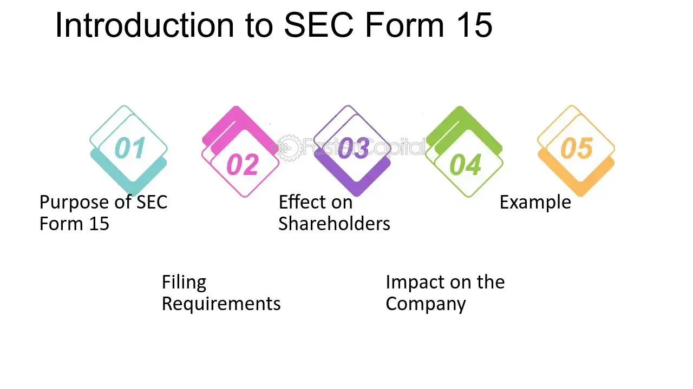

## Table of Contents

## What is SEC Form 15-12G?

SEC Form 15-12G is a document that companies file with the U.S. Securities and Exchange Commission (SEC) when they want to stop being a public company. This form is also known as the Certification of Termination of Registration of a Class of Securities. When a company files this form, it means they no longer want to have their stocks traded on the stock market and they don't want to follow the rules that public companies have to follow.

Once a company files Form 15-12G, they are usually no longer required to file regular reports with the SEC, like quarterly and annual reports. This can save the company time and money because they don't have to spend resources on these reports. However, it also means that investors will have less information about the company, which can make it harder for them to make good decisions about buying or selling the company's stock.

## Who needs to file SEC Form 15-12G?

A company needs to file SEC Form 15-12G if it wants to stop being a public company. This means the company no longer wants its stocks to be traded on the stock market. Companies might choose to do this for different reasons, like if they want to save money on the costs of being public or if they want more privacy.

When a company files this form, it tells the SEC that it wants to stop following the rules that public companies have to follow. This includes not having to file regular reports like quarterly and annual reports anymore. But, it also means that people who own the company's stock will have less information about how the company is doing, which can make it harder for them to decide whether to keep or sell their stocks.

## What is the purpose of filing SEC Form 15-12G?

The main reason a company files SEC Form 15-12G is to stop being a public company. This means the company no longer wants its stocks to be traded on the stock market. Companies might choose to do this because they want to save money on the costs of being a public company or because they want more privacy.

When a company files this form, it tells the SEC that it wants to stop following the rules that public companies have to follow. This includes not having to file regular reports like quarterly and annual reports anymore. However, this also means that people who own the company's stock will have less information about how the company is doing, which can make it harder for them to decide whether to keep or sell their stocks.

## How does filing SEC Form 15-12G affect a company's reporting obligations?

When a company files SEC Form 15-12G, it means they want to stop being a public company. This filing tells the SEC that the company no longer wants to follow the rules that public companies have to follow. One big change is that the company doesn't have to file regular reports anymore. These reports, like quarterly and annual reports, can be costly and time-consuming to prepare. By not having to file them, the company can save a lot of money and effort.

However, this also means that people who own the company's stock will have less information about how the company is doing. Without these regular reports, investors might find it harder to make good decisions about whether to keep or sell their stocks. So, while filing Form 15-12G can help the company save resources, it can also make things more difficult for its shareholders.

## What are the steps to file SEC Form 15-12G?

To file SEC Form 15-12G, a company first needs to prepare the form. They can find the form on the SEC's website. The company needs to fill out the form with all the right information, like the name of the company and the type of securities they want to stop trading. They also need to explain why they want to stop being a public company. Once the form is filled out, the company needs to sign it to show that the information is true.

After preparing the form, the company needs to submit it to the SEC. They can do this electronically through the SEC's online filing system called EDGAR. The company needs to make sure they follow all the rules for filing, like paying any fees that might be required. Once the SEC gets the form, they will review it. If everything is okay, the company will no longer have to follow the rules for public companies, and their stocks will stop trading on the stock market.

## What are the deadlines for filing SEC Form 15-12G?

When a company wants to file SEC Form 15-12G, there isn't a strict deadline they have to meet. Instead, they can file it whenever they decide they want to stop being a public company. This means they can choose the timing that works best for them, but they should think about how it might affect their business and shareholders.

Once the company files the form, the SEC will review it. If everything looks good, the company's stocks will stop trading on the stock market 90 days after the filing. This gives investors some time to adjust to the change. So, while there's no specific deadline for filing, the company should plan ahead because there's a waiting period before the change is final.

## What are the potential benefits of filing SEC Form 15-12G for a company?

Filing SEC Form 15-12G can help a company save money. When a company is public, it has to spend a lot of time and money on things like making quarterly and annual reports. By filing this form, the company doesn't have to do those things anymore. This can save them a lot of money and let them focus more on running their business instead of worrying about all the rules they have to follow.

Another benefit is that the company can be more private. When a company is public, it has to share a lot of information with everyone. But when it files Form 15-12G, it doesn't have to share as much. This can be good for companies that want to keep their business plans secret or just want to have less attention on them. It can also make it easier for the company to make big changes without having to explain everything to the public.

## What are the potential risks or drawbacks of filing SEC Form 15-12G?

Filing SEC Form 15-12G can make it harder for a company to get money. When a company is public, it can sell its stocks to raise money. But if it stops being public, it might not be able to do that anymore. This can make it harder for the company to grow or to pay for things it needs. Also, when a company goes private, it might have to buy back its stocks from shareholders, which can be expensive.

Another risk is that shareholders might not like the change. When a company is public, shareholders get regular reports about how the company is doing. But when the company files Form 15-12G, it stops sharing this information. This can make shareholders feel left in the dark and they might decide to sell their stocks. If a lot of people sell their stocks, the price of the stock can go down a lot, which can hurt the company's value.

## How does the SEC review and process Form 15-12G filings?

When a company files SEC Form 15-12G, the SEC looks at the form to make sure everything is correct. They check if the company has filled out all the parts of the form and if the information they gave is true. The SEC also makes sure the company has followed all the rules for filing, like paying any fees that might be needed. If the SEC finds any problems, they might ask the company to fix them before they can approve the form.

Once the SEC is happy with the form, they will approve it. After the form is approved, the company's stocks will stop trading on the stock market. This doesn't happen right away; there is a waiting period of 90 days after the filing. This gives investors some time to get ready for the change. During this time, the company doesn't have to file regular reports anymore, but they still have to follow some rules until the 90 days are over.

## What happens after a company successfully files SEC Form 15-12G?

After a company successfully files SEC Form 15-12G, it starts the process of becoming a private company again. The SEC will review the form to make sure everything is correct. Once the SEC approves the form, there is a waiting period of 90 days before the company officially stops being public. During this time, the company's stocks will still be traded on the stock market, but the company doesn't have to file regular reports like they used to.

Once the 90 days are over, the company's stocks will stop trading on the stock market. The company will no longer have to follow the rules that public companies have to follow. This means they don't have to spend time and money on making quarterly and annual reports anymore. However, this also means that shareholders will have less information about how the company is doing, which can make it harder for them to decide what to do with their stocks.

## Can a company reverse the filing of SEC Form 15-12G, and if so, how?

Yes, a company can reverse the filing of SEC Form 15-12G, but it's not easy. If a company changes its mind before the 90-day waiting period is over, they can file a Form 15-12G/A, which is an amendment to the original form. This tells the SEC that they don't want to go through with stopping being a public company after all. They need to do this before the 90 days are up, or it will be too late.

If the 90 days have already passed and the company's stocks have stopped trading, it's much harder to reverse the decision. The company would have to go through a process called "going public" again. This means they would have to file a new registration statement with the SEC, follow all the rules for public companies, and start trading their stocks on the stock market again. It can be a long and expensive process, so companies need to be very sure before they file Form 15-12G in the first place.

## What are some real-world examples of companies that have filed SEC Form 15-12G and the outcomes?

One example of a company that filed SEC Form 15-12G is Dell Inc. In 2013, Dell decided to go private because they wanted to focus on long-term plans without the pressure of being a public company. They filed Form 15-12G and after the 90-day waiting period, Dell's stocks stopped trading on the stock market. This move helped Dell save money on reporting costs and allowed them to make big changes without having to explain everything to shareholders. However, some shareholders were not happy because they lost the chance to sell their stocks at a high price.

Another example is Toys "R" Us. In 2018, Toys "R" Us filed Form 15-12G as part of their bankruptcy process. They wanted to stop being a public company to focus on restructuring their business. After filing the form, their stocks stopped trading, and they no longer had to file regular reports. Unfortunately, Toys "R" Us was not able to recover from their financial problems and ended up closing all their stores in the U.S. This shows that going private can be a good move for some companies, but it doesn't always lead to success.

## References & Further Reading

[1]: Carlson, R., Kowalski, P., & Marcus, J. (2017). ["SEC Compliance for Public Companies."](https://carlsonr.com/publication/) Practising Law Institute.

[2]: Khadem, S. (2013). ["Securities Regulation in the United States: A Practical Guide."](https://law-store.wolterskluwer.com/s/product/united-states-securities-law-a-practicle-guide-third-edition/01t0f00000J3aZ3AAJ) Kluwer Law International.

[3]: Coffee, J. C., & Sale, H. A. (2019). ["Securities Regulation: Cases and Materials."](https://scholarship.law.columbia.edu/books/342/) University Casebook Series.

[4]: Moyer, S. P. (2017). ["Crowdfunding and Regulation A+: How to Launch a Campaign and Harness the Power of the Internet to Fund Your Small Business or Start-Up."](https://www.bizapedia.com/people/walt-moyer.html) ABA Business Law Section.

[5]: Rochlin, S. A. (2018). ["Trader's Guide to Financial Markets and Algorithmic Trading."](https://www.nickiswift.com/1740611/richest-fox-news-anchors/) Penguin Publishing Group.