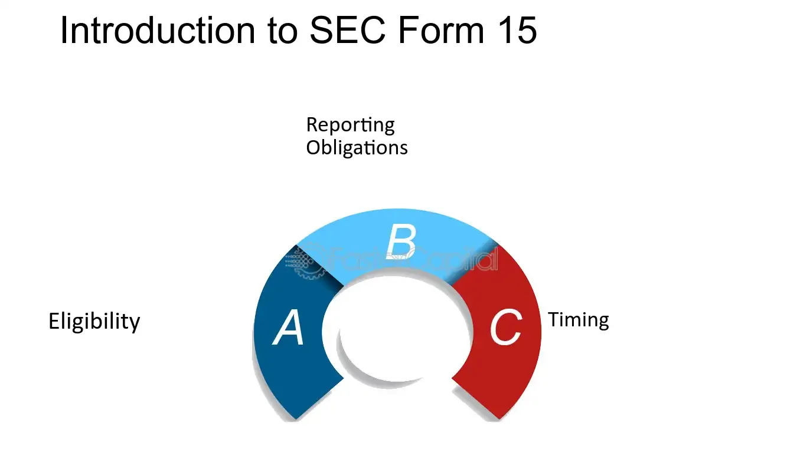

## Table of Contents

## What is SEC Form 15?

SEC Form 15 is a document that companies use to tell the Securities and Exchange Commission (SEC) that they no longer want to be a public company. When a company files this form, it means they want to stop having to follow all the rules and regulations that come with being a public company. This includes not having to file regular reports like annual and quarterly financial statements.

After a company files Form 15, it starts a process called deregistration. This process can take about 90 days to complete. Once it's done, the company is no longer considered a public company and doesn't have to report to the SEC anymore. This can be a big change for the company, as it means they can operate more privately but also might have less access to public investment.

## Who is eligible to file SEC Form 15?

Any company that has registered securities with the SEC can file Form 15 if they want to stop being a public company. This includes companies that have stocks, bonds, or other types of securities that are traded on public markets. The company must be up to date with all their required filings before they can file Form 15. This means they need to have submitted all their annual and quarterly reports that were due before they can start the process of deregistration.

Once a company files Form 15, they start a process that takes about 90 days. During this time, the SEC reviews the filing and makes sure everything is in order. If everything is correct, the company's securities will be deregistered, and they will no longer have to follow the rules for public companies. This can be a good choice for smaller companies that find the costs and time of being public too high, but it also means they might have a harder time getting money from the public in the future.

## What are the conditions for filing SEC Form 15?

To file SEC Form 15, a company needs to have securities that are registered with the SEC. This means they have stocks, bonds, or other types of securities that are traded on public markets. The company also needs to be up to date with all their required filings. This means they must have submitted all their annual and quarterly reports that were due before they can start the process of deregistration.

Once a company files Form 15, it starts a process that takes about 90 days. During this time, the SEC checks the filing to make sure everything is correct. If everything is in order, the company's securities will be deregistered, and they will no longer have to follow the rules for public companies. This can be a good choice for smaller companies that find the costs and time of being public too high, but it also means they might have a harder time getting money from the public in the future.

## What is the process for filing SEC Form 15?

To file SEC Form 15, a company first needs to make sure they are up to date with all their required reports. This means they have to have sent in all their annual and quarterly reports that were due. If they have done this, they can then file Form 15 with the SEC. This form tells the SEC that the company wants to stop being a public company and no longer wants to follow the rules for public companies.

After the company files Form 15, a process starts that takes about 90 days. During this time, the SEC looks at the filing to make sure everything is correct. If everything is okay, the company's securities will be deregistered. This means the company is no longer a public company and doesn't have to follow the rules for public companies anymore. This can be a good choice for smaller companies that find the costs and time of being public too high, but it also means they might have a harder time getting money from the public in the future.

## What are the immediate effects of filing SEC Form 15?

When a company files SEC Form 15, it starts a 90-day process where the SEC checks the filing. During this time, the company's securities are still considered public, but the company is telling everyone they want to stop being a public company. This means they are asking to not have to follow all the rules and regulations that come with being public anymore.

Once the 90 days are up and everything is okay, the company's securities get deregistered. This means the company is no longer a public company. They don't have to file regular reports like annual and quarterly financial statements anymore. This can save them time and money, but it also means they might find it harder to get money from the public in the future because they are less transparent.

## How does filing SEC Form 15 affect a company's reporting obligations?

When a company files SEC Form 15, it starts a process to stop being a public company. During the 90 days it takes for the SEC to check the filing, the company still has to follow all the rules for public companies. This means they need to keep filing their regular reports like annual and quarterly financial statements.

Once the 90 days are over and everything is okay, the company's securities get deregistered. This means the company is no longer a public company and they don't have to follow the rules for public companies anymore. They don't need to file those regular reports anymore, which can save them time and money. But, it also means they might find it harder to get money from the public because they are less transparent.

## What are the long-term implications of filing SEC Form 15?

When a company files SEC Form 15 and becomes a private company, it means they no longer have to follow the strict rules for public companies. They don't have to file regular reports like annual and quarterly financial statements anymore. This can save them a lot of time and money because they don't have to spend as much on keeping up with all the rules and paperwork. It can also mean they have more privacy because they don't have to share as much information with the public.

However, there are also some challenges that come with becoming a private company. It can be harder for the company to get money from the public because investors might not trust them as much if they can't see all the financial details. This means the company might need to find other ways to get the money they need to grow. Also, if the company ever wants to go back to being a public company, it can be a long and expensive process to start following all the rules again.

## Can a company reverse the filing of SEC Form 15, and if so, how?

Yes, a company can reverse the filing of SEC Form 15, but it's not easy. If a company decides they want to be a public company again, they need to go through a process called re-registration. This means they have to start following all the rules for public companies again, like filing regular reports with the SEC. They also have to make sure they meet all the requirements to be a public company, which can be hard and expensive.

The process to reverse a Form 15 filing can take a long time. The company has to file new forms with the SEC and might need to have their financials checked by an independent auditor. They also need to make sure they have enough shareholders and that their stock is traded enough to meet the rules for being a public company. It's a big step, so companies need to think carefully before deciding to go back to being public.

## What are the potential risks and benefits of filing SEC Form 15?

Filing SEC Form 15 means a company wants to stop being a public company. One big benefit is that it can save the company a lot of time and money. They don't have to spend as much on following all the rules and paperwork that public companies have to do. This can also give them more privacy because they don't have to share as much information with everyone. It can be a good choice for smaller companies that find being public too hard or expensive.

But there are also risks. When a company stops being public, it can be harder for them to get money from investors. People might not trust them as much if they can't see all the financial details. This means the company might need to find other ways to get the money they need to grow. Also, if they ever want to go back to being a public company, it can be a long and expensive process to start following all the rules again. So, companies need to think carefully about these risks and benefits before deciding to file Form 15.

## How does SEC Form 15 impact shareholders and investors?

When a company files SEC Form 15, it wants to stop being a public company. This can be a big change for shareholders and investors. They might find it harder to get information about the company because it doesn't have to share as much anymore. This can make them less sure about the company's future and might make them want to sell their shares. Also, if they want to buy or sell the company's stock, it can be harder because there might be fewer people trading it.

On the other hand, some investors might see the company filing Form 15 as a good thing. They might think the company will save money by not having to follow all the rules for public companies. This could mean the company has more money to spend on growing the business, which could be good for shareholders in the long run. But, investors need to be careful and think about if they are okay with less information and possibly less chance to trade the stock easily.

## What are some common mistakes to avoid when filing SEC Form 15?

When a company wants to file SEC Form 15, it's important to make sure they are up to date with all their reports. If they haven't sent in all their annual and quarterly reports that were due, the SEC won't accept their Form 15. This is a common mistake that can delay the whole process. Companies need to check that they have done everything they need to do before they file.

Another mistake to avoid is not understanding what happens after filing Form 15. The company needs to know that it starts a 90-day process where the SEC checks everything. During this time, they still have to follow all the rules for public companies. If they don't, it can cause problems. It's also important for the company to think about how this will affect their shareholders and investors, and make sure they communicate clearly about what's happening.

## What recent changes or updates have been made to the regulations surrounding SEC Form 15?

There have been some changes to the rules about SEC Form 15 that companies need to know about. One big change is that the SEC now allows companies to file Form 15 even if they have a class of securities that is listed on a national securities exchange. Before, companies could only file if their securities were not listed on an exchange. This change makes it easier for more companies to choose to stop being public.

Another update is that the SEC has made the process of filing Form 15 a bit simpler. They have improved the way companies can submit their forms online, making it easier and faster. These changes help companies save time and avoid mistakes when they want to stop being a public company. It's important for companies to stay updated on these rules so they can make the best decisions for their business.

## References & Further Reading

[1]: ["Form 15 – Certification and Notice of Termination of Registration under Section 12(g) of the Securities Exchange Act of 1934 or Suspension of Duty to File Reports under Sections 13 and 15(d) of the Securities Exchange Act of 1934"](https://www.sec.gov/files/form15.pdf) - U.S. Securities and Exchange Commission

[2]: Aldridge, I. (2013). ["High-Frequency Trading: A Practical Guide to Algorithmic Strategies and Trading Systems"](https://www.amazon.com/High-Frequency-Trading-Practical-Algorithmic-Strategies/dp/1118343506). Wiley Trading.

[3]: Harris, L. (2003). ["Trading and Exchanges: Market Microstructure for Practitioners"](https://www.amazon.com/Trading-Exchanges-Market-Microstructure-Practitioners/dp/0195144708) - Oxford University Press.

[4]: ["The Impact of SEC Deregulation on Algorithmic Trading Firms"](https://www.sec.gov/files/Algo_Trading_Report_2020.pdf) - Financial Stability Board Report

[5]: Pagano, M., Schwartz, R. A., & Economides, N. (2003). ["The Microstructure of Electronic Markets: Global Trading and Regulation"](https://www.researchgate.net/publication/222564035_A_closing_call's_impact_on_market_quality_at_Euronext_Paris). Cambridge University Press.