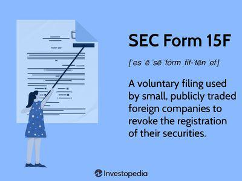

Deregistration with the U.S. Securities and Exchange Commission (SEC) through the use of Form 15 represents a notable transition for public companies seeking to revert to private status. For firms engaged in algorithmic trading, such a move carries particular significance given the delicate balance between regulatory burden and operational agility. This introduction explores the relevance, benefits, and implications of this process for algorithmic trading companies.

Algorithmic trading plays a vital role in today’s financial markets by employing computer algorithms to execute trades at speeds and frequencies that human traders cannot achieve. This highly automated approach can lead to improved market liquidity and better price discovery, but it also exposes firms to stringent regulatory scrutiny. High-frequency trading firms, in particular, may view deregistration as an opportunity to reduce compliance costs and gain strategic flexibility that public companies do not typically enjoy.

SEC Form 15 is the instrument that allows companies to deregister their securities and terminate the associated reporting obligations. By filing Form 15, a company can suspend its duty to file periodic reports such as Forms 10-K and 10-Q, which can result in substantial administrative and financial savings. For algorithmic trading companies, where operational efficiency is paramount, these savings can be redirected to enhance trading strategies or improve technological infrastructure.

This article will provide a comprehensive overview of the process and implications of filing SEC Form 15, specifically focused on algorithmic trading firms. The sections that follow will define SEC Form 15 and articulate its role in deregistration, offer a step-by-step guide to the filing process, examine the benefits and drawbacks of deregistration, and explore the legal and operational impacts on algorithmic trading operations. The conclusion will summarize these discussions and provide recommendations for firms considering this strategic path. By the end of the article, readers will have a clear understanding of how SEC Form 15 can influence the algorithmic trading sector and the strategic considerations involved in the deregistration process.

## Table of Contents

## What is SEC Form 15 and its Role in Deregistration?

SEC Form 15 is a document filed with the U.S. Securities and Exchange Commission (SEC) by publicly traded companies seeking to deregister their securities. This step effectively allows companies to suspend their reporting obligations under the Securities Exchange Act of 1934, a move often pursued by entities transitioning from public to private status. Deregistration through Form 15 is particularly impactful for companies as it can lead to significant reductions in regulatory burdens and associated costs.

To file Form 15, a company must meet specific eligibility criteria. One of the primary requirements is related to the number of shareholders. Typically, a company qualifies to file Form 15 if it has fewer than 300 shareholders of record. Alternatively, the threshold may extend to 500 shareholders if the company’s total assets are below $10 million for each of the last three consecutive fiscal years. By meeting these conditions, companies can opt to forgo the comprehensive and often costly financial disclosures mandated for public companies.

The utilization of Form 15 streamlines the process for companies electing to move from public to private status. It acts as a formal notification to the SEC of the company's intent to suspend its reporting obligations, thereby freeing it from regular filings such as the 10-K and 10-Q. This deregistration process can lead to significant cost savings on compliance and reporting, as maintaining public company status requires substantial financial and administrative resources. Furthermore, the reduction of public scrutiny post-deregistration can provide companies with greater strategic flexibility and privacy.

Algorithmic trading firms, which rely heavily on proprietary trading strategies and data analytics, may find deregistration through Form 15 advantageous for several reasons. First, the reduction in compulsory public disclosures can protect sensitive trading strategies from public exposure. Second, the financial and operational flexibility gained through deregistration might enable these firms to adapt more swiftly to market conditions without the constraints of regulatory reporting. Additionally, these companies might seek to deregister when the costs of compliance outweigh the benefits of being publicly traded, especially if they have a small group of controlled or closely-knit investors.

In summary, SEC Form 15 presents a viable pathway for companies, particularly [algorithmic trading](/wiki/algorithmic-trading) firms, to deregister their securities efficiently, thereby reducing regulatory load and potentially enhancing strategic operations.

## Step-by-Step Filing Process for SEC Form 15

SEC Form 15 is a pivotal document for companies seeking deregistration from the Securities and Exchange Commission, enabling them to transition from public to private status effectively. Below is a comprehensive guide on the step-by-step process of filing SEC Form 15.

### Board Approval

The first step in filing SEC Form 15 is obtaining board approval. This involves presenting the deregistration plan to the company's board of directors, emphasizing the strategic and financial benefits of transitioning to a private entity. Board approval is essential to ensure that the decision aligns with the company's long-term objectives and complies with corporate governance standards.

### Preparing Necessary Documentation

Once board approval is obtained, the next step is preparing the requisite documentation. This includes:

1. **Eligibility Criteria Verification**: Companies must verify they meet the eligibility criteria for deregistration, such as having fewer than 300 shareholders or fewer than 1,200 shareholders if the company’s total assets are below a specified threshold.

2. **Form 15 Preparation**: Form 15 must be meticulously prepared, ensuring all required fields are accurately completed. The form requires the company to state its SEC file number, the exact name of the registrant, address, and the specific section under which deregistration is claimed.

3. **Financial Statements**: Recent financial statements and shareholder records should be compiled as part of the documentation to substantiate eligibility and ensure records are up-to-date.

### Following SEC Guidelines

Adhering to SEC guidelines throughout the filing process is crucial. Companies should ensure that Form 15 is filed via the EDGAR system, the SEC's Electronic Data Gathering, Analysis, and Retrieval system, which is designed for electronic submissions. Proper submission through EDGAR is vital for the timely execution of deregistration.

### Timeline for Deregistration Post-Filing

Upon filing Form 15, a company’s reporting obligations under the Securities Exchange Act are suspended immediately. However, deregistration becomes effective 90 days after filing unless the SEC objects or stipulates additional requirements. During this period, companies should maintain compliance with residual requirements, such as outstanding investor communications or any specific SEC-imposed conditions.

### Potential Challenges and Common Mistakes

Certain challenges and common mistakes can arise during the filing process:

- **Incomplete Documentation**: An incomplete or inaccurately filled form can delay the deregistration process. Ensuring meticulous attention to detail during form preparation is critical.

- **Failure to Communicate**: Not informing stakeholders, including investors and employees, about the deregistration process and implications can lead to miscommunication and mistrust.

- **Lack of Legal and Financial Expertise**: Companies might overlook consulting legal and financial advisers, resulting in non-compliance with remaining regulatory requirements or failure to optimize strategic decisions during deregistration.

By following these outlined steps and avoiding potential pitfalls, companies can effectively navigate the SEC Form 15 filing process, optimizing their transition from public to private status.

## Benefits of Deregistration for Algorithmic Trading Firms

Deregistration from the Securities and Exchange Commission (SEC) using Form 15 can offer significant benefits to algorithmic trading firms, addressing both financial efficiency and strategic flexibility. 

One of the primary advantages is the potential for cost savings. Public companies are subject to stringent reporting requirements imposed by the SEC, including the filing of quarterly and annual reports, and compliance with the Sarbanes-Oxley Act of 2002. These compliance activities demand considerable resources in terms of both time and money. By deregistering, an algorithmic trading firm can reduce these expenses, allowing it to allocate resources towards enhancing trading technologies and strategies.

Deregistration also provides enhanced strategic flexibility and operational privacy. When a company is publicly traded, it must disclose vast amounts of information, ranging from financial data to strategic directions, thereby exposing sensitive business insights to competitors. Going private enables firms to safeguard proprietary trading algorithms and strategies from public scrutiny, potentially improving their competitive edge in the market.

Additionally, deregistration may facilitate a firm's ability to pursue long-term strategic goals without the pressure of short-term market expectations. Public firms often face pressure to meet quarterly expectations, which can sometimes lead to decisions that are beneficial in the short term but detrimental in the long run. Private firms, however, can focus on sustainable development and innovation without the constant oversight and pressure from public investors.

Case studies exemplifying successful deregistration include firms that experienced both operational benefits and improved market positioning. For instance, some algorithmic trading companies have reported that, following deregistration, they innovated more freely and swiftly, timescales that might have been unpalatable under the constant scrutiny required of public entities. Moreover, deregistration can enhance shareholder value by allowing the company to focus on maximizing internal efficiencies rather than merely meeting external analyst expectations.

Overall, while deregistration is a significant decision for any firm, the benefits for algorithmic trading companies can be substantial, leading to a more focused, efficient, and strategically agile organization.

## Risks and Consequences of Deregistration

Deregistration, while presenting certain benefits, also carries inherent risks that companies, particularly those involved in algorithmic trading, must evaluate carefully. One primary concern is the potential loss of market visibility and investor confidence. Being publicly traded confers a level of legitimacy and visibility that can attract investor interest and confidence. Going private might reduce this exposure, potentially influencing investor perceptions negatively and reducing the ability to raise capital in the future.

Liquidity issues constitute another significant challenge. In public markets, shares can be bought and sold freely, providing [liquidity](/wiki/liquidity-risk-premium) to stakeholders. Upon deregistration, the shares of a company are no longer traded on public exchanges, which may lead to reduced liquidity. This lack of liquidity can inhibit the ability of shareholders to sell their holdings promptly at a fair market price, potentially affecting those relying on high-frequency trading strategies where liquidity is crucial. For algorithmic trading firms, the shift from a highly liquid environment could necessitate significant alterations in trading strategies and business operations to adapt to the constraints of reduced market liquidity.

Another vital consideration is the potential legal implications that accompany deregistration. While deregistered companies are no longer subject to the rigorous reporting requirements imposed on public companies, they are not entirely free from regulatory obligations. Certain standards and practices must still be adhered to, including compliance with state-level securities regulations and other financial disclosure requirements. 

Maintaining adherence to these standards is crucial, as failure to comply can result in legal penalties and damage to the firm’s reputation. Businesses must navigate this new regulatory landscape carefully, ensuring they have appropriate legal counsel to guide their decisions and operations post-deregistration. Continuing adherence to certain best practices, such as maintaining robust internal controls and ensuring transparency with existing shareholders, can mitigate some legal risks and support smoother operations.

Algorithmic trading firms, when considering deregistration, must weigh these risks against potential benefits and develop strategic plans that offset the potential downsides. Balancing the cost savings and strategic advantages of deregistration with the operational and regulatory demands will be key to ensuring long-term success amidst these transitions.

## Legal Requirements and Compliance for Deregistration

The deregistration process from the U.S. Securities and Exchange Commission (SEC) using Form 15 involves a well-defined legal framework to ensure compliance and adherence to regulatory obligations. Companies considering this transition must navigate a series of legal requirements designed to maintain transparency and protect investor interests.

The legal framework for deregistration primarily involves understanding the Securities Exchange Act of 1934, under which SEC Form 15 is filed. Companies eligible for deregistration typically must have fewer than 300 shareholders or, in certain cases, fewer than 1,200 shareholders and less than $10 million in total assets for the three preceding years. This framework aims to ensure only companies with sufficiently limited public interest and investor base responsibilities reduce their reporting requirements.

Engaging legal counsel is instrumental in ensuring a smooth transition from public to private status. Legal experts help companies comprehend and adhere to complex regulations, facilitating decisions that align with both business strategies and legal requirements. Legal advisors can guide companies in gathering necessary documentation, understanding shareholder composition, and ensuring all procedural steps are efficiently executed. Their expertise is invaluable in maintaining compliance and mitigating potential legal risks during deregistration.

A comprehensive checklist is crucial for ensuring compliance with SEC regulations both during and after deregistration. The following steps and considerations are essential:

1. **Eligibility Assessment**: Confirm the company's eligibility for filing Form 15 based on shareholder count and asset criteria.

2. **Board Resolutions**: Secure board approval to initiate the deregistration process, emphasizing the strategic rationale and anticipated benefits.

3. **Documentation Preparation**: Compile all necessary financial statements, shareholder lists, and other relevant documentation demonstrating compliance with eligibility requirements.

4. **Form 15 Filing**: Accurately complete and file SEC Form 15, ensuring all information is current and reflective of the company’s status.

5. **Public Disclosure**: Communicate the intent to deregister to shareholders and the public, maintaining transparency and managing investor relations.

6. **Ongoing Compliance**: Even post-deregistration, companies must adhere to certain regulatory standards, such as engaging in fair trading practices and safeguarding investor interests.

7. **Transition Strategy**: Align the company’s operational strategies with the new status, addressing any challenges that may arise from reduced regulatory oversight.

8. **Legal Review**: Conduct a thorough review with legal counsel to confirm compliance at every stage, reducing risks of non-compliance penalties.

By ensuring adherence to these legal requirements, companies can successfully navigate the deregistration process, maintaining a focus on their long-term strategic objectives while ensuring regulatory compliance.

## Impact of Deregistration on Algorithmic Trading Operations

Deregistration from the Securities and Exchange Commission (SEC), through the filing of Form 15, can significantly impact the operational aspects of an algorithmic trading firm. This transition from public to private status presents unique challenges and opportunities that can reshape how these firms operate their trading strategies.

### Changes in Market Participation

Deregistration results in a reduced obligation for public disclosure, which can affect a firm's market participation. Without the need for extensive public reporting, algorithmic trading firms may find more strategic flexibility, potentially allowing them to explore niche markets or develop proprietary trading strategies without public scrutiny. However, this lack of transparency might also impact the firm's market visibility, possibly reducing the pool of potential liquidity partners.

### Order Execution

The implications for order execution are multifaceted. On one hand, algorithmic trading firms might leverage lesser regulatory constraints to refine algorithms and improve execution efficiency. Freed from specific reporting requirements, firms can adapt algorithms to optimize speed and accuracy in executing trades. However, changes in compliance obligations could also alter the dynamics of order processing systems, necessitating adjustments in areas like latency management and execution protocols to ensure optimal performance in less regulated environments.

### Regulatory Reporting

Despite reduced reporting obligations, maintaining robust internal controls and compliance systems remains vital. Deregistration can potentially simplify regulatory processes, allowing firms to streamline operations. This might lead to cost savings and reduce the administrative burden associated with widespread regulatory adherence. However, firms must continue adhering to applicable legal standards to avoid penalties and protect their reputational integrity.

### Leveraging Deregistration

The move to private can allow firms to leverage deregistration for enhanced algorithmic efficiency and competitiveness. Freed from the pressures of quarterly earnings reports and shareholder expectations, algorithmic trading firms can focus on long-term strategies and innovation. This might involve deploying capital into research and development of advanced trading models, thereby gaining a competitive edge in technology-driven markets.

### Conclusion

Deregistration's impact on algorithmic trading operations is profound, affecting everything from market participation to the minutiae of order execution and regulatory compliance. While the transition to private status affords greater strategic latitude and cost efficiencies, it also demands careful management to avoid negative consequences such as decreased liquidity and market presence. Algorithmic trading firms must weigh these factors carefully, ensuring their operational strategies remain robust and adaptable in a changing regulatory landscape.

## Conclusion and Final Thoughts

In conclusion, SEC Form 15 serves a pivotal role for algorithmic trading firms seeking deregistration from the United States Securities and Exchange Commission (SEC). It allows these companies to transition from a public to private entity, thereby reducing regulatory burdens and associated costs. This form is specifically relevant for firms with fewer than 300 shareholders, making them eligible to opt out of stringent public reporting requirements. Deregistration presents several benefits, including enhanced privacy, strategic flexibility, and significant cost savings. These advantages are crucial for algorithmic trading firms that thrive on agile operations and confidentiality in their trading strategies.

However, deregistration is not without its drawbacks. Firms face potential challenges such as decreased market visibility and investor confidence, which could affect stock liquidity and trading strategies. Additionally, despite stepping away from certain regulatory obligations, companies must still ensure compliance with prevailing laws and standards, underscoring the importance of legal counsel throughout this process.

For algorithmic trading firms contemplating deregistration, it is imperative to evaluate both the benefits and the potential risks thoroughly. Engaging with financial and legal experts can provide invaluable guidance, ensuring that the firm's strategic goals are aligned with its regulatory responsibilities. This assessment helps in making informed decisions that support the long-term objectives of the firm.

Lastly, companies are encouraged to seek further resources to better understand the intricacies of deregistration and the implications for algorithmic trading operations. Staying informed of regulatory changes and market conditions is key to maintaining a competitive edge while ensuring compliance in a continually evolving financial landscape.

## References & Further Reading

[1]: ["Form 15 – Certification and Notice of Termination of Registration under Section 12(g) of the Securities Exchange Act of 1934 or Suspension of Duty to File Reports under Sections 13 and 15(d) of the Securities Exchange Act of 1934"](https://www.sec.gov/files/form15.pdf) - U.S. Securities and Exchange Commission

[2]: Aldridge, I. (2013). ["High-Frequency Trading: A Practical Guide to Algorithmic Strategies and Trading Systems"](https://www.amazon.com/High-Frequency-Trading-Practical-Algorithmic-Strategies/dp/1118343506). Wiley Trading.

[3]: Harris, L. (2003). ["Trading and Exchanges: Market Microstructure for Practitioners"](https://www.amazon.com/Trading-Exchanges-Market-Microstructure-Practitioners/dp/0195144708) - Oxford University Press.

[4]: ["The Impact of SEC Deregulation on Algorithmic Trading Firms"](https://www.sec.gov/files/Algo_Trading_Report_2020.pdf) - Financial Stability Board Report

[5]: Pagano, M., Schwartz, R. A., & Economides, N. (2003). ["The Microstructure of Electronic Markets: Global Trading and Regulation"](https://www.researchgate.net/publication/222564035_A_closing_call's_impact_on_market_quality_at_Euronext_Paris). Cambridge University Press.