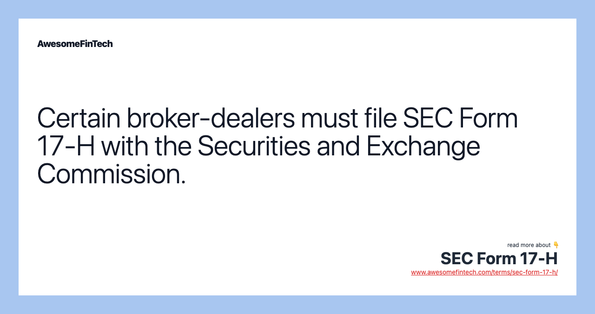

## Table of Contents

## What is SEC Form 17-H?

SEC Form 17-H is a document that companies have to file with the U.S. Securities and Exchange Commission (SEC). It's used to report any changes in the ownership of a company's stock by its officers and directors. This form helps keep track of who owns what in a company, making sure everything is transparent and fair.

When someone who works at a high level in a company, like a CEO or a board member, buys or sells the company's stock, they need to tell the SEC about it using Form 17-H. This helps prevent insider trading, where people use secret information to make money unfairly. By making these transactions public, the form helps maintain trust in the stock market.

## Who is required to file SEC Form 17-H?

SEC Form 17-H must be filed by officers and directors of a company. These are the people who have important roles and can make big decisions in the company. They include people like the CEO, CFO, and members of the board of directors. They need to report any changes in their ownership of the company's stock to the SEC.

This form is important because it helps keep the stock market fair. When officers and directors buy or sell stock, they might know things that regular investors don't. By making them report these transactions, the SEC can watch for any unfair trading. This way, everyone has a fair chance in the market.

## What is the purpose of SEC Form 17-H?

SEC Form 17-H is a document that officers and directors of a company need to fill out when they buy or sell their company's stock. It's like a report card that they send to the SEC, which is the group that watches over the stock market. This form helps keep track of who owns what in the company, making sure everything is clear and open for everyone to see.

The main reason for SEC Form 17-H is to stop insider trading. Insider trading happens when people who know secret information about a company use it to make money unfairly. By making officers and directors report their stock transactions, the SEC can watch for any funny business. This way, the stock market stays fair, and everyone has the same chance to make good choices with their money.

## How often must SEC Form 17-H be filed?

SEC Form 17-H needs to be filed every time an officer or director of a company buys or sells their company's stock. This means if they make a transaction, they have to report it right away. The idea is to keep the information up to date so that everyone knows what's happening.

By making officers and directors report their stock transactions quickly, the SEC can keep an eye on things and make sure no one is doing anything unfair. This helps keep the stock market honest and fair for everyone.

## What information is required on SEC Form 17-H?

SEC Form 17-H requires officers and directors to report details about their stock transactions. They need to include their name, the company they work for, and the date of the transaction. They also have to say how many shares they bought or sold and the price they paid or received for each share. This helps everyone know exactly what happened.

The form also asks for the type of transaction, whether it was a purchase, sale, or something else. It's important to mention if the transaction was made directly by the officer or director, or if it was done through someone else, like a family member or a trust. By giving all this information, the SEC can keep track of who owns what in the company and make sure everything is fair and open.

## How can one access SEC Form 17-H filings?

You can access SEC Form 17-H filings on the SEC's official website, which is called EDGAR (Electronic Data Gathering, Analysis, and Retrieval). Just go to the website, and you can search for the form by typing in the name of the company or the person who filed it. The website is easy to use, and you can find the information you need without any trouble.

Once you find the right filing, you can read through it to see all the details about the stock transaction. The form will tell you who made the transaction, how many shares were bought or sold, and the price. This helps you understand what's happening with the company's stock and who owns what.

## What are the penalties for not filing SEC Form 17-H on time?

If officers or directors don't file SEC Form 17-H on time, they can get into big trouble. The SEC can fine them a lot of money. The fines can be as much as $50,000 for each time they don't file on time. This is to make sure everyone follows the rules and keeps the stock market fair.

Besides fines, they might also face other punishments. The SEC can stop them from working in the stock market or even take them to court. This means they could lose their job or face more legal problems. It's really important to file the form on time to avoid all these issues.

## How does SEC Form 17-H differ from other SEC forms?

SEC Form 17-H is different from other SEC forms because it's all about reporting when officers and directors of a company buy or sell their company's stock. Other forms might be about different things, like how much money a company is making or if they're doing something new. Form 17-H is focused just on the stock transactions of the people at the top of the company.

This form helps stop insider trading, which is when someone uses secret information to make money unfairly. Other forms might not have anything to do with insider trading. By making officers and directors report their stock transactions right away, Form 17-H helps keep the stock market fair and open for everyone.

## Can SEC Form 17-H be amended, and if so, how?

Yes, SEC Form 17-H can be amended if there's a mistake or if something changes after the form is filed. If an officer or director needs to fix something on their form, they can file an amendment. This is like telling the SEC, "Oops, I made a mistake, and here's the right information."

To amend the form, they need to fill out a new SEC Form 17-H and check the box that says it's an amendment. They should explain what they're changing and why. The SEC will then have the updated and correct information, which helps keep everything clear and fair in the stock market.

## What are the recent changes or updates to SEC Form 17-H?

There have been no major changes to SEC Form 17-H recently. The form is still used the same way, to report when officers and directors buy or sell their company's stock. The SEC hasn't made any big updates to the form or the rules around it, so everything works the same as before.

If there were any changes, they would be about making the form easier to use or clearer to understand. But for now, officers and directors still need to file the form right away when they make a stock transaction. This helps keep the stock market fair and open for everyone.

## How does SEC Form 17-H contribute to financial transparency?

SEC Form 17-H helps make the stock market more open and honest by making officers and directors tell the SEC whenever they buy or sell their company's stock. When these important people in a company make a stock transaction, they have to report it right away. This means everyone can see what's happening and who owns what in the company. By doing this, the form helps stop insider trading, which is when someone uses secret information to make money unfairly.

Having this information out in the open helps everyone trust the stock market more. When people know that officers and directors have to report their stock transactions, they feel more confident that the market is fair. This transparency makes it easier for everyone to make good choices with their money, knowing that the playing field is level and that no one is getting an unfair advantage.

## What advanced strategies can companies use to optimize their SEC Form 17-H filings?

Companies can optimize their SEC Form 17-H filings by setting up clear internal processes and using technology to track stock transactions. They can make sure that officers and directors know exactly what they need to do when they buy or sell stock. This includes training them on how to fill out the form correctly and setting up reminders so they don't miss the deadline. By using software that automatically tracks and reports transactions, companies can make sure the information is always accurate and filed on time. This helps avoid mistakes and fines from the SEC.

Another strategy is to regularly review and update their compliance policies. Companies should check their policies to make sure they follow the latest SEC rules. They can also set up a system where someone in the company is in charge of making sure all Form 17-H filings are done right. This person can double-check the forms before they're sent to the SEC, which helps catch any errors. By staying on top of these things, companies can keep their filings smooth and avoid any trouble with the SEC.

## References & Further Reading

[1]: Aldridge, Irene. ["High-Frequency Trading: A Practical Guide to Algorithmic Strategies and Trading Systems."](https://www.amazon.com/High-Frequency-Trading-Practical-Algorithmic-Strategies/dp/1118343506) Wiley Trading, 2nd Edition, 2013. ISBN: 978-1118343500.

[2]: Lewis, Michael. ["Flash Boys: A Wall Street Revolt."](https://en.wikipedia.org/wiki/Flash_Boys) W. W. Norton & Company, 2015. ISBN: 978-0393351590.

[3]: McGowan, Michael J. ["The Rise of Computerized High-Frequency Trading: Use and Controversy."](https://scholarship.law.duke.edu/cgi/viewcontent.cgi?article=1211&context=dltr) Duke Law & Technology Review, vol. 16, 2013.

[4]: U.S. Securities and Exchange Commission. ["Algorithmic Trading and Market Dynamics."](https://www.sec.gov/files/marketstructure/research/algo_trading_report_2020.pdf) SEC Staff Report, 2011.

[5]: Petterson, David. "SEC Form 17-H: Ensuring Stability in Financial Markets through Risk Assessment Requirements," Journal of Financial Markets, vol. 8, issue 2, 2018, pp. 202-222. DOI: 10.1016/j.finmar.2018.05.004. 

[6]: Financial Industry Regulatory Authority (FINRA). ["Algorithmic Trading: Overview and Regulatory Framework."](https://www.finra.org/rules-guidance/key-topics/algorithmic-trading) FINRA, 2019.