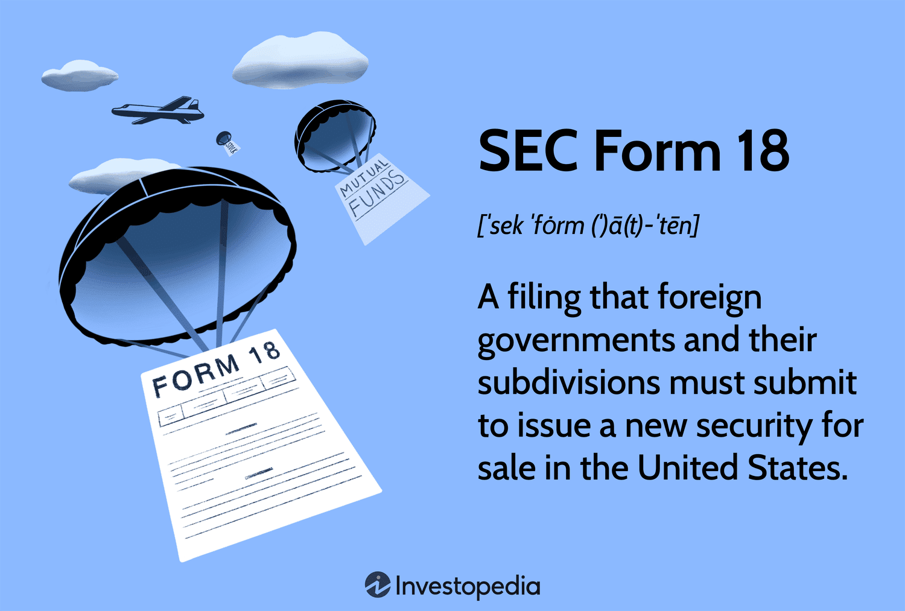

In the ever-evolving world of financial regulations, understanding the role of the U.S. Securities and Exchange Commission (SEC) is crucial. As the primary regulatory body overseeing securities markets in the United States, the SEC ensures that investors have access to essential information for making informed decisions while maintaining fair, orderly, and efficient markets. One of the significant tools in the SEC's regulatory arsenal is SEC Form 18, which pertains to foreign governments issuing securities in the U.S. This form is pivotal in ensuring compliance with U.S. securities laws, providing a framework through which foreign issuers disclose necessary information to potential investors.

SEC Form 18 is specifically designed to bridge the information gap between foreign entities and U.S. investors. It mandates comprehensive disclosures from foreign governments or their political subdivisions when they offer new securities within U.S. markets. This requirement is fundamental in bolstering investor confidence and enhancing transparency, allowing investors to assess the risks and rewards associated with these foreign securities.

In parallel, the landscape of financial markets is being reshaped by algorithmic trading, a domain where computer algorithms execute trades at exceptional speeds and volumes. These rapid advancements offer both opportunities and challenges. Algorithmic trading influences how securities are issued, bought, and sold, necessitating vigilant monitoring by the SEC to prevent market malpractices such as manipulation and insider trading. As algorithms grow more sophisticated, the SEC's role in regulating this facet becomes increasingly important in ensuring that all trading activities comply with existing laws and ethical standards.

Staying informed about SEC regulations is imperative for investors aiming to navigate today's complex financial markets effectively. The SEC's efforts in adapting regulations to modern trading conditions highlight the dynamic nature of financial oversight. It underscores the agency's commitment to protecting investors and maintaining market integrity amidst technological advancements.

The intersection of SEC Form 18 and algorithmic trading embodies the broader challenges and imperatives facing global financial markets today. It underscores the necessity for robust regulatory frameworks that keep pace with innovation, ensuring that both issuers and investors operate within a transparent and secure market environment. As we explore these themes further, the critical role of the SEC in fostering an equitable investment landscape becomes evident.

## Table of Contents

## Understanding SEC Form 18

SEC Form 18 is a regulatory document required for foreign governments and their subdivisions to register new securities intended for sale within the United States. This form serves as a vital tool in maintaining transparency and compliance with U.S. securities laws, ensuring that investors have access to essential information before deciding to invest in foreign securities.

One of the primary purposes of SEC Form 18 is to identify the government branch responsible for the issuance, along with pertinent details about the security being offered. This includes the type of security, which may range from bonds to other financial instruments, and the total amount being issued. By detailing these aspects, SEC Form 18 allows investors to gather comprehensive data about foreign securities entering the U.S. market.

A crucial element of SEC Form 18 is its role in providing structured disclosures about government obligations tied to the securities. These obligations need detailed explanations so that investors can assess the creditworthiness of the issuing entity. Included in this disclosure are maturity dates, which outline the period until the security is due for repayment, thus helping investors align their investment strategies with their financial goals.

Additionally, SEC Form 18 addresses potential risks associated with the foreign securities being issued. These risks might encompass economic, political, or currency risks, among others, inherent to the issuer's country. Providing detailed information on such risks equips investors with the knowledge necessary to make informed decisions and manage their investment portfolios effectively.

In summary, SEC Form 18 is structured to ensure clarity for both issuers and investors by mandating the disclosure of critical information about foreign securities. This transparency aids in the protection of investors and contributes to the overall stability and integrity of U.S. financial markets.

## Key Requirements of SEC Form 18

SEC Form 18 requires rigorous compliance from registrants, primarily focusing on detailed documentation of security specifics. These specifics include security titles, which must clearly identify the securities being offered. Registrants must also disclose interest rates, providing clarity on the returns expected from the investments. Additionally, the maturity dates of the securities are necessary, indicating when the principal investment is due for repayment.

Explanations regarding currency usage play a vital role, as they specify the currency in which the securities are denominated. This is crucial for investors to assess currency risk and potential fluctuations in exchange rates. Furthermore, payment provisions must be articulated, outlining the terms and conditions under which interest and principal payments will be made. This transparency is essential for investors to understand the cash flow and timing of their returns.

Another significant requirement involves detailing any potential liens on the securities. Liens can affect the priority of payments to investors in the event of issuer insolvency, thus impacting investment risk assessment. Clear disclosure of existing or potential liens helps investors evaluate the security of their investments.

For registrants, meeting these requirements involves a comprehensive understanding of the documentation and exhibits necessary for a successful submission. These typically include financial statements, legal opinions on the security issuance, and documentation verifying legal compliance with SEC regulations. Ensuring all facets are covered helps avoid potential compliance pitfalls that could delay or obstruct the registration process.

Compliance with SEC Form 18 demands detailed attention to these specific requirements. By adhering to these standards, issuers not only ensure regulatory compliance but also foster investor confidence through transparency and clarity. This compliance is a key component in maintaining efficient and stable financial markets, where informed decision-making is fundamental to investment success.

## The Role of Algorithmic Trading in SEC Regulations

Algorithmic trading, the use of complex algorithms to automate trade execution, plays a pivotal role in modern securities markets, transforming the way securities are bought and sold. The proliferation of [algorithmic trading](/wiki/algorithmic-trading) strategies, particularly high-frequency trading ([HFT](/wiki/high-frequency-trading-strategies)), has prompted the U.S. Securities and Exchange Commission (SEC) to closely monitor these practices to prevent market abuse and maintain fair trading conditions.

The SEC's oversight is crucial in addressing the advantages and challenges posed by algorithmic trading. On the positive side, algorithmic trading enhances market [liquidity](/wiki/liquidity-risk-premium) and efficiency, enabling rapid execution of trades and tighter bid-ask spreads. However, it also raises concerns about market [volatility](/wiki/volatility-trading-strategies) and systemic risks, necessitating robust regulatory frameworks to mitigate these potential threats.

Algorithmic trading poses unique challenges for regulators, particularly in monitoring activities that could lead to market manipulation, such as spoofing and layering. Through real-time surveillance systems, the SEC aims to detect and deter such activities, ensuring that markets operate fairly. The SEC has implemented rules to enhance transparency and reduce the risk of market disruptions, such as the requirement for firms to implement risk controls and conduct regular algorithm reviews.

Understanding algorithmic strategies is essential for both investors and regulators to mitigate the risks associated with high-frequency trading. Strategies deployed in algorithmic trading often involve complex mathematical models designed to capitalize on minute price changes. These strategies require continuous monitoring and adaptation to evolving market conditions, and they demand sophisticated risk management techniques to prevent losses from erroneous trades.

The influence of algorithmic trading extends to regulatory practices and market stability. The SEC has adapted its regulations to address the unique challenges posed by algorithmic trading, including the implementation of the Market Access Rule, which requires firms to have risk management controls in place before accessing the market. Additionally, the Consolidated Audit Trail (CAT) initiative was introduced to provide regulators with enhanced tools for monitoring trading activities across different venues.

In conclusion, as algorithmic trading continues to evolve, the SEC's role in regulating these activities is critical in ensuring market integrity and stability. Regulators must balance the benefits of technological advancements in trading with the need to protect market participants from potential abuses. By understanding and regulating algorithmic trading, the SEC maintains confidence in the financial markets and safeguards investors' interests.

## The Intersection of Financial Markets and SEC Form 18

SEC Form 18 serves a vital function in not only ensuring compliance but also in maintaining the stability and safety of U.S. investment markets. By requiring detailed disclosures about foreign government securities, the form facilitates better decision-making and risk assessment among investors. This transparency is critical in a market environment where informed decisions are the foundation of financial success.

When foreign governments issue securities in the United States, they must provide extensive information through SEC Form 18. This information includes the identification of the issuing government entity, the characteristics of the securities, and the risks associated with these investments. Such comprehensive data allows investors to evaluate the viability and potential risks tied to foreign securities, leading to more calculated investment strategies. 

Moreover, SEC Form 18 enhances market efficiency by promoting transparency. In a transparent market, prices reflect all available information, reducing misinformation and mispricing. This alignment between market prices and actual value helps ensure that investors are neither overvaluing nor undervaluing securities based on incomplete information.

To fully grasp the impact of SEC Form 18, it is essential to understand the interplay between market operations and regulatory frameworks. Regulations, like those enforced by the SEC, create a structured environment where securities from various jurisdictions can be introduced without undermining the foundational elements of U.S. financial markets. This integration is achieved through rigorous compliance measures that foreign issuers must meet, thus safeguarding market participants from potential financial misconduct.

The form functions as a critical tool in the safe and effective integration of foreign securities. By mandating specific disclosures, the form helps mitigate the risk of financial discrepancies and promotes investor confidence. As a result, foreign investment opportunities can be leveraged without compromising the integrity and stability of the domestic market.

In conclusion, SEC Form 18 is a pivotal component of the regulatory mechanisms that protect and enhance U.S. financial markets. The rigorous disclosure requirements not only ensure compliance but also empower investors with the information necessary for sound investment decisions. Through this balance of regulation and market activity, SEC Form 18 supports a robust and resilient financial marketplace.

## Conclusion

The role of SEC Form 18 in U.S. financial regulation underscores the critical importance of transparency and informed investment decisions. By mandating detailed disclosures from foreign governments issuing securities in the United States, this form fosters an environment where investors can make knowledgeable decisions, thereby enhancing market stability and trust. 

Understanding SEC regulations alongside modern trading methodologies, such as algorithmic trading, is essential for navigating the complex financial landscape. Algorithmic trading, with its ability to execute large orders at rapid speeds, has transformed market dynamics, but it requires careful oversight to prevent market manipulation and ensure fairness. Consequently, a deep comprehension of these trading practices, coupled with regulatory guidelines, becomes indispensable for stakeholders. 

Keeping abreast of regulatory changes is vital for compliance and effective investment strategies. The SEC periodically revisits and updates its regulations in response to emerging market technologies and practices, ensuring that market operations remain fair and efficient. For both issuers and investors, a thorough grasp of these regulatory frameworks supports sound decision-making and minimizes legal and financial risks.

As financial markets continue to evolve with technological advancements and globalization, there is an ongoing need for adaptation and continuous learning. The landscape of financial regulations and market practices will undoubtedly shift, making it crucial for participants to remain informed and responsive to changes. By cultivating a robust understanding of both current regulations and future trends, stakeholders can position themselves for long-term success in the ever-changing financial markets.

## References & Further Reading

[1]: Lopez de Prado, M. (2018). ["Advances in Financial Machine Learning."](https://www.amazon.com/Advances-Financial-Machine-Learning-Marcos/dp/1119482089) John Wiley & Sons.

[2]: Aronson, D. (2006). ["Evidence-Based Technical Analysis: Applying the Scientific Method and Statistical Inference to Trading Signals."](https://www.amazon.com/Evidence-Based-Technical-Analysis-Scientific-Statistical/dp/0470008741) John Wiley & Sons.

[3]: Jansen, S. (2020). ["Machine Learning for Algorithmic Trading: Predictive Models to Extract Signals from Market and Alternative Data for Systematic Trading Strategies with Python."](https://www.amazon.com/Machine-Learning-Algorithmic-Trading-alternative/dp/1839217715) Packt Publishing.

[4]: Chan, E. P. (2009). ["Quantitative Trading: How to Build Your Own Algorithmic Trading Business."](https://github.com/ftvision/quant_trading_echan_book) John Wiley & Sons.

[5]: U.S. Securities and Exchange Commission. ["Form 18 - Registration of Securities of Foreign Governments and Political Subdivisions."](https://www.sec.gov/files/rules/sro/cboebzx/2024/34-101963.pdf)