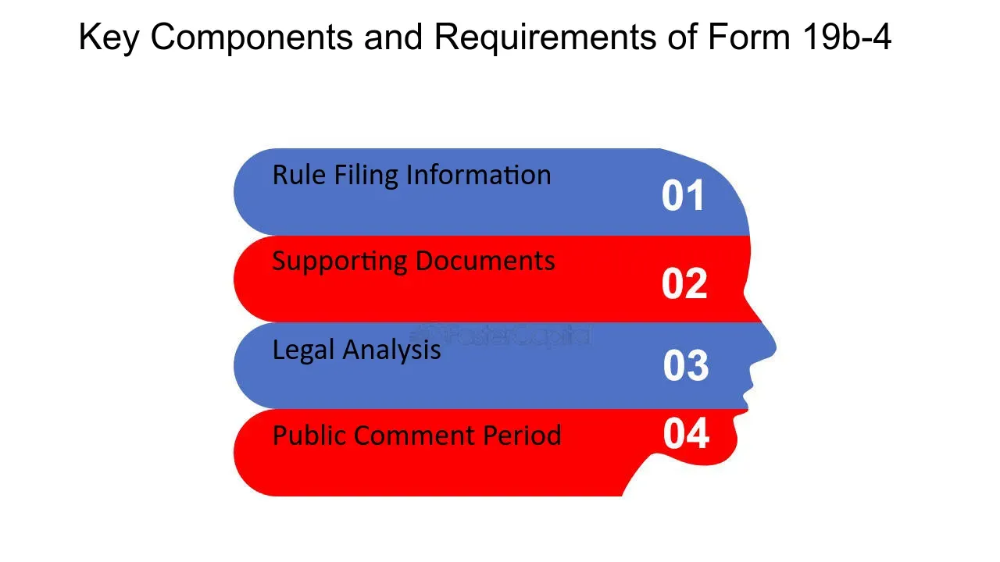

## Table of Contents

## What is SEC Form 19b-4?

SEC Form 19b-4 is a document that self-regulatory organizations (SROs) need to file with the U.S. Securities and Exchange Commission (SEC). SROs are groups like stock exchanges or the Financial Industry Regulatory Authority (FINRA) that make rules for their members. They use this form to tell the SEC about new rules or changes to existing rules they want to make. This helps the SEC keep an eye on these rules to make sure they are fair and follow the law.

When an SRO files a Form 19b-4, they have to explain the new rule or change clearly. They need to say why they think it's needed and how it will affect members and the market. The SEC then reviews this information. If the SEC agrees with the rule or change, it gets approved. If not, the SEC might ask for changes or even reject it. This process helps keep the financial markets safe and fair for everyone.

## Who is required to file SEC Form 19b-4?

SEC Form 19b-4 is a document that self-regulatory organizations (SROs) need to file with the U.S. Securities and Exchange Commission (SEC). SROs are groups that make rules for their members, like stock exchanges or the Financial Industry Regulatory Authority (FINRA). These organizations must file this form whenever they want to create a new rule or change an existing one. This helps the SEC keep track of these rules and make sure they are fair and follow the law.

When an SRO wants to make a new rule or change a rule, they fill out Form 19b-4 and send it to the SEC. In the form, they explain the new rule or change clearly and give reasons why it's needed. They also need to say how it might affect their members and the market. The SEC then looks at this information and decides if the rule or change is okay. If the SEC agrees, the rule or change gets approved. If not, the SEC might ask for changes or reject it altogether.

## What is the purpose of filing SEC Form 19b-4?

The purpose of filing SEC Form 19b-4 is to let the U.S. Securities and Exchange Commission (SEC) know about new rules or changes to existing rules that self-regulatory organizations (SROs) want to make. SROs are groups like stock exchanges or FINRA that set rules for their members. When they want to make a new rule or change an old one, they have to tell the SEC by filling out this form. This helps the SEC keep an eye on what the SROs are doing.

When an SRO files Form 19b-4, they explain the new rule or change in a clear way. They also need to say why they think the rule or change is needed and how it might affect their members and the market. The SEC then reviews this information to make sure the rule or change is fair and follows the law. If the SEC agrees, they approve the rule or change. If not, they might ask for changes or reject it. This process helps keep the financial markets safe and fair for everyone.

## How does SEC Form 19b-4 relate to self-regulatory organizations (SROs)?

SEC Form 19b-4 is important for self-regulatory organizations (SROs) because it's the way they tell the U.S. Securities and Exchange Commission (SEC) about new rules or changes to old rules. SROs are groups like stock exchanges or FINRA that make rules for their members. When they want to make a new rule or change an existing one, they have to fill out this form and send it to the SEC. This helps the SEC keep track of what the SROs are doing and make sure their rules are fair and follow the law.

When an SRO files Form 19b-4, they need to explain the new rule or change clearly. They also have to say why they think it's needed and how it might affect their members and the market. The SEC then looks at this information to decide if the rule or change is okay. If the SEC agrees, they approve the rule or change. If not, they might ask for changes or reject it. This process helps keep the financial markets safe and fair for everyone.

## What types of proposed rule changes must be reported on SEC Form 19b-4?

SEC Form 19b-4 is used by self-regulatory organizations (SROs) to report any proposed new rules or changes to existing rules to the U.S. Securities and Exchange Commission (SEC). SROs, like stock exchanges or FINRA, need to fill out this form whenever they want to make a new rule or change an old one. This includes changes that affect how their members operate, how trading happens, or any other rules that govern their activities.

The form is important because it helps the SEC keep an eye on what the SROs are doing. When an SRO wants to make a change, they need to explain it clearly on the form. They also have to say why the change is needed and how it might affect their members and the market. The SEC then reviews this information to make sure the proposed rule or change is fair and follows the law.

## What are the key components of SEC Form 19b-4?

SEC Form 19b-4 is a form that self-regulatory organizations (SROs), like stock exchanges or FINRA, fill out when they want to make a new rule or change an old one. They need to explain the new rule or change clearly on the form. They also have to say why they think the rule or change is needed and how it might affect their members and the market. This helps the U.S. Securities and Exchange Commission (SEC) understand the proposed changes.

The form has sections where the SRO needs to provide detailed information about the rule or change. They must include the exact text of the new rule or the changes they want to make to an existing rule. They also need to explain how the rule or change will work and what it aims to achieve. The SEC reviews all this information to make sure the proposed rule or change is fair and follows the law. This process helps keep the financial markets safe and fair for everyone.

## How does the SEC review process work for Form 19b-4 filings?

When a self-regulatory organization (SRO) like a stock exchange or FINRA wants to make a new rule or change an old one, they fill out SEC Form 19b-4 and send it to the U.S. Securities and Exchange Commission (SEC). In the form, the SRO explains the new rule or change clearly and says why it's needed. They also need to say how it might affect their members and the market. This helps the SEC understand what the SRO wants to do.

Once the SEC gets the Form 19b-4, they start reviewing it. They look at the rule or change to make sure it's fair and follows the law. If the SEC thinks the rule or change is okay, they approve it. But if they have concerns, they might ask the SRO to make changes or even reject the rule or change. This process helps keep the financial markets safe and fair for everyone.

## What is the timeline for the SEC's review of a Form 19b-4 filing?

When a self-regulatory organization (SRO) sends a Form 19b-4 to the SEC to propose a new rule or change an old one, the SEC has a specific timeline to review it. The SEC usually has 35 days to look at the proposal and decide if it's okay. During this time, the SEC might ask the SRO for more information or suggest changes to make the rule better.

If the SEC doesn't make a decision within the first 35 days, they can extend the review period for another 45 days. This gives them more time to think about the rule or change carefully. So, the whole review process can take up to 80 days before the SEC finally approves, asks for changes, or rejects the proposal.

## Can a Form 19b-4 filing be amended, and if so, how?

Yes, a Form 19b-4 filing can be amended. If a self-regulatory organization (SRO) wants to change something in their proposal after they've sent it to the SEC, they can send an amendment. This means they fill out a new Form 19b-4 with the changes they want to make and send it to the SEC. The amendment needs to clearly explain what's different from the original filing and why the changes are needed.

When the SEC gets the amended Form 19b-4, they review it just like they did the original filing. They look at the changes to make sure they're fair and follow the law. If the SEC agrees with the changes, they approve the amendment. If not, they might ask for more changes or reject it. This process helps keep the financial markets safe and fair for everyone.

## What are the common challenges or issues faced when filing SEC Form 19b-4?

Filing SEC Form 19b-4 can be tricky because it needs a lot of detail. Self-regulatory organizations (SROs) have to explain the new rule or change very clearly and say why it's needed. They also have to think about how it might affect their members and the market. If they don't explain things well, the SEC might not understand the proposal and could ask for more information or even reject it. This can make the process longer and more complicated.

Another challenge is making sure the rule or change follows all the laws and rules. The SEC looks closely at every filing to make sure it's fair and legal. If there's even a small problem, the SEC might not approve it right away. SROs might need to fix the rule or change and send a new form, which can take more time. It's important for SROs to get everything right the first time to avoid delays and make the process smoother.

## How does the approval of a Form 19b-4 filing impact the market or industry?

When the SEC approves a Form 19b-4 filing, it means that a new rule or change to an old rule from a self-regulatory organization (SRO) can go into effect. This can have a big impact on the market or industry because it changes how things work. For example, if a stock exchange changes its trading rules, it might affect how people buy and sell stocks. This can make the market more fair or efficient, or it might change how much it costs to trade.

The approval of a new rule or change can also affect the members of the SRO, like brokers or dealers. They might have to follow new rules or change how they do business. This can be good if the new rules make things clearer or safer for everyone. But sometimes, members might need time to adjust to the changes, and it could cost them money or effort to do so. Overall, the approval of a Form 19b-4 filing helps keep the financial markets safe and fair, but it can also bring some challenges for the people working in the industry.

## What are some notable historical cases or examples of SEC Form 19b-4 filings?

One notable example of a Form 19b-4 filing was when the New York Stock Exchange (NYSE) wanted to change its rules about how stocks are traded. In 2005, the NYSE filed a Form 19b-4 to introduce a new trading system called the NYSE Hybrid Market. This system mixed old ways of trading with new electronic methods. The SEC had to review the filing to make sure the new system was fair and followed the law. After looking at it carefully, the SEC approved the change. This helped the NYSE keep up with new technology and made trading faster and more efficient.

Another example happened in 2016 when the Financial Industry Regulatory Authority (FINRA) wanted to change its rules about how brokers report their trades. FINRA filed a Form 19b-4 to make the reporting process more clear and easier to follow. The SEC reviewed the filing and made sure the new rules would help keep the market safe and fair. After some back-and-forth, the SEC approved the changes. This made it easier for brokers to report their trades correctly and helped the SEC keep a closer eye on what was happening in the market.

## References & Further Reading

[1]: Macey, J. R., & Pacces, A. M. (2016). ["The Law and Economics of Securities Regulation."](https://papers.ssrn.com/sol3/papers.cfm?abstract_id=2884374) In The Oxford Handbook of Law and Economics.

[2]: Committee on Capital Markets Regulation. (2009). ["The Global Financial Crisis: A Plan for Regulatory Reform."](https://www.europarl.europa.eu/meetdocs/2009_2014/documents/d-us/dv/d-us_tgfc-ccmr_executive_summa/d-us_tgfc-ccmr_executive_summary.pdf) 

[3]: Putniņš, T. J. (2015). ["High frequency trading: Practices, risks and regulation."](https://metaquantuniverse.com/download/High%20Frequency%20Trading%20and%20Market%20Making%20-%20Understanding%20Order%20Flow%20Manipulation%20Techniques.pdf) Journal of Financial Stability, 16, 91-100.

[4]: Stowell, D. P. (2010). ["An Introduction to the Form 19b-4 Process and SEC Regulatory Oversight."](https://123docz.net/document/4833085-stowell-an-introduction-to-investment-banks-hedge-funds-private-equity-2010.htm) In An Introduction to Investment Banks, Hedge Funds, and Private Equity.

[5]: Aldridge, I. (2013). ["High-Frequency Trading: A Practical Guide to Algorithmic Strategies and Trading Systems."](https://www.amazon.com/High-Frequency-Trading-Practical-Algorithmic-Strategies/dp/1118343506) Wiley Trading.