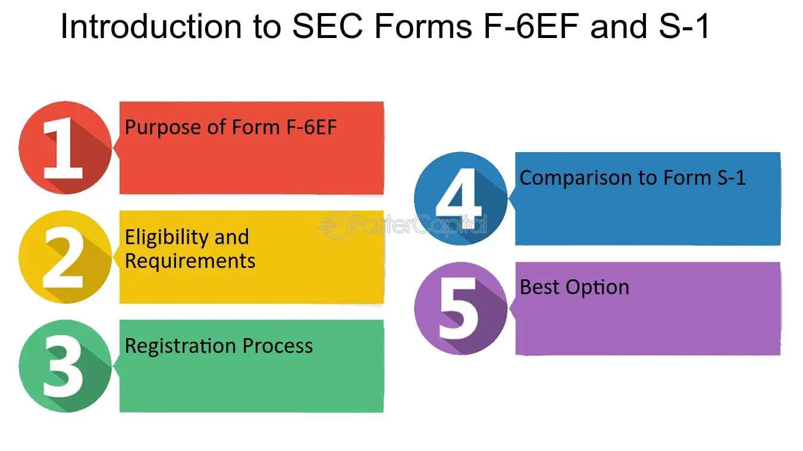

## Table of Contents

## What is SEC Form 1-A?

SEC Form 1-A is a document that companies use to register certain types of securities offerings with the U.S. Securities and Exchange Commission (SEC). It is used for what is called a "Regulation A" offering, which allows smaller companies to raise money from the public without going through the full registration process that larger public offerings require. This makes it easier and less expensive for small businesses to get funding.

When a company fills out Form 1-A, it has to provide details about the company, the securities being offered, and how the money raised will be used. This form helps the SEC make sure that the information given to investors is clear and complete. It also helps investors make informed decisions by giving them important information about the investment opportunity.

## What is the purpose of filing SEC Form 1-A?

The purpose of filing SEC Form 1-A is to allow small companies to raise money from the public more easily and at a lower cost. Instead of going through the full registration process that bigger companies need for their public offerings, small businesses can use Form 1-A for a simpler "Regulation A" offering. This makes it easier for them to get the funding they need to grow.

When a company files Form 1-A, it gives important details about the company and the securities it wants to offer. This information helps the SEC make sure that what the company tells investors is clear and complete. It also helps investors understand the investment opportunity better, so they can make smarter choices about whether to invest their money.

## Who is eligible to file SEC Form 1-A?

Any company that wants to raise money through a Regulation A offering can file SEC Form 1-A. This type of offering is designed for smaller companies that don't want to go through the full, more expensive process of a traditional public offering. As long as the company follows the rules set by the SEC for Regulation A, it can use Form 1-A to offer its securities to the public.

The main thing is that the company must be honest and provide all the necessary information in the form. This includes details about the company itself, the securities it wants to offer, and how it plans to use the money it raises. By filing Form 1-A, the company can reach out to potential investors and raise the funds it needs to grow, while also making sure those investors have the information they need to make good decisions.

## How does SEC Form 1-A differ from other SEC forms like Form S-1?

SEC Form 1-A and Form S-1 are both used to register securities with the SEC, but they are used for different types of offerings. Form 1-A is used for Regulation A offerings, which are designed for smaller companies that want to raise money from the public without going through the full, more expensive process of a traditional public offering. This makes it easier and cheaper for small businesses to get funding. When a company uses Form 1-A, it has to provide details about the company, the securities it's offering, and how it plans to use the money it raises.

On the other hand, Form S-1 is used for full registration of securities under the Securities Act of 1933. This form is typically used by larger companies that are doing an initial public offering (IPO) or other types of larger public offerings. The process of filing Form S-1 is more detailed and involves more disclosure requirements than filing Form 1-A. This is because the SEC wants to make sure that investors in these larger offerings have all the information they need to make informed decisions. So, while both forms help companies raise money, they serve different purposes and are used by different types of companies.

## What are the key components of SEC Form 1-A?

SEC Form 1-A has several important parts that help the SEC and investors understand the company and its offering. The form starts with basic information about the company, like its name, address, and the type of business it does. It also includes details about the people running the company, like their names and backgrounds. This helps investors know who is in charge and what experience they have.

The next part of Form 1-A focuses on the securities being offered. It explains what kind of securities the company is selling, how many are available, and the price per security. The form also describes how the company plans to use the money it raises. This is important because it shows investors what the company will do with their money. Finally, the form includes financial statements and other important information that helps investors understand the company's financial health and make informed decisions about whether to invest.

## What is the historical context of SEC Form 1-A?

SEC Form 1-A has been around for a long time, but it became more important in 2012 when the U.S. government passed a law called the JOBS Act. This law was meant to help small businesses grow by making it easier for them to raise money. Before the JOBS Act, small companies had a hard time getting funding because the rules for selling securities were strict and expensive. The JOBS Act changed that by creating something called Regulation A, which is a simpler way for small companies to offer securities to the public. That's where Form 1-A comes in – it's the form that companies use to register their Regulation A offerings with the SEC.

Since the JOBS Act, Form 1-A has become a key tool for small businesses looking to raise money. It's less complicated and cheaper than the full registration process that bigger companies have to go through. This means more small companies can now reach out to investors and get the funding they need to grow. The form helps make sure that investors get clear and complete information about the company and the securities being offered, so they can make smart choices about where to put their money.

## How has the regulation around SEC Form 1-A evolved over time?

The rules around SEC Form 1-A have changed a lot over time, especially with the JOBS Act in 2012. Before that, small companies found it hard to raise money because the rules for selling securities were very strict and expensive. The JOBS Act made things easier by creating Regulation A, which lets small companies offer securities to the public in a simpler way. This is where Form 1-A comes in – it's the form that companies use to register their Regulation A offerings with the SEC. The JOBS Act made Form 1-A more important because it gave small businesses a new way to get funding.

Since the JOBS Act, the SEC has made some more changes to Regulation A to make it even better for small companies. In 2015, the SEC updated the rules to create two tiers of Regulation A offerings. Tier 1 lets companies raise up to $20 million in a year, while Tier 2 lets them raise up to $75 million. These changes made it easier for small companies to raise more money. The SEC also made sure that investors still get clear and complete information about the company and the securities being offered, so they can make good choices about where to put their money.

## What are the financial thresholds for using SEC Form 1-A?

SEC Form 1-A is used for Regulation A offerings, which have two different levels called Tier 1 and Tier 2. For Tier 1, a company can raise up to $20 million in a year. This is good for smaller companies that want to get some funding but don't need a lot of money. For Tier 2, a company can raise up to $75 million in a year. This is better for companies that need more money to grow but still want to keep things simple and less expensive than a full public offering.

Both tiers have rules to make sure investors get the right information. For Tier 1, the company has to give financial statements that are reviewed by an independent accountant. For Tier 2, the company needs to provide audited financial statements, which are more detailed and checked more thoroughly. These financial thresholds and rules help small companies raise money while making sure investors know what they're getting into.

## What are the advantages and disadvantages of using SEC Form 1-A for a company?

Using SEC Form 1-A can be a big help for small companies that want to raise money. It's a lot cheaper and easier than doing a full public offering, which can cost a lot of money and take a long time. With Form 1-A, a company can raise up to $20 million or even $75 million a year, depending on which tier they choose. This can give the company the money it needs to grow without having to go through a big, expensive process. Plus, it lets the company reach out to more investors, which can be a good way to get the word out about the business.

But there are some downsides to using Form 1-A too. One big one is that the company has to share a lot of information with the SEC and investors. This can be a lot of work and might make the company feel like it's giving away too much about its plans and finances. Also, even though it's easier than a full public offering, it's still a lot of work to get everything ready and make sure it's all correct. And if the company doesn't do it right, it could get in trouble with the SEC. So, while Form 1-A can be a great way for small companies to raise money, it's important to think about these challenges too.

## How does the process of filing SEC Form 1-A work, including timelines and fees?

Filing SEC Form 1-A starts with the company putting together all the information it needs to share with the SEC and investors. This includes details about the company, the securities it wants to offer, and how it plans to use the money. The company has to choose between Tier 1, which lets it raise up to $20 million a year, or Tier 2, which lets it raise up to $75 million a year. Once everything is ready, the company sends the form to the SEC. The SEC then looks over the form to make sure it's complete and that the company is following the rules. This review process can take about 30 days for Tier 1 and up to 60 days for Tier 2. If the SEC has any questions or needs more information, it might take longer.

The fees for filing Form 1-A depend on which tier the company chooses. For Tier 1, the filing fee is $250, plus a small percentage of the money the company wants to raise. For Tier 2, the filing fee is $1,500, plus a small percentage of the money the company wants to raise. After the SEC approves the form, the company can start selling its securities to the public. It's important for the company to keep the SEC updated with any big changes or new information, like if it raises more money or if something important happens with the business. This helps make sure investors always have the latest information.

## What are some notable cases or examples where SEC Form 1-A was used effectively?

One notable case where SEC Form 1-A was used effectively is the crowdfunding platform Republic. Republic used Form 1-A to raise money from the public for their business. They chose Tier 2, which let them raise up to $75 million a year. This helped them grow their platform and help more startups get funding. Republic's success shows how Form 1-A can be a powerful tool for companies that want to reach a lot of investors and raise a good amount of money without going through a full public offering.

Another example is Elio Motors, a company that wanted to make a new kind of car. They used Form 1-A to raise money from people who believed in their idea. Elio Motors chose Tier 1, which let them raise up to $20 million a year. Even though they faced some challenges later on, using Form 1-A helped them get the funding they needed to start their project. This shows how Form 1-A can be a good option for companies with big ideas but not a lot of money to start with.

## What are the future trends or potential changes expected for SEC Form 1-A?

The future of SEC Form 1-A looks promising as more and more small businesses are looking for easier ways to raise money. One trend we might see is more companies using Form 1-A because it's cheaper and simpler than a full public offering. The SEC might also make some changes to make it even easier for companies to use Form 1-A. For example, they could raise the amount of money companies can raise with Tier 1 and Tier 2 offerings, or make the rules a bit less strict so more companies can use it.

Another potential change could be more focus on making sure investors have all the information they need. The SEC might ask for more details in Form 1-A to help investors make better choices. They could also use new technology to make the process of filing and reviewing Form 1-A faster and easier. This would help small companies get the money they need to grow even quicker. Overall, the future of Form 1-A looks bright as it continues to be a key tool for small businesses to raise money.

## References & Further Reading

[1]: Ginsburg, D. M., & Paul, S. (2020). ["The Regulation A+ Offering: How to Capitalize an Emerging Growth Company."](https://scholar.google.com/citations?user=Q2OH2tkAAAAJ&hl=en) ABA Business Law Section.

[2]: Securities and Exchange Commission. ["Form 1-A: Regulation A Offering Statement Under the Securities Act of 1933."](https://www.sec.gov/files/form1_1.pdf) 

[3]: Narang, R. K. (2013). ["Inside the Black Box: A Simple Guide to Quantitative and High-Frequency Trading,"](https://onlinelibrary.wiley.com/doi/book/10.1002/9781118662717) 2nd Edition. Wiley.

[4]: U.S. Securities and Exchange Commission. ["Fast Answers: Regulation A."](https://www.sec.gov/rules-regulations/statutes-regulations) 

[5]: Securities and Exchange Commission. ["Regulation SCI: Systems Compliance and Integrity."](https://www.sec.gov/rules-regulations/2023/03/regulation-systems-compliance-integrity) 

[6]: Aldridge, I. (2010). ["High-Frequency Trading: A Practical Guide to Algorithmic Strategies and Trading Systems."](https://www.ahmetbeyefendi.com/wp-content/uploads/2020/07/High-Frequency-Trading-Irene-Aldridge.pdf) Wiley.