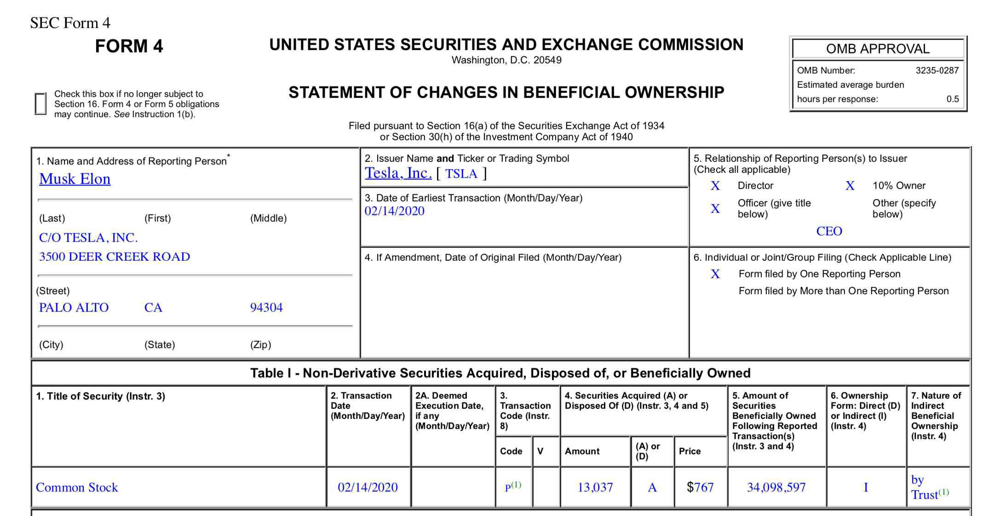

In investment, securities regulation is critical to maintaining market integrity and ensuring investor protection. Central to this regulatory framework is the U.S. Securities and Exchange Commission (SEC), which oversees various forms and filings. These documents provide transparency and accountability in financial markets, allowing investors to make informed decisions and helping to prevent fraudulent activities.

A key form within this framework is the SEC Form 1-A. This form plays an essential role for entities seeking to be exempt from traditional registration requirements for certain public offerings. Particularly under Regulation A, Form 1-A simplifies the process for companies to raise capital without the extensive costs and complexities associated with full registration. This exemption is especially vital for small to mid-sized enterprises that wish to access public capital markets but lack the resources to undergo a full initial public offering (IPO).



Alongside these regulatory forms, algorithmic trading has dramatically transformed the financial markets. Algorithmic trading, or algo trading, employs sophisticated mathematical models and automated systems to execute trades at speeds and volumes unattainable by human traders. While offering significant opportunities for efficiency and potential profit, algorithmic trading also introduces a host of regulatory challenges. Issues such as market manipulation, flash crashes, and systemic risks require vigilant oversight to ensure that technological advancements do not compromise market stability or fairness.

This article examines the intricacies of SEC Form 1-A, evaluates its role within securities regulation, and assesses the implications of algorithmic trading in modern finance. For investors and stakeholders, understanding these components is crucial for navigating today's rapidly evolving financial landscape and capitalizing on opportunities while remaining in compliance with regulatory standards.

## Table of Contents

## Overview of SEC Form 1-A

SEC Form 1-A is an essential document used by companies to seek an exemption from the standard registration requirements typically mandated by the U.S. Securities and Exchange Commission (SEC) under the Regulation A framework. This form serves as a fundamental tool for businesses aiming to engage in public offerings without undergoing the comprehensive registration process that usually accompanies such financial activities. 

Regulation A plays a pivotal role in easing the pathway for companies aspiring to raise capital by allowing securities offerings of up to $75 million within a 12-month period to be exempt from more stringent SEC registration demands. This exemption is designed to facilitate smaller companies in accessing public investment markets, thus fostering a more dynamic financial ecosystem.

The form is commonly known as the 'Regulation A Offering Statement' and is explicitly tied to the Securities Exchange Act of 1933. This act is a cornerstone piece of legislation designed to infuse transparency into the financial markets by ensuring that investors receive significant information regarding securities being offered for public sale. This statute also provides a mechanism for companies to communicate essential facts as they engage in securities offerings, thereby underlining the importance of SEC Form 1-A.

Structurally, SEC Form 1-A is composed of three main components, each requiring specific information from issuers. These components include:

1. **Part I: Notification** - This part requires basic issuer information. This includes the type of securities being offered, the number of shares, the price per share, and other identifying details about the issuer and the offering.

2. **Part II: Offering Circular** - This section provides more detailed disclosures akin to a simplified prospectus. It covers information on the business, financial statements, offer terms, risk factors, and other pertinent details that investors would find crucial for informed decision-making.

3. **Part III: Exhibits** - This part requires issuers to attach additional documents such as underwriting agreements, legal opinions on the legality of the securities, and other exhibits that support the disclosures made in Part II.

Understanding these elements is crucial for businesses intending to benefit from Regulation A exemptions. Comprehension of SEC Form 1-A ensures that companies can maintain compliance with SEC's regulations while optimizing their strategy for public offerings. By effectively navigating these requirements, companies can leverage the exemptions provided by Regulation A to achieve their financial and operational objectives in a regulatory-compliant manner.

## Components and Tiers of SEC Form 1-A

SEC Form 1-A consists of three structured parts: basic issuer information, specific disclosures, and additional documents. These components are designed to provide transparency and safeguard investor interests while facilitating certain exempt securities offerings under Regulation A.

1. **Basic Issuer Information:**
   This section requires entities to furnish fundamental data, including the name of the issuer, primary business address, and details of primary stakeholders. The issuer must also describe the type of business, purpose of the offering, and the intended use of the proceeds. This foundational information helps investors understand the core aspects of the entity making the offering.

2. **Specific Disclosures:**
   The second part encompasses detailed disclosures about the issuer's financial condition, including balance sheets, cash flow statements, and earnings statements for up to two fiscal years. Moreover, it mandates disclosures on risks associated with the offering, potential conflicts of interest, and other material facts that could influence an investor's decision. These disclosures are crucial for evaluating the viability and risk profile of the offering.

3. **Additional Documents:**
   Issuers must attach supplementary documents, such as legal opinions regarding the legality of the securities, and any contracts or agreements pertinent to the offering. This segment ensures all necessary legal and financial documents are available for comprehensive analysis by regulatory bodies and investors.

### Tiers under SEC Form 1-A

SEC Form 1-A provides two tiers, each imposing distinct regulatory frameworks tailored to the scale of the offering:

- **Tier 1:**
  Tier 1 covers offerings of up to $20 million in a 12-month period, with a cap on affiliate sales at $6 million. Issuers under Tier 1 are subject to less stringent reporting requirements, primarily focusing on the initial offering document's accuracy. There is no ongoing federal reporting after the offering, but companies must comply with blue sky laws, which pertain to state-level securities regulations.

- **Tier 2:**
  Tier 2 allows offerings up to $75 million, with affiliate sales limited to $22.5 million for the same period. This tier involves more comprehensive reporting duties, including annual, semiannual, and current event reports. These requirements mirror certain aspects of public company reporting under the SEC's Exchange Act. Tier 2 issuers benefit from preemption of state securities law registration requirements, streamlining multi-state offerings.

Understanding these tiers allows companies to identify the most suitable regulatory pathway based on their needs and capacity to meet compliance demands. By leveraging the appropriate tier, companies can reduce administrative burdens, mitigate compliance risks, and strategically structure their public offerings to maximize success while maintaining regulatory integrity.

## Algorithmic Trading and Its Regulatory Challenges

Algorithmic trading, commonly known as algo trading, employs computer algorithms to automate the trading process, executing orders at speeds and frequencies far surpassing human capabilities. These algorithms use pre-defined criteria, such as timing, price, or quantity, to make trading decisions, significantly enhancing the efficiency of financial markets. Investors often see algo trading as a means of achieving higher returns due to its ability to react swiftly to market changes and capitalize on opportunities that may only exist for fractions of a second.

Despite its benefits, the rapid expansion of [algorithmic trading](/wiki/algorithmic-trading) has created significant challenges for market regulation, especially in ensuring fairness and stability. One of the primary concerns is that high-frequency trading, a subset of algorithmic trading, could exacerbate market [volatility](/wiki/volatility-trading-strategies) and widen bid-ask spreads, thereby affecting market [liquidity](/wiki/liquidity-risk-premium). The 2010 Flash Crash exemplified these risks, where the Dow Jones Industrial Average plunged about 1,000 points in just minutes before rebounding almost as quickly. This demonstrated how unchecked algorithmic activities could lead to dramatic market disruptions.

The U.S. Securities and Exchange Commission (SEC) recognizes these challenges and has implemented several measures to manage them. For instance, the SEC has instituted circuit breakers, mechanisms designed to temporarily halt trading on an exchange if severe price movements of a single stock or the market index are detected. This gives the market time to absorb and react to the significant movements more gradually.

Moreover, the SEC requires thorough disclosure of trading algorithms to identify and mitigate potential conflicts of interest. This regulation ensures that such algorithms are utilized in ways that do not disadvantage retail investors or favor specific broker strategies over the investor's interests. In addition, the SEC's Regulation SCI (Systems Compliance and Integrity) mandates that essential market participants implement, maintain, and test robust automated control measures to ensure their systems' resilience.

Understanding the intricacies of algorithmic trading within the securities regulation framework is essential for both investors and regulatory bodies to maintain market integrity and investor trust. Algo trading continues to evolve with advancements in technology, necessitating ongoing adaptation of regulatory strategies to address emerging challenges and ensure a fair, transparent, and stable financial market landscape.

## Impact of SEC Regulations on Algorithmic Trading

The SEC's enhanced regulations are pivotal in ensuring that online brokers utilizing complex trading algorithms adhere to the same stringent standards as traditional investment advisors. These rules are designed to prevent conflicts of interest that may arise when trading algorithms are deployed, thereby safeguarding the interests of investors. By aligning technological advancements with fair trading practices, the SEC aims to uphold the integrity of financial markets.

A core aspect of algorithmic trading is predictive analytics, which uses historical data to forecast future market movements. This approach, while potentially beneficial, has been scrutinized for its ability to prioritize broker interests over those of investors. The rapid processing and execution of trades, if unchecked, can create scenarios where brokers profit at the expense of their clients. Hence, the SEC's regulations mandate transparency in the deployment of algorithms. Brokers are required to disclose any conflicts of interest and implement strategies to mitigate such issues.

To illustrate the complexity of these algorithms, consider a simplified Python example of a moving average crossover strategy, commonly used in algorithmic trading:

```python
import pandas as pd

# Example stock data
data = {'Date': ['2022-01-01', '2022-01-02', '2022-01-03', '2022-01-04', '2022-01-05'],
        'Close': [100, 102, 101, 105, 107]}
df = pd.DataFrame(data)
df['Date'] = pd.to_datetime(df['Date'])
df.set_index('Date', inplace=True)

# Calculate short and long moving averages
short_window = 2
long_window = 3
df['Short_MA'] = df['Close'].rolling(window=short_window, min_periods=1).mean()
df['Long_MA'] = df['Close'].rolling(window=long_window, min_periods=1).mean()

# Identify crossover points
df['Signal'] = 0
df['Signal'][short_window:] = np.where(df['Short_MA'][short_window:] > df['Long_MA'][short_window:], 1, 0)
df['Position'] = df['Signal'].diff()

print(df)
```

In this code, a moving average crossover strategy is implemented. The algorithm calculates short and long moving averages and generates buy or sell signals based on their crossovers. This type of strategy, while straightforward, exemplifies how algorithms can make quick, data-driven decisions, highlighting the need for thorough regulatory oversight.

As algorithmic trading continues to develop, the SEC's regulatory framework remains crucial in maintaining market integrity and investor confidence. The Commission's proactive approach ensures that algorithmic trading does not undermine fairness and transparency, key tenets that bolster trust in financial markets. By demanding clearer disclosure of algorithmic processes and potential conflicts, the SEC supports a balanced evolution of technology and regulation in the investment sector.

## Conclusion

The relationship between securities regulation, SEC Form 1-A, and algorithmic trading illustrates the complexities inherent in today's financial markets. SEC Form 1-A provides a more efficient mechanism for companies to conduct public offerings by waiving extensive registration requirements under Regulation A. This ease can substantially lower entry barriers, appeasing smaller companies seeking capital. However, the advent of algorithmic trading presents significant regulatory challenges, often necessitating adaptations to protect market fairness and integrity.

Understanding the role and nuances of both SEC Form 1-A and algorithmic trading allows investors and companies to more adeptly navigate the regulatory framework governing financial markets. This understanding is critical as firms align their investment strategies with existing legal mandates, ensuring compliance while optimizing their market activities.

The rapidly evolving financial landscape underscores the necessity for continuous awareness and adaptation to SEC regulations. As market dynamics change, so too must the regulatory strategies employed by both companies and regulatory bodies. Institutions that proactively engage with regulatory changes and technological advancements can better exploit investment opportunities and reduce compliance risks.

Ultimately, achieving a balanced regulatory approach will lead to a more equitable and transparent investment environment. Such balance is not only fundamental to maintaining market integrity but also to fostering trust among all market participants, from small investors to large financial institutions. In this context, both SEC Form 1-A and comprehensive regulation of algorithmic trading are essential components that together contribute to the stability and fairness of the financial markets.

## References & Further Reading

[1]: Ginsburg, D. M., & Paul, S. (2020). ["The Regulation A+ Offering: How to Capitalize an Emerging Growth Company."](https://scholar.google.com/citations?user=Q2OH2tkAAAAJ&hl=en) ABA Business Law Section.

[2]: Securities and Exchange Commission. ["Form 1-A: Regulation A Offering Statement Under the Securities Act of 1933."](https://www.sec.gov/files/form1_1.pdf) 

[3]: Narang, R. K. (2013). ["Inside the Black Box: A Simple Guide to Quantitative and High-Frequency Trading,"](https://onlinelibrary.wiley.com/doi/book/10.1002/9781118662717) 2nd Edition. Wiley.

[4]: U.S. Securities and Exchange Commission. ["Fast Answers: Regulation A."](https://www.sec.gov/rules-regulations/statutes-regulations) 

[5]: Securities and Exchange Commission. ["Regulation SCI: Systems Compliance and Integrity."](https://www.sec.gov/rules-regulations/2023/03/regulation-systems-compliance-integrity) 

[6]: Aldridge, I. (2010). ["High-Frequency Trading: A Practical Guide to Algorithmic Strategies and Trading Systems."](https://www.ahmetbeyefendi.com/wp-content/uploads/2020/07/High-Frequency-Trading-Irene-Aldridge.pdf) Wiley.