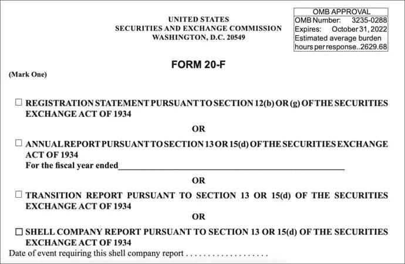

## Table of Contents

## What is SEC Form 20-F?

SEC Form 20-F is a document that foreign companies need to file with the U.S. Securities and Exchange Commission (SEC). This form is important because it gives detailed information about the company's finances, operations, and management to investors in the United States. When a foreign company wants to list its stocks on a U.S. stock exchange, it has to use this form to make sure American investors know everything they need to know about the company.

The form includes information like the company's financial statements, a description of its business, and details about its management team. It's similar to the annual report that U.S. companies file, but it's specifically designed for foreign companies. By filing Form 20-F, these companies can meet the SEC's requirements for transparency and help build trust with American investors.

## Who is required to file SEC Form 20-F?

SEC Form 20-F is required to be filed by foreign companies that have their stocks listed on a U.S. stock exchange. These companies are usually based outside of the United States but want to sell their stocks to American investors. By filing Form 20-F, they follow the rules set by the U.S. Securities and Exchange Commission (SEC) to make sure investors have all the important information they need.

The form helps these foreign companies share details about their business, finances, and management with people in the U.S. This is important because it builds trust and makes sure everyone knows what's going on with the company. If a foreign company wants to keep its stocks listed on a U.S. exchange, it has to file Form 20-F every year.

## What is the purpose of filing Form 20-F?

The main purpose of filing Form 20-F is to give American investors important information about foreign companies that want to sell their stocks in the U.S. When a company from another country wants to list its stocks on a U.S. stock exchange, it has to tell investors about its business, how it's doing financially, and who is running the company. This helps investors make smart choices about whether they want to buy the company's stocks.

By filing Form 20-F, foreign companies follow the rules set by the U.S. Securities and Exchange Commission (SEC). This makes sure that everyone knows the same information about the company, which builds trust between the company and American investors. It's like an annual report that U.S. companies file, but it's made for foreign companies to use when they want to be part of the U.S. market.

## How does Form 20-F differ from Form 10-K?

Form 20-F and Form 10-K are both important documents that companies need to file with the U.S. Securities and Exchange Commission (SEC), but they are used by different types of companies. Form 20-F is for foreign companies that want to list their stocks on a U.S. stock exchange. These companies are based outside of the U.S. but want to sell their stocks to American investors. On the other hand, Form 10-K is used by companies that are based in the U.S. This form is like an annual report that U.S. companies have to file every year to share information about their business, finances, and management with investors.

The main difference between the two forms is who has to file them and where the companies are based. Both forms share similar kinds of information, like financial statements, business descriptions, and details about the management team. However, Form 20-F is designed to help foreign companies meet the SEC's rules for transparency when they want to enter the U.S. market. This helps build trust with American investors by making sure they have all the important information they need about the foreign company.

## What are the key components of SEC Form 20-F?

SEC Form 20-F is a detailed document that foreign companies need to file with the U.S. Securities and Exchange Commission (SEC) if they want to list their stocks on a U.S. stock exchange. The form includes important information about the company's business, like what they do, where they operate, and how they make money. It also has details about the company's financial health, showing their financial statements, how much money they make, and how much they owe. This helps American investors understand the company's financial situation before deciding to buy their stocks.

Another key part of Form 20-F is information about the company's management team. This section tells investors who is running the company, their backgrounds, and how they are paid. It also includes any risks the company might face, like competition or changes in the market. By including all this information, Form 20-F helps build trust with investors by making sure they have all the facts they need to make smart investment choices.

## What are the deadlines for filing Form 20-F?

Foreign companies that have their stocks listed on a U.S. stock exchange need to file Form 20-F with the U.S. Securities and Exchange Commission (SEC) within four months after the end of their fiscal year. This means if a company's fiscal year ends on December 31, they have until April 30 of the next year to file their Form 20-F.

Sometimes, a foreign company might need more time to finish their Form 20-F. In these cases, they can ask the SEC for a 15-day extension. This gives them a little more time to make sure all the information in the form is correct and complete before they submit it.

## Can a company request an extension for filing Form 20-F, and if so, how?

Yes, a company can ask for more time to file their Form 20-F with the SEC. If they need it, they can request an extension that gives them an extra 15 days. This can help if they need a bit more time to make sure all the information in the form is correct and complete.

To ask for this extension, the company needs to file a special form with the SEC. This form is called Form 12b-25. They need to do this before the original deadline for filing Form 20-F, which is four months after the end of their fiscal year. By filing Form 12b-25, they can get the extra time they need to submit their Form 20-F.

## What are the financial reporting requirements under Form 20-F?

Form 20-F requires foreign companies to share a lot of financial information with the SEC. This includes their financial statements, which show how much money the company made, how much they spent, and how much they owe. They need to include an income statement, a balance sheet, and a cash flow statement. These statements should follow either U.S. Generally Accepted Accounting Principles (GAAP) or International Financial Reporting Standards (IFRS) as issued by the International Accounting Standards Board. If the company uses a different accounting standard, they need to explain the differences and provide a reconciliation to U.S. GAAP or IFRS.

In addition to the financial statements, the company also has to include notes to the financial statements. These notes give more details about the numbers in the statements, like how they figured out certain amounts or any special situations that might affect the company's finances. They also need to include a management's discussion and analysis (MD&A) section. This part explains the company's financial condition, changes in financial condition, and the results of their operations. It helps investors understand what the numbers mean and what might happen in the future.

## How should non-U.S. GAAP financial statements be reconciled in Form 20-F?

When a foreign company files Form 20-F with the SEC, they need to include their financial statements. If these statements follow a different accounting standard than U.S. GAAP or IFRS, the company has to reconcile them. This means they need to show how their numbers would look if they used U.S. GAAP or IFRS instead. This helps American investors understand the company's financials in a way that's familiar to them.

To do this reconciliation, the company should provide a detailed explanation of the differences between their accounting standard and U.S. GAAP or IFRS. They need to adjust their financial statements to show what the numbers would be under U.S. GAAP or IFRS. This includes things like how they count their income, expenses, assets, and liabilities. By doing this, the company makes sure that investors have a clear picture of their financial situation, no matter which accounting rules they usually follow.

## What are the disclosure requirements regarding risk factors in Form 20-F?

When a foreign company files Form 20-F with the SEC, they need to talk about the risks that might affect their business. These are called risk factors. The company has to explain what could go wrong and how it might impact their operations, finances, or stock price. This could include things like competition, changes in laws, or problems with their supply chain. By sharing these risks, the company helps investors understand what they might be getting into if they decide to buy the company's stocks.

The risk factors section in Form 20-F should be detailed and specific to the company. They can't just list general risks that could apply to any business. Instead, they need to focus on the risks that are most important to their situation. For example, if a company relies a lot on one country for sales, they should talk about the risks of doing business in that country, like political instability or economic changes. By being clear and honest about these risks, the company builds trust with investors and helps them make better decisions.

## How does the SEC review and process Form 20-F filings?

When a foreign company files Form 20-F with the SEC, the SEC reviews the document to make sure it has all the required information and that the information is accurate. This review process helps the SEC make sure that investors get all the important details they need about the company. The SEC might look at the company's financial statements, the description of their business, and the risks they face. If the SEC finds any problems or missing information, they can ask the company to fix it or provide more details.

After the SEC reviews Form 20-F, they make it available to the public on their website, called EDGAR. This way, anyone can look at the information and learn about the company. If the SEC finds any issues during their review, they might start an investigation or take other actions to make sure the company follows the rules. The whole process is important because it helps keep the U.S. stock market fair and transparent for everyone.

## What are the common pitfalls and how can they be avoided when preparing Form 20-F?

When preparing Form 20-F, one common pitfall is not providing enough detail about the company's business and operations. Foreign companies sometimes think that a general description is enough, but the SEC wants specific information about what the company does, where it operates, and how it makes money. To avoid this, companies should take the time to explain their business clearly and thoroughly. They should also make sure to include all the details about their products, services, and any important changes in their operations.

Another common mistake is not fully disclosing risk factors. Companies need to be honest and specific about the risks they face, like competition, changes in laws, or issues with their supply chain. If they don't do this, they might get in trouble with the SEC. To avoid this, companies should carefully list all the risks that could affect their business and explain how these risks might impact their operations and finances. Being clear and detailed about risks helps build trust with investors.

A third pitfall is not properly reconciling financial statements if they use a different accounting standard than U.S. GAAP or IFRS. This can confuse investors and lead to problems with the SEC. To avoid this, companies should carefully explain any differences between their accounting standards and U.S. GAAP or IFRS, and provide a clear reconciliation of their financial numbers. This helps investors understand the company's financial situation accurately and makes the filing process smoother.

## References & Further Reading

[1]: SEC Division of Corporation Finance. ["Form 20-F."](https://www.sec.gov/about/divisions-offices/division-corporation-finance/filing-disclosure-requirement-forms) U.S. Securities and Exchange Commission, available on the SEC's official website.

[2]: Lopez de Prado, M. (2018). ["Advances in Financial Machine Learning."](https://www.amazon.com/Advances-Financial-Machine-Learning-Marcos/dp/1119482089) Wiley & Sons.

[3]: Aronson, D. R. (2006). ["Evidence-Based Technical Analysis."](https://onlinelibrary.wiley.com/doi/book/10.1002/9781118268315) John Wiley & Sons.

[4]: Jansen, S. (2020). ["Machine Learning for Algorithmic Trading."](https://github.com/stefan-jansen/machine-learning-for-trading) Packt Publishing.

[5]: Chan, E. P. (2009). ["Quantitative Trading: How to Build Your Own Algorithmic Trading Business."](https://github.com/ftvision/quant_trading_echan_book) John Wiley & Sons.