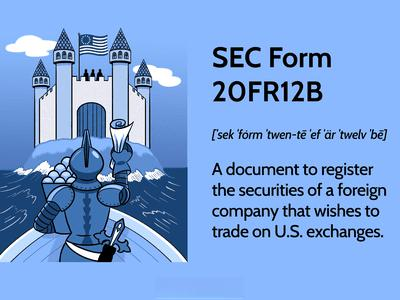

The complexity of global financial markets often necessitates specific regulatory forms for foreign entities that trade securities in the U.S. One such requirement is the Securities and Exchange Commission (SEC) Form 20-F. This form serves as a crucial annual filing requirement for foreign private issuers trading in U.S. markets, ensuring that these entities provide a standardized set of financial data and operational insights to American investors. This standardization is imperative, as it allows investors to make informed decisions by evaluating foreign companies on a comparable basis with domestic firms.

In this article, we aim to demystify SEC Form 20-F, focusing specifically on its filing requirements for companies involved in algorithmic trading—a sector characterized by using sophisticated algorithms and high-speed execution to leverage small price discrepancies in financial markets. As algorithmic, or algo trading, becomes increasingly prevalent, it introduces unique challenges to regulatory compliance. Ensuring transparency and accuracy in reporting algo trading activities is essential for maintaining market integrity and investor trust.



By exploring the nuances of SEC Form 20-F, we will examine how this standardization of reporting benefits both investors and issuers, facilitating an environment where financial disclosures are both comprehensive and comprehensible. Automated trading adds layers of complexity to financial transactions and reporting, necessitating careful attention to regulatory guidelines. This article will address these unique challenges and underscore the importance of aligning algorithmic trading practices with the stringent requirements of SEC Form 20-F, ultimately highlighting the role of compliance in enhancing the credibility and attractiveness of foreign private issuers in the U.S. market.

## Table of Contents

## What is SEC Form 20-F?

SEC Form 20-F is an essential annual filing requirement mandated by the United States Securities and Exchange Commission (SEC) for all foreign private issuers that seek to trade equity shares on U.S. exchanges. This form is pivotal in enforcing transparency and ensures that U.S. investors have access to a standardized set of financial data and operational insights regarding foreign companies. The comprehensive nature of Form 20-F aids in leveling the playing field between domestic and international issuers by creating a uniform disclosure platform.

The primary purpose of SEC Form 20-F is to standardize foreign company disclosures, bridging diverse international accounting practices and financial reporting with the requirements of the U.S. securities market. This standardization promotes informed investment decisions, as it guarantees that investors receive comparable and reliable data, regardless of the issuer's country of origin. A key function of Form 20-F is its role in ensuring compliance with the Securities Exchange Act of 1934, which establishes the ground rules for trading securities in the United States.

Unlike their domestic counterparts, foreign companies benefit from specific regulatory leniencies under Form 20-F in terms of financial reporting. For instance, while U.S. companies must adhere strictly to Generally Accepted Accounting Principles (GAAP), foreign private issuers have the option to report using International Financial Reporting Standards (IFRS) without reconciling those statements to GAAP. This flexibility acknowledges the global diversity in accounting standards and attempts to mitigate the reporting burden on foreign entities while maintaining adequate disclosure for investor protection.

In summary, SEC Form 20-F acts as a crucial instrument in harmonizing the financial information of foreign companies to meet U.S. standards, thereby facilitating a more transparent, efficient, and equitable investment landscape.

## Understanding Form 20-F Filing Requirements

Form 20-F is a mandatory submission that foreign private issuers must file with the U.S. Securities and Exchange Commission (SEC). It needs to be submitted within four months following the end of the issuer's fiscal year. This timeline ensures that U.S. investors receive updated and relevant information in a timely manner.

Eligibility for Form 20-F is determined by several criteria, one of which is the foreign private issuer's shareholding structure. Specifically, the issuer qualifies if less than 50% of its voting shares are owned by U.S. investors. This threshold is vital as it helps distinguish foreign private issuers from domestic ones, thus allowing them certain reporting leniencies.

The consequences of not complying with the Form 20-F filing requirements are significant. Penalties can include fines and, more severely, delisting from U.S. stock exchanges such as the NYSE or NASDAQ. Delisting is a critical issue as it limits the company's access to the vast U.S. capital markets, potentially affecting the [liquidity](/wiki/liquidity-risk-premium) and marketability of its securities.

The form is comprehensive and includes a wide array of information pertinent to investors. It captures financial performance, encompassing balance sheets, income statements, and cash flow statements. The governance practices section details the company's board practices, executive compensation, and shareholder rights. Additionally, significant risks that may impact the company's operations or financial standing are disclosed. This can include market risks, economic conditions, or regulatory environments that may affect the business.

Overall, the requirements of Form 20-F serve to provide transparency, protect investors, and maintain the integrity of the U.S. financial markets by ensuring that foreign companies adhere to these standards.

## SEC Form 20-F and Algo Trading

Algorithmic trading, often referred to as algo trading, utilizes computer systems to conduct a high [volume](/wiki/volume-trading-strategy) of trades at speeds and frequencies that far surpass human capabilities. It involves pre-programmed algorithms based on frameworks such as mean reversion, statistical [arbitrage](/wiki/arbitrage), or [momentum](/wiki/momentum)-based strategies. These algorithms can execute orders when pre-specified conditions are met, ensuring swift, data-driven decisions in financial markets.

For companies involved in algo trading, it's imperative to accurately disclose this in their Securities and Exchange Commission (SEC) Form 20-F filings. This requirement underscores the importance of transparency and compliance with U.S. regulatory standards. The form serves not only as a regulatory tool but also reassures investors about the practices of foreign issuers.

**Accurate Reporting and Compliance**

Accurate reporting of [algorithmic trading](/wiki/algorithmic-trading) activities involves detailing the design, operation, and evaluation of these algorithms. Companies must clearly outline how the algorithms function, including the types of data utilized and the decision-making processes they follow. Additionally, companies need to document and report the results of risk assessments and back-tests that reflect how these algorithms respond under various market conditions.

**Algorithm Transparency and Risk Assessment**

Transparency is key. A detailed description of an algorithm's strategy and functionality is vital. Companies should provide insights into the logic of their algorithms and disclose any modifications to their trading models. Algorithmic transparency also includes providing data on trades executed, their outcomes, and any deviations from expected performance.

Risk assessments form an integral component of accurate reporting. By using statistical models and historical data, companies can evaluate the potential risks associated with their trading algorithms. It is crucial to perform stress-testing to understand potential vulnerabilities and scenario analyses to anticipate the impacts of atypical market events.

**Cybersecurity and High-Speed Trading Environments**

Given the nature of high-speed trading and the significant financial activity it involves, cybersecurity is a critical focus area in Form 20-F reporting. This consists of both safeguarding trading algorithms and protecting market data from breaches or manipulations. Companies must prepare comprehensive cybersecurity disclosures detailing current measures to prevent unauthorized access or disruptions in trading operations.

Additionally, considering the dynamic nature of high-speed trading environments, there is an emphasis on maintaining robust contingency plans. These plans provide a [course](/wiki/best-algorithmic-trading-courses) of action in the event of system failures or breaches, aimed at minimizing potential damage and ensuring swift recovery.

Ultimately, for companies engaged in algo trading, the process of crafting a Form 20-F involves meticulous documentation and a commitment to transparency. Such diligence not only meets regulatory obligations but also fosters trust among U.S. investors, sustaining investor confidence and long-term investment potential.

## Common Challenges in Filing Form 20-F

Navigating multiple regulatory frameworks between the issuing country and the United States presents significant challenges for foreign private issuers required to file SEC Form 20-F. Each jurisdiction often has its unique set of financial reporting standards, legal requirements, and business practices. Harmonizing these differences while ensuring compliance with U.S. securities laws is a demanding task for many companies.

One major hurdle involves reconciling financial statements to align with Generally Accepted Accounting Principles (GAAP). Although foreign issuers are given some leniency in terms of reporting standards, adherence to GAAP remains a critical requirement. This reconciliation process can be intricate, particularly for companies accustomed to International Financial Reporting Standards (IFRS) or other local accounting conventions. The nuances between GAAP and IFRS, for instance, often require detailed adjustments and a deep understanding of both sets of standards.

The specificity of algorithmic trading, or algo trading, adds another layer of complexity to Form 20-F disclosures. Foreign entities engaged in such trading activities must ensure they provide detailed information about these operations. Failing to adequately disclose aspects of algo trading, such as algorithm design, operational methodologies, and associated risks, can lead to significant compliance risks. The need for thorough and transparent reporting is underscored by the rapid nature and high volume of trades executed through these systems, which can amplify both operational and financial risks if not properly communicated.

Language barriers present additional challenges for foreign private issuers. Precise financial and operational disclosures are critical, and any ambiguity resulting from translation issues can lead to misunderstandings or non-compliance. Companies must ensure that all disclosures are not only linguistically accurate but also culturally and contextually appropriate, given the diverse investor base in U.S. markets. This necessity often warrants additional translation efforts and consultation to achieve clarity and accuracy in disclosures.

Addressing these challenges requires a multi-faceted approach, involving expert guidance and robust internal processes. Foreign entities must remain vigilant in their compliance efforts to successfully navigate these complex regulatory landscapes and maintain their position in U.S. capital markets.

## Best Practices for SEC Form 20-F Filers

Engaging financial and legal advisors who specialize in cross-border securities regulations is crucial for foreign private issuers filing SEC Form 20-F. These advisors possess the expertise to navigate the complex interplay between international standards and U.S. regulations. Their insights ensure that disclosures meet both the letter and spirit of the law, reducing the risk of non-compliance and associated penalties, such as possible delisting from U.S. stock exchanges.

Implementing robust internal controls for algorithmic trading activities is essential for ensuring accurate disclosures in SEC Form 20-F. Algorithmic trading, by its nature, involves executing numerous trades at high speed, making monitoring vital. Effective internal controls encompass real-time tracking and systematic risk assessment of trading algorithms. These controls help maintain transparency and provide necessary information for accurate reporting on the design, operation, and risks associated with algorithms. A sample Python script for logging trading activity might involve using libraries like `pandas` and `datetime` to ensure transactions are tracked and assessed accurately:

```python
import pandas as pd
from datetime import datetime

def log_trade(trade_data):
    trade_log = pd.DataFrame(columns=["time", "symbol", "volume", "price"])
    trade_log = trade_log.append(trade_data, ignore_index=True)
    trade_log.to_csv('trade_log.csv', mode='a', header=False, index=False)

trade_data = {
    "time": datetime.now(),
    "symbol": "AAPL",
    "volume": 100,
    "price": 150.00
}

log_trade(trade_data)
```

Maintaining updated and future-proof cybersecurity measures is integral to operating in a high-speed trading environment. Given the high risks of cyber threats in the digital trading context, it's crucial for companies to adopt advanced technologies and protocols to protect sensitive financial systems and data. Comprehensive documentation of these cybersecurity measures should be a standard part of the filings, ensuring that stakeholders are aware of the defensive strategies implemented.

Transparent communication with investors is vital to mitigate concerns regarding algo trading risks. Open and regular dialogue with investors can enhance trust and clarify any potential misconceptions about the risks involved in algorithmic trading. Companies should prioritize releasing clear, concise, and accurate information regarding trading strategies, goals, and the measures in place to manage associated risks. This proactive approach not only enhances investor relations but also solidifies the company's reputation in the competitive landscape of global financial markets.

## Conclusion

SEC Form 20-F serves as a vital tool for foreign companies to gain and maintain their investor base in the U.S. by facilitating transparency and standardization in financial reporting. This aligns the interests of foreign private issuers with U.S. regulatory requirements and investor expectations, enhancing both their credibility and attractiveness in the global financial markets. 

In particular, companies engaged in algorithmic trading must carefully navigate Form 20-F's disclosure mandates. Proper understanding and adherence to these requirements not only ensures compliance but also supports operational efficiency and builds investor trust. Given the complexity and speed at which algorithmic trading operates, detailed and accurate reporting of such activities is crucial. This transparency aids in mitigating risks associated with automated trading and reassures investors about the integrity and reliability of the issuer.

Looking ahead, potential regulatory changes may further impact disclosure requirements for foreign private issuers, particularly those involved in advanced trading technologies. Therefore, adopting proactive compliance strategies becomes essential. By anticipating and adapting to these changes, issuers can sustain their competitive edge and investor confidence in a dynamic regulatory environment. 

In conclusion, adherence to SEC Form 20-F is a strategic imperative for foreign companies seeking to maximize their opportunities in U.S. markets, particularly as the landscape of trading and regulatory requirements continues to evolve.

## Additional Resources

### Additional Resources

To facilitate a thorough understanding and compliance with SEC Form 20-F requirements, several resources are available:

1. **Official SEC Guidelines for Form 20-F Filing**: 
   The SEC provides comprehensive documentation that outlines the requirements and procedures for filing Form 20-F. This resource is indispensable for foreign private issuers aiming to ensure compliance. Access the guidelines on the [SEC's official website](https://www.sec.gov).

2. **Consultation Resources for Algorithmic Trading Compliance**: 
   With the complexities inherent in algorithmic trading, specialized consultation can be crucial. Firms such as Deloitte, PwC, and EY offer expert advisory services to navigate algorithmic trading strategies within regulatory frameworks. Additionally, specialized compliance platforms like ACA Group and RFA focus on ensuring that trading algorithms adhere to existing regulations.

3. **Financial and Legal Advisory Services Specializing in International Securities Trading**: 
   International trading requires navigating various legislative landscapes. Professional services firms with global networks, like KPMG and Clifford Chance, provide robust financial and legal advice tailored to cross-border securities trading. Their expertise can be leveraged to address the intricacies of different regulatory environments and to develop comprehensive compliance strategies.

By utilizing these resources, foreign private issuers can enhance their understanding of SEC Form 20-F filing requirements and ensure effective compliance, thus fostering trust and credibility in U.S. capital markets.

## References & Further Reading

[1]: SEC Division of Corporation Finance. ["Form 20-F."](https://www.sec.gov/about/divisions-offices/division-corporation-finance/filing-disclosure-requirement-forms) U.S. Securities and Exchange Commission, available on the SEC's official website.

[2]: Lopez de Prado, M. (2018). ["Advances in Financial Machine Learning."](https://www.amazon.com/Advances-Financial-Machine-Learning-Marcos/dp/1119482089) Wiley & Sons.

[3]: Aronson, D. R. (2006). ["Evidence-Based Technical Analysis."](https://onlinelibrary.wiley.com/doi/book/10.1002/9781118268315) John Wiley & Sons.

[4]: Jansen, S. (2020). ["Machine Learning for Algorithmic Trading."](https://github.com/stefan-jansen/machine-learning-for-trading) Packt Publishing.

[5]: Chan, E. P. (2009). ["Quantitative Trading: How to Build Your Own Algorithmic Trading Business."](https://github.com/ftvision/quant_trading_echan_book) John Wiley & Sons.