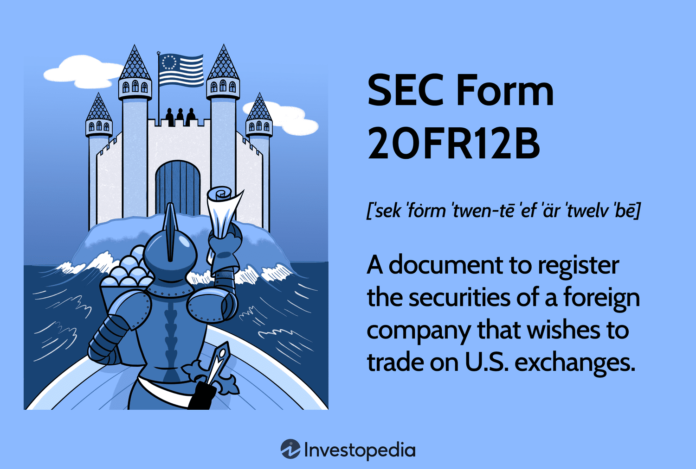

Algorithmic trading has become an integral part of modern financial markets, leveraging computer algorithms to automate trading strategies and execute orders at speeds and frequencies that are impossible for human traders. This method typically relies on complex algorithms to analyze market data and execute trades based on pre-set criteria. The significance of algorithmic trading lies in its ability to enhance market efficiency, reduce transaction costs, and provide liquidity, making it a cornerstone in today's financial ecosystem.

The Securities and Exchange Commission (SEC), an independent federal agency, plays a crucial role in regulating financial markets in the United States. Its primary mission is to protect investors, maintain fair, orderly, and efficient markets, and facilitate capital formation. In this context, the SEC establishes rules and regulations to ensure the integrity and transparency of U.S. financial markets, a responsibility that extends to entities engaging in algorithmic trading.

SEC Form 20FR12B is an important regulatory filing for foreign companies intending to participate in the U.S. markets. This form is specifically designed for foreign private issuers to register securities with the SEC, thereby granting them access to the U.S. financial markets. In relation to algorithmic trading, SEC Form 20FR12B is particularly relevant for foreign companies seeking to employ algorithmic trading strategies within the United States. This form ensures that these companies comply with U.S. securities regulations, thereby promoting transparency and investor protection.

By complying with Form 20FR12B, foreign entities can assure U.S. regulators and investors of their adherence to American financial standards. This compliance not only facilitates their participation in the U.S. markets but also sets a foundation for building trust in their automated trading operations. As algorithmic trading continues to grow and evolve, understanding and fulfilling these regulatory requirements remain crucial for foreign companies aiming to leverage the U.S. market efficiently.

## Table of Contents

## Understanding SEC Form 20FR12B

SEC Form 20FR12B is a regulatory filing required by the U.S. Securities and Exchange Commission (SEC) from foreign companies looking to list their securities in the United States. The primary purpose of this form is to provide the SEC and potential investors with relevant information about the foreign company. This allows for informed decision-making and ensures that the company complies with the regulatory standards set by the SEC for foreign issuers.

The form requires a comprehensive range of information. Firstly, companies must provide detailed investor relations contacts, which serve as the primary points of communication for investors seeking information about the company's operations and financial health. This includes the names, addresses, and contact details of individuals or departments responsible for handling investor inquiries. Furthermore, companies are required to submit a thorough description of their business operations, including details about their industry sector, business model, competitors, and market position. This section offers investors a clear understanding of the company's activities and strategic direction.

Additionally, the form mandates the disclosure of financial statements, which need to adhere to U.S. Generally Accepted Accounting Principles (GAAP) or International Financial Reporting Standards (IFRS). These statements provide insights into the company’s financial status, performance, and cash flow, ensuring transparency and enabling investors and regulators to assess the company's economic viability.

Compared to other SEC filings required of foreign issuers, such as Form 20-F and Form 6-K, SEC Form 20FR12B is notably comprehensive. While Form 20-F is an annual report detailing foreign companies' operations and financial conditions as per SEC standards, Form 20FR12B goes further by also considering initial registration and listing requirements, which include more extensive disclosures regarding investor relations and business operations. Similarly, Form 6-K is used for periodic updates, such as press releases or earnings reports, whereas Form 20FR12B encompasses an initial, in-depth audit of the company's readiness to participate in U.S. markets.

The comprehensiveness of SEC Form 20FR12B ensures that foreign entities meet the stringent regulatory requirements needed to engage with the U.S. financial markets, fostering a level of transparency that protects investors and maintains market integrity.

## Importance of SEC Form 20FR12B in Algo Trading

Algorithmic trading, a method that uses complex algorithms and high-speed data processing to execute trading strategies, heavily depends on regulatory compliance to maintain trust and efficiency in financial markets. Compliance ensures that all traders operate on an even playing field and minimizes the risks of market manipulation and fraud. In this context, SEC Form 20FR12B serves as a critical element in the regulatory framework for foreign companies participating in U.S. financial markets, particularly those involved in [algorithmic trading](/wiki/algorithmic-trading).

SEC Form 20FR12B plays a pivotal role in ensuring transparency and protecting investors. This form requires a comprehensive disclosure of a company's operations, financial health, and governance structures. By providing detailed information about foreign companies, the form helps maintain investor confidence by reducing information asymmetry. Enhanced transparency through rigorous reporting standards is particularly important in algorithmic trading, where the opaqueness of algorithms could potentially obscure unfair practices or financial health.

Furthermore, compliance with SEC Form 20FR12B aids foreign companies in accessing the U.S. financial markets for algorithmic trading. By adhering to the regulatory requirements outlined in the form, foreign entities demonstrate their commitment to U.S. market integrity standards. This commitment facilitates smoother integration into U.S. markets, allowing foreign companies to leverage algorithmic trading's high-speed execution capabilities and vast [liquidity](/wiki/liquidity-risk-premium) opportunities.

Ultimately, by fulfilling the requirements of SEC Form 20FR12B, foreign companies not only comply with regulatory standards but also contribute to the overall stability and trustworthiness of the financial markets. This compliance is crucial for maintaining robust market operations and mitigates the risks associated with high-frequency trading and other advanced trading strategies commonly employed in algorithmic trading.

## Process of Filing SEC Form 20FR12B

Filing SEC Form 20FR12B is a critical process for foreign companies seeking to register securities with the U.S. Securities and Exchange Commission (SEC). This form acts as a gateway to accessing the U.S. financial markets, particularly for firms involved in algorithmic trading. The process requires meticulous preparation and compliance with regulatory standards. Below, we outline the steps and requirements for filing SEC Form 20FR12B, with emphasis on the necessary documentation and the role of legal and financial advisors.

### Steps to File SEC Form 20FR12B

1. **Initial Preparation and Assessment**:
   - Initially, the foreign company must assess whether it qualifies as a foreign private issuer under the SEC regulations. This typically involves determining whether more than half of the company's outstanding voting securities are held by U.S. residents.
   - Companies must also ensure that they have the necessary infrastructure and expertise to comply with ongoing SEC reporting obligations once registered.

2. **Gathering Documentation and Information**:
   - The firm must compile detailed reports and disclosures, including a complete description of the company's business, management structure, financial statements, and risk factors. 
   - Financial statements should be prepared in accordance with the International Financial Reporting Standards (IFRS) or U.S. Generally Accepted Accounting Principles (GAAP), ensuring accuracy and transparency.
   - A comprehensive description of the securities to be offered and the terms and conditions affecting them must be included.

3. **Investor Relations and Contact Information**:
   - Companies need to provide detailed investor relations contact information. This includes the names and addresses of agents designated for service of process in the United States.
   - The form requires the disclosure of the company’s principal executive office location outside the United States as well as other administrative information.

4. **Disclosure of Legal and Regulatory Matters**:
   - Detailed disclosures regarding legal proceedings, regulatory matters, and the company’s compliance with relevant laws in its home jurisdiction are necessary.
   - The company must inform the SEC of any recent events that are significantly affecting the issuer, providing context and potential implications for investors.

5. **Submission and Review Process**:
   - Once the documentation is completed, it needs to be submitted electronically through the SEC’s Electronic Data Gathering, Analysis, and Retrieval (EDGAR) system. 
   - After submission, the SEC reviews the documentation to ensure compliance with U.S. regulations. This may result in requests for further information or modifications to the submitted form.

### Role of Legal and Financial Advisors

Navigating the complexities of SEC Form 20FR12B typically necessitates the involvement of experienced legal and financial advisors. Legal advisors are instrumental in ensuring that all regulatory requirements are met and that the company’s disclosures are accurate and complete. They also assist in interpreting any SEC feedback or requests for additional information.

Financial advisors play a crucial role in preparing the financial statements and ensuring that they align with U.S. standards. They also aid in the financial aspects of risk disclosure and help strategize compliance with ongoing reporting obligations.

In summary, while the filing of SEC Form 20FR12B demands careful attention to detail and rigorous compliance with U.S. regulations, the process is significantly streamlined with the help of proficient legal and financial advisors. This collaboration ensures that foreign companies are not only compliant but also well-positioned to successfully enter the U.S. financial markets.

## Comparison with Other Related SEC Forms

SEC Form 20FR12B is an important regulatory filing for foreign companies looking to engage in activities within the United States' financial markets. However, it is not the only form that such companies must consider. In comparison, forms like SEC Form 20-F and Form 6-K also play crucial roles in maintaining compliance within the U.S. securities regulations.

### SEC Form 20-F

SEC Form 20-F is a major reporting requirement for foreign companies, particularly for those listing their securities on U.S. exchanges. It requires comprehensive annual reporting similar to the Form 10-K used by domestic companies. The form includes financial statements, a company overview, risk factors, management's discussion and analysis (MD&A), and other vital disclosures. 

The ongoing requirement for compliance necessitates that foreign private issuers file this form annually, with deadlines typically six months after the end of the company's fiscal year. This annual filing ensures that investors have access to the most current and complete information about the company’s financial status, corporate governance, and management changes. 

### SEC Form 6-K

SEC Form 6-K is a more frequent reporting requirement that foreign private issuers must file to report any material information that the company makes available to investors in its home country. These may include press releases, financial statements, or other communications reflecting material developments. Unlike Form 20-F, which is annual, Form 6-K is filed as needed, whenever significant events occur. 

This form ensures ongoing transparency and up-to-date communication with investors, reflecting any substantial changes or announcements that could impact investor decisions. 

### Collective Role in Algo Trading

Together, SEC Forms 20-F, 20FR12B, and 6-K establish a comprehensive regulatory framework crucial for algorithmic trading, where timely, accurate, and transparent information is essential for market efficiency and investor trust. The forms ensure that foreign entities are not only compliant from a legal standpoint but are also providing adequate disclosure to foster fair trading practices. 

For foreign companies, understanding and adhering to these reporting requirements is crucial to maintain their standing and credibility on U.S. markets. This is particularly important in algorithmic trading, where strategies can be sensitive to information asymmetries and where compliance lapses can lead to significant legal and financial repercussions.

In summary, these forms collectively require foreign companies to maintain transparency and provide timely disclosures, enhancing the overall confidence in U.S. financial markets. Proper compliance aids in the seamless and ethical execution of algorithmic trading strategies by ensuring that all market participants have equal access to vital information.

## Challenges and Considerations

Foreign companies seeking to file SEC Form 20FR12B encounter a range of challenges primarily due to the complexity of U.S. regulatory requirements. A key challenge is understanding the specific disclosures mandated by the form, which can be substantially different from domestic reporting standards in a company's home country. This complexity is compounded by the high level of detail required, including comprehensive financial disclosures, corporate governance information, and investor relations contacts.

A common pitfall in filing Form 20FR12B is inadequate preparation or incomplete submission of documentation. Companies may submit forms with missing or incorrect information, leading to delays or even rejections by the SEC. To avoid such pitfalls, foreign entities should conduct thorough due diligence and ensure that all required documents are accurate and complete before submission. Engaging experienced legal and financial advisors familiar with SEC regulations can also provide critical guidance, reducing the likelihood of errors during the filing process.

Another significant challenge is the ongoing need to comply with U.S. financial regulations even after the initial filing. The U.S. regulatory landscape is dynamic, and foreign companies must remain updated on changes that could affect their reporting obligations and business strategies, particularly in the context of algorithmic trading. Understanding these regulations is crucial as non-compliance can result in penalties or the loss of access to U.S. capital markets, which are significantly impactful on algorithmic trading operations that depend on market access and liquidity.

The impact of U.S. regulations on algorithmic trading strategies should not be underestimated. Regulatory requirements can influence the design and execution of trading algorithms, especially in risk management and compliance checks. For instance, algorithms may need to be adjusted to account for regulatory constraints on trading volumes or to ensure adherence to market manipulation rules. Failure to integrate these regulatory considerations into algorithmic strategies can lead to significant financial and reputational risks.

In summary, while filing SEC Form 20FR12B poses challenges for foreign companies, these can be mitigated through careful preparation, adherence to detailed regulatory guidance, and leveraging expert advisors. Understanding the broader regulatory environment is essential, not only to ensure compliance but also to optimize algorithmic trading strategies within the U.S. financial markets.

## Conclusion

SEC Form 20FR12B holds significant importance in algorithmic trading, particularly for foreign companies intending to engage with U.S. financial markets. The form is pivotal in ensuring compliance with SEC regulations, thereby fostering a transparent and secure trading environment. By mandating comprehensive disclosures about a company’s operations, financials, and governance practices, SEC Form 20FR12B acts as a safeguard for U.S. investors, enhancing their ability to make informed decisions.

The transparency promoted by SEC Form 20FR12B is critical in maintaining the integrity of financial markets, especially with the heightened pace and complexity introduced by algorithmic trading. It requires foreign companies to provide detailed information, thus reducing asymmetries and potential information gaps that could disadvantage investors. In this way, it supports the SEC’s broader mandate of protecting investors from fraudulent activities and malpractices.

Compliance with SEC Form 20FR12B is not merely a procedural formality but a strategic necessity for foreign entities. It serves as an entry ticket to one of the largest and most liquid financial markets globally, allowing foreign companies to leverage the advantages of algorithmic trading in the U.S. By adhering to the requirements of this form, foreign companies affirm their commitment to regulatory norms, which can bolster their reputation among U.S. investors and potentially enhance their market valuation and access to capital.

In summary, SEC Form 20FR12B is indispensable in the context of algorithmic trading, catering to the dual objectives of investor protection and market transparency. For foreign companies, it underscores the essentiality of regulatory compliance, presenting a conduit to unlock the opportunities available within the U.S. financial markets while adhering to the highest standards of corporate governance and disclosure.

## Additional Resources

For those interested in expanding their knowledge of algorithmic trading and the regulatory landscape established by the U.S. Securities and Exchange Commission (SEC), a range of resources is available to explore these subjects in depth.

### Algorithmic Trading
1. **Books and Publications**:
   - *"Algorithmic Trading and DMA: An Introduction to Direct Access Trading Strategies"* by Barry Johnson provides a comprehensive introduction to the world of algorithmic trading with insights into strategies and market dynamics.
   - *"Quantitative Trading: How to Build Your Own Algorithmic Trading Business"* by Ernest P. Chan offers practical advice on setting up an algorithmic trading venture with an emphasis on quantitative techniques.

2. **Online Courses**:
   - Coursera and edX offer courses such as "Algorithmic Trading Strategies" and "Quantitative Foundations for International and Corporate Finance," which cover the basics and advanced concepts of algorithmic trading.

3. **Research Articles**:
   - Websites like SSRN (Social Science Research Network) provide access to numerous research papers focusing on the latest advancements and techniques in algorithmic trading.

### SEC Regulatory Requirements
1. **Official SEC Resources**:
   - The SEC’s official website hosts a comprehensive repository of regulatory documents, guidelines, and forms, including detailed instructions on filings like the SEC Form 20FR12B. Visit [sec.gov](https://www.sec.gov) for up-to-date information.

2. **Educational Guides**:
   - Investopedia offers a range of articles explaining the intricacies of SEC regulatory requirements and specific forms that foreign companies must submit, like Form 20-F and Form 6-K.

3. **Workshops and Webinars**:
   - The SEC often conducts webinars and workshops discussing various compliance and regulatory topics pertinent to both domestic and international market participants.

### Resources for Foreign Companies
1. **Consultancy and Legal Services**:
   - Companies like PwC, Ernst & Young, and Deloitte offer consulting services to help foreign companies navigate U.S. financial regulations. These firms provide guidance on statutory requirements and the filing process.

2. **Professional Associations**:
   - Organizations such as the American Bar Association and the International Swaps and Derivatives Association (ISDA) provide resources, guidelines, and networking opportunities for professionals involved in cross-border financial transactions.

3. **Online Platforms**:
   - Websites like RegulatoryCompliance.com offer insights, tools, and resources that address the specific regulatory compliance needs of international firms.

### Professional Assistance in SEC Filing Process
1. **Legal Advisors**:
   - Law firms specializing in financial securities, such as Skadden, Arps, Slate, Meagher & Flom, provide expert legal services to assist with SEC filings and navigating regulatory complexities.

2. **Financial Advisors**:
   - Financial advisory firms, including KPMG and BDO, offer services to ensure accurate financial reporting and compliance with SEC requirements.

3. **Software Solutions**:
   - Platforms like Workiva offer cloud-based solutions that streamline the SEC filing process by providing tools for documentation, collaboration, and submission of required forms and disclosures.

By leveraging these resources, foreign companies and individuals interested in algorithmic trading can better understand the U.S. financial landscape and ensure compliance with relevant regulations.

## References & Further Reading

[1]: Bergstra, J., Bardenet, R., Bengio, Y., & Kégl, B. (2011). ["Algorithms for Hyper-Parameter Optimization."](https://dl.acm.org/doi/10.5555/2986459.2986743) Advances in Neural Information Processing Systems 24.

[2]: ["Advances in Financial Machine Learning"](https://www.amazon.com/Advances-Financial-Machine-Learning-Marcos/dp/1119482089) by Marcos Lopez de Prado

[3]: ["Evidence-Based Technical Analysis: Applying the Scientific Method and Statistical Inference to Trading Signals"](https://www.amazon.com/Evidence-Based-Technical-Analysis-Scientific-Statistical/dp/0470008741) by David Aronson

[4]: ["Machine Learning for Algorithmic Trading"](https://github.com/stefan-jansen/machine-learning-for-trading) by Stefan Jansen

[5]: ["Quantitative Trading: How to Build Your Own Algorithmic Trading Business"](https://www.amazon.com/Quantitative-Trading-Build-Algorithmic-Business/dp/1119800064) by Ernest P. Chan