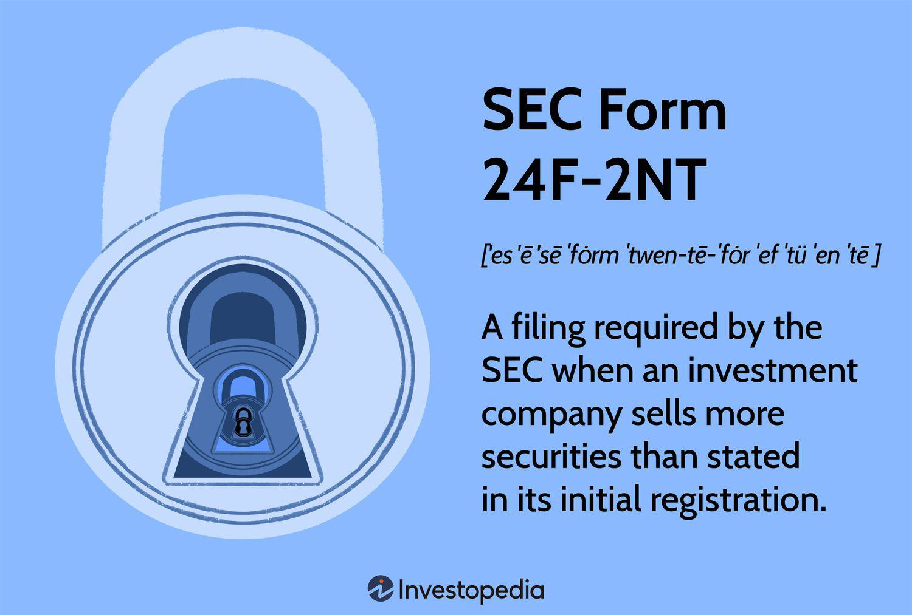

In the rapidly evolving landscape of investment, understanding regulatory frameworks is essential for companies and investors alike. Regulatory compliance ensures that financial markets operate smoothly and transparently, safeguarding both individual and institutional investors. Among these regulatory requirements, SEC Form 24F-2 plays a pivotal role in the registration and functioning of investment companies.

SEC Form 24F-2 is a crucial tool for open-end management companies, such as mutual funds and exchange-traded funds (ETFs), in maintaining compliance with the Investment Company Act of 1940. The form is also applicable to face-amount certificate companies and unit investment trusts (UITs). It essentially functions as an annual notification that aids in tracking the sale of securities and the computation of related registration fees. These processes support the Securities and Exchange Commission's (SEC) overarching goal of promoting transparency and accountability within the securities market.

This article discusses SEC Form 24F-2's implications for investment companies, with particular attention to its relevance in the context of algorithmic trading. Given the rise of algorithmic trading, where trades are executed based on advanced algorithms using various market parameters, compliance with SEC regulations like Form 24F-2 is even more critical. Ensuring that trading activities align with regulatory requirements allows investment companies to operate seamlessly within a highly dynamic market environment, thereby fostering trust and confidence among market participants.

## Table of Contents

## Understanding SEC Form 24F-2

SEC Form 24F-2 is a crucial annual filing mandated under the Investment Company Act of 1940. This filing requirement serves as an essential compliance measure for investment entities, primarily focusing on open-end management companies, which encompass mutual funds and exchange-traded funds (ETFs). Additionally, the form is required for face-amount certificate companies and unit investment trusts (UITs).

The fundamental purpose of SEC Form 24F-2 is to facilitate the collection of registration fees from these investment entities. Such fees are integral in maintaining orderly and transparent financial markets. The form also plays a vital role in ensuring compliance with the regulatory provisions set forth by the Securities and Exchange Commission (SEC). Compliance is not merely a legal obligation but a critical practice for fostering confidence among investors and maintaining the integrity of financial transactions.

Moreover, SEC Form 24F-2 provides a comprehensive and clear record of the securities sold by registered entities within the fiscal year. It requires registrants to report the aggregate number of shares sold and redeemed during the fiscal period. This information is fundamental in calculating the net sales amount, which forms the basis for computing the registration fee owed to the SEC.

To accurately determine the fees, entities must compute the net sales amount using the formula:

$$
\text{Net Sales} = \text{Total Sales} - \text{Total Redemptions}
$$

Where:
- $\text{Total Sales}$ represents the aggregate dollar value of shares sold.
- $\text{Total Redemptions}$ reflects the aggregate dollar value of shares redeemed or repurchased.

Investment companies are obligated to file Form 24F-2 electronically through the SEC’s Electronic Data Gathering, Analysis, and Retrieval (EDGAR) system. It is critical for them to keep meticulous records to prevent potential discrepancies or penalties associated with inaccurate filings. This structured approach not only meets regulatory requirements but also serves to enhance the operational efficiency and reputation of the investment firms involved.

## Importance for Investment Companies

Investment companies rely on SEC Form 24F-2 to calculate and pay the necessary fees to the Securities and Exchange Commission (SEC). This form is a pivotal component in the compliance framework established under the Investment Company Act of 1940, ensuring that securities sold publicly are duly accounted for and that applicable fees are remitted correctly. 

Investment companies, such as mutual funds and exchange-traded funds (ETFs), are required to report their aggregate net sales of securities on Form 24F-2. The accurate calculation of fees is crucial, as it involves multiplying the aggregate sales of securities by the fee rate. Failure to appropriately calculate these fees can lead to penalties, emphasizing the importance of precise record-keeping and adherence to regulatory requirements. In 2021, the fee rate was $109.10 per million dollars of the aggregate net sales. This fee is periodically adjusted, and investment companies must stay updated on such changes to ensure compliance.

Moreover, compliance with SEC Form 24F-2 is essential for maintaining orderly financial markets. It ensures transparency in the financial activities of investment companies, which is fundamental in fostering investor confidence. Failure to comply with these requirements can not only accrue monetary penalties but also damage the company's reputation, thereby affecting investor trust and market position.

Regular and timely filing of SEC Form 24F-2 facilitates the smooth operation of investment companies by maintaining their registration status with the SEC. Companies must submit the form electronically via the SEC's EDGAR (Electronic Data Gathering, Analysis, and Retrieval) system, along with corresponding registration fees. The process underscores a broader regulatory requirement designed to uphold the integrity and fairness of financial markets, crucial for sustaining investor participation and capital flow. In summary, strict adherence to the filing requirements of SEC Form 24F-2 is not only a legal obligation but also a strategic component for the continued success and credibility of investment companies in the financial market.

## The Role of Algorithmic Trading

Algorithmic trading, a method that uses computer algorithms to trade securities, relies on advanced data analysis and mathematical models to make trading decisions. Investment companies adopt this approach to exploit market efficiencies and execute large orders with minimal impact on market prices. The algorithms assess a variety of market variables, including price, [volume](/wiki/volume-trading-strategy), and time, to identify and capitalize on market opportunities.

Incorporating [algorithmic trading](/wiki/algorithmic-trading) into investment company operations requires strict adherence to regulatory requirements, including those mandated by the Securities and Exchange Commission (SEC). The filing of SEC Form 24F-2, an essential compliance document, ensures that investment activities are transparent and in line with regulatory standards. Open-end management companies such as mutual funds and ETFs, which frequently engage in high-volume trading, are particularly impacted by these regulations.

The ability to navigate the regulatory landscape is crucial for companies leveraging algorithmic trading. The precision and speed of algorithmic trading can offer a significant competitive advantage, enabling firms to respond swiftly to market fluctuations. However, these benefits come with the responsibility of ensuring that algorithmic operations align with legal requirements. Failing to properly file Form 24F-2 can lead to financial penalties and disrupt trading operations.

Understanding the complexities of algorithmic trading can position investment companies favorably in the financial markets. By maintaining compliance with the SEC through regular and accurate filing of Form 24F-2, companies can enhance their reputation for reliability and integrity in the market. As technology continues to advance, staying informed and compliant with these regulations will be vital for capitalizing on the capabilities of algorithmic trading in a constantly evolving market.

## Filing Procedures and Key Considerations

Investment companies are required to submit SEC Form 24F-2 electronically via the EDGAR (Electronic Data Gathering, Analysis, and Retrieval) system, a pivotal tool used by the U.S. Securities and Exchange Commission (SEC) to increase the efficiency and accessibility of financial filings. This electronic submission process mandates accuracy and completeness to ensure compliance and avoid any potential penalties or interest fees due to late filings.

The registration fee accompanying SEC Form 24F-2 is computed based on the aggregate net sales of securities by the investment company for the relevant fiscal year. This calculation is crucial, as it determines the total fee payable to the SEC. The fee rate can be represented by the following formula:

$$
\text{Registration Fee} = \left( \frac{\text{Aggregate Net Sales of Securities}}{1,000,000} \right) \times \text{Fee Rate}
$$

For instance, in 2021, this fee rate was set at $109.10 per million dollars. It is incumbent upon investment companies to stay updated on any changes to this fee rate, as it can influence the overall cost of compliance significantly. Regular monitoring and adjustment to these fee calculations ensure that companies remain aligned with current SEC guidelines.

Investment companies must maintain precise record-keeping practices, an essential component for accurate filings. These records help in calculating the registration fees correctly and serve as a reference in case of audit or review by regulatory bodies. Failure to file within the designated deadlines results in interest charges, emphasizing the importance of timely submissions.

Essential considerations include understanding the financial periods applicable to net sales calculations and ensuring all transactions within these periods are properly accounted for. Additionally, firms should ensure that their staff involved in EDGAR submissions are well-versed in its procedures and requirements to mitigate the risk of filing errors. Keeping abreast of any regulatory updates through the SEC’s official communications is also highly recommended. These measures collectively support investment companies in fulfilling their obligations under the Investment Company Act of 1940.

## Conclusion

SEC Form 24F-2 is a foundational component of the regulatory framework for investment companies, playing a vital role in maintaining orderly and transparent financial markets. By adhering to the filing requirements of Form 24F-2, investment companies not only ensure their compliance with the securities regulations but also build trust with investors and stakeholders. This compliance is critical for fostering a transparent environment where investor confidence can thrive. 

For companies involved in algorithmic trading, understanding and leveraging regulatory frameworks such as SEC Form 24F-2 offers a strategic advantage. Algorithmic trading is characterized by its reliance on complex algorithms to optimize trade performance. As these firms navigate an increasingly competitive and fast-paced market, staying aligned with regulatory obligations like Form 24F-2 is crucial. This alignment provides a safeguard against potential legal setbacks and enhances the company's reputation as a reliable and compliant market participant.

In an investment landscape marked by rapid technological advancements and evolving market conditions, staying informed about regulatory updates and proactively ensuring compliance are indispensable practices for investment companies. The continuous review of procedures related to SEC Form 24F-2 helps in recognizing changes in filing regulations and calculating registration fees accurately, thereby avoiding penalties.

Ultimately, the proactive engagement with regulatory requirements helps investment firms not only survive but thrive in the competitive financial industry. By embedding regulatory compliance into the core operations, companies can focus on innovating and leveraging market opportunities effectively.

## References & Further Reading

[1]: ["SEC Form 24F-2 Details"](https://www.sec.gov/files/form24f-2.pdf) - U.S. Securities and Exchange Commission

[2]: ["Investment Company Act of 1940"](https://en.wikipedia.org/wiki/Investment_Company_Act_of_1940) - U.S. Securities and Exchange Commission

[3]: Lochner, T. (2017). ["Algorithmic Trading and the Impact of Regulation"](https://www.researchgate.net/publication/378548435_Algorithmic_Trading_and_AI_A_Review_of_Strategies_and_Market_Impact) - CFA Institute

[4]: Allen, F., & Karjalainen, R. (1999). ["Using Genetic Algorithms to Find Technical Trading Rules"](https://www.sciencedirect.com/science/article/pii/S0304405X9800052X) - Journal of Financial Economics

[5]: ["Essentials of Investments"](https://www.mheducation.com/highered/product/Essentials-of-Investments-Bodie.html) by Zvi Bodie, Alex Kane, and Alan Marcus

[6]: Hasbrouck, J., & Saar, G. (2013). ["Low-Latency Trading"](https://www.sciencedirect.com/science/article/abs/pii/S1386418113000165) - The Review of Financial Studies