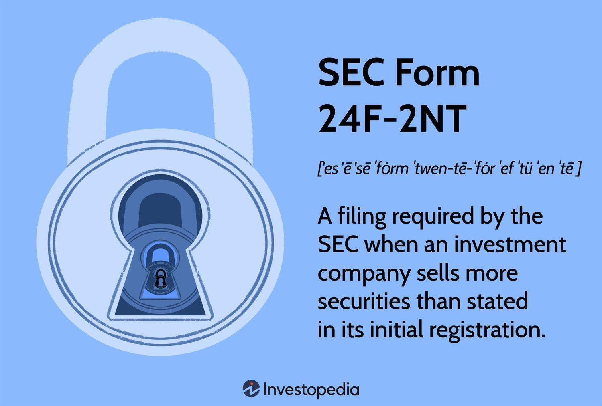

In the complex domain of financial investments, maintaining compliance with regulatory bodies is as critical as executing strategic decisions. Investment companies frequently engage with the Securities and Exchange Commission (SEC) through a variety of procedural filings. Among these, SEC Form 24F-2NT stands out as an essential instrument for mutual funds and other investment companies. It provides a mechanism to ensure legal compliance when selling shares exceeding the quantity initially registered with the SEC.

SEC Form 24F-2NT plays a pivotal role in aligning investment activities with regulatory standards. By utilizing this form, companies can adjust their sales of securities beyond what was initially anticipated in their registration filings. This adjustment is vital for adhering to SEC regulations, allowing firms to broaden their securities distribution legally and efficiently.

This article investigates into the nuances of SEC Form 24F-2NT, highlighting its significance in the contemporary investment landscape. It examines how the form not only facilitates compliance but also influences the strategic planning of investment companies, particularly in relation to algorithmic trading. Algorithmic trading, characterized by rapid, data-driven decision-making processes, requires frequent regulatory reporting. As such, understanding the role and functioning of SEC Form 24F-2NT is crucial for modern traders, enabling them to optimize their trading strategies while remaining compliant with regulatory requirements.

Through this exploration, we aim to uncover how SEC Form 24F-2NT assists investment companies in navigating the intricate regulatory environment, ultimately demonstrating its importance as a strategic tool in investment management.

## Table of Contents

## Understanding SEC Form 24F-2NT

SEC Form 24F-2NT is a regulatory tool employed by investment companies to notify the U.S. Securities and Exchange Commission (SEC) of additional sales of securities beyond those initially registered. This form is integral for companies to initiate adjustments to their initial predictions regarding share sales as indicated in their registration statements. 

The process facilitated by SEC Form 24F-2NT ensures compliance with SEC regulations, thus allowing companies to expand their securities sales lawfully. When a company initially registers its securities offerings, it makes a prediction about the number of shares it intends to offer for sale. However, market demand and strategic shifts often necessitate selling more shares than originally anticipated. In such cases, SEC Form 24F-2NT provides a mechanism for reporting these additional sales to maintain regulatory compliance.

The form typically involves reporting the actual shares sold over the fiscal year, any discrepancy from the initial registration, and associated registration fees. Through this structured reporting, investment companies not only adhere to regulation norms but also transparently update their market activities, fostering investor trust and aligning with governance practices under the Investment Company Act of 1940.

In summary, SEC Form 24F-2NT serves as a pivotal compliance measure enabling investment companies to legally broaden their market presence and adapt to dynamic financial environments, thus safeguarding both the companies' interests and regulatory standards.

## Role of SEC Form 24F-2NT in Investment Companies

SEC Form 24F-2NT is a critical regulatory instrument for investment companies such as mutual funds, ensuring compliance with the financial disclosure norms and governance practices mandated by the Investment Company Act of 1940. This form allows companies to notify the Securities and Exchange Commission (SEC) about the sale of additional securities beyond the amount initially registered. By doing so, it acts as a regulatory check, confirming that companies adhere to the legal framework and transparency requirements set by the SEC.

The use of SEC Form 24F-2NT provides investment companies an opportunity to lawfully expand their portfolios. By filing this form, firms can adjust their securities sales beyond initial forecasts, thereby accommodating investor demand and optimizing fund performance. This capability is particularly important for mutual funds, which may experience fluctuating investor interest and need the flexibility to issue more shares without risking non-compliance with federal securities laws.

Furthermore, SEC Form 24F-2NT enhances investor engagement by maintaining the transparency and accountability of investment strategies. Investors gain confidence as these disclosures reflect the fund's active management and ability to adapt to market conditions. Consequently, mutual funds and other investment companies are better positioned to attract and retain investors, leading to greater capital inflows and portfolio diversification. The form thus serves both as a compliance measure and a strategic tool, enabling companies to meet legal obligations while pursuing growth objectives.

## How Algorithmic Trading Intersects with Regulatory Compliance

Algorithmic trading has significantly transformed investment companies' participation in financial markets by providing the capability to execute rapid and data-driven trades. This form of trading leverages complex algorithms, often enhanced by [artificial intelligence](/wiki/ai-artificial-intelligence) (AI) and [machine learning](/wiki/machine-learning), to make split-second decisions based on various market indicators. The speed and precision offered by these technologies have made [algorithmic trading](/wiki/algorithmic-trading) a dominant force in today's financial landscape.

The introduction of AI and machine learning into algorithmic trading has further enhanced its capabilities, allowing investors to identify and capitalize on market patterns that were previously undetectable. These technologies can process vast amounts of data, employ predictive analytics, and execute trades much faster than human traders, leading to the emergence of high-frequency trading ([HFT](/wiki/high-frequency-trading-strategies)). HFT involves executing a large number of trades at extremely high speeds, often within fractions of a second. While this strategy can lead to increased market efficiency and [liquidity](/wiki/liquidity-risk-premium), it also poses unique challenges concerning regulatory compliance.

Frequent regulatory reporting is a crucial aspect for investment companies engaged in algorithmic trading. Given the significant [volume](/wiki/volume-trading-strategy) and speed of trades executed, companies must ensure compliance with applicable securities regulations. One critical tool in maintaining this compliance is the understanding and proper utilization of SEC Form 24F-2NT. This form facilitates the notification of additional securities sales to the Securities and Exchange Commission (SEC), ensuring that companies adhere to their legal obligations.

The SEC Form 24F-2NT holds particular significance for algorithmic traders as it addresses the challenges associated with increased securities transactions stemming from algorithmic strategies. By comprehensively reporting these transactions, investment firms can demonstrate adherence to the financial disclosure norms and governance practices mandated by regulatory authorities, such as the Investment Company Act of 1940.

Furthermore, by effectively utilizing SEC Form 24F-2NT, traders can align their high-frequency trading strategies with regulatory requirements, thus optimizing both compliance and trading efficacy. Understanding this form is essential for algorithmic traders not only to maintain regulatory compliance but also to capitalize on the strategic advantages offered by advanced trading technologies.

In conclusion, as algorithmic trading continues to evolve and gain prominence, investment companies must remain vigilant in understanding the intricacies of regulatory compliance. By leveraging tools like SEC Form 24F-2NT, they can ensure that their innovative trading strategies remain compliant, thereby securing sustained success in the ever-complex financial markets.

## Benefits and Criticisms of SEC Form 24F-2NT

SEC Form 24F-2NT offers several advantages to investment companies, primarily by facilitating the additional sale of securities in a streamlined manner. This aligns these entities with regulatory mandates, notably those governed by the Investment Company Act of 1940. One of the notable benefits of this form is the efficiency it introduces into securities sales. By enabling companies to regularly update the Securities and Exchange Commission (SEC) on their sale of additional shares, the form ensures compliance is maintained without significant disruption to the firm's overall operations.

The form's submission process via the SEC’s EDGAR (Electronic Data Gathering, Analysis, and Retrieval) system significantly enhances its accessibility and processing speed. This electronic system allows companies to file their documentation securely and efficiently, resulting in timely public disclosure and giving investors direct access to essential information. The use of EDGAR minimizes the delays traditionally caused by paper-based systems, reduces administrative burdens, and increases transparency within financial markets.

Despite these advantages, SEC Form 24F-2NT is not without its critics. Some argue that the form and its associated processes are outdated, rooted in older filing methodologies that have not fully adapted to the technological advancements in financial reporting. This perception of obsolescence may pose challenges, particularly for smaller investment entities that may lack the resources or technical capacity to navigate the complexities of the form. These smaller organizations might find the form burdensome, as the costs and expertise required to manage compliance can outweigh the benefits of increased securities sales.

Moreover, as the investment landscape evolves with the rise of digital finance and algorithmic trading, the existing framework of SEC Form 24F-2NT may require modernization to better suit contemporary operational dynamics. While the form currently addresses the needs of traditional investment companies, the growing diversity in trading strategies calls for a review and possible update to ensure it remains fit for modern financial ecosystems.

In summary, while SEC Form 24F-2NT is a crucial tool for maintaining compliance and facilitating additional securities sales, it also presents certain challenges. Its efficacy through the EDGAR system is well-acknowledged, yet its complexity and age may hinder smaller entities and trigger calls for its modernization to keep pace with technological advancements in the financial sector.

## Practical Example: Bringing Theory to Life

The Legg Mason Partners Equity Trust provides an illustrative example of how investment companies utilize SEC Form 24F-2NT to maintain regulatory compliance while adapting their market strategies. As a reputable mutual fund, Legg Mason regularly participates in securities sales beyond their initially registered amounts. Filing the SEC Form 24F-2NT allowed Legg Mason to legally and transparently declare these additional sales to the SEC, effectively updating the predicted sales specified in their original registration documents.

The process involved submitting detailed information about the total amount of securities sold, calculated through the formula outlined by the SEC. This calculation considers the investment company's sales of securities during the fiscal year, exempting any shares re-acquired under the fund's buy-back plan. By doing so, Legg Mason ensured that its sales activities aligned with financial disclosure norms, thereby maintaining the trust of its investors and adhering to regulatory standards.

This strategic use of SEC Form 24F-2NT enables investment companies like Legg Mason to expand their operational capacity, optimize their portfolios, and remain competitive in the rapidly evolving financial markets. This example demonstrates the practical application of the form, highlighting how prominent funds manage compliance in a way that supports their broader market objectives.

## Conclusion

SEC Form 24F-2NT serves as more than a regulatory compliance instrument; it is a strategic asset for investment companies. The necessity of understanding and leveraging this form becomes increasingly evident with the expansion of algorithmic trading. As algorithmic and high-frequency trading strategies gain prominence, ensuring compliance with SEC regulations through timely and accurate filings is imperative. This form functions as a critical interface between innovative trading techniques and regulatory requirements, facilitating a seamless interaction between investment strategies and compliance obligations.

In a landscape where adherence to financial regulations determines the viability and success of investment strategies, SEC Form 24F-2NT provides a structured approach to legal compliance. Proactive engagement with this filing not only helps in addressing regulatory requirements but also aids in enhancing investor trust, which is indispensable for long-term success. Investment companies that are proficient in utilizing SEC filings like Form 24F-2NT are better positioned to adapt to regulatory changes while capitalizing on new market opportunities. Staying informed and adept at navigating the complexities of these filings is, therefore, a key [factor](/wiki/factor-investing) in proficient investment management and ensuring continued operational success.

## References & Further Reading

[1]: SEC Division of Investment Management. ["Form 24F-2 Frequently Asked Questions."](https://www.sec.gov/rules-regulations/staff-guidance/division-investment-management-frequently-asked-questions) U.S. Securities and Exchange Commission.

[2]: Investment Company Act of 1940. ["Public Law 76-768, 54 STAT. 789, Enacted August 22, 1940."](https://en.wikipedia.org/wiki/Investment_Company_Act_of_1940) U.S. Government Publishing Office.

[3]: Lopez de Prado, M. (2018). ["Advances in Financial Machine Learning."](https://www.amazon.com/Advances-Financial-Machine-Learning-Marcos/dp/1119482089) Wiley.

[4]: Chan, E. P. (2008). ["Quantitative Trading: How to Build Your Own Algorithmic Trading Business."](https://github.com/egorpe/EPChan-QuantitativeTrading/blob/master/example7_6.m) Wiley.

[5]: Hull, J. C. (2018). ["Options, Futures, and Other Derivatives."](https://www.semanticscholar.org/paper/Options%2C-Futures%2C-and-Other-Derivatives-Hull/89bdee500c8623864fc9eb7a471546aa713acc44) Pearson.

[6]: Kissell, R. (2013). ["The Science of Algorithmic Trading and Portfolio Management."](https://www.sciencedirect.com/book/9780124016897/the-science-of-algorithmic-trading-and-portfolio-management) Academic Press.