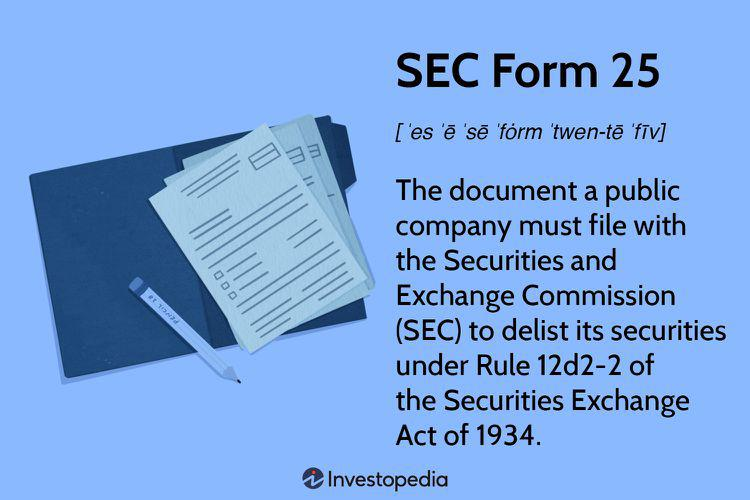

The financial landscape is constantly evolving, and navigating its complexities requires an understanding of various regulations and processes. Among these, SEC Form 25 plays a vital role in the delisting and deregistration processes of public companies from stock exchanges. Delisting refers to the removal of a company's securities from a stock exchange, fundamentally impacting a company's public trading status. Deregistration follows delisting, signifying the cessation of mandatory financial reporting to the Securities and Exchange Commission (SEC) for companies that meet specific criteria.

This article aims to analyze the significance of SEC Form 25, examining its influence on business viability and the regulatory environment. Additionally, it explores the intricate link between delisting and algorithmic trading. Algorithmic trading, known as algo trading, involves using computer algorithms to execute trading orders at speeds and frequencies unachievable by human traders. This modern trading method has transformed securities markets, demanding an intricate understanding of regulatory procedures such as SEC Form 25 to maintain compliance and market stability.

In today's rapidly-paced trading ecosystem, businesses must strategically navigate regulations like SEC Form 25 to align their financial objectives with current market practices. Understanding these regulations is essential not only for compliance but also for leveraging new trading technologies and optimizing market participation. This guide offers insights into how businesses can make informed delisting decisions, while also considering the evolving landscape of algorithmic trading, ensuring they maintain competitive advantages and regulatory adherence in challenging markets.

## Table of Contents

## Understanding SEC Form 25

SEC Form 25 is a regulatory document crucial for companies wishing to remove their securities from listing on a national stock exchange, pursuant to Rule 12d2-2 of the Securities Exchange Act of 1934. The primary motivation for delisting usually revolves around minimizing compliance costs, which can be burdensome for companies, particularly those facing financial challenges or maintaining smaller market capitalizations. The decision to delist is strategic, often aimed at reallocating financial resources more efficiently within the organization.

The delisting process via SEC Form 25 involves several mandatory notifications and filings designed to ensure transparency and provide adequate notice to investors. Initially, companies must submit the form to the Securities and Exchange Commission (SEC) and adhere to procedural requirements, which include issuing a press release and making online notifications about their intent to delist no less than ten days prior to its officialization. This advance notice period allows stakeholders to prepare for changes in trading status and evaluate any implications for their investment strategies.

Once the ten-day notice period lapses, delisting from the exchange becomes effective. However, it is important to note that while the delisting process is completed within this timeframe, full deregistration with the SEC only occurs after an additional 90 days. This interim period ensures that all remaining reporting responsibilities and obligations are satisfied, providing a buffer that accommodates ongoing regulatory compliance while transitioning out of public scrutiny.

In this phased approach, companies must meticulously plan their [exit](/wiki/exit-strategy) strategy, balancing the timing and execution of each step to align with broader corporate objectives and safeguard investor relations. Understanding SEC Form 25 and its procedural requirements is therefore vital for the successful delisting and deregistration from public exchanges.

## Reasons for Delisting and Deregistration

Companies may choose to delist from stock exchanges and deregister their securities for several strategic reasons. One primary motive is the reduction of compliance costs associated with maintaining a public company status. Public companies are subject to stringent regulatory requirements imposed by the Securities and Exchange Commission (SEC), which can be particularly burdensome for smaller companies. For businesses with market capitalizations under $50 million and revenues less than $100 million, the costs of compliance can be disproportionate to their financial capabilities.

Delisting also presents an opportunity for firms to go private or "go dark." Going private involves a company buying out its public shareholders to reduce the number of holders of record to fewer than 300, which then enables deregistration with the SEC and releases the company from public filing obligations. This can be attractive for companies wishing to focus on long-term strategies without the short-term pressures from public shareholders and analysts. Conversely, "going dark" refers to the cessation of periodic reporting with the SEC, while the company still remains registered, albeit with reduced disclosure obligations. This option serves as an intermediate step between being a public company and going private, aimed at minimizing costs while retaining some level of shareholder engagement.

Financial underperformance is another driving [factor](/wiki/factor-investing) for delisting, as companies facing economic challenges may find the public markets' scrutiny detrimental to turnaround efforts. In such cases, the relief from compliance requirements and the flexibility gained by operating privately can be pivotal in stabilizing finances. In challenging economic periods, delisting allows firms to focus resources on core business operations and critical restructuring efforts, thereby offering financial relief.

Strategically, delisting requires careful consideration of the company's overall objectives, shareholder interests, and market conditions. Managers must weigh the benefits of staying public, like access to capital markets and enhanced visibility, against the regulatory and financial benefits of delisting. Each company’s decision will depend on its unique circumstances and long-term vision.

## Impact of Algorithmic Trading on Delisting

Algorithmic trading has revolutionized the financial markets by automating trading decisions based on pre-programmed strategies. This technological advancement has profound implications for companies contemplating delisting from stock exchanges. The rapid execution capabilities and large trading volumes associated with [algorithmic trading](/wiki/algorithmic-trading) create a dynamic trading environment that companies must understand before deciding to delist.

High-frequency trading ([HFT](/wiki/high-frequency-trading-strategies)), a subset of algorithmic trading, poses both opportunities and challenges for entities considering delisting. On one hand, HFT can enhance [liquidity](/wiki/liquidity-risk-premium) by facilitating trades at narrow bid-ask spreads, which may increase market efficiency. On the other hand, the presence of HFT can amplify price [volatility](/wiki/volatility-trading-strategies), as these algorithms react in milliseconds to market news and events. This volatility could unfavorably influence stock prices, complicating a company's delisting strategy by causing abrupt fluctuations in its market valuation.

Before delisting, companies should conduct thorough analyses of the potential impact of algorithmic trading on liquidity and market perception. Liquidity, defined as the ease with which stocks can be bought or sold without causing a significant impact on price, is a critical factor for firms to consider. A reduction in trading activity, often a consequence of delisting, can lead to decreased liquidity, making it difficult for existing shareholders to exit their positions. To counter this, some firms might explore alternative platforms like Over-The-Counter (OTC) markets where trading might continue post-delisting albeit with altered liquidity dynamics.

Market perception also plays a crucial role in a company's delisting decision. Investors and market participants often perceive delisting negatively, equating it with financial distress or reduced transparency. Algorithmic trading engines, programmed to harness market cues and signals, can exacerbate these perceptions through rapid sell-offs, affecting the company’s stock price before, during, and after the delisting process.

To mitigate these challenges, companies can employ strategies such as enhanced communication with stakeholders and ensuring transparency throughout the delisting process. By keeping investors informed, firms can manage market expectations and maintain investor confidence, thereby preventing adverse price movements fueled by algorithmic trading. 

Overall, the interplay between algorithmic trading and delisting underscores the importance of strategic foresight and comprehensive analysis. Firms must evaluate the potential impacts on liquidity and market perception, integrating this understanding into their broader financial and strategic objectives.

## Special Considerations and Strategic Implications

Deciding to delist from a stock exchange is a significant decision that requires an in-depth examination of a company's long-term objectives and financial well-being, especially against the constantly shifting market dynamics. While remaining a public entity confers certain advantages, such as increased visibility among investors and enhanced access to capital markets, it also imposes a heavy regulatory burden. These regulations encompass rigorous reporting requirements, potential vulnerability to market volatility, and compliance with extensive corporate governance standards.

For companies contemplating delisting, a strategic appraisal must include a thorough analysis of shareholder interests. This involves evaluating whether remaining public serves the best interests of shareholders in terms of return on investment and alignment with the company's trajectory. Companies should also reconsider their overall market strategy, assessing whether the costs associated with regulatory compliance outweigh the benefits of being publicly traded.

An alternative pathway could involve transitioning to trading over-the-counter (OTC). OTC trading offers reduced regulatory oversight and costs, which can be particularly beneficial for smaller or financially constrained companies. However, this approach may also reduce liquidity and limit the company's ability to attract large institutional investors.

In addition to financial and regulatory considerations, companies must recognize the pervasive impact of algorithmic trading on market conditions. Algorithmic trading, particularly high-frequency trading (HFT), can significantly influence a stock's liquidity and price stability. Companies must assess how their stock is affected by such trading activities before making delisting decisions, ensuring that their strategies are in line with market mechanics.

Aligning these considerations strategically involves examining how technology-driven trading influences stock performance and market perception. It is essential for firms to ensure that their delisting plans align with emerging trends in trading technology, as this can directly impact their market positioning post-delisting.

In conclusion, the decision to delist is multifaceted, involving an evaluation of financial health, shareholder interests, market strategy, and technological factors. Firms that carefully navigate these elements can make informed choices that optimize their long-term success and align with broader industry trends.

## Conclusion

SEC Form 25 stands as an essential element within the regulatory landscape for businesses aiming to delist from stock exchanges. Understanding the processes, requirements, and strategic implications associated with this form is vital for companies as they navigate the increasingly complex trading systems of today. A thorough comprehension of these aspects ensures that firms can make informed decisions regarding their market presence and regulatory obligations.

As algorithmic trading continues to shape the trading environment, aligning delisting strategies with prevailing market trends and technological advancements becomes paramount. Algorithmic trading, which includes high-frequency trading, has introduced challenges and opportunities that impact market liquidity, price discovery, and company valuation. These factors can significantly influence the outcomes of a delisting decision. As such, businesses must thoroughly assess how algorithmic trading affects their market interactions and decisions, crafting strategies that mitigate potential downsides while capitalizing on emerging opportunities.

By fully grasping the elements surrounding SEC Form 25 and algorithmic trading, companies can enhance their ability to manage their financial health effectively. This comprehensive understanding enables firms to sustain competitive edges within global markets, ensuring resilience against market fluctuations and regulatory changes. As businesses move forward, integrating insights from these regulatory frameworks and technologies is crucial for maintaining operational flexibility and strategic positioning in the ever-evolving financial landscape.

## References & Further Reading

[1]: Securities and Exchange Commission. ["Form 25—Notification of Removal from Listing and/or Registration."](https://www.sec.gov/files/form25.pdf)

[2]: Moyer, E.S., Martin, J.D., & Salas, J. (2020). ["Delisting and Corporate Governance: A Literature Review."](https://pubmed.ncbi.nlm.nih.gov/31999425/) Journal of Economics and Finance, 44(4), 701-726.

[3]: Lopez de Prado, M. (2018). ["Advances in Financial Machine Learning."](https://www.amazon.com/Advances-Financial-Machine-Learning-Marcos/dp/1119482089) John Wiley & Sons.

[4]: Schwartz, R.A., & Byrne, J.A. (2006). ["Algorithmic Trading: A Practitioner's Guide."](https://www.researchgate.net/publication/319664562_The_Quality_of_Our_Financial_Markets_Taking_Stock_of_Where_We_Stand) Institutional Investor Books.

[5]: Chan, E.P. (2009). ["Quantitative Trading: How to Build Your Own Algorithmic Trading Business."](https://github.com/ftvision/quant_trading_echan_book) John Wiley & Sons.