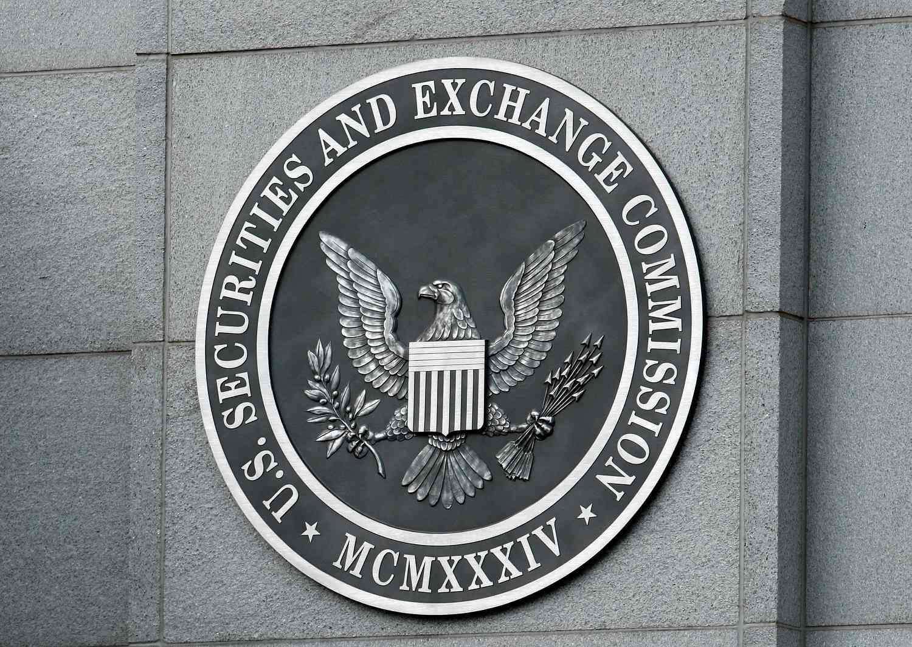

Insider trading refers to the buying or selling of securities by individuals with access to non-public, material information about a company. This practice poses significant risks to market integrity as it can provide unfair advantages, disrupt market equilibrium, and lead to a lack of confidence among investors. With the proliferation of algorithmic trading, which involves the use of automated strategies to execute trades at high speed, the importance of regulatory compliance has increased exponentially. The Securities and Exchange Commission (SEC) has implemented several regulations to monitor trading activities and ensure transparency and fairness in the financial markets.

One crucial regulatory tool in this landscape is the SEC Form 3. This form is the Initial Statement of Beneficial Ownership of Securities and is intended to enforce transparency by requiring disclosures of holdings by company insiders, such as directors, officers, and beneficial owners holding more than 10% equity. Timely and accurate filing of Form 3 is instrumental in preventing illegal and unethical trading conduct, as it provides a public record of insider holdings, which can be monitored for suspicious activities. This disclosure mechanism is vital for maintaining fair and orderly market operations, especially as algorithmic trading becomes more prevalent.



This article examines the filing requirements associated with insider trading and SEC Form 3, focusing on the impact these have on trading strategies, particularly those involving algorithmic processes. The interaction between regulation and technology in trading highlights the necessity for investors and traders to thoroughly understand these regulatory responsibilities to mitigate legal risks and enhance market integrity. These insights are indispensable in navigating the complex regulatory environment and ensuring that trading activities comply with legal standards, thus preserving trust in the financial market system.

## Table of Contents

## What is Insider Trading?

Insider trading refers to the practice of buying or selling a publicly traded company's securities by individuals who have access to non-public, material information about the company. This type of trading can provide an unfair advantage and create an unlevel playing field for regular investors, undermining the integrity and fairness of the financial markets. Material information is crucial because it is the type of news that could influence an investor’s decision to buy or sell a stock. Examples include upcoming mergers, financial results before they are disclosed publicly, or announcements of significant company changes.

Illegal insider trading is deemed as such because it violates the trust placed on insiders not to exploit their privileged access to "inside" information for personal gain. The U.S. Securities and Exchange Commission (SEC) actively monitors and regulates insider trading to protect market fairness and integrity. The SEC enforces strict rules and regulations, pursuing legal action and imposing financial penalties against individuals who engage in illegal insider trading activities.

With the advent of technology, algorithmic trading has transformed how securities are traded, employing automated systems and pre-programmed instructions for the execution of trades. Algorithmic trading handles vast volumes of data and executes transactions at speeds far beyond human capacity. While this has increased market efficiency, it has also complicated the regulatory landscape concerning insider trading. Algorithms that inadvertently exploit non-public information could result in unlawful trading activities, necessitating updated regulations to prevent such occurrences.

Regulators face the challenge of ensuring these algorithms adhere to insider trading laws. Firms engaged in [algorithmic trading](/wiki/algorithmic-trading) must ensure meticulous compliance with the SEC's regulations, guaranteeing that their trading systems do not access or use confidential information to influence trading decisions unfairly.

## Understanding SEC Form 3

SEC Form 3, formally known as the Initial Statement of Beneficial Ownership of Securities, is a critical regulatory document required by the U.S. Securities and Exchange Commission (SEC). This form is designed to disclose the securities holdings of corporate insiders—individuals within a company who possess significant, non-public information about that company. These insiders typically include directors, officers, and substantial shareholders who own more than 10% of a class of the company's equity securities.

The primary function of Form 3 is to ensure transparency in the trading activities of these insiders. By requiring the disclosure of their holdings, the form serves as a mechanism to prevent illegal insider trading, thereby promoting market integrity and fairness. This procedure is vital in maintaining investor trust and preventing market manipulation.

Filing Form 3 is not optional; it is a mandatory requirement that must be fulfilled promptly. The SEC mandates that this form be submitted within 10 days of an individual attaining insider status. The urgency of this requirement underscores the importance of having a clear view of insider transactions from the outset of their association with the company.

The form comprises various sections that gather specific information about the insider. These include personal details of the insider, their relationship to the company, and detailed descriptions of their securities holdings. Accurate completion of this form enables the SEC and the public to monitor trading activities, ensuring they adhere to legal standards and discourage any potential abuses of insider information.

## Filing Requirements of SEC Form 3

SEC Form 3 is an integral part of ensuring transparency in the financial markets by outlining the initial ownership details of individuals with access to potentially sensitive company information. The filing requirements for SEC Form 3 primarily target key individuals who can exert substantial influence over a publicly traded company. These individuals include directors, officers, and beneficial owners with a stake exceeding 10% of the company’s equity securities. Such individuals are required to file Form 3 to disclose their beneficial ownership, providing an overview of their interests in any company securities.

The specific information required on SEC Form 3 includes the insider's name, the nature of their relationship to the company, and the details of the securities they own. This information is essential for the SEC to track and monitor insider trading activities. The timely and accurate submission of this form helps ensure that any changes in insider status are monitored to prevent any unlawful trading practices using non-public information.

Filing Form 3 is mandatory for compliance and must be completed within 10 days of acquiring insider status. Companies and individuals need to adhere to these filing requirements to maintain regulatory compliance, as a failure to file Form 3 can lead to significant repercussions. These repercussions include financial penalties, reputational damage, and heightened scrutiny from the SEC regarding the trading activities of the involved personnel. Ensuring accurate and timely submission minimizes the risk of legal and financial penalties, thereby supporting market integrity and investor confidence.

## Impact of SEC Regulations on Algorithmic Trading

Algorithmic trading employs advanced computational techniques to execute trading decisions at speeds and efficiencies beyond human capabilities. These strategies often rely on algorithms that process vast amounts of data to identify trading opportunities, execute buy and sell orders, and manage risk. The integration of such technology in financial markets demands strict adherence to regulatory frameworks to preserve market integrity, especially with regard to insider trading.

The Securities and Exchange Commission (SEC) has established regulations that are essential for maintaining transparency and fairness in trading activities. Compliance with these regulations is imperative for algorithmic trading systems. Algorithms must be designed to comply with SEC rules regarding the non-exploitation of non-public information. This requires ensuring that trading strategies do not inadvertently leverage insider information for unlawful benefit.

To illustrate, consider the example of [machine learning](/wiki/machine-learning) models that predict stock movement. If these models are trained on datasets that include or infer non-public information, trades executed based on these insights could potentially violate insider trading laws. Thus, algorithm developers must diligently audit data sources and machine learning pipelines to verify compliance.

Moreover, SEC filings, such as Form 3, Form 4, and Form 5, play an instrumental role in this regulatory framework by providing transparency. Algorithms should be programmed to monitor and manage holdings and transactions to reflect any necessary disclosures in these forms accurately. This ensures that any changes in ownership, whether through direct, automatic, or algorithm-driven transactions, are reported within the prescribed timelines, avoiding the risk of penalties.

In building regulatory-compliant algorithmic systems, developers can employ methodologies like:

1. **Data Scrubbing**: Implement systematic data scrubbing processes to remove or flag any potentially non-public data.
   ```python
   def scrub_data(data):
       # Placeholder function for data scrubbing
       sensitive_keywords = ["confidential", "non-public"]
       for record in data:
           if any(word in record for word in sensitive_keywords):
               data.remove(record)
       return data
   ```

2. **Ethical Guidelines**: Program algorithms to incorporate ethical trading guidelines, limiting opportunities for regulatory breaches.

3. **Compliance Audits**: Conduct regular audits and updates to algorithmic strategies to integrate the latest regulatory practices.

4. **Real-time Monitoring**: Utilize real-time monitoring systems to detect and halt transactions that cross regulatory thresholds or suspicious activities.

By rigorously applying such practices, algorithmic traders can ensure their strategies are aligned with SEC regulations, thereby safeguarding against the illicit exploitation of material non-public information and fostering a more equitable trading environment. As the landscape of financial trading evolves, the intersection of technology and regulation will remain a critical area of focus.

## Other Related SEC Forms

SEC Forms 4 and 5 are integral components of the regulatory framework established by the U.S. Securities and Exchange Commission (SEC) to ensure comprehensive disclosure of insider trading activities. These forms, used in conjunction with SEC Form 3, provide a mechanism for detailed and continuous reporting of ownership changes in company securities, thus promoting market transparency and fairness.

**SEC Form 4** is filed by insiders—such as company directors, officers, and beneficial owners with more than 10% ownership—whenever there is a change in their ownership of the company's securities. This form is crucial as it enables the SEC to track immediate changes in insider holdings. It must be filed within two business days of the transaction, ensuring that the information is both timely and relevant. The prompt filing requirement helps deter illicit trading by insiders who might attempt to exploit non-public information for personal gain. Form 4 captures specific transactional details including the securities involved, the nature of the transaction (such as a purchase or sale), and any derivative securities exercised or acquired.

**SEC Form 5** complements the reporting structure by capturing transactions that are exempt from the two-day filing requirement of Form 4. This form is used for transactions that occurred during the fiscal year but were not previously reported on Form 4. It may include certain acquisitions that qualify for deferred reporting or transactions in securities that are not subject to Section 16 of the Securities Exchange Act. Form 5 must be filed within 45 days after the end of the company's fiscal year, facilitating a catch-up mechanism for insiders to report any remaining transactions.

Together, Forms 3, 4, and 5 create a comprehensive disclosure system that enables the SEC to effectively monitor insider trading activities. This triad of forms allows for a detailed and chronological account of insider security holdings and transactions, thereby maintaining the integrity and fairness of the financial markets. The timely and accurate filing of these forms is not only a regulatory obligation but also a critical practice for ensuring investor confidence and protecting the integrity of financial markets from the adverse impacts of insider trading.

## Common Challenges and Penalties

A common challenge accompanying the filing of SEC Form 3 is the necessity for timely submission and accurate reporting of insider activities. Timeliness is critical as the SEC mandates a submission within 10 days of assuming an insider position. Failure to adhere to this deadline can lead to complications with regulatory compliance, evoking additional scrutiny.

Misinterpretations or anomalies in the data reported on Form 3 pose further challenges. Errors in declaring the ownership or nature of securities can cause discrepancies that invite inquiries or investigations by the SEC. This could range from simple typographical mistakes to more substantive errors in specifying the number or type of securities owned.

The SEC's stringent requirements make non-compliance a costly affair. Penalties imposed for non-compliance may include fines, which can be substantial depending on the severity and impact of the violation. Legal actions are another repercussion, potentially resulting in lawsuits and further financial liabilities for the offending parties. These penalties emphasize the importance of accurate and timely filings to avoid regulatory pitfalls.

For investors and companies alike, it is imperative to establish robust systems to ensure Form 3 filings are completed accurately and on time. Employing technological solutions, such as compliance software, may help in tracking insider activities more effectively and in maintaining the precision required by SEC standards, minimizing the risk of non-compliance.

## Conclusion

Understanding SEC Form 3 and its associated filing requirements is indispensable for operating within the modern financial landscape. As the intricacies of insider trading and algorithmic strategies intertwine, adhering to these regulations ensures that trading activities remain transparent and equitable. Compliance with SEC regulations serves as a foundational component to mitigate allegations of insider trading, providing a legal safeguard for individuals and organizations engaged in trading.

The rapid expansion of algorithmic trading necessitates rigorous adherence to SEC guidelines. Algorithms, capable of executing vast numbers of transactions at speeds unattainable by humans, must be programmed to prevent the exploitation of non-public information, a central concern of the SEC. This regulatory framework is not merely a legal obligation but acts as a critical control to uphold market integrity. 

For investors and firms, maintaining an informed stance on SEC requirements is imperative. Regulatory landscapes can shift, often in response to evolving trading techniques and market conditions, making vigilance a necessity. Being proactive in understanding and implementing these requirements not only helps in reducing the risk of compliance failures but also strengthens market confidence. Hence, the role of Form 3, along with other SEC forms, becomes pivotal in fostering a culture of transparency and accountability within financial markets.

## References & Further Reading

[1]: Securities and Exchange Commission. ["Form 3 — Initial Statement of Beneficial Ownership of Securities."](https://www.sec.gov/files/form3.pdf)

[2]: Securities and Exchange Commission. ["Amendments to Forms 3, 4, and 5."](https://www.sec.gov/files/rules/final/2024/33-11325.pdf)

[3]: ["Algorithmic Trading and DMA: An Introduction to Direct Access Trading Strategies"](https://www.amazon.com/Algorithmic-Trading-DMA-introduction-strategies/dp/0956399207) by Barry Johnson

[4]: Fischel, Daniel R. (1982). ["Insider Trading and Investment Analysts: An Economic Analysis of Dirks v. SEC."](https://www.hofstralawreview.org/wp-content/uploads/2014/05/10_13HofstraLRev1271984-1985.pdf) The Supreme Court Review, 1982, pp. 309-333.

[5]: Jarrow, Robert A. (1992). ["Market Manipulation, Bubbles, Corners, and Short Squeezes."](https://www.jstor.org/stable/2331322) Financial Analysts Journal, Volume 48, Issue 2. 

[6]: Bhattacharya, Utpal, and Daouk, Hazem (2002). ["The World Price of Insider Trading."](https://onlinelibrary.wiley.com/doi/abs/10.1111/1540-6261.00416) The Review of Financial Studies, Volume 15, Issue 1, Pages 75–108.