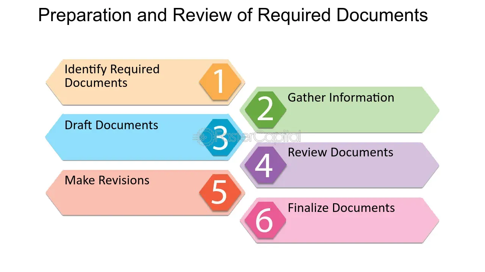

## Table of Contents

## What is SEC Form 3?

SEC Form 3 is a document that certain people have to file with the U.S. Securities and Exchange Commission (SEC). These people are usually big shareholders or important company officers who own a lot of stock in a company. The form is used to report their ownership of these stocks. It's important because it helps keep the stock market fair and open by making sure everyone knows who owns big chunks of a company.

When someone first becomes a big shareholder or an important officer, they need to fill out and submit SEC Form 3. This form lists all the stocks they own in that company at that time. It's a one-time filing, but it's crucial because it sets a starting point for tracking any changes in their stock ownership later on. This helps investors and the public understand who has significant control or influence over a company.

## Who needs to file SEC Form 3?

SEC Form 3 needs to be filed by people who own a lot of stock in a company or who are important officers in that company. These people are called "insiders." Insiders include company directors, officers like the CEO or CFO, and anyone who owns more than 10% of the company's stock. When someone first becomes an insider, they have to fill out SEC Form 3 to report how much stock they own at that time.

This form is important because it helps keep the stock market fair. By making insiders report their stock ownership, everyone can see who has a big say in the company. This helps investors make better decisions because they know who is in control. It's a one-time filing, but it sets the stage for any future changes in ownership that the insider might need to report later.

## When should SEC Form 3 be filed?

SEC Form 3 should be filed within 10 days after someone becomes an insider. An insider is someone who owns a lot of stock in a company or is an important officer, like a director or CEO. This form is important because it tells everyone how much stock the insider owns when they first become an insider.

It's a one-time thing, but it's really important. It helps keep the stock market fair by showing who has a big say in the company. This way, other people who might want to buy the company's stock can make better choices because they know who's in charge.

## What information is required on SEC Form 3?

SEC Form 3 asks for basic information about the person who needs to file it. This includes their name, address, and their relationship to the company, like if they are a director or officer. It also asks for details about the company itself, such as the company's name, the stock exchange where the company's stock is traded, and the type of stock they own.

The main part of the form is about the stock the person owns. It asks for the number of shares they have and the date they got them. This helps everyone know how much of the company the person controls right when they become an important part of it. By filling out this form, the person shows how much stock they own at the start, which is important for keeping the stock market fair and open.

## How does one file SEC Form 3?

To file SEC Form 3, you need to go to the SEC's website. There, you can find the form and fill it out online. You'll need to enter your personal information, like your name and address, and details about your relationship with the company, such as if you're a director or officer. You also need to provide information about the company, like its name and where its stock is traded. Most importantly, you have to list how many shares of the company's stock you own and when you got them.

Once you've filled out all the information, you can submit the form electronically through the SEC's Electronic Data Gathering, Analysis, and Retrieval (EDGAR) system. You'll need to set up an account with EDGAR if you don't already have one. After submitting, the SEC will review your form. It's important to file SEC Form 3 within 10 days of becoming an insider to make sure you're following the rules and keeping the stock market fair.

## What are the penalties for not filing SEC Form 3 on time?

If you don't file SEC Form 3 on time, you could get in trouble. The SEC can fine you if you miss the 10-day deadline after becoming an insider. The fine can be pretty big, and it depends on how late you are and how serious the SEC thinks it is.

Not filing on time can also hurt your reputation. People might think you're not being honest or following the rules. This can make it harder for you to work in the stock market or with other companies in the future. So, it's really important to file SEC Form 3 as soon as you can after becoming an insider.

## How does SEC Form 3 differ from SEC Form 4 and SEC Form 5?

SEC Form 3, SEC Form 4, and SEC Form 5 are all used by insiders to report their stock ownership, but they are used at different times and for different reasons. SEC Form 3 is filed once, within 10 days of someone becoming an insider, to report how much stock they own when they first start. This form sets the baseline for their ownership in the company.

SEC Form 4 is used to report any changes in an insider's stock ownership after the initial Form 3 filing. This means if an insider buys or sells stock, or if they get stock options or other kinds of stock-related payments, they need to file a Form 4 within two business days of the change. This keeps everyone up to date on what insiders are doing with their stock.

SEC Form 5 is filed once a year and is used to report any transactions that should have been reported on Form 4 but were missed, or to correct any mistakes made on earlier Form 4 filings. It's like a yearly check-up to make sure all the insider's stock dealings are reported correctly. This helps keep the stock market fair by making sure all changes in insider ownership are accounted for.

## What are the common mistakes to avoid when filing SEC Form 3?

When filing SEC Form 3, one common mistake is not filing within the 10-day deadline after becoming an insider. Missing this deadline can lead to fines and damage your reputation. It's important to keep track of the date you become an insider and file the form as soon as possible to avoid these problems.

Another mistake is not providing accurate information on the form. This includes your name, address, and details about the stock you own. If you make a mistake, it can cause confusion and might lead to more trouble later on. Double-check all the information before you submit the form to make sure everything is correct.

Lastly, some people forget to set up an EDGAR account or don't know how to use it properly. The SEC requires you to file Form 3 through the EDGAR system, so make sure you have an account and understand how to use it. If you're not sure, you can ask for help to avoid any delays or errors in filing.

## Can amendments be made to SEC Form 3, and if so, how?

Yes, amendments can be made to SEC Form 3 if there are mistakes or changes to the information you first reported. If you find a mistake after you've already filed the form, you need to file an amendment to fix it. This is important because it helps keep the information accurate and fair for everyone.

To make an amendment, you go back to the SEC's EDGAR system where you originally filed the form. You'll need to fill out a new form with the correct information and mark it as an amendment. This way, everyone can see the updated and correct details about your stock ownership.

## How does the electronic filing system (EDGAR) work with SEC Form 3?

The EDGAR system is how you file SEC Form 3 with the SEC. It's an online system where you can fill out and send in the form. To use EDGAR, you first need to set up an account on the SEC's website. Once you have an account, you can log in and find the form you need to fill out. After you enter all the information about your stock ownership, you submit the form through EDGAR. It's important to do this within 10 days of becoming an insider so you don't get in trouble.

When you file SEC Form 3 through EDGAR, the system keeps a record of your filing. This means the SEC and the public can see how much stock you own in the company. If you need to make changes or fix mistakes later, you can also use EDGAR to file an amendment. This helps keep everything up to date and accurate. Using EDGAR makes it easier to follow the rules and keep the stock market fair for everyone.

## What are the recent changes or updates to the requirements of SEC Form 3?

There haven't been many big changes to SEC Form 3 recently. The main rules about who needs to file it and when they need to file it are still the same. You still have to file it within 10 days of becoming an insider, like a director or someone who owns a lot of stock in a company. The form still asks for your name, address, and how much stock you own when you first become an insider.

One small change is that the SEC has been working on making the filing process easier. They've been updating the EDGAR system to make it simpler to file forms like SEC Form 3 online. This means you can fill out the form and send it in more easily. But the basic information you need to put on the form and the deadlines for filing haven't changed much.

## How can one ensure compliance with SEC Form 3 filing requirements in complex corporate structures?

In complex corporate structures, ensuring compliance with SEC Form 3 filing requirements can be a bit tricky. It's important to keep track of who counts as an insider, like directors, officers, or anyone who owns more than 10% of the company's stock. In big companies with lots of different parts, it can be hard to know when someone becomes an insider. You need to make sure everyone knows the rules and that they file the form within 10 days of becoming an insider. It's a good idea to have a system in place to watch for these changes and remind people when they need to file.

Using the EDGAR system can help too. Everyone who might need to file SEC Form 3 should have an account set up and know how to use it. If the company has a lot of insiders, it might be helpful to have someone in charge of making sure all the forms are filed on time. This person can keep an eye on things and help make sure no one misses the deadline. By staying organized and keeping everyone informed, you can make sure the company follows the rules and keeps the stock market fair.

## References & Further Reading

[1]: Securities and Exchange Commission. ["Form 3 — Initial Statement of Beneficial Ownership of Securities."](https://www.sec.gov/files/form3.pdf)

[2]: Securities and Exchange Commission. ["Amendments to Forms 3, 4, and 5."](https://www.sec.gov/files/rules/final/2024/33-11325.pdf)

[3]: ["Algorithmic Trading and DMA: An Introduction to Direct Access Trading Strategies"](https://www.amazon.com/Algorithmic-Trading-DMA-introduction-strategies/dp/0956399207) by Barry Johnson

[4]: Fischel, Daniel R. (1982). ["Insider Trading and Investment Analysts: An Economic Analysis of Dirks v. SEC."](https://www.hofstralawreview.org/wp-content/uploads/2014/05/10_13HofstraLRev1271984-1985.pdf) The Supreme Court Review, 1982, pp. 309-333.

[5]: Jarrow, Robert A. (1992). ["Market Manipulation, Bubbles, Corners, and Short Squeezes."](https://www.jstor.org/stable/2331322) Financial Analysts Journal, Volume 48, Issue 2. 

[6]: Bhattacharya, Utpal, and Daouk, Hazem (2002). ["The World Price of Insider Trading."](https://onlinelibrary.wiley.com/doi/abs/10.1111/1540-6261.00416) The Review of Financial Studies, Volume 15, Issue 1, Pages 75–108.