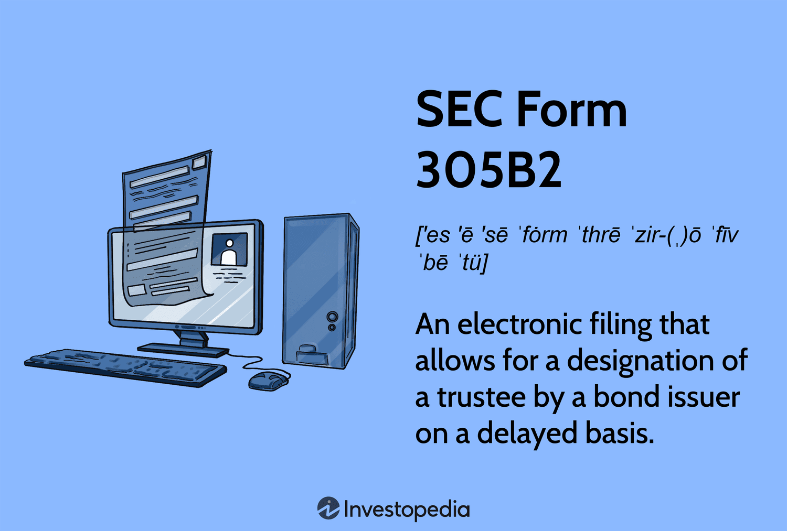

In today's financial landscape, understanding key regulatory forms like SEC Form 305B2 is crucial for companies involved in the issuance of securities. This regulatory form holds particular significance for firms that engage in automated trading and financial reporting, as it embodies the principles of transparency and accountability essential in contemporary finance. SEC Form 305B2 is strategically designed to align with the intricacies of algorithmic trading, ensuring that companies maintain the requisite compliance while utilizing advanced trading technologies. 

This article aims to elucidate the purpose, requirements, and benefits of complying with SEC Form 305B2, highlighting its importance in algorithmic trading. It will provide an in-depth exploration of the operational challenges faced by companies in adhering to the form's standards, while also offering best practices for efficient compliance. Navigating these regulatory requirements is vital for companies seeking to mitigate risks, maintain investor confidence, and uphold ethical practices in a rapidly evolving financial environment. By understanding and adhering to SEC Form 305B2, firms not only meet their regulatory obligations but also contribute to a transparent and robust financial sector.



## Table of Contents

## Understanding SEC Form 305B2

SEC Form 305B2 is an essential filing requirement for firms intending to undertake a shelf offering of bonds or other debt instruments. This form is particularly significant within the framework of the Trust Indenture Act of 1939 as it permits companies to appoint a trustee on a postponed basis, thereby providing flexibility and strategic advantages in managing securities offerings.

One of the primary purposes of SEC Form 305B2 is to support the registration process of fixed-income securities with the Securities and Exchange Commission (SEC). This facilitates a delayed issuance, granting companies the capability to adapt their financial strategies to market conditions while still adhering to mandatory regulatory standards. This flexibility can be crucial for financial firms aiming to optimize their strategies in dynamic economic landscapes.

Compliance with SEC Form 305B2 is non-negotiable for businesses intending to issue such securities. By conforming to federal compliance standards, companies not only protect investor interests but also uphold transparency and accountability within the financial market. This transparency is key in safeguarding the investments by ensuring that all pertinent information regarding securities is disclosed accurately and promptly, which is a cornerstone of ethical financial practices.

In the broader investment and trading environment, SEC Form 305B2 plays a pivotal role. It assists in aligning the securities issuance with federal regulations, thereby enhancing investor confidence and market integrity. Companies leveraging this form can mitigate potential risks such as legal repercussions or investor mistrust, which can arise from non-compliance or inaccurate financial disclosures.

Moreover, the function of SEC Form 305B2 extends beyond mere compliance, as it underpins trust-building measures by ensuring that all stakeholder communications concerning securities offerings are performed within a regulated and structured framework. This embedded trust is essential not only for existing stakeholders but also for attracting future investment, as firms are seen to operate within the legal frameworks designed to protect and inform investors and the market as a whole.

## Importance of SEC Form 305B2 in Algorithmic Trading

Algorithmic trading has transformed the financial markets by utilizing complex algorithms to execute trades at speeds and frequencies that human traders cannot match. Central to the success and reliability of these algorithms is the timely and accurate dissemination of financial information, which is a crucial aspect governed by the Securities and Exchange Commission (SEC) regulations, particularly SEC Form 305B2.

SEC Form 305B2 is designed to ensure that companies engaging in the issuance of debt instruments comply with federal requirements for transparency and accountability. For algorithmic traders, these components are not just a regulatory obligation but a fundamental necessity for maintaining operational integrity. By aligning with the requirements of SEC Form 305B2, firms can provide accurate disclosures that contribute to an environment of regulatory transparency essential for automated trading systems.

Timely compliance with SEC Form 305B2 is instrumental in mitigating risks such as market manipulation and insider trading. The form mandates detailed disclosures that provide insights into the securities being offered, usage of the proceeds, and associated risks. This level of transparency allows algorithmic traders to access reliable data, thereby minimizing the risk of engaging in practices that could be interpreted as manipulative or unfair. Additionally, it ensures that automated trading algorithms operate within the bounds of legality and ethical standards, which is paramount for maintaining a level playing field in the markets.

Moreover, by adhering to the required disclosures stipulated in SEC Form 305B2, firms engaged in [algorithmic trading](/wiki/algorithmic-trading) can uphold investor confidence and diminish potential legal repercussions. Accurate and comprehensive financial reporting reassures investors about the integrity of market operations and the robustness of the financial assets being traded. Investors are more likely to commit capital to firms that are perceived as compliant with regulatory standards, thereby enhancing market credibility.

In conclusion, SEC Form 305B2 serves as a foundational element for ethical and compliant algorithmic trading operations. It ensures that market participants have access to accurate financial information, which is vital for executing informed trading decisions. This compliance not only safeguards the interests of investors but also reinforces the stability and fairness of the financial ecosystem, making it indispensable for modern trading practices.

## Key Requirements for SEC Form 305B2 Compliance

SEC Form 305B2 requires firms to present a comprehensive suite of documentation and disclosures to ensure regulatory compliance in securities offerings. Detailed information about the proposed offer is paramount, requiring firms to specify the number of securities being issued and their intended use. This transparency helps investors understand the purpose and potential impact of the offer.

Financial statements accompanying SEC Form 305B2 must adhere to generally accepted accounting principles (GAAP). This criterion guarantees the financial information presented is both accurate and comparable across the industry, fostering trust and facilitating investor analysis. The alignment with GAAP typically involves a detailed breakdown of income statements, balance sheets, and cash flow statements that provide a clear financial overview of the issuing entity.

Moreover, identifying and detailing significant risk factors is mandatory when filing this form. These risk factors could include market [volatility](/wiki/volatility-trading-strategies), credit risks, or operational challenges that might affect the value of the issued securities. Providing a thorough risk assessment allows investors to make informed decisions by understanding the potential pitfalls associated with the investment.

Legal opinions might also be required as part of the documentation process. These are formal statements provided by legal experts affirming the legality of the securities offer. Such opinions ensure the issuance is conducted within the legal framework, protecting both the issuing firm and potential investors from unforeseen legal complications.

To achieve compliance, firms need to meticulously follow several steps:

1. **Information Disclosure**: Provide clear details about the securities' nature, number, and intended use.

2. **Financial Reporting**: Submit financial statements that conform to GAAP standards, ensuring accuracy and reliability.

3. **Risk Assessment**: Clearly outline all significant risk factors that could impact the securities' performance.

4. **Legal Documentation**: Include necessary legal opinions to verify the compliance and legality of the offer.

By meeting these key requirements, firms not only fulfill regulatory obligations but also position themselves as transparent and trustworthy entities in the financial marketplace. This meticulous approach serves to protect investor interests while aligning with federal compliance standards.

## Challenges and Pitfalls in Filing SEC Form 305B2

Filing SEC Form 305B2, while integral to compliance, presents several challenges that companies must navigate to avoid potential pitfalls. The complexity of the requirements and the detailed financial disclosures necessary can make the filing process cumbersome.

One of the most common errors arises from incomplete information. Submitting forms with missing or inaccurate data not only leads to inefficiencies but also exposes the firm to penalties from regulatory bodies. It is crucial to ensure that all sections of the form are thoroughly completed to avoid such issues. Additionally, failing to update filings with new or revised information promptly can result in non-compliance, emphasizing the need for regular reviews and updates of submitted documents.

Communication inconsistencies across departments further complicate the filing process. The accurate preparation of SEC Form 305B2 often requires the collaboration of multiple departments, such as finance, legal, and compliance. Ensuring effective and ongoing communication among these groups is essential for gathering and verifying the data needed for the form. Establishing clear lines of communication and assigning specific responsibilities to each department can help in minimizing errors and omissions.

To mitigate these challenges, companies should adopt a structured approach. This includes setting up a checklist to ensure all form requirements are met, implementing a timeline for regular updates, and utilizing project management tools to streamline inter-departmental communications. By understanding and addressing these challenges proactively, firms can enhance their compliance efforts and maintain a smooth filing process for SEC Form 305B2.

## Leveraging Technology for Compliance Efficiency

Technology plays a pivotal role in enhancing the efficiency and accuracy of filing SEC Form 305B2. Automated systems are at the forefront of this transformation, streamlining the data collection process. By reducing the dependency on manual entry, these systems mitigate the risk of errors, ensuring that financial information is both current and precise.

Real-time monitoring and predictive analytics further bolster compliance efforts by identifying potential issues before they escalate into significant problems. Through continuous data assessment, these technologies provide insights that are crucial for proactive compliance management, allowing firms to address discrepancies swiftly.

Implementing robust data management systems is essential for better organization and accessibility of compliance-related information. These systems allow firms to efficiently structure and retrieve data, supporting accurate reporting. The ability to rapidly access organized data is vital for adhering to the SEC's stringent reporting timelines and requirements.

The integration of these technological advancements not only simplifies the compliance process but also drastically improves accuracy. For example, predictive analytics might utilize statistical algorithms to forecast areas where compliance issues are likely to arise. This can be implemented in Python using libraries like NumPy and pandas to handle data and Scikit-Learn for predictive analytics:

```python
import numpy as np
import pandas as pd
from sklearn.model_selection import train_test_split
from sklearn.ensemble import RandomForestClassifier

# Example: Predict compliance issues
# Load dataset into a DataFrame
data = pd.read_csv('compliance_data.csv')

# Prepare data
X = data.drop('compliance_issue', axis=1)  # Features
y = data['compliance_issue']  # Target variable

# Split data into training and testing sets
X_train, X_test, y_train, y_test = train_test_split(X, y, test_size=0.2, random_state=42)

# Initialize and train a Random Forest model
model = RandomForestClassifier(n_estimators=100, random_state=42)
model.fit(X_train, y_train)

# Evaluate the model
accuracy = model.score(X_test, y_test)
print(f'Model Accuracy: {accuracy:.2f}')
```

Adoptive technology in compliance management results in more efficient operations and minimizes the likelihood of errors, ultimately fostering an environment of transparency and trust. By leveraging these technological tools, firms can navigate the complexities of financial reporting and enhance their compliance strategies effectively.

## Benefits of SEC Form 305B2 Compliance

Compliance with SEC Form 305B2 plays a significant role in promoting transparency and reliability in financial disclosures. This transparency is crucial in fostering investor trust, as it ensures that all pertinent information about securities offerings is accurately presented and made publicly available. By adhering to these stringent disclosure requirements, companies can effectively shield themselves from potential legal scrutiny and reduce the risk of sanctions or penalties due to non-compliance.

One of the primary benefits of complying with SEC Form 305B2 is facilitating efficient [capital raising](/wiki/hedge-fund-capital-raising). By providing clear, consistent, and complete information as required by the form, companies can enhance the confidence of potential investors. This, in turn, can lead to more successful capital raises as investors are more likely to commit funds when they feel assured of the company's compliance and transparency.

For investors, rigorous compliance with SEC Form 305B2 provides essential insights into the issuer's financial health and the nature of the offered securities. This critical information enables investors to make more informed decisions, thus enhancing overall market integrity. The increased confidence resulting from robust disclosures can lead to a more vibrant investment climate, as informed investors are more likely to engage in the market.

Compliance with SEC Form 305B2 also has strategic advantages for companies. It helps in building a reputation for corporate responsibility and ethical behavior, which can be beneficial for long-term business success. Firms that consistently meet the form's requirements contribute to a more stable and trustworthy financial ecosystem, which is advantageous not only for individual entities but for the industry as a whole.

In summary, adherence to SEC Form 305B2 requirements is not merely a regulatory obligation but a strategic practice that provides measurable benefits. By promoting transparency, enhancing investor trust, and facilitating capital raises, companies can secure a competitive edge and contribute positively to the financial market's stability and integrity.

## Best Practices for Ensuring Timely and Accurate Reporting

Regular training and updates on compliance requirements play a critical role in ensuring that all stakeholders are informed and prepared for SEC Form 305B2 reporting. By keeping teams well-versed in the latest regulatory changes, companies can minimize errors and miscommunications that could lead to costly penalties. Training programs should be comprehensive, covering the intricacies of SEC requirements, and should be refreshed regularly to incorporate any updates in the regulatory framework.

Establishing a clear workflow for data collection and reporting is essential for streamlining the compliance process. A well-defined workflow ensures that data is gathered methodically, minimizing the chance of omissions or inaccuracies. This can be achieved by delineating each step of the data collection process, assigning clear responsibilities, and maintaining a centralized data repository for easy access and verification. Incorporating a systematic approach to data handling not only enhances reliability but also expedites the reporting timeline.

Regular audits and reviews further support the integrity of financial disclosures by identifying discrepancies and areas for improvement. Scheduled audits provide an opportunity to scrutinize records and processes, ensuring that all compliance measures are met. These audits can be internal, conducted by a company’s compliance team, or external, utilizing third-party auditing services for an unbiased assessment. Continuous reviews and real-time monitoring allow for prompt correction of errors and adjustment of processes as needed.

To alleviate the stress of compliance reporting, firms can adopt several practical approaches. Automation tools can significantly reduce manual workload, improve accuracy, and ensure efficiency. For instance, employing software for automated data entry and analysis can lead to more timely and precise reporting. Additionally, fostering an organizational culture that prioritizes transparency and accountability can encourage proactive compliance, making the process less cumbersome.

In conclusion, by adhering to these best practices—such as regular training, clear workflows, systematic audits, and technological integration—companies can enhance their financial reporting processes. These strategies not only ensure adherence to SEC Form 305B2 requirements but also contribute to overall organizational efficiency and regulatory compliance.

## Conclusion

SEC Form 305B2 plays a crucial role in fostering transparent and accountable financial practices, notably within the domain of algorithmic trading. Understanding and adherence to the form’s requirements are not only pivotal for complying with legal mandates but also serve as a foundation for ethical business operations. By aligning business activities with these regulations, companies can fortify investor confidence and uphold market integrity.

The integration of technology into compliance processes emerges as a strategic advantage. Advanced data management systems and automated tools can optimize the accuracy and timeliness of financial reporting. This technological leverage enables firms to streamline operations, minimize human error, and maintain real-time compliance monitoring, thereby proactively addressing potential discrepancies.

Companies that systematically adopt these practices position themselves to mitigate risks effectively, such as those associated with market manipulation or legal penalties. In doing so, they not only safeguard their reputation but also gain a competitive advantage in the marketplace, attracting investors who value transparency and reliability.

As discussed throughout this article, SEC Form 305B2 is an indispensable component of the financial reporting ecosystem. By navigating these regulatory complexities, firms can contribute to a more stable and trustworthy financial environment, ultimately fostering a harmonious relationship with regulatory bodies and market participants.

## References & Further Reading

[1]: Poserina, J. M., & Poirier, J. R. (2016). ["Algorithmic Trading and Market Dynamics."](https://www.jstor.org/stable/43303831) Economic Theory Bulletin.

[2]: Kroszner, R. S., & Strahan, P. E. (2001). ["Obstacles to Optimal Policy: The Interplay of Politics and Economics in Shaping Bank Supervision and Regulation Reforms."](https://papers.ssrn.com/sol3/papers.cfm?abstract_id=217929) National Bureau of Economic Research.

[3]: Aldridge, I. (2013). ["High-Frequency Trading: A Practical Guide to Algorithmic Strategies and Trading Systems"](https://onlinelibrary.wiley.com/doi/pdf/10.1002/9781119203803.fmatter) by Irene Aldridge, Wiley Finance.

[4]: Wooldridge, J. M. (2009). ["Introductory Econometrics: A Modern Approach"](https://archive.org/details/introductoryecon0000wool), South-Western College Pub.

[5]: Madhavan, A. (2002). ["Market Microstructure: A Survey."](https://www.semanticscholar.org/paper/Market-Microstructure%3A-A-Survey-Madhavan/92c3866089c0bc821190ae15f69bcbe6e546cf38) Review of Financial Studies, 15(2), 346-365.

[6]: Securities and Exchange Commission. (n.d.). ["Regulation of Securities Offerings"](https://www.sec.gov/rules-regulations/1999/03/regulation-securities-offerings). U.S. Securities and Exchange Commission Website. 

[7]: Securities and Exchange Commission. (n.d.). ["Fast Answers: Trust Indenture Act of 1939."](https://www.sec.gov/rules-regulations/staff-guidance/compliance-disclosure-interpretations/trust-indenture-act-1939) U.S. Securities and Exchange Commission Website.