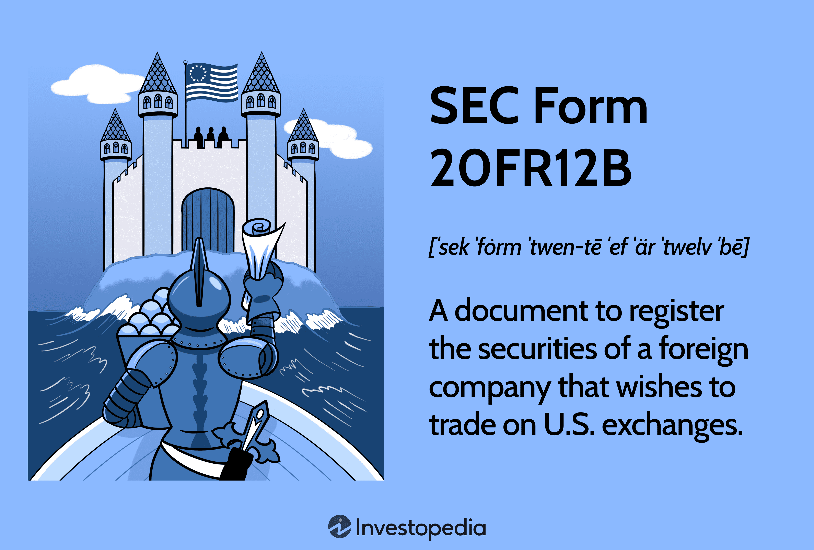

In the constantly evolving world of finance, having a comprehensive understanding of financial regulations and reporting requirements is crucial, especially for Canadian companies engaging with U.S. markets. One key regulatory requirement is the SEC Form 40-F, which serves as a cornerstone for Canadian firms that issue securities in the United States. This form not only ensures compliance with U.S. Securities and Exchange Commission (SEC) regulations but also plays a pivotal role in maintaining transparency and providing detailed financial information to investors.

SEC Form 40-F, akin to the Form 10-K for American companies, demands a broad disclosure of strategic objectives, market performance, and financial statements. For Canadian companies, filing this annual report is indispensable to accessing the substantial U.S. market, fostering financial growth and investor confidence. As such, the intricacies of Form 40-F are vital for business planning and strategic alignment with market expectations and legal requirements.

Moreover, the intersection of financial reporting and technology has given rise to automated algorithmic trading—systems that capitalize on financial data, such as those found in Form 40-F. Algorithmic trading, which uses pre-programmed criteria for executing trade orders, thrives on the rapid interpretation of detailed and timely financial disclosures. This synergy not only enhances market liquidity but also reduces trading costs, thus supporting more efficient and informed investor decision-making.

This article examines the importance of SEC Form 40-F for Canadian companies trading in the U.S. and explores how accurate financial reporting interfaces with advancements in algorithmic trading, providing a framework for evaluating the evolving financial landscape and its implications for investor strategies.

## Table of Contents

## Understanding SEC Form 40-F

SEC Form 40-F serves as an essential annual filing requirement for Canadian companies with securities registered in the United States, analogous to the Form 10-K used by American companies. It is integral for companies participating in U.S. markets to complete this form due to its comprehensive nature, ensuring transparency and alignment with regulatory standards imposed by the U.S. Securities and Exchange Commission (SEC).

The form is composed of several key sections that provide a holistic view of the company's operations and financial health. A detailed business overview is included, outlining the company's strategic objectives, the markets it serves, and prevailing industry dynamics. This information aids investors and regulatory bodies in understanding the company's position and potential in the market.

Financial statements form a critical component of SEC Form 40-F, offering insights into the company's financial performance. These statements typically include the balance sheet, income statement, and cash flow statement, which are essential for evaluating the financial stability and profitability of the company. Detailed notes accompanying these financial statements offer further clarity on accounting policies, financial risks, and any changes in financial practices.

Another significant aspect of Form 40-F is the Management Discussion and Analysis (MD&A) section. This part provides a narrative from the company's management, analyzing financial results from previous fiscal years and offering insights into the company's performance and strategic direction. The MD&A section is invaluable for stakeholders, as it presents management's perspective on financial outcomes, challenges, and forward-looking strategies.

Overall, the submission of SEC Form 40-F enhances corporate transparency and accountability, aligning Canadian companies with the stringent reporting requirements expected within the U.S. financial markets. This alignment is crucial for maintaining investor confidence and ensuring compliance with regulatory expectations.

## Key Components of SEC Form 40-F

SEC Form 40-F is a crucial document for Canadian companies trading in the U.S., serving as a detailed annual report that offers transparent and comprehensive information to investors and regulatory bodies. Three key components of SEC Form 40-F are the business overview, Management Discussion and Analysis (MD&A), and the risks section.

The business overview section provides a broad description of the company's strategy, including its long-term objectives and the tactics employed to achieve them. It outlines the markets served and provides context on the company's position within its industry. This section typically addresses competition, product or service innovation, and any unique factors that distinguish the company from its peers. By offering a clear outline of its strategic direction, the company helps investors understand its future growth potential and competitive advantage.

The MD&A section provides a thorough analysis of the company's financial performance over the previous fiscal years. This part of the form is essential as it allows management to offer insights into the financial results, including an explanation of the core components affecting revenue, expenses, and profitability. In addition, it can cover non-financial metrics that are critical to the business's success. This section helps investors and analysts assess the company's financial health and management's effectiveness in steering the business through past challenges and opportunities.

The risks section identifies and elaborates on potential threats that could have significant implications on the company's financial outcomes. These risks could be internal, such as operational inefficiencies or strategic misalignments, or external, including macroeconomic factors, regulatory changes, or industry-specific challenges. By outlining these risks, the company provides investors with a realistic view of potential hurdles that could impact future performance.

Collectively, these components are integral to SEC Form 40-F, offering a holistic view of a company's operational and financial landscape, which is indispensable for making informed investment decisions.

## Mandatory Filing Requirements

To adhere to the mandatory filing requirements for SEC Form 40-F, Canadian companies seeking to trade securities in U.S. markets must first ensure they meet several key conditions. One of the primary requirements is that these companies must maintain a minimum of $75 million in equity securities registered in the United States. This threshold ensures that only companies of substantial financial standing engage with the U.S. securities market, promoting stability and reducing investor risk.

Additionally, it is necessary for these companies to have a track record of reporting to Canadian regulatory authorities for no less than 12 months. This stipulation aligns with the need for consistent and reliable financial disclosures and assures that the entities are accountable and experienced in formal financial reporting.

Maintaining timely updates and submissions of the SEC Form 40-F is critical not only for compliance but also for sustaining investor confidence. Regular and punctual filing illustrates the company's commitment to transparency and adherence to regulatory standards, which can significantly impact investor perceptions and trust.

By strictly conforming to these requirements, Canadian companies can enhance their standing with investors and ensure ongoing eligibility to capitalize on opportunities within the substantial U.S. securities market. These measures help maintain an orderly and efficient market, providing a strong foundation for investor confidence and corporate accountability.

## Algorithmic Trading and Financial Reporting

Algorithmic trading leverages automated software systems to execute trade orders at optimal speeds based on pre-determined criteria. These systems thrive on the timely and detailed financial information provided by reports such as the SEC Form 40-F. This form—essential for Canadian companies trading in the U.S.—provides comprehensive financial data which [algorithmic trading](/wiki/algorithmic-trading) systems analyze to make swift and informed trading decisions.

The core advantage of algorithmic trading lies in its ability to process and act upon vast quantities of financial data almost instantaneously. Financial reports, like the SEC Form 40-F, which include extensive financial statements and market analysis, are particularly valuable. The data extracted from these reports enables algorithms to detect patterns and execute trades with a speed and accuracy unattainable through manual processes.

Algorithmic trading's efficiency also contributes to market [liquidity](/wiki/liquidity-risk-premium). By processing transactions at high speeds, these systems ensure a continuous flow of trades, thereby enhancing market depth and narrowing bid-ask spreads. This increased liquidity benefits all market participants by making it easier to buy and sell securities without causing significant price fluctuations.

Moreover, algorithmic trading helps reduce trading costs. By minimizing the manual intervention required and optimizing the timing of trades, algorithms can lower transaction costs. The matching of buy and sell orders through pre-set criteria reduces market impact and slippage, ensuring trades are executed at near-optimal prices.

As technological capabilities advance, understanding the synergy between precise financial reporting and algorithmic trading becomes increasingly critical. Accurate and timely disclosures ensure that algorithmic systems can function correctly, as these systems rely on up-to-date and verified information to execute trades that reflect true market positions.

In conclusion, algorithmic trading represents a significant evolution in financial markets, driven by comprehensive data interpretation from reports such as SEC Form 40-F. This integration of advanced technology and precise financial reporting supports efficient market operations, offering substantial benefits in terms of liquidity and cost reduction. For Canadian companies operating within the U.S., maintaining high standards of financial disclosure is essential to leverage these technological advancements effectively.

## Impacts on Canadian Companies

Filing SEC Form 40-F provides Canadian companies with significant opportunities to engage with the U.S. market. This engagement is crucial for financial growth, offering access to a larger investor base and enhancing [capital raising](/wiki/hedge-fund-capital-raising) potential. By complying with rigorous reporting standards set by the U.S. Securities and Exchange Commission (SEC), Canadian firms affirm their dedication to transparency and accountability, thereby solidifying their credibility among investors.

The comprehensive nature of SEC Form 40-F ensures that all pertinent business information, including strategy, financial performance, and market risks, is systematically disclosed. This transparency is vital in maintaining investor trust and can lead to increased investment as stakeholders are better informed about the company's operations and potential risks.

Furthermore, timely and accurate filings of SEC Form 40-F are essential for Canadian companies to reap the advantages of algorithmic trading. Algorithmic trading relies heavily on precise and prompt data to make informed trading decisions. Complete and punctual financial disclosures allow algorithms to more effectively interpret and act upon the company's market data, enhancing liquidity and reducing trading costs.

Strategically aligning business operations with market demands is increasingly facilitated by the integration of financial reporting and automated trading technologies. This alignment allows companies to react swiftly to market changes and investor needs, keeping them competitive in the ever-evolving financial landscape. By ensuring the accuracy and timeliness of their SEC Form 40-F filings, Canadian firms can better harness algorithmic trading's potential, positioning themselves advantageously within the U.S. market.

## Conclusion

SEC Form 40-F serves as a critical instrument for Canadian companies participating in U.S. markets, signifying their commitment to transparency, compliance, and rigorous reporting standards. The role of this form becomes increasingly significant with the growing prevalence of algorithmic trading. Automated trading systems rely heavily on accurate and timely financial reporting to enhance market liquidity and lower transaction costs, thus amplifying the importance of precise and prompt disclosures. As these technologies become more integrated into financial markets, understanding the interplay between financial reporting accuracy and algorithmic trading efficiency becomes vital.

Staying informed about evolving financial reporting requirements and technological advancements is essential for Canadian companies to maintain a competitive edge worldwide. Embracing these innovations allows firms not only to comply with regulatory expectations but also to capitalize on emerging opportunities by facilitating better investment decisions and strategic planning. As the financial landscape continues to transform, integrating thorough financial reporting with advanced trading technologies will be fundamental to achieving sustained growth and market success.

## References & Further Reading

[1]: Securities and Exchange Commission. (2005). ["Form 40-F."](https://www.sec.gov/files/form40-f.pdf) U.S. Securities and Exchange Commission.

[2]: Securities and Exchange Commission. ["Fast Answers: Form 40-F."](https://www.sec.gov/files/form40-f.pdf) U.S. Securities and Exchange Commission.

[3]: Lopez de Prado, M. (2018). ["Advances in Financial Machine Learning."](https://www.amazon.com/Advances-Financial-Machine-Learning-Marcos/dp/1119482089) John Wiley & Sons.

[4]: Jansen, S. (2018). ["Machine Learning for Algorithmic Trading."](https://github.com/stefan-jansen/machine-learning-for-trading) Packt Publishing.

[5]: Chan, E. P. (2009). ["Quantitative Trading: How to Build Your Own Algorithmic Trading Business."](https://github.com/ftvision/quant_trading_echan_book) John Wiley & Sons.

[6]: Aronson, D. R. (2006). ["Evidence-Based Technical Analysis: Applying the Scientific Method and Statistical Inference to Trading Signals."](https://www.amazon.com/Evidence-Based-Technical-Analysis-Scientific-Statistical/dp/0470008741) John Wiley & Sons.