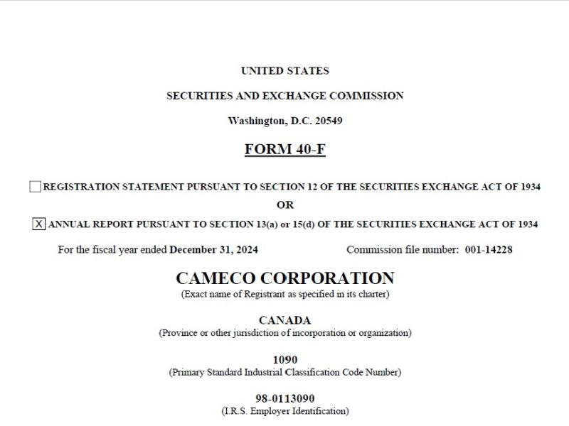

## Table of Contents

## What is SEC Form 40-F?

SEC Form 40-F is a document that certain Canadian companies need to file with the U.S. Securities and Exchange Commission (SEC). These companies are usually listed on both Canadian and American stock exchanges. The form helps the SEC keep track of important information about these companies, like their financial performance and any major changes in their business.

The form is similar to the annual report that U.S. companies file, which is called Form 10-K. By filing Form 40-F, Canadian companies can meet the SEC's requirements without having to prepare a separate U.S.-specific report. This makes it easier for them to comply with regulations in both countries and keeps investors informed about the company's status.

## Who is required to file SEC Form 40-F?

SEC Form 40-F is required to be filed by certain Canadian companies that are listed on U.S. stock exchanges. These companies need to meet specific criteria set by the SEC. The main requirement is that the company must be subject to the reporting requirements of the Canadian securities regulatory authority. This means they already provide detailed financial information to Canadian regulators.

These companies can use Form 40-F to fulfill their annual reporting obligations to the SEC. By doing this, they don't have to prepare a separate annual report for the U.S. market. This makes it easier for them to comply with regulations in both countries. It also helps keep investors informed about the company's financial health and any significant changes in its operations.

## What is the purpose of filing SEC Form 40-F?

The main purpose of filing SEC Form 40-F is to help Canadian companies that are listed on U.S. stock exchanges meet the reporting requirements of the U.S. Securities and Exchange Commission (SEC). By filing this form, these companies can share important information about their financial performance and any major changes in their business with U.S. investors. This is important because it helps keep the investors informed and ensures that the companies are transparent about their operations.

Form 40-F makes it easier for Canadian companies to comply with regulations in both the U.S. and Canada. Instead of having to prepare a separate annual report for the U.S. market, they can use the information they already provide to Canadian regulators. This saves time and effort for the companies and helps maintain consistency in the information provided to investors in both countries.

## How does SEC Form 40-F differ from other SEC forms like 10-K or 20-F?

SEC Form 40-F is specifically for Canadian companies listed on U.S. stock exchanges. It's like a special pass that lets them use the financial reports they already give to Canadian regulators instead of making a new one just for the U.S. This makes things easier for these companies because they don't have to do extra work to meet U.S. rules. On the other hand, Form 10-K is what U.S. companies use for their annual reports. It's a detailed report that U.S. companies have to file every year to tell investors about their financial health and any big changes in their business.

Form 20-F is used by foreign companies that are not from Canada but are listed on U.S. stock exchanges. Like Form 40-F, it's an annual report, but it's for companies from countries other than Canada. This form helps these foreign companies meet U.S. reporting rules. So, while Form 40-F is for Canadian companies, Form 20-F is for companies from other countries, and Form 10-K is for U.S. companies. Each form helps make sure that investors get the information they need, but they are tailored to different types of companies.

## What are the key components of SEC Form 40-F?

SEC Form 40-F has several important parts that help U.S. investors understand the financial health and operations of Canadian companies listed on U.S. stock exchanges. One key component is the financial statements, which include the company's balance sheet, income statement, and cash flow statement. These statements give a clear picture of the company's financial performance over the past year. Another important part is the management's discussion and analysis (MD&A), where the company's leaders explain their financial results, talk about any big changes in the business, and discuss future plans. This helps investors understand what's going on behind the numbers.

In addition to financial details, Form 40-F also includes information about the company's governance and any legal issues it might be facing. This part of the form lists the company's directors and officers, and it talks about any lawsuits or regulatory actions that could affect the company. It's important for investors to know about these things because they can impact the company's future. Finally, the form also has sections for any other information that the company thinks is important for investors to know, like changes in accounting practices or major business deals. All these parts together help investors make informed decisions about whether to buy, sell, or hold the company's stock.

## What are the filing deadlines for SEC Form 40-F?

Canadian companies that are listed on U.S. stock exchanges need to file SEC Form 40-F within 90 days after the end of their fiscal year. This means if their fiscal year ends on December 31, they have until March 30 of the next year to file the form. This deadline helps make sure that investors get the latest information about the company's financial health and any big changes in its business in a timely manner.

If a company needs more time to file, they can ask the SEC for an extension. They do this by filing Form 12b-25, which gives them an extra 15 days to submit their Form 40-F. This can be helpful if the company is still working on their financial statements or if there are other reasons that make it hard to meet the original deadline. But, they need to have a good reason for asking for more time, and they should let investors know about the delay.

## Can amendments be made to SEC Form 40-F, and if so, how?

Yes, amendments can be made to SEC Form 40-F if a company needs to update or correct information after the original filing. If a company finds a mistake or wants to add new information, they can file an amendment using Form 40-F/A. This form is specifically for making changes to the original Form 40-F. The company needs to explain what they are changing and why, making sure that investors get the most accurate and up-to-date information.

To file an amendment, the company submits Form 40-F/A to the SEC. They include the updated information and clearly mark the changes from the original filing. This helps keep everything transparent and ensures that investors have the latest details about the company's financial health and any significant changes in its operations.

## What are the common challenges companies face when preparing SEC Form 40-F?

One common challenge companies face when preparing SEC Form 40-F is making sure all the financial information is correct and complete. This can be tough because they need to follow both Canadian and U.S. accounting rules. Sometimes, these rules are different, so the company has to make sure their financial statements meet both sets of standards. It can take a lot of time and effort to get everything right, especially if there are any last-minute changes or if they need to fix any mistakes.

Another challenge is meeting the filing deadline. Companies have to file Form 40-F within 90 days after the end of their fiscal year. This can be stressful, especially if they are still working on their financial statements or if something unexpected happens. If they can't meet the deadline, they might need to ask for an extension, which adds more work and can make investors worried about delays. Keeping everything on track and making sure all the information is ready on time is a big job for the company's team.

## How does the SEC review and process Form 40-F submissions?

When a Canadian company files SEC Form 40-F, the SEC reviews the submission to make sure it meets all the rules. They look at the financial statements, the management's discussion and analysis, and any other important information to check if everything is correct and complete. The SEC might ask the company for more information or clarification if they find something that doesn't seem right. This process helps make sure that investors get accurate and reliable information about the company.

After the SEC reviews the form, they make it available to the public through their online database called EDGAR. This way, anyone can look at the company's financial information and learn about any big changes in its business. If the company needs to make any changes or corrections after the initial filing, they can file an amendment using Form 40-F/A. The SEC will review these amendments too, to keep the information up to date and accurate for investors.

## What are the implications of non-compliance with SEC Form 40-F filing requirements?

If a Canadian company listed on U.S. stock exchanges doesn't file SEC Form 40-F on time or correctly, they can face serious problems. The SEC might start an investigation to find out why the company didn't follow the rules. This can lead to fines or other penalties, which can be expensive and bad for the company's reputation. Investors might also lose trust in the company, which can make the stock price go down and make it harder for the company to raise money in the future.

Not filing Form 40-F properly can also cause legal issues. The company might get sued by investors who think they were hurt because they didn't get the right information. This can lead to more fines and legal costs. It's really important for companies to follow the SEC's rules to avoid these problems and keep their investors happy and informed.

## How has the requirement for SEC Form 40-F evolved over time?

The requirement for SEC Form 40-F has changed over the years to make it easier for Canadian companies to report to the U.S. Securities and Exchange Commission (SEC). In the past, these companies had to file a lot of different forms to meet U.S. rules, which was hard and took a lot of time. But in 1991, the SEC made a new rule called the Multijurisdictional Disclosure System (MJDS). This rule let Canadian companies use the information they already gave to Canadian regulators to meet U.S. requirements, which saved them a lot of work.

Since then, the SEC has kept updating the rules to make them even simpler. For example, they made changes to let companies file their Form 40-F electronically, which made things faster and easier. The SEC also keeps an eye on how well the MJDS is working and makes small changes to make sure Canadian companies can keep using it without any problems. This way, the companies can focus more on their business instead of spending too much time on paperwork.

## What advanced strategies can be used to optimize the preparation and filing of SEC Form 40-F?

To optimize the preparation and filing of SEC Form 40-F, Canadian companies can start by using technology to make things easier. They can use special software that helps them keep track of all their financial information and make sure it follows both Canadian and U.S. rules. This software can also help them spot any mistakes early, so they don't have to rush to fix things at the last minute. Another good idea is to have a team that works together all year long, not just at the end of the year. This team can keep an eye on the company's financials and make sure everything is ready for the Form 40-F filing well before the deadline.

Another strategy is to plan ahead and set up a clear schedule for getting all the information ready. Companies can break down the work into smaller parts and assign different tasks to different people. This way, everyone knows what they need to do and when, which helps avoid any last-minute stress. It's also a good idea to talk to experts who know a lot about SEC rules. These experts can give advice on how to make the filing process smoother and help the company avoid any problems with the SEC. By using these strategies, companies can make sure they file their Form 40-F on time and correctly, which keeps their investors happy and avoids any trouble with the SEC.

## References & Further Reading

[1]: Securities and Exchange Commission. (2005). ["Form 40-F."](https://www.sec.gov/files/form40-f.pdf) U.S. Securities and Exchange Commission.

[2]: Securities and Exchange Commission. ["Fast Answers: Form 40-F."](https://www.sec.gov/files/form40-f.pdf) U.S. Securities and Exchange Commission.

[3]: Lopez de Prado, M. (2018). ["Advances in Financial Machine Learning."](https://www.amazon.com/Advances-Financial-Machine-Learning-Marcos/dp/1119482089) John Wiley & Sons.

[4]: Jansen, S. (2018). ["Machine Learning for Algorithmic Trading."](https://github.com/stefan-jansen/machine-learning-for-trading) Packt Publishing.

[5]: Chan, E. P. (2009). ["Quantitative Trading: How to Build Your Own Algorithmic Trading Business."](https://github.com/ftvision/quant_trading_echan_book) John Wiley & Sons.

[6]: Aronson, D. R. (2006). ["Evidence-Based Technical Analysis: Applying the Scientific Method and Statistical Inference to Trading Signals."](https://www.amazon.com/Evidence-Based-Technical-Analysis-Scientific-Statistical/dp/0470008741) John Wiley & Sons.