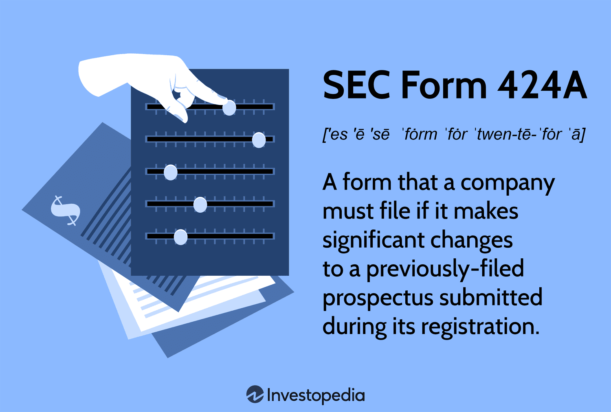

## Table of Contents

## What is SEC Form 424A?

SEC Form 424A is a document that companies file with the U.S. Securities and Exchange Commission (SEC). It is used when a company wants to sell new securities, like stocks or bonds, to the public. The form includes important details about the securities being offered, such as the price, the number of securities available, and the risks involved in buying them. This helps investors make informed decisions about whether to buy the securities.

The form is part of the registration statement that companies must file before they can sell securities to the public. It is often used as a prospectus, which is a document given to potential investors that explains the investment opportunity. By providing clear and detailed information, SEC Form 424A helps ensure that the securities market operates fairly and transparently, protecting both the company and the investors.

## Who needs to file SEC Form 424A?

SEC Form 424A needs to be filed by companies that want to sell new securities, like stocks or bonds, to the public. This form is part of the registration process that companies must go through before they can offer their securities for sale. It's important because it helps make sure that the information given to potential investors is clear and complete.

The form is usually filed by the company itself, but sometimes it can be filed by the underwriters who help the company sell the securities. Underwriters are like middlemen who help manage the sale of new securities. By filing Form 424A, the company and the underwriters make sure that everyone who might want to buy the securities has all the information they need to make a good decision.

## What is the purpose of filing SEC Form 424A?

The purpose of filing SEC Form 424A is to provide important information to people who might want to buy new securities, like stocks or bonds. When a company wants to sell these securities to the public, they have to tell everyone about the price, how many securities they are selling, and any risks involved. This form helps make sure that everyone has the same information so they can decide if they want to buy the securities or not.

By filing SEC Form 424A, companies follow the rules set by the U.S. Securities and Exchange Commission (SEC). This helps keep the market fair and open for everyone. The form is often used as a prospectus, which is a document that explains the investment to potential buyers. This way, investors can make smart choices, and the company can sell their securities in a clear and honest way.

## How does SEC Form 424A differ from other SEC forms?

SEC Form 424A is different from other SEC forms because it is specifically used when a company wants to sell new securities to the public. It includes detailed information about the securities, such as the price, the number available, and the risks involved. This form is part of the registration statement that companies must file before they can offer their securities for sale. Unlike other forms that might be used for different purposes, like reporting financial changes or insider trading, Form 424A focuses on providing potential investors with all the information they need to make a decision about buying the securities.

Another way SEC Form 424A differs from other forms is that it is often used as a prospectus. A prospectus is a document given to potential investors that explains the investment opportunity in detail. While other SEC forms, like Form 10-K or Form 8-K, are used for annual reports or to report significant events, Form 424A is specifically designed to help investors understand the securities being offered. This helps ensure that the market operates fairly and transparently, protecting both the company and the investors by making sure everyone has the same information.

## What information is required on SEC Form 424A?

SEC Form 424A includes important details about new securities a company wants to sell to the public. This form tells people about the price of the securities, how many are available, and how long the offer will last. It also explains the risks involved in buying these securities, so people can make smart choices. The form makes sure everyone who might want to buy the securities has all the information they need.

The form also includes information about the company itself, like its business, financial situation, and any legal problems it might have. This helps people understand what they are investing in. SEC Form 424A is often used as a prospectus, which is a document that explains the investment opportunity in detail. By providing all this information, the form helps keep the market fair and open for everyone.

## When must SEC Form 424A be filed?

SEC Form 424A must be filed with the U.S. Securities and Exchange Commission (SEC) before a company can sell new securities to the public. This form needs to be submitted after the company has filed its initial registration statement but before the securities are actually offered for sale. The timing is important because it makes sure that all the information about the securities is available to potential investors before they make any decisions.

The exact timing can depend on the specific rules set by the SEC and the details of the company's offering. Usually, the form is filed close to the time when the securities are going to be sold. This helps keep the information up-to-date and ensures that everyone who might want to buy the securities has the latest details about the price, the number of securities available, and any risks involved.

## What are the consequences of not filing SEC Form 424A on time?

If a company doesn't file SEC Form 424A on time, they could get in trouble with the SEC. The SEC makes rules to keep the market fair and honest, and if a company doesn't follow these rules, they might have to pay fines or face other punishments. This is because not filing on time can mean that people who want to buy the securities don't get all the information they need, which can lead to unfair situations.

Not filing SEC Form 424A on time can also delay the company's plans to sell their new securities. If the form is late, the company might not be able to go ahead with their sale until everything is in order. This can be a big problem because it can mess up the company's plans and make it harder for them to raise the money they need.

## How can one access SEC Form 424A filings?

You can access SEC Form 424A filings by visiting the SEC's official website, which is called EDGAR (Electronic Data Gathering, Analysis, and Retrieval system). On the EDGAR website, you can search for the company you are interested in by typing its name into the search bar. Once you find the company, you can look through their list of filings and find the one labeled as Form 424A. This form will give you all the details about the new securities the company is selling.

Another way to access SEC Form 424A filings is through financial news websites and databases that track SEC filings. These websites often have search tools that let you find the form by entering the company's name or the date of the filing. Some of these services might require a subscription, but they can be very helpful if you need to keep up with a lot of different companies and their filings.

## What are some common mistakes to avoid when filing SEC Form 424A?

When filing SEC Form 424A, one common mistake to avoid is not providing all the required information. The form needs to include details about the price of the securities, how many are available, and any risks involved. If any of this information is missing or not clear, it can cause problems. The SEC might not accept the filing, and it could delay the company's plans to sell the securities. It's important to double-check everything to make sure all the necessary details are included and easy to understand.

Another mistake to watch out for is filing the form too late. SEC Form 424A needs to be filed before the securities are offered for sale. If it's late, the company might get in trouble with the SEC and could face fines or other penalties. Also, a late filing can delay the sale of the securities, which can mess up the company's plans and make it harder to raise money. It's a good idea to plan ahead and make sure the form is filed on time to avoid these issues.

## How has the filing process for SEC Form 424A evolved over time?

The filing process for SEC Form 424A has changed a lot over the years, especially with the help of technology. In the past, companies had to file paper forms with the SEC, which could take a long time and was not very efficient. But now, thanks to the internet and the SEC's EDGAR system, companies can file their forms electronically. This makes the process much faster and easier. Companies can now submit their Form 424A online, and it gets shared with the public right away, making the whole process more transparent and efficient.

Another big change is how easy it is for people to access these filings. Before, if you wanted to see a company's Form 424A, you might have to go to the SEC's office or wait for a mailed copy. Now, anyone with an internet connection can go to the EDGAR website and look up any company's filings, including Form 424A. This change has made it simpler for investors to get the information they need to make smart decisions. Overall, these improvements have made the filing process for SEC Form 424A more streamlined and accessible to everyone.

## What are the best practices for ensuring compliance with SEC Form 424A requirements?

To make sure you follow the rules for filing SEC Form 424A, it's important to be very careful and thorough. Start by double-checking that all the required information is included in the form. This means you need to list the price of the securities, how many are available, and any risks involved. Make sure everything is clear and easy to understand so that potential investors can make good decisions. If anything is missing or not clear, the SEC might not accept the filing, which could delay your plans to sell the securities.

Another good practice is to file the form on time. SEC Form 424A needs to be submitted before the securities are offered for sale. Filing late can lead to fines or other penalties from the SEC, and it can also mess up your plans to raise money. To avoid these problems, plan ahead and make sure you know the deadlines. Using the SEC's EDGAR system to file electronically can help make the process faster and more efficient. By being thorough and timely, you can ensure that you comply with the SEC's requirements for Form 424A.

## How do regulatory changes impact the filing of SEC Form 424A?

Regulatory changes can affect how companies file SEC Form 424A. When the SEC makes new rules or updates old ones, companies need to follow these changes carefully. For example, if the SEC decides that more information needs to be included in the form, companies have to make sure they add this information before filing. If they don't, they might get in trouble or have to delay their plans to sell securities. Staying up-to-date with these changes is important to keep everything running smoothly.

Changes in regulations can also change the deadlines for filing SEC Form 424A. If the SEC decides to shorten the time companies have to file the form, companies need to adjust their schedules to meet these new deadlines. Not filing on time can lead to fines or other problems. So, it's a good idea for companies to keep an eye on any regulatory updates and make sure they understand how these changes affect their filing process.

## References & Further Reading

[1]: ["SEC.gov | Forms - Securities and Exchange Commission"](https://www.sec.gov/submit-filings/forms-index) - The official SEC webpage that provides comprehensive information about forms and regulations, including SEC Form 424A.

[2]: ["U.S. Securities and Exchange Commission | The Investor's Advocate: How the SEC Protects Investors, Maintains Market Integrity, and Facilitates Capital Formation"](https://www.ajpe.org/article/S0002-9459(23)03524-6/fulltext) - An overview of the SEC's role within the financial markets.

[3]: ["Advances in Financial Machine Learning"](https://www.amazon.com/Advances-Financial-Machine-Learning-Marcos/dp/1119482089) by Marcos Lopez de Prado – A book exploring methods for systematically learning from financial data.

[4]: Nantell, T. J. (1985). ["Amendments and Supplemental Prospectuses: Are They Effective?"](https://krannert.purdue.edu/faculty/mcconnell/publications/corporate-combinations-common-stock-1985-vol40.pdf) Journal of Financial Economics. An academic paper discussing the effectiveness of amendments like those made through SEC Form 424A.

[5]: ["Quantitative Trading: How to Build Your Own Algorithmic Trading Business"](https://www.amazon.com/Quantitative-Trading-Build-Algorithmic-Business/dp/1119800064) by Ernest P. Chan – A guide to understanding and implementing algorithmic trading strategies.

[6]: ["High-Frequency Trading: A Practical Guide to Algorithmic Strategies and Trading Systems"](https://www.ahmetbeyefendi.com/wp-content/uploads/2020/07/High-Frequency-Trading-Irene-Aldridge.pdf) by Irene Aldridge – This book provides insights into high-frequency and algorithmic trading systems.

[7]: Porter, G. E. (1995). ["The Impact of SEC Form 424B Filings on the Information Environment of Issuing Firms"](https://www.aeaweb.org/articles?id=10.1257/jep.9.4.97) Journal of Accounting Research. This paper examines how SEC forms influence the informational environment for firms.