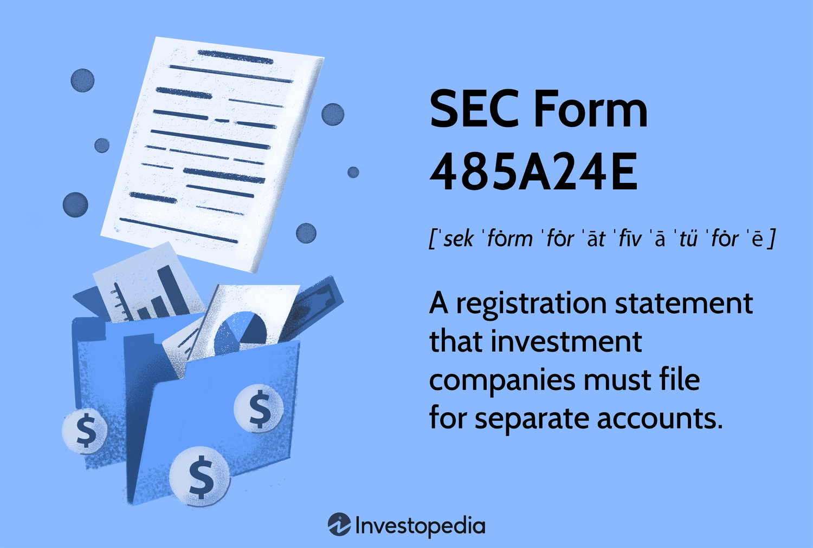

## Table of Contents

## What is SEC Form 485A24E?

SEC Form 485A24E is a document that investment companies file with the U.S. Securities and Exchange Commission (SEC). It is used to register new securities or to update information about existing securities. This form is important because it helps the SEC keep track of what investment companies are doing and make sure they are following the rules.

When an investment company wants to make changes to its securities, like changing how they are sold or what they invest in, they need to fill out and submit this form. By doing this, they let the SEC and investors know about these changes. This helps keep everything transparent and fair for everyone involved.

## Who is required to file SEC Form 485A24E?

Investment companies are the ones who need to file SEC Form 485A24E. These companies manage funds like mutual funds or exchange-traded funds (ETFs). They use this form to tell the SEC about new securities they want to offer or to update information about securities they already have.

The form is important because it helps the SEC make sure that investment companies are following the rules. When these companies want to change something about their securities, like how they are sold or what they invest in, they need to fill out this form. This keeps everything clear and fair for everyone, including the investors who put their money into these funds.

## What is the purpose of filing SEC Form 485A24E?

The purpose of filing SEC Form 485A24E is to let the SEC know about new securities that investment companies want to offer or to update information about securities they already have. This form helps the SEC keep track of what investment companies are doing and make sure they follow the rules.

When an investment company wants to change something about their securities, like how they are sold or what they invest in, they need to fill out this form. This keeps everything clear and fair for everyone, including the investors who put their money into these funds. By using SEC Form 485A24E, investment companies make sure that the SEC and investors are always up to date with any changes.

## How does SEC Form 485A24E differ from other SEC forms?

SEC Form 485A24E is specifically used by investment companies to register new securities or update information about existing ones. It's different from other SEC forms because it focuses on the details of securities that investment companies manage, like mutual funds or ETFs. This form is important for keeping the SEC and investors informed about changes in how securities are sold or what they invest in.

Other SEC forms serve different purposes. For example, Form 10-K is used by publicly traded companies to provide a detailed annual report about their financial performance and operations. Form 4, on the other hand, is used by company insiders to report their transactions in the company's stock. Unlike these, Form 485A24E is tailored to the needs of investment companies and their securities, making sure that any changes or new offerings are properly documented and communicated.

## What are the key components of SEC Form 485A24E?

SEC Form 485A24E includes several important parts that help the SEC understand what investment companies are doing with their securities. The form starts with basic information about the investment company, like its name and address. It then goes into details about the securities, including what they are, how they will be sold, and any changes that are being made to them. This part is important because it helps the SEC see if everything is being done correctly.

Another key part of the form is the section about the investment objectives and strategies. This tells the SEC and investors what the securities aim to achieve and how they plan to do it. The form also includes financial statements and other important documents that show the company's financial health. By including all these parts, SEC Form 485A24E makes sure that everyone has a clear picture of what's going on with the securities.

## What are the deadlines for filing SEC Form 485A24E?

Investment companies need to file SEC Form 485A24E before they start selling new securities or making big changes to existing ones. This means they have to send the form to the SEC before they do anything new with their securities. This helps the SEC make sure everything is okay before the company moves forward.

The exact deadline can depend on the type of change being made. If it's a new security, the company usually has to file the form at least 75 days before they want to start selling it. For updates to existing securities, the deadline might be different, but it's always important to file the form well before making any changes. This gives the SEC time to look over the information and make sure the company is following the rules.

## How can one access SEC Form 485A24E filings?

You can find SEC Form 485A24E filings on the SEC's website, which is called EDGAR. EDGAR stands for Electronic Data Gathering, Analysis, and Retrieval. You just go to the SEC's website, type in the name of the investment company you're looking for, and search for their filings. Once you find the company, you can look through their documents to find Form 485A24E.

If you want to see these forms without going to the SEC's website, some other websites also have this information. Websites like Morningstar or Bloomberg might have copies of these filings. You can search for the investment company on these sites, and they will show you the forms that the company has filed with the SEC. This can be a helpful way to see the information without going directly to the SEC's site.

## What are the common mistakes to avoid when filing SEC Form 485A24E?

When filing SEC Form 485A24E, it's important to be careful and make sure all the information is correct. A common mistake is not filling out all the required sections. The form asks for a lot of details about the securities, like what they are, how they will be sold, and any changes being made. If you miss any part, the SEC might not accept the form, and you'll have to do it again. Another mistake is not giving clear and accurate information about the investment objectives and strategies. This part is important because it tells the SEC and investors what the securities aim to achieve and how they plan to do it.

Another thing to watch out for is not including the right financial statements and other documents. These show the company's financial health and are a big part of the form. If they are missing or not correct, the SEC will likely ask for them again, which can delay the whole process. Also, make sure to file the form on time. If it's for a new security, you usually need to file at least 75 days before you want to start selling it. For updates to existing securities, the timing can be different, but it's always important to file well before making any changes. Missing these deadlines can cause problems and slow things down.

## How has the SEC Form 485A24E evolved over time?

SEC Form 485A24E has changed over time to keep up with new rules and needs in the investment world. When it first started, the form was pretty simple and just asked for basic info about new securities or changes to old ones. But as more people started investing in things like mutual funds and ETFs, the SEC needed more details to make sure everything was fair and clear. So, they added more sections to the form to ask about things like investment strategies, how securities are sold, and what risks there might be.

Today, SEC Form 485A24E is a lot more detailed than it used to be. It now includes parts for financial statements, which show how healthy the company is, and other important documents. The form also has to be filed earlier than before, giving the SEC more time to check everything. These changes help make sure that investors get all the info they need and that companies follow the rules.

## What are the penalties for non-compliance with SEC Form 485A24E filing requirements?

If an investment company does not file SEC Form 485A24E correctly or on time, they could face penalties from the SEC. These penalties can include fines, which are like a punishment in the form of money that the company has to pay. The fines can be pretty big, depending on how serious the mistake is and if the company did it on purpose. The SEC might also stop the company from selling new securities until they fix the problem. This can hurt the company's business because they can't bring new products to investors.

Besides fines and stopping sales, the SEC could take other actions against the company. They might start an investigation to see if the company broke other rules too. If they find more problems, the penalties could get worse. The company might have to change how they do things or even face legal action. All of this can make it hard for the company to keep doing business and can damage their reputation with investors.

## How does SEC Form 485A24E impact investors?

SEC Form 485A24E helps keep investors safe by making sure they know what's going on with the securities they're investing in. When an investment company wants to start selling new securities or make changes to old ones, they have to tell the SEC about it using this form. This means investors get all the important details about what they're putting their money into, like the goals of the securities and any risks involved. By having this information, investors can make smarter choices about where to invest their money.

If an investment company doesn't follow the rules about filing SEC Form 485A24E, it can cause problems for investors. The SEC might fine the company or stop them from selling new securities, which can affect the value of the investments people already have. When companies don't give clear and honest information, it can hurt investors because they might not know the full story about their investments. So, this form is really important for keeping everything fair and open for everyone who's investing.

## What advanced strategies can be used to optimize the filing of SEC Form 485A24E?

To optimize the filing of SEC Form 485A24E, investment companies can start by using technology to help them. They can use special software that makes it easier to fill out the form correctly and on time. This software can check the form for any mistakes and make sure all the required parts are filled out. It can also keep track of the deadlines so the company doesn't miss them. By using technology, companies can save time and make sure they follow the rules better.

Another strategy is to have a good team working on the form. This team should include people who know a lot about the rules and can explain them clearly. They can also keep up with any changes to the rules and make sure the form is always up to date. It's helpful to have someone on the team who is really good at organizing and can make sure everything gets done on time. By having the right people working together, companies can make the filing process smoother and avoid mistakes that could cause problems with the SEC.

## References & Further Reading

[1]: Bergstra, J., Bardenet, R., Bengio, Y., & Kégl, B. (2011). ["Algorithms for Hyper-Parameter Optimization."](https://dl.acm.org/doi/10.5555/2986459.2986743) Advances in Neural Information Processing Systems 24.

[2]: ["Advances in Financial Machine Learning"](https://www.amazon.com/Advances-Financial-Machine-Learning-Marcos/dp/1119482089) by Marcos Lopez de Prado

[3]: ["Evidence-Based Technical Analysis: Applying the Scientific Method and Statistical Inference to Trading Signals"](https://www.amazon.com/Evidence-Based-Technical-Analysis-Scientific-Statistical/dp/0470008741) by David Aronson

[4]: ["Machine Learning for Algorithmic Trading"](https://github.com/stefan-jansen/machine-learning-for-trading) by Stefan Jansen

[5]: ["Quantitative Trading: How to Build Your Own Algorithmic Trading Business"](https://www.amazon.com/Quantitative-Trading-Build-Algorithmic-Business/dp/1119800064) by Ernest P. Chan