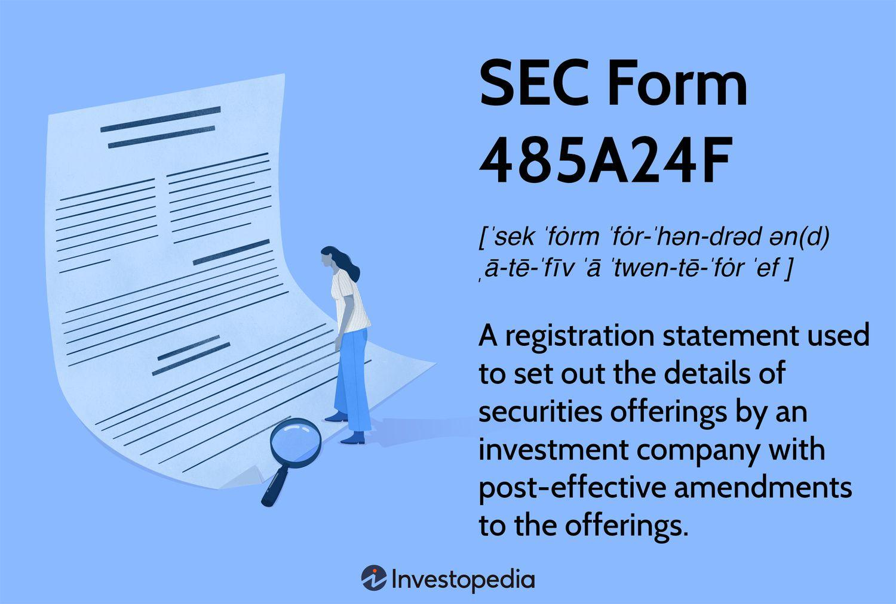

## Table of Contents

## What is SEC Form 485A24F?

SEC Form 485A24F is a document used by investment companies to register new securities or make changes to existing ones. It's part of a series of forms that help the Securities and Exchange Commission (SEC) keep track of what investment companies are doing. This form is important because it helps the SEC make sure that the information given to investors is accurate and up-to-date.

When an investment company wants to start selling new types of securities or update the information about their current securities, they need to file this form. It includes details like the type of securities being offered, any changes to the fees or risks involved, and other important updates. By filing this form, the company ensures that they are following the rules set by the SEC and that investors have all the information they need to make smart choices.

## Who is required to file SEC Form 485A24F?

SEC Form 485A24F is required to be filed by investment companies. These companies manage funds and offer securities to the public, like mutual funds or exchange-traded funds (ETFs). When they want to introduce new securities or make changes to existing ones, they need to file this form to keep the SEC informed.

The form helps the SEC make sure that all the information given to investors is correct and up-to-date. This is important because it helps investors make informed decisions about where to put their money. By filing this form, investment companies follow the rules and keep everything transparent.

## What is the purpose of filing SEC Form 485A24F?

The main purpose of filing SEC Form 485A24F is to let the Securities and Exchange Commission (SEC) know about new securities or changes to existing ones that an investment company wants to offer. When an investment company wants to start selling a new type of security or update the details about their current securities, they need to file this form. This helps the SEC keep track of what's going on and make sure everything is done correctly.

Filing this form is important because it helps keep the information that investors get accurate and up-to-date. When investors are thinking about where to put their money, they need to know all the details about the securities they are considering. By using SEC Form 485A24F, investment companies make sure they are following the rules and being transparent with investors, which helps everyone make better decisions.

## When should SEC Form 485A24F be filed?

SEC Form 485A24F should be filed by investment companies when they want to start selling new securities or make changes to the ones they already offer. This could be when they want to introduce a new type of mutual fund or [ETF](/wiki/etf-trading-strategies), or when they need to update the information about the fees, risks, or other details of their current securities.

Filing this form is important because it helps the Securities and Exchange Commission (SEC) keep track of what investment companies are doing. It makes sure that the information given to investors is always correct and up-to-date. This way, investors can make smart choices about where to put their money, knowing that the investment company is following the rules and being open about their offerings.

## How can one access SEC Form 485A24F?

To access SEC Form 485A24F, you can visit the Securities and Exchange Commission's official website. The SEC's website has a section called EDGAR (Electronic Data Gathering, Analysis, and Retrieval system) where all the forms filed by companies are stored. You can search for SEC Form 485A24F by using the search function on the EDGAR database and entering the name of the investment company or the specific form number.

Once you find the form, you can view it online or download it for your records. The EDGAR system is user-friendly, so even if you're not familiar with it, you should be able to find what you need with a little bit of searching. If you have trouble, the SEC's website also has resources and guides to help you navigate the system and find the information you're looking for.

## What are the key components of SEC Form 485A24F?

SEC Form 485A24F has several important parts that help the Securities and Exchange Commission (SEC) understand what an investment company is doing. The form includes details about the new securities the company wants to offer or changes to the ones they already have. This can include information about the type of securities, like mutual funds or ETFs, and any updates to the fees or risks involved. The form also has sections where the company explains why they are making these changes and how it might affect investors.

Another key part of the form is the section where the company gives updated information about their investment strategies and objectives. This helps investors understand what the company plans to do with their money and what they hope to achieve. The form also includes legal and financial disclosures that make sure everything is transparent and follows the rules. By including all these details, SEC Form 485A24F helps keep investors informed and ensures that the SEC can keep track of what investment companies are doing.

## What are the common mistakes to avoid when filing SEC Form 485A24F?

When filing SEC Form 485A24F, it's important to be careful and avoid common mistakes. One big mistake is not giving all the information that's needed. The form asks for details about the new securities or changes to existing ones, like the type of securities, any changes to fees or risks, and the company's investment strategies. If any of this information is missing or not clear, it can cause problems and delays. Another mistake is not following the rules about how to file the form. The SEC has specific rules about how and when to file, and if these are not followed, it can lead to issues with the filing.

Another common mistake is not updating the form if there are changes after it's been filed. If something important changes, like the fees or the risks, the company needs to update the form to keep the information accurate. Not doing this can confuse investors and get the company in trouble with the SEC. It's also important to double-check all the information before filing to make sure there are no mistakes or typos. Small errors can cause big problems, so taking the time to review everything carefully is a good idea.

## How does SEC Form 485A24F differ from other SEC forms?

SEC Form 485A24F is used by investment companies to tell the Securities and Exchange Commission (SEC) about new securities they want to offer or changes to the ones they already have. This form is different from others because it focuses on specific details about the securities, like the type of funds, any changes to fees or risks, and the company's investment strategies. Other forms might deal with different things, like company finances or insider trading. For example, Form 10-K is used for annual reports, and Form 3 is for reporting ownership of securities by company insiders.

The main goal of Form 485A24F is to make sure investors have all the right information to make smart choices. When an investment company wants to start selling a new type of security or update information about their current securities, they use this form to keep everything transparent. Other forms might not focus as much on investor information. For example, Form D is used for private placements and doesn't need as much detail about the securities themselves. By using Form 485A24F, investment companies can follow the rules and keep investors informed about what they're offering.

## What are the recent changes or updates to SEC Form 485A24F?

Recently, there haven't been any big changes to SEC Form 485A24F itself. The form still asks investment companies to give details about new securities or changes to existing ones. This includes information about the type of securities, any updates to fees or risks, and the company's investment strategies. The SEC keeps an eye on these forms to make sure the information given to investors is correct and up-to-date.

However, the rules around how to file the form and what to include can change. For example, the SEC might update the rules to make sure the information is even clearer for investors. These updates can affect how investment companies fill out the form and what they need to include. It's important for companies to keep up with these changes to make sure they are following the rules and giving investors the best information possible.

## What are the penalties for non-compliance with SEC Form 485A24F filing requirements?

If an investment company doesn't file SEC Form 485A24F correctly or on time, they can get in trouble with the Securities and Exchange Commission (SEC). The SEC might give them a warning or a fine. The fines can be a lot of money, depending on how serious the mistake is. If the company keeps making the same mistake, the fines can get even bigger.

Not filing the form properly can also hurt the company's reputation. Investors might not trust the company anymore if they think it's not following the rules. This can make it harder for the company to sell their securities and make money. So, it's really important for investment companies to make sure they file SEC Form 485A24F correctly and on time to avoid these problems.

## How can technology assist in the filing process of SEC Form 485A24F?

Technology can help a lot when it comes to filing SEC Form 485A24F. There are special software programs that can make the whole process easier. These programs can guide investment companies through the form, making sure they fill out all the right parts and don't miss anything important. They can also check for mistakes and remind the company when it's time to file the form, so they don't miss the deadline.

Another way technology helps is by letting companies file the form online. Instead of sending paper forms through the mail, they can use the SEC's EDGAR system to submit everything electronically. This is faster and more reliable. Plus, technology can keep all the information organized and easy to find, which makes it simpler for companies to keep track of what they've filed and make updates if they need to.

## What advanced strategies can be employed to optimize the filing of SEC Form 485A24F?

To optimize the filing of SEC Form 485A24F, investment companies can use technology to their advantage. Special software can help by guiding them through the form, making sure all the necessary information is included and correctly filled out. This software can also check for any mistakes or missing information, which helps avoid errors that might cause delays or penalties. Additionally, setting up reminders and alerts within the software can ensure that the company never misses a filing deadline, which is crucial for staying compliant with SEC rules.

Another strategy is to keep a detailed record of all past filings and updates. This can be done using digital document management systems that make it easy to find and review previous forms. By having quick access to this information, companies can quickly make any necessary updates to SEC Form 485A24F and ensure that all the details are consistent and accurate. Regularly training staff on the latest SEC requirements and how to use the filing software can also help keep the process smooth and efficient, reducing the chance of mistakes and ensuring that the company stays in good standing with the SEC.

## What are the key components of SEC Form 485A24F?

SEC Form 485A24F plays a critical role in the disclosure framework for management investment companies offering separate accounts. It serves as a registration statement that provides a comprehensive overview of the company's securities offerings, enabling investors to make informed decisions based on detailed, updated information.

The form’s primary components focus on transparency and accuracy in financial reporting. It includes extensive fund descriptions, detailing the investment objectives and strategies that define how the fund seeks to achieve its financial goals. This section ensures investors clearly understand the fund's purpose and the approach it takes to manage investments.

Management agreements are another pivotal element. These agreements outline the duties and responsibilities of the managers who oversee fund operations, highlighting their role in pursuing the fund's investment objectives. By specifying the terms of these agreements, the form provides insights into the governance and operational framework of the investment company.

Portfolio securities listings form the backbone of the form, offering a snapshot of the assets held within the fund. This detailed enumeration helps investors assess the diversity and risk profile of the portfolio, enabling them to evaluate whether the fund aligns with their investment preferences and risk tolerance. 

The calculation of net asset value (NAV) is crucial for understanding a fund’s financial health and investment performance. The NAV per share is computed by taking the total value of the fund's assets, subtracting liabilities, and then dividing by the number of outstanding shares. This calculation is vital for determining the price at which investors can buy or sell shares of the fund. 

$$
\text{NAV per share} = \frac{\text{Total Assets - Liabilities}}{\text{Number of Outstanding Shares}}
$$

Finally, post-effective amendments in SEC Form 485A24F are designed to notify investors of any changes in the fund or its management after the initial filing. These amendments ensure ongoing transparency and allow investors to stay informed about developments that might affect their investment choices. By maintaining updated records, the form helps uphold investor confidence and market integrity.

## References & Further Reading

[1]: Securities and Exchange Commission. (1993). ["Securities Act of 1933."](https://www.sec.gov/rules-regulations/statutes-regulations)

[2]: Securities and Exchange Commission. (1940). ["Investment Company Act of 1940."](https://www.sec.gov/investment/laws-and-rules)

[3]: Aldrige, I. (2013). ["High-Frequency Trading: A Practical Guide to Algorithmic Strategies and Trading Systems"](https://www.amazon.com/High-Frequency-Trading-Practical-Algorithmic-Strategies/dp/1118343506). 2nd Edition, Wiley.

[4]: Mackintosh, J. (2014). ["Regulators Close In on Algorithmic Trading."](https://www.researchinpsychotherapy.org/rpsy/article/view/826) Financial Times.

[5]: Patterson, S. (2012). ["Dark Pools: High-Speed Traders, A.I. Bandits, and the Threat to the Global Financial System"](https://dl.acm.org/doi/10.5555/2385786). Crown Business.