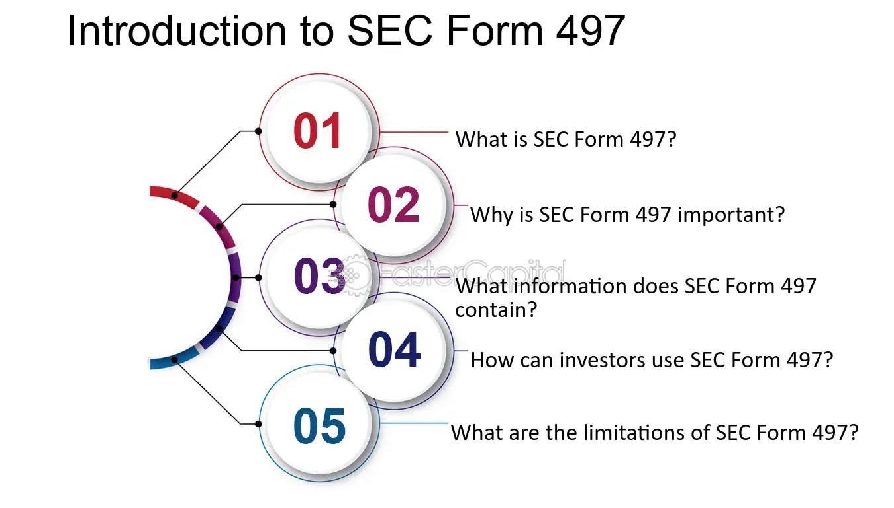

## Table of Contents

## What is SEC Form 497?

SEC Form 497 is a document that investment companies use to share important updates with their investors. It's like a newsletter that tells investors about changes in the company's investment options, fees, or other key details. When something important changes, the company has to send out this form to keep everyone in the loop.

The form helps investors make smart choices about their investments. By reading it, they can see if the changes will affect their money and decide if they need to do anything different. It's a way for the company to be open and honest with the people who have put their money into it.

## Who is required to file SEC Form 497?

SEC Form 497 must be filed by investment companies, like mutual funds or exchange-traded funds (ETFs). These companies need to use the form to tell their investors about important changes. This could be anything from new fees to changes in how the fund is managed. The goal is to keep investors informed so they can make good decisions about their money.

The Securities and Exchange Commission (SEC) requires these companies to file Form 497 to make sure they are being open and honest with their investors. When something big changes, the company has to send out the form within a certain time. This helps investors stay up-to-date and feel confident that the company is looking out for their best interests.

## What is the purpose of SEC Form 497?

SEC Form 497 is a document that investment companies use to tell their investors about important changes. It's like a newsletter that keeps everyone updated on things like new fees, changes in how the fund is managed, or other big news. The goal is to make sure investors know what's going on with their money so they can make smart choices.

The Securities and Exchange Commission (SEC) requires these companies to file Form 497 to make sure they are being honest and open with their investors. When something important changes, the company has to send out the form quickly. This helps investors stay informed and feel confident that the company is looking out for their best interests.

## How often must SEC Form 497 be filed?

Investment companies don't have to file SEC Form 497 on a regular schedule like every month or year. Instead, they need to file it whenever there's an important change that investors should know about. This could be things like new fees, changes in how the fund is managed, or other big news.

When something important changes, the company has to send out Form 497 quickly to keep investors in the loop. This helps investors stay informed and make smart choices about their money. The goal is to make sure everyone knows what's going on with their investments so they can feel confident and secure.

## What information is required to be included in SEC Form 497?

SEC Form 497 is used by investment companies to tell their investors about important changes. The form needs to include details about what has changed, like new fees, changes in how the fund is managed, or other big news. It also has to say when these changes will start happening. This helps investors understand exactly what's going on with their money.

The form also needs to explain why these changes are happening. This can help investors see the reasons behind the updates and decide if they agree with them. It's important for the form to be clear and easy to understand so that everyone can make smart choices about their investments. By including all this information, the company makes sure investors stay informed and can feel confident about their money.

## How does SEC Form 497 differ from other SEC forms?

SEC Form 497 is different from other SEC forms because it's used by investment companies to tell their investors about important changes. Unlike forms like the 10-K or 10-Q, which are about a company's financial performance, Form 497 focuses on updates to the investment options, fees, or management of the fund. It's like a newsletter that keeps investors in the loop about what's happening with their money.

Another way Form 497 stands out is that it's not filed on a regular schedule. While forms like the 10-K are filed annually and 10-Q quarterly, Form 497 is only sent out when there's a big change that investors need to know about. This makes it more about keeping investors informed in real-time rather than providing periodic updates. By doing this, investment companies can make sure their investors are always up-to-date and can make smart choices about their investments.

## What are the key deadlines associated with filing SEC Form 497?

Investment companies need to file SEC Form 497 quickly when there's an important change. The main rule is that they have to send out the form within a certain time after the change happens. This is usually within 60 days after the change is made, but it can be sooner if the change is really big and investors need to know right away.

The goal is to keep investors in the loop as soon as possible. By filing Form 497 within this time, the company makes sure that everyone knows about the changes before they start affecting their money. This helps investors feel confident and make smart choices about their investments.

## What are the exemptions from filing SEC Form 497?

There are some situations where investment companies don't have to file SEC Form 497. One big reason is if the change is really small and won't affect investors much. For example, if the company just changes the name of a fund without changing how it works or its fees, they might not need to file the form.

Another exemption is if the change has already been shared with investors in another way. If the company has already told everyone about the change in a different document, like a prospectus or a shareholder report, they might not need to file Form 497 again. The goal is to make sure investors are informed, but if they already know about the change, the company doesn't have to repeat it.

## How can a company apply for an exemption from SEC Form 497?

If a company thinks they don't need to file SEC Form 497, they can ask the Securities and Exchange Commission (SEC) for an exemption. They do this by writing a letter to the SEC explaining why they believe they should be exempt. In the letter, they need to clearly describe the change and explain why it's so small or why investors already know about it. This helps the SEC understand why the company thinks they don't need to file the form.

The SEC will then review the company's request. If the SEC agrees that the change is minor or that investors have already been informed, they might grant the exemption. This means the company doesn't have to file Form 497 for that specific change. But if the SEC doesn't agree, the company will still need to file the form to keep their investors in the loop about important updates.

## What are the penalties for non-compliance with SEC Form 497 filing requirements?

If an investment company doesn't file SEC Form 497 when they're supposed to, they could get in trouble with the Securities and Exchange Commission (SEC). The SEC might fine the company, which means they have to pay money as a penalty. The fines can be big, depending on how serious the mistake was and if the company did it on purpose or by accident.

Besides fines, the SEC might also make the company do other things to fix the problem. They could be told to send out the form right away or to tell their investors about the change in another way. If the company keeps not following the rules, the SEC might even take away their right to manage the fund. This is a big deal because it means they can't do their job anymore. So, it's really important for companies to file Form 497 on time to avoid these penalties.

## How does the SEC review and process SEC Form 497 filings?

When an investment company sends in SEC Form 497, the Securities and Exchange Commission (SEC) takes a close look at it. They check to make sure the form has all the right information about the changes the company is making. This includes details like new fees, changes in how the fund is managed, or other important updates. The SEC wants to make sure that investors get all the information they need to make good choices about their money.

After the SEC reviews the form, they might ask the company for more information if something is missing or not clear. If everything looks good, the SEC will accept the filing. This means the company can go ahead and send out the form to their investors. The whole process is about making sure that investors are kept in the loop and that the company is being honest and open about any big changes.

## What are the recent changes or updates to SEC Form 497 and their implications?

Recently, the SEC made some changes to how investment companies need to use Form 497. One big change is that companies now have to send out the form faster when there are important updates. Before, they had up to 60 days, but now they might need to do it sooner if the change is really big. This means investors will get important news about their money quicker, which helps them make better choices.

These updates are all about making sure investors are always in the know. By getting the form faster, investors can react to changes in their investments more quickly. This also makes investment companies be more open and honest, because they have to share big news right away. Overall, these changes help investors feel more confident and secure about their money.

## References & Further Reading

[1]: ["Regulation of Securities Sales: The Securities Act of 1933"](https://www.sec.gov/rules-regulations/statutes-regulations) - U.S. Securities and Exchange Commission

[2]: ["Investing in Mutual Funds"](https://www.forbes.com/advisor/investing/how-to-invest-in-mutual-funds/) - Financial Industry Regulatory Authority (FINRA)

[3]: ["Mutual Fund Disclosures"](https://www.sec.gov/about/divisions-offices/division-investment-management/fund-disclosure-glance) - U.S. Securities and Exchange Commission

[4]: Pyle, D. (1999). ["Data preparation for data mining."](https://archive.org/details/datapreparationf0000pyle) Morgan Kaufmann.

[5]: ["Understanding Mutual Funds"](https://www.investopedia.com/terms/m/mutualfund.asp) - Investopedia

[6]: ["Form N-1A and Other SEC Filings"](https://www.sec.gov/file/form-n-1a) - U.S. Securities and Exchange Commission