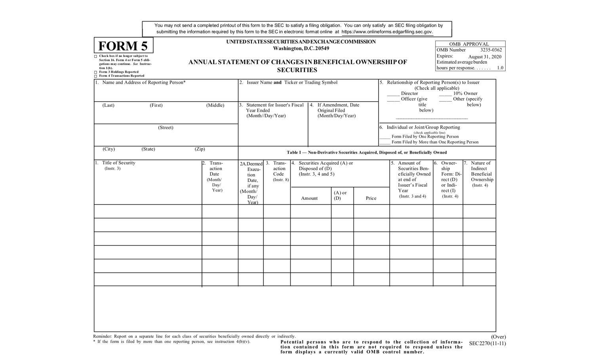

The world of finance is governed by intricate systems and stringent regulations crafted to uphold transparency and equity. Among these, SEC Form 5 stands out as a vital instrument in reinforcing legal and ethical trading practices within corporations. This form is a key component in the disclosure of insider trading activities, ensuring that information about ownership changes by company insiders is made public. Its role extends to regulating interactions with algorithmic trading, a sophisticated method of executing securities transactions using advanced algorithms.

Understanding SEC Form 5 is critical not only for investors who rely on transparent market operations but also for company insiders who are obligated to comply with legal reporting standards. Such comprehension aids in promoting a fair investment environment where decisions are based on publicly available information rather than undisclosed insights.

As we explore the workings of SEC Form 5, it becomes evident why this document is indispensable in the financial ecosystem. By requiring the disclosure of detailed information about insider transactions, the form helps prevent the misuse of confidential information and contributes to maintaining market integrity. This article will elucidate the significance of SEC Form 5 in regulating insider trading and its relationship with algorithmic trading, highlighting its importance for both market participants and regulatory bodies.

## Table of Contents

## Understanding SEC Form 5

SEC Form 5 is an important annual disclosure document mandated by the U.S. Securities and Exchange Commission (SEC) to record changes in beneficial ownership of securities by company insiders. These insiders typically include corporate officers, directors, and individuals holding more than 10% of voting shares. The primary purpose of SEC Form 5 is to serve as a complementary document for transactions that might not have been reported on SEC Form 4, which is used to disclose insider trading activities throughout the year.

The requirement for filing SEC Form 5 arises under Section 16(a) of the Securities Exchange Act of 1934, ensuring that any modifications in ownership that were not reported due to exemptions or delays are adequately accounted for. This ensures clarity and transparency in the ownership activities within publicly traded companies. Providing this level of transparency is crucial in guarding against illegal insider trading practices and maintaining the integrity of financial markets.

Through the filing of SEC Form 5, company insiders have the opportunity to correct any errors or omissions in their previous disclosures related to securities transactions. If an insider engaged in any transaction that qualifies for deferred reporting, such as small acquisitions or acquisitions made pursuant to Rule 16b-3, it is essential that these be detailed in SEC Form 5. This comprehensive reporting mechanism reinforces investor confidence by ensuring all material transactions are disclosed accurately and within an appropriate timeframe.

Ultimately, by mandating this level of disclosure, the SEC empowers investors with the knowledge needed to make informed decisions, while holding corporate insiders accountable for their trading activities. The consistent application of SEC Form 5, alongside other related forms, forms a pivotal component of the regulatory framework designed to foster ethical conduct and transparency in financial dealings.

## The Role of SEC Form 5 in Insider Trading Disclosure

Insider trading is defined as the buying or selling of securities by individuals with access to non-public, material information about a company. This type of trading can give insiders an unfair advantage over other market participants, undermine investor confidence, and distort the integrity of financial markets. The Securities and Exchange Commission (SEC) employs various mechanisms to curb such activities, with SEC Form 5 being a critical component in this effort.

SEC Form 5 is designed to enhance transparency and accountability among company insiders, which include officers, directors, and substantial shareholders. By mandating the detailed disclosure of securities transactions that were not reported on SEC Form 4 within the same fiscal year, Form 5 provides a comprehensive view of insider trading activities. This requirement ensures that all changes in beneficial ownership are publicly accessible, thereby reducing the potential for illicit trading based on privileged information.

One of the primary functions of SEC Form 5 is to create a record of ownership changes, thus holding insiders accountable to market regulators and the investing public. This accountability acts as a deterrent against the misuse of confidential information for personal gain. The requirement to disclose ownership changes also promotes a culture of ethical trading practices within companies, encouraging insiders to operate within the legal frameworks established by the SEC.

Furthermore, SEC Form 5 acts as a robust monitoring tool for the SEC, providing the agency with the necessary information to track insider trading activities efficiently. By scrutinizing the reports filed, the SEC can identify irregular trading patterns or suspicious transactions that may warrant further investigation. This surveillance is crucial in maintaining market integrity and ensuring a level playing field for all market participants.

Overall, SEC Form 5 is pivotal in the ongoing efforts to prevent illegal insider trading. By mandating transparency and accountability in the reporting of securities transactions, the form plays a crucial role in protecting investors and upholding the fairness of financial markets.

## Information Required by SEC Form 5

SEC Form 5 is a pivotal document in financial transparency and regulatory compliance, necessitating the disclosure of several key pieces of information to ensure clarity in insider transactions. 

Primarily, the form requires the name and address of the reporting individual, which allows for precise identification and accountability. Alongside personal identification, the issuer's name and the corresponding ticker symbol must be included, providing a clear link to the specific securities and the company involved.

Another critical element is the fiscal year-end date, which situates the reported transactions within a defined timeframe. This ensures consistency and aids in evaluating the chronological context of the trading activities. Additionally, any amendments to previously filed forms are to be reported, which maintains the accuracy and integrity of past disclosures.

Furthermore, the form insists on clarity regarding the relationship of the filer to the issuer—whether they are a director, officer, or significant shareholder. This delineation of roles helps illuminate the context and potential influence behind trading decisions. The nature of the transactions, alongside whether ownership is direct or indirect, must be transparently disclosed, providing insight into the nature and motivation of the trades.

Moreover, detailed information on each securities transaction—such as transaction dates, respective codes, and the quantities of securities owned—is indispensable. This data creates a comprehensive picture of the insider’s activities across the fiscal year. The thorough collection of these details on SEC Form 5 contributes to a robust structure for monitoring and evaluating insider trading, thus reinforcing market transparency and fairness. 

In essence, the meticulous requirements of SEC Form 5 craft a detailed narrative of insider ownership and transaction dynamics, pivotal for regulatory bodies to uphold the integrity of the financial markets.

## The Intersection of SEC Form 5 and Algorithmic Trading

Algorithmic trading, commonly referred to as algo trading, involves the use of complex algorithms that execute trades at rapid speeds, often much faster than human traders. The primary aim of these algorithms is to identify and capitalize on profitable trading opportunities by analyzing a multitude of market data quickly and efficiently. While [algorithmic trading](/wiki/algorithmic-trading) itself is a legitimate practice, it operates under the scrutiny of regulatory frameworks designed to ensure fairness and legality in financial markets.

One crucial concern with algorithmic trading is its potential intersection with insider trading, particularly if algorithms are able to access and utilize non-public, material information. This poses a significant risk to market integrity as it could enable entities to gain unfair advantages in trading. It is within this context that SEC Form 5 indirectly exerts its influence. By mandating the disclosure of securities transactions by insiders, Form 5 establishes a framework of transparency that algo trading systems must respect to prevent the misuse of privileged information.

SEC Form 5 filings are integral to maintaining this transparency by providing detailed reports of changes in ownership, which the Securities and Exchange Commission (SEC) uses to monitor insider trading activities. If algorithmic trading systems are able to access such information without restrictions, it may lead to circumstances where insider trading occurs without detection. Therefore, it is essential for these systems to adhere to SEC regulations.

Ensuring compliance of algorithmic trading activities with SEC regulations is crucial for preserving market fairness. As technology continues to advance, the sophistication of trading algorithms also increases, raising the complexity of ensuring they operate within legal boundaries. Regulators must, therefore, stay vigilant and update compliance frameworks to address these evolving challenges.

Furthermore, the advancement of [machine learning](/wiki/machine-learning) and [artificial intelligence](/wiki/ai-artificial-intelligence) in trading strategies necessitates that firms incorporate internal controls to prevent potential violations. It is imperative for those engaged in algorithmic trading to implement robust compliance checks and to keep algorithmic strategies transparent and auditable.

In conclusion, while algorithmic trading presents numerous benefits in terms of efficiency and execution speeds, its interplay with SEC regulations like those concerning insider trading is a dynamic and evolving area of concern. Safeguarding market integrity requires ongoing efforts to balance technological innovations with rigorous adherence to established legal frameworks.

## Conclusion

SEC Form 5 is a critical instrument in the financial reporting system, with its primary objective being the enhancement of transparency in corporate insider activities and the deterrence of insider trading. By mandating detailed disclosures from company insiders, SEC Form 5 ensures these individuals conduct their trading activities within a robust legal and ethical framework. This requirement not only promotes adherence to securities regulations but also mitigates the potential misuse of insider information, thereby safeguarding the integrity of the financial markets.

The dynamic interplay between SEC regulations and algorithmic trading underscores the necessity for constant vigilance in the financial sector. As trading technologies evolve and become more sophisticated, ensuring compliance with SEC Form 5 and related regulations becomes increasingly vital. Algorithmic trading, which relies on high-speed data processing, must align with these regulations to prevent unethical practices and maintain market fairness. SEC Form 5's framework of disclosure acts as a check that indirectly influences the integration of new trading technologies by promoting transparency.

Understanding the role and requirements of SEC Form 5 empowers investors by providing them with essential insights into insider trading activities. This transparency helps foster a more equitable and clear market environment where all participants can make informed decisions based on complete and accurate information. 

As financial systems continue to evolve, regulatory frameworks such as SEC Form 5 will remain central to upholding market integrity. These regulations ensure that as the complexity and speed of financial transactions increase, the foundational principles of fairness and transparency are not compromised. Such regulatory measures are indispensable for nurturing investor confidence and maintaining an orderly market structure.

## References & Further Reading

[1]: ["SEC.gov | Form 5."](https://www.sec.gov/about/forms/form5.pdf) U.S. Securities and Exchange Commission.

[2]: Cornell, B. (2007). ["Insider Trading: Regulation and Analysis."](https://link.springer.com/article/10.1007/s10551-007-9532-z) Kluwer Law International.

[3]: Fox, M. B., & Fox, M. (2014). ["The Economics of Insider Trading: Lessons from the Trading Cases and Their Aftermath."](https://scholarship.law.columbia.edu/cgi/viewcontent.cgi?article=4178&context=faculty_scholarship) Georgetown Public Law Research Paper.

[4]: Lopez de Prado, M. (2018). ["Advances in Financial Machine Learning."](https://www.amazon.com/Advances-Financial-Machine-Learning-Marcos/dp/1119482089) Wiley.

[5]: Tabb, L. (2013). ["The Future of Trading: Stressing the Value of Human Input in the Age of Algorithms."](https://www.researchgate.net/publication/380732108_THE_IMPACT_OF_AI_ON_ALGORITHMIC_TRADING_HOW_AI_ALGORITHMS_ARE_CHANGING_THE_LANDSCAPE_OF_STOCK_TRADING_INCLUDING_THE_ETHICAL_IMPLICATIONS) Tabb Group.