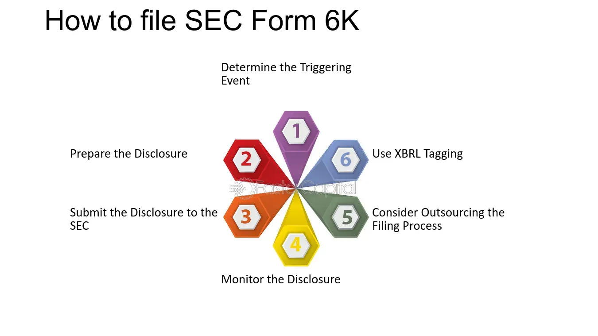

## Table of Contents

## What is SEC Form 6-K?

SEC Form 6-K is a report that foreign companies use to share important information with the U.S. Securities and Exchange Commission (SEC). These companies are not based in the U.S. but have their stocks traded on American stock exchanges. The form helps keep investors informed about significant events or changes in the company, like financial results, acquisitions, or changes in management.

The information in a Form 6-K can be anything that the company thinks is important for investors to know. This could include quarterly or annual financial reports, news about major business deals, or updates on legal issues. By filing this form, the company makes sure that everyone who might want to invest in their stock has access to the same important information at the same time.

## Who needs to file SEC Form 6-K?

Foreign companies that have their stocks listed on U.S. stock exchanges need to file SEC Form 6-K. These companies are based outside of the United States but want their stocks to be available for trading in the U.S. markets. By filing Form 6-K, they follow the rules set by the U.S. Securities and Exchange Commission (SEC) to keep investors informed.

The form is used to share important updates or news about the company. This can include things like financial reports, news about big business deals, or changes in who runs the company. Filing Form 6-K helps make sure that all investors, no matter where they are, have the same important information about the company at the same time.

## What types of information are included in SEC Form 6-K?

SEC Form 6-K includes a wide range of information that foreign companies think is important for investors to know. This can include financial reports that show how the company is doing money-wise, like their earnings for a quarter or a whole year. It might also cover news about big business deals, like when a company buys or merges with another one. If there are changes in who runs the company, like a new CEO, that information would also be in the Form 6-K.

The form is also used to share updates on legal issues that might affect the company. For example, if the company is involved in a lawsuit, they might need to tell investors about it through Form 6-K. Any other news that the company thinks could impact its stock price or how investors see the company would also be included. This way, everyone who might want to invest in the company has the same important information at the same time.

## How often must SEC Form 6-K be filed?

SEC Form 6-K does not have a set schedule that says it must be filed at certain times like every month or every year. Instead, foreign companies need to file it whenever they have important news or updates that they think investors should know about. This could be whenever they release their financial reports, like quarterly or yearly earnings, or when something big happens, like a merger or a change in who runs the company.

The idea behind this is to make sure that investors always have the latest and most important information about the company. If the company is involved in a lawsuit or has some other big news, they need to file a Form 6-K to tell investors about it. This way, everyone who might want to invest in the company has the same important information at the same time.

## What is the purpose of filing SEC Form 6-K?

The main purpose of filing SEC Form 6-K is to keep investors informed about important news and updates from foreign companies that have their stocks listed on U.S. stock exchanges. These companies are not based in the U.S., but they want their stocks to be available for trading in the U.S. markets. By filing Form 6-K, they make sure that everyone who might want to invest in their stock has access to the same important information at the same time.

The information shared in a Form 6-K can include financial reports, like quarterly or yearly earnings, news about big business deals, changes in who runs the company, or updates on legal issues. This helps investors understand how the company is doing and what might affect its future. By keeping everyone up to date, Form 6-K helps make the stock market fair and transparent for all investors.

## How does SEC Form 6-K differ from other SEC forms like 10-K and 20-F?

SEC Form 6-K is used by foreign companies that have their stocks listed on U.S. stock exchanges to share important updates with investors. These updates can include financial reports, news about big business deals, changes in who runs the company, or updates on legal issues. Unlike other forms, Form 6-K does not have a set schedule and is filed whenever the company has important news to share. The main goal is to keep investors informed and ensure that everyone has the same important information at the same time.

On the other hand, SEC Form 10-K is used by U.S. companies to provide a detailed annual report of their financial performance and business operations. It includes a lot of information like audited financial statements, a management discussion and analysis (MD&A), and information about the company's risks and business strategy. Form 10-K is filed once a year and follows a strict schedule, usually within 60 to 90 days after the end of the company's fiscal year. This form is more comprehensive and is meant to give investors a full picture of the company's yearly performance.

SEC Form 20-F is similar to Form 10-K but is used by foreign companies that are listed on U.S. stock exchanges. Like Form 10-K, it is an annual report that includes detailed financial statements and information about the company's business and risks. However, Form 20-F is filed once a year and follows a specific schedule, usually within six months after the end of the company's fiscal year. The key difference between Form 6-K and Form 20-F is that Form 6-K is used for more immediate updates throughout the year, while Form 20-F provides a comprehensive annual overview.

## What are the specific submission guidelines for SEC Form 6-K?

When a foreign company wants to file SEC Form 6-K, it must submit the form electronically through the SEC's Electronic Data Gathering, Analysis, and Retrieval (EDGAR) system. This system helps the SEC keep track of all the information that companies share with investors. The company needs to make sure that the information in the Form 6-K is accurate and complete before they submit it. They also need to follow any rules about what kind of information they can include and how they should format it.

There is no set schedule for filing Form 6-K, so the company needs to file it whenever they have important news or updates to share. This could be when they release their financial reports, like quarterly or yearly earnings, or when something big happens, like a merger or a change in who runs the company. The company should file the form as soon as possible after the important event happens, to make sure that investors have the latest information. By doing this, they help keep the stock market fair and transparent for everyone.

## Can SEC Form 6-K be amended, and if so, how?

Yes, SEC Form 6-K can be amended if a foreign company needs to update or correct information they shared before. To do this, they file an amended Form 6-K. They need to use the same EDGAR system they used to file the original form. The company should clearly say that the new filing is an amendment and explain what has changed or been corrected.

When a company files an amended Form 6-K, they need to make sure that the new information is accurate and complete. They should also follow the same rules about what kind of information they can include and how they should format it. By filing an amendment, the company keeps investors informed and makes sure that everyone has the most up-to-date and correct information about the company.

## What are the penalties for non-compliance with SEC Form 6-K filing requirements?

If a foreign company does not file SEC Form 6-K when they should, they could face penalties from the SEC. These penalties can include fines, which are like a punishment in the form of money that the company has to pay. The fines can be big, depending on how serious the mistake was and how long the company waited to fix it. The SEC might also take other actions, like stopping the company from selling their stocks in the U.S. until they fix the problem.

Not filing Form 6-K on time can also hurt the company's reputation. Investors might lose trust in the company if they think it's not being honest or open about important news. This could make the company's stock price go down, which means the company could lose money. It's important for companies to follow the rules and file Form 6-K when they have important news to share, so they can keep their investors happy and avoid any trouble with the SEC.

## How does the SEC review and process Form 6-K submissions?

When a foreign company files SEC Form 6-K, the SEC reviews the submission to make sure it follows all the rules. They use a computer system called EDGAR to collect and look at all the forms that companies send in. The SEC checks to see if the information in the Form 6-K is complete and if it's shared in the right way. If the SEC finds any problems, they might ask the company to fix them or explain what happened.

After the SEC reviews the Form 6-K, they make the information public so that everyone can see it. This helps investors stay informed about what's going on with the company. If the SEC finds that the company did not file the form correctly or on time, they might take action against the company. This could mean giving them a fine or stopping them from selling their stocks in the U.S. until they fix the problem.

## What are some best practices for preparing and submitting SEC Form 6-K?

When preparing SEC Form 6-K, it's important to make sure that all the information is accurate and complete. The company should double-check their financial reports, news about big business deals, or any changes in who runs the company. They need to make sure that everything they want to share is included and that it follows the SEC's rules. Using the right format and including all the required information helps make sure that the form gets accepted without any problems.

Submitting SEC Form 6-K should be done through the SEC's EDGAR system. The company needs to file the form as soon as possible after they have important news or updates to share. This helps keep investors informed and makes the stock market fair for everyone. It's also a good idea to keep a record of when and what was filed, so the company can easily find and fix any mistakes if they need to file an amendment later. By following these best practices, the company can avoid fines and keep their investors happy.

## How can technology and automation assist in the filing of SEC Form 6-K?

Technology and automation can make it easier for companies to file SEC Form 6-K. They can use special software to help them prepare the form. This software can check the information to make sure it's correct and complete before it's sent to the SEC. It can also help with formatting the form the right way, so it follows all the rules. This saves time and helps avoid mistakes that could cause problems later.

Automation can also help companies send the form through the SEC's EDGAR system. Instead of doing everything by hand, the software can do it automatically. This means the form gets filed faster and with fewer errors. Companies can also use technology to keep track of when they need to file the form and what they need to include. This helps them stay on top of their filing and make sure they don't miss any important deadlines.

## References & Further Reading

[1]: SEC. (2022). [Form 6-K.](https://www.sec.gov/about/forms/form6-k.pdf) U.S. Securities and Exchange Commission.

[2]: Avellaneda, M., & Stoikov, S. (2008). ["High-frequency trading in a limit order book."](https://people.orie.cornell.edu/sfs33/LimitOrderBook.pdf) Quantitative Finance.

[3]: Hull, J. C. (2017). ["Options, Futures, and Other Derivatives,"](https://www.semanticscholar.org/paper/Options%2C-Futures%2C-and-Other-Derivatives-Hull/89bdee500c8623864fc9eb7a471546aa713acc44) 10th Edition. Pearson.

[4]: Jorion, P. (2006). ["Value at Risk: The New Benchmark for Managing Financial Risk,"](https://books.google.com/books/about/Value_at_Risk_3rd_Ed.html?id=nnblKhI7KP8C) 3rd Edition. McGraw Hill.

[5]: Securities Exchange Act of 1934. (1934). [U.S. Securities and Exchange Commission.](https://en.wikipedia.org/wiki/Securities_Exchange_Act_of_1934) 

[6]: Lopez de Prado, M. (2018). ["Advances in Financial Machine Learning."](https://www.amazon.com/Advances-Financial-Machine-Learning-Marcos/dp/1119482089) Wiley.