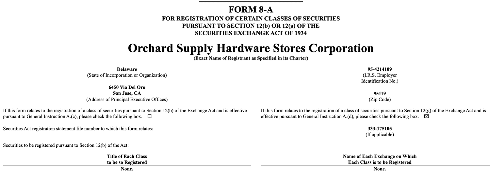

## Table of Contents

## What is SEC Form 8-A12B?

SEC Form 8-A12B is a document that companies file with the U.S. Securities and Exchange Commission (SEC). This form is used to register a class of securities, like stocks or bonds, so they can be traded on a stock exchange. By filing this form, a company makes sure that its securities follow the rules set by the SEC and can be legally bought and sold by the public.

The form is important because it helps the SEC keep track of the securities that are being offered to the public. It includes details about the securities, the company issuing them, and any other important information that investors might need to know. Once the form is filed and approved, the securities can be listed on a stock exchange, making it easier for people to invest in the company.

## Why is SEC Form 8-A12B important for companies?

SEC Form 8-A12B is important for companies because it allows them to register their securities, like stocks or bonds, with the SEC. This registration is necessary for the securities to be traded on a stock exchange. By filing this form, a company can make its securities available to the public, which can help attract more investors and raise capital for the business.

The form also helps companies follow the rules set by the SEC. By providing detailed information about the securities and the company, the form ensures that everything is transparent and clear to investors. This transparency can build trust with the public and make it easier for the company to grow and succeed in the market.

## Who needs to file SEC Form 8-A12B?

Any company that wants to have its securities traded on a stock exchange needs to file SEC Form 8-A12B. This form is important because it registers the securities with the SEC, which is required before they can be listed on a stock exchange.

Filing this form helps the company follow the rules set by the SEC. It also makes sure that the company gives clear information to the public about its securities. This can help attract more investors and make it easier for the company to raise money.

## When should SEC Form 8-A12B be filed?

SEC Form 8-A12B should be filed before a company wants to list its securities on a stock exchange. This is important because the form registers the securities with the SEC, which is needed before they can be traded publicly.

By filing the form on time, a company can make sure it follows all the rules set by the SEC. This helps the company be clear with investors about its securities, which can attract more people to invest and help the company raise money.

## What information is required on SEC Form 8-A12B?

SEC Form 8-A12B needs information about the company and the securities it wants to trade. This includes the name of the company, the type of securities like stocks or bonds, and how many securities are being registered. The form also asks for details about the stock exchange where the securities will be listed.

The form also needs information about the company's business and any important legal issues. This helps the SEC make sure the company is following the rules. By giving all this information, the company can be clear with investors about what they are buying, which can help build trust and attract more people to invest.

## How does SEC Form 8-A12B differ from other SEC forms?

SEC Form 8-A12B is different from other SEC forms because it is used to register securities for trading on a stock exchange. Other forms, like Form S-1, are used when a company is doing an initial public offering (IPO) to sell its securities to the public for the first time. Form 8-A12B is more about getting the securities ready to be listed on an exchange, while Form S-1 is about offering them to the public.

Another difference is that Form 8-A12B focuses on the details of the securities and the company's business, but it doesn't need as much financial information as some other forms. For example, Form 10-K is a yearly report that includes a lot of financial data and business information. Form 8-A12B is simpler and more about making sure the securities follow the SEC's rules before they can be traded.

## What are the steps to file SEC Form 8-A12B?

To file SEC Form 8-A12B, a company first needs to gather all the information about the securities they want to register. This includes the type of securities, like stocks or bonds, and how many they want to list on the stock exchange. The company also needs to provide details about their business and any important legal issues. Once all this information is ready, the company can fill out the form.

After filling out the form, the company needs to submit it to the SEC. This can be done electronically through the SEC's online filing system. Once the SEC reviews and approves the form, the securities can be listed on the stock exchange. This process helps make sure the company follows the SEC's rules and can attract investors to buy their securities.

## What are the common mistakes to avoid when filing SEC Form 8-A12B?

When filing SEC Form 8-A12B, one common mistake to avoid is not providing all the required information. The form needs details about the securities, like the type and number, and information about the company's business and any legal issues. If any of this information is missing, the SEC might not approve the form, which can delay the listing of the securities on the stock exchange.

Another mistake to watch out for is not following the SEC's rules and deadlines. The form needs to be filed before the securities can be traded, so missing the deadline can cause problems. It's also important to make sure the information on the form is correct and up-to-date. If there are mistakes or outdated information, it can lead to issues with the SEC and make it harder for the company to attract investors.

## How does the filing of SEC Form 8-A12B affect a company's stock?

Filing SEC Form 8-A12B is a big step for a company because it lets the company's stock be traded on a stock exchange. When the form is filed and approved by the SEC, the company's stock can be bought and sold by the public. This can help the company attract more investors and raise money to grow their business.

After the form is filed, the company's stock might become more popular because it's easier for people to buy and sell it. More investors might want to buy the stock because they can see all the information about the company and its securities. This can make the stock's price go up if a lot of people want to buy it. But if the information on the form isn't good or if there are problems with the company, the stock's price might go down.

## What are the legal implications of not filing SEC Form 8-A12B on time?

Not filing SEC Form 8-A12B on time can cause big problems for a company. If the form is not filed before the company wants to list its securities on a stock exchange, the SEC might not let the company's stock be traded. This means the company won't be able to attract new investors or raise money through the stock market. It can also make the company look bad to investors, which can hurt its reputation and make it harder to do business.

The SEC might also take legal action against the company for not following the rules. This could mean fines or other penalties that can cost the company a lot of money. It's really important for a company to file the form on time to avoid these problems and make sure everything goes smoothly with the SEC and the stock exchange.

## Can amendments be made to SEC Form 8-A12B after initial filing, and if so, how?

Yes, amendments can be made to SEC Form 8-A12B after the initial filing. If a company finds out that some information on the form is wrong or needs to be updated, they can file an amendment. To do this, the company needs to fill out a new form with the updated information and send it to the SEC. This can be done through the SEC's online filing system, just like the original form.

Making amendments is important because it helps keep the information about the company and its securities accurate. If the SEC finds out that the information on the form is not correct, they might not let the company's stock be traded on the stock exchange. By filing amendments, the company can make sure everything is up-to-date and follow the SEC's rules.

## What advanced strategies can companies use to optimize their SEC Form 8-A12B filings?

Companies can use some smart strategies to make their SEC Form 8-A12B filings better. One good idea is to work closely with lawyers and financial experts who know a lot about SEC rules. These experts can help make sure all the information on the form is correct and complete. They can also help the company explain their business and securities in a clear way that investors will understand. This can make the company look more trustworthy and attract more people to invest.

Another strategy is to use technology to help with the filing process. Companies can use special software to fill out the form and check for any mistakes before sending it to the SEC. This can save time and make sure the form is filed on time. It's also a good idea to keep an eye on what other companies are doing with their SEC filings. By looking at what works well for others, a company can learn how to make their own filings even better and stand out to investors.

## References & Further Reading

[1]: Securities and Exchange Commission. ["Form 8-A."](https://www.sec.gov/files/form8-a.pdf) Accessed 2023.

[2]: Securities and Exchange Commission. ["Introduction to the Federal Securities Laws."](https://crsreports.congress.gov/product/pdf/if/if10032) Accessed 2023.

[3]: Harris, L. (2003). ["Trading and Exchanges: Market Microstructure for Practitioners."](https://www.amazon.com/Trading-Exchanges-Market-Microstructure-Practitioners/dp/0195144708) Oxford University Press.

[4]: Aldridge, I. (2013). ["High-Frequency Trading: A Practical Guide to Algorithmic Strategies and Trading Systems."](https://www.amazon.com/High-Frequency-Trading-Practical-Algorithmic-Strategies/dp/1118343506) Wiley.

[5]: Johnson, B. (2010). ["Algorithmic Trading & DMA: An Introduction to Direct Access Trading Strategies."](https://archive.org/details/algorithmictradi0000john) 4Myeloma Press.