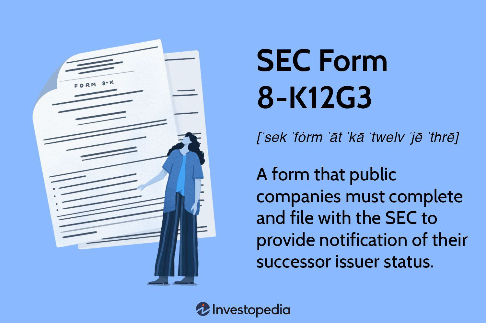

SEC Form 8-K serves as a vital tool for publicly traded companies to disclose significant corporate events promptly and transparently. This article explores the various aspects and implications of Form 8-K, especially in the context of financial disclosures and algorithmic trading. For investors and market participants, understanding the filing requirements and contents of Form 8-K is critical to making informed decisions. Algorithmic trading, which relies heavily on real-time data, finds the timely information provided by the 8-K reports indispensable for adapting and optimizing trading strategies. This highlights the form's significance as a crucial point of reference for both human and automated trading activities.

Addressing the pros and cons of Form 8-K is essential in understanding its role and effectiveness in today's fast-paced financial markets. The form aims to bridge the information gap between corporations and investors, providing insights into material events that might impact a company’s valuation or operations. While it plays a significant role in ensuring transparency and reducing informational asymmetries, challenges remain, particularly concerning the accessibility and rapid interpretation of data. This article delves into these aspects, offering insights into how Form 8-K helps navigate the complexities of modern financial landscapes.



## Table of Contents

## Understanding SEC Form 8-K

SEC Form 8-K serves as a vital tool for publicly traded companies, enabling them to disclose material events and provide timely information to investors. This form ensures transparency and helps bridge the information gap between the company and its stakeholders, including investors, analysts, and regulatory bodies. Companies are required to file Form 8-K within four business days following an event that could significantly impact the company's financial condition or operations. 

Key events that necessitate disclosure through Form 8-K include significant corporate developments such as mergers and acquisitions, bankruptcy filings, and changes in executive leadership or directors. These events are considered material because they can substantially affect a company's stock price and influence investment decisions.

The structure of Form 8-K is systematically divided into nine main sections, each addressing different corporate aspects and ensuring comprehensive disclosure. These sections include:

1. **Business and Financial Information**: This section provides details about the company's financial state, significant contracts, and other dealings that could influence its fiscal status.

2. **Securities and Trading Markets**: This part includes information on changes in securities or markets where the company’s stock is traded.

3. **Accountants and Financial Statements**: Obligations related to changes in accountants or disagreement with an accountant regarding financial statements are disclosed here.

4. **Matters Related to Corporate Governance and Management**: This covers changes in control of the company, departures of executives, and other governance-related alterations.

5. **Regulation FD Disclosures**: Ensures critical information is disseminated to all investors simultaneously to prevent informational advantages.

6. **Other Events**: For any material event not specifically covered in other sections, companies can use this section to provide relevant information.

7. **Financial Statements and Exhibits**: Presents requisite financial statements and exhibits that pertain to the disclosed event.

8. **Amendments to Articles of Incorporation or Bylaws; Change in Fiscal Year**: Details amendments to fundamental corporate documents.

9. **Other Non-disclosed Information**: This allows for additional relevant information to be filed that doesn't fit into the other categories.

By strictly adhering to these structured sections, companies ensure efficient and transparent communication with investors, maintaining trust and facilitating equitable trading conditions. This layout not only serves regulatory compliance but also enhances the ability of analysts and investors to process and act on the information disclosed promptly.

## The Importance of Filing Requirements

SEC Form 8-K's filing requirements hold critical importance for maintaining transparency and reducing informational disparities among investors. The timely submission of this form is essential for ensuring that all stakeholders have access to pertinent information within a narrow timeframe, thereby minimizing the informational advantage that may otherwise be held by those with quicker access to significant developments.

Regulation Fair Disclosure (Reg FD) plays a pivotal role in this context by mandating that publicly traded companies distribute material information equitably. Reg FD is instrumental in preventing selective disclosure, whereby companies might otherwise provide information preferentially to select institutional investors or analysts. The regulatory framework ensures that all market participants have equal opportunities to access the information disclosed in an 8-K filing, thus promoting a fairer trading environment.

For algorithmic traders, the ability to rapidly process and respond to Form 8-K disclosures is particularly valuable. Trading algorithms are designed to analyze and react to news events in real-time. Therefore, having immediate access to the information contained in these filings allows trading systems to adjust strategies and execute trades with precision, capitalizing on the market's reaction to new data. The speed at which algorithms can adapt to informational disclosures is a significant [factor](/wiki/factor-investing) in their effectiveness and profitability.

Non-compliance with the filing deadlines for Form 8-K can severely impact a company's credibility and performance in the financial markets. Delayed disclosures may lead to market speculation and uncertainty, potentially resulting in adverse price movements and loss of investor confidence. Companies that consistently meet filing deadlines demonstrate transparency and accountability, reinforcing their reputation and fostering trust among stakeholders.

In summary, the timely filing of SEC Form 8-K serves as a critical mechanism for maintaining market integrity and ensuring that all participants can make informed decisions based on promptly disclosed material events. The interplay of regulatory requirements and advanced trading technologies underscores the importance of efficient and accurate information dissemination in maintaining a level playing field in the financial markets.

## Algorithmic Trading and Financial Disclosures

Algorithmic trading leverages real-time data, and SEC Form 8-K disclosures are instrumental in this process. These filings provide timely insights into significant corporate events, allowing algorithmic traders to adjust their trading strategies with precision. The speed and accuracy with which this data can be processed are critical in gaining a competitive advantage in the financial markets.

Algorithmic trading systems utilize high-speed computers to scan and react to Form 8-K filings almost instantaneously. These systems are programmed to identify keywords, phrases, and structured data within the filings that may indicate a potential impact on a company’s stock value. Upon identifying a relevant event, such as a merger or a change in corporate governance, these algorithms can execute trades in milliseconds, capitalizing on the information before it is fully absorbed by the market. This rapid information assimilation is a cornerstone of successful [algorithmic trading](/wiki/algorithmic-trading) strategies.

Firms with advanced data analysis capabilities have a distinct edge. By employing [machine learning](/wiki/machine-learning) models and [artificial intelligence](/wiki/ai-artificial-intelligence), these firms can enhance their ability to predict stock price movements resulting from data disclosed in Form 8-K filings. Algorithms can be trained to learn from historical data, improving their accuracy in reacting to similar events in the future. For example, a machine learning model might analyze patterns in past trading volumes and price movements following Form 8-K releases and use these insights to inform future trading decisions.

Python is a popular programming language used in developing algorithms for processing financial disclosures due to its extensive libraries and frameworks such as Pandas for data manipulation and Scikit-learn for machine learning. A simple script to scan Form 8-K filings for specific keywords might look like this:

```python
import requests
from bs4 import BeautifulSoup

def extract_form_8k(url):
    response = requests.get(url)
    soup = BeautifulSoup(response.content, 'html.parser')

    # Extract text from the filing
    text = soup.get_text()

    # Keywords to look for
    keywords = ['merger', 'acquisition', 'resignation', 'bankruptcy']

    # Check for presence of keywords
    found_keywords = {word: True for word in keywords if word in text.lower()}

    return found_keywords

url = 'http://example.com/form-8k-filing'
print(extract_form_8k(url))
```

This script demonstrates a fundamental approach to identifying impactful events disclosed in Form 8-K filings. As algorithmic trading continues to evolve, the ability to quickly integrate and act upon financial disclosures will remain a key differentiator for trading firms.

## Challenges and Critiques of Form 8-K

SEC Form 8-K fosters transparency by mandating disclosures for significant corporate events; however, it is not without its challenges. One of the primary critiques is the persistence of information asymmetry. Institutional investors often have the resources to access and process information from Form 8-K more swiftly and efficiently than retail investors. This disparity can give institutional investors a significant advantage, as they can update their trading strategies based on the latest data, potentially profiting from market movements before retail investors even become aware of the changes.

Retail investors, on the other hand, often find themselves trading on outdated news. The rapid absorption of new information by institutional algorithms can create a lag for individual investors, who may only discover critical corporate developments after stock prices have already reacted. This delay in access can lead to retail investors making trading decisions based on obsolete information, putting them at a disadvantage in an already competitive market.

Another challenge with Form 8-K is the complexity of its filings, which can be overwhelming for non-professional investors. The form includes detailed sections covering various aspects of corporate events, and the specificity and technicality of the language used can be difficult for the average investor to interpret. This complexity necessitates a certain level of financial literacy and resources to analyze and understand fully, something that institutional investors typically possess.

Despite its intent to create a level playing field, Form 8-K inadvertently creates gaps that sophisticated traders can exploit. Traders with advanced data analytics capabilities and high-speed computing can extract insights from 8-K filings quickly and act on them almost instantaneously. This capability allows them to identify trends and trading opportunities that might not be apparent to less equipped investors. As a result, there remains a divide between those who can leverage technology to maximize the use of 8-K filings and those who cannot, contributing to ongoing inequities in the financial markets.

These critiques highlight the need for ongoing discussions on how to enhance the effectiveness of Form 8-K in narrowing the information gap between different investor classes without compromising the operational efficiency of corporations.

## Proposed Improvements and Future Outlook

Recommendations for the enhancement of SEC Form 8-K focus on improving timeliness and accessibility, aiming to foster a more equitable trading environment. One primary suggestion is to implement faster filing requirements and real-time disclosures. This change would ensure that investors, both institutional and retail, have access to critical information concurrently, reducing the potential for information asymmetry. Real-time disclosures could leverage technology to automatically publish material events as they occur, diminishing delays inherent in the current four-day window.

Another area of improvement involves educational efforts targeted at retail investors. By enhancing understanding of financial disclosures, smaller investors can better interpret information and make informed decisions, narrowing the gap with more resource-rich institutional investors. Educational initiatives could include workshops, online courses, and tools tailored to demystify the complexities of Form 8-K filings.

Regulators are also tasked with balancing the push for transparency with the potential burden it places on companies. While increased openness is advantageous for market participants, it’s crucial to consider the logistical and financial impacts on corporations, particularly smaller firms with limited resources. The goal is to devise a framework that offers transparency without an excessive compliance burden, possibly through phased implementations or scaled requirements based on company size.

Looking forward, technological advancements hold promise for transforming the landscape of financial disclosures. Integration of AI-driven data analysis could enhance the assimilation of Form 8-K filings into market dynamics. Advanced algorithms can sift through large volumes of data, identify patterns, and generate actionable insights, providing investors with clearer and more immediate understandings of how disclosures impact financial performance. This shift could significantly alter trading strategies, leading to more efficient markets where information is seamlessly incorporated into asset pricing.

As regulatory environments evolve, the interplay between technology and transparency will be pivotal in shaping the future of financial disclosures. Building a system that leverages real-time data, educates investors, and maintains a fair corporate burden will be key to ensuring that SEC Form 8-K continues to serve as a vital tool in modern financial markets.

## Conclusion

SEC Form 8-K remains essential for providing timely and crucial financial disclosures needed by investors and analysts to make informed decisions. Its application in algorithmic trading signifies the increasing importance of rapid and accurate data processing in financial markets. By promptly updating market participants on significant corporate events, Form 8-K plays a critical role in reducing asymmetric information, thus promoting market fairness.

The real-time nature of data consumption today means that any delay or inconsistency in information dissemination can lead to inefficiencies. Addressing the current challenges associated with Form 8-K, such as potential information asymmetry and the complexity of disclosures, can significantly enhance market efficiency. By refining filing protocols and encouraging more educational efforts for retail investors, the gaps between sophisticated traders and individual investors may be further minimized.

As financial markets grow more complex, both corporate entities and investors must remain vigilant and adaptable in response to changing regulations and technological advancements. The evolving regulatory landscape necessitates that stakeholders stay informed and prepared to implement measures ensuring transparency and fairness. With the potential for future enhancements, such as integrated AI-driven data analysis, the assimilation and interpretation of such disclosures can see substantial improvements, benefiting the entire financial ecosystem.

## References & Further Reading

[1]: ["SEC Form 8-K."](https://www.sec.gov/about/forms/form8-k.pdf) U.S. Securities and Exchange Commission.

[2]: Rauterberg, G. (2019). ["The Aftermarket for Innovation."](https://www.mckinsey.com/industries/automotive-and-assembly/our-insights/ready-for-inspection-the-automotive-aftermarket-in-2030) Yale Journal on Regulation.

[3]: Moses, O., & Werner, T. (2014). ["Trading Proximity and Merger Predictability."](https://quizlet.com/446465720/unit-3-interpersonal-communication-flash-cards/) Journal of Financial Economics.

[4]: Hasbrouck, J. (2003). ["Intraday Price Formation in US Equity Index Markets."](https://onlinelibrary.wiley.com/doi/10.1046/j.1540-6261.2003.00609.x) Journal of Financial Markets.

[5]: Mishra, D. R., Gopalakrishnan, S., & Yu, Z. (2014). ["The Impact of Announcements and Algorithmic Trading on an Emerging Market."](https://pubmed.ncbi.nlm.nih.gov/31653092/) International Journal of Finance & Economics.