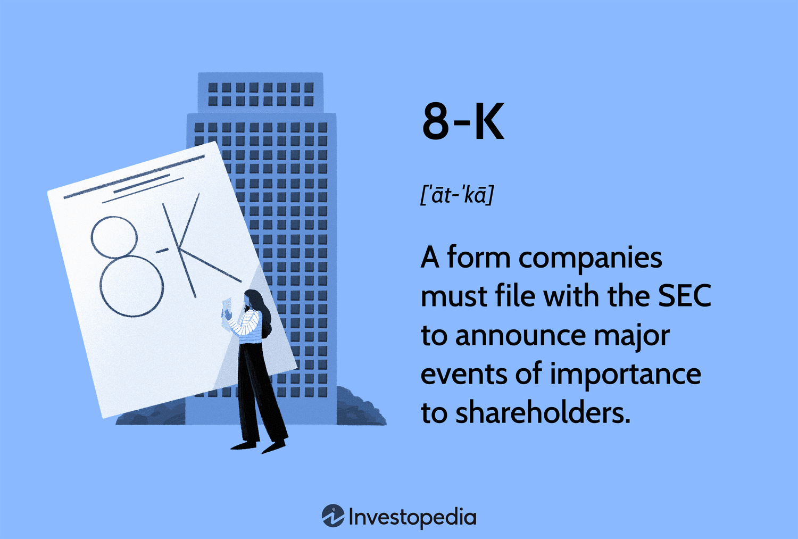

## Table of Contents

## What is SEC Form 8-K?

SEC Form 8-K is a report that public companies in the United States have to file with the Securities and Exchange Commission (SEC). This form is used to tell investors about important events that happen in the company. These events can include things like big changes in the company's leadership, mergers or acquisitions, or even if the company is facing financial problems.

The form helps keep investors informed so they can make better decisions about buying or selling the company's stock. Companies usually have to file the Form 8-K very quickly, often within four business days of the event happening. This makes sure that the information gets to investors as soon as possible.

## Why is SEC Form 8-K important for investors?

SEC Form 8-K is really important for investors because it keeps them in the loop about big changes or events happening in a company. When a company has to file an 8-K, it means something important has happened, like a new CEO being appointed, a merger with another company, or even if the company is having money troubles. By knowing about these events quickly, investors can decide if they want to buy more stock, sell what they have, or hold onto it and see what happens next.

The quick filing requirement of the 8-K, usually within four business days, makes sure that investors get this important information fast. This helps create a fair market where everyone has the same chance to react to new information. Without the 8-K, some people might find out about these events before others, which could lead to unfair advantages in trading. So, the 8-K helps keep the market honest and helps investors make smart choices based on the latest news about a company.

## What types of events trigger the filing of a Form 8-K?

Form 8-K is filed for many different important events that happen in a company. Some common events include when a company changes its leadership, like when a new CEO or CFO is appointed. It's also filed if the company makes a big deal, like merging with another company or buying a big part of another business. If the company's financial situation changes a lot, like if it's having trouble paying its debts or if it's doing much better than expected, that also triggers an 8-K.

Another reason for filing an 8-K is if the company's stock changes in a big way, like if it starts trading on a new stock exchange or if the company decides to buy back a lot of its own stock. Also, if there's a big change in the company's accounting practices or if it finds out about a big problem with its financial statements, it has to file an 8-K. These events are important because they can affect how investors see the company and what they decide to do with their investments.

## How soon after an event must a company file a Form 8-K?

A company usually has to file a Form 8-K within four business days after an important event happens. This quick timeline is to make sure that investors get the information as soon as possible. The idea is to keep everyone in the market on the same page and to stop some people from getting an unfair advantage by knowing about the event before others.

There are a few exceptions to this four-day rule. For example, if a company is announcing the results of a shareholders' vote on something important, it has to file the 8-K even faster, within four business days after the vote happens. Also, if the company is reporting that it can't file its regular financial reports on time, it has to file the 8-K right away to let investors know about the delay. These rules help make sure that the market stays fair and that investors can make good choices with the latest information.

## Who is required to file a Form 8-K?

Public companies in the United States that have their stock traded on a stock exchange need to file a Form 8-K. This includes big companies like Apple and smaller ones that anyone can buy stock in. The main reason they have to file is to tell investors about important events that happen in the company.

These events can be things like a new CEO being chosen, the company merging with another business, or big financial changes. By filing the Form 8-K, the company makes sure that everyone who might want to buy or sell its stock knows about these important updates quickly. This helps keep the stock market fair for everyone.

## What are the different items covered under Form 8-K?

Form 8-K covers many different important events that a company needs to tell investors about. Some of these events include changes in the company's leadership, like when a new CEO or CFO is chosen. It also includes big business deals, like when a company merges with another company or buys a big part of another business. If the company's financial situation changes a lot, like if it's having trouble paying its debts or if it's doing much better than expected, that's another reason to file an 8-K.

Other events that trigger an 8-K include big changes in the company's stock, like if it starts trading on a new stock exchange or if the company decides to buy back a lot of its own stock. Also, if there's a big change in the company's accounting practices or if it finds out about a big problem with its financial statements, it has to file an 8-K. These events are important because they can affect how investors see the company and what they decide to do with their investments.

## Can you explain the amendments and corrections process for Form 8-K?

If a company makes a mistake on its Form 8-K or if something changes after they file it, they can fix it by filing an amended Form 8-K. This is called Form 8-K/A. The company has to explain what they are changing and why. They usually have to file this amendment as soon as they find out about the mistake or the change. This helps keep the information they share with investors accurate and up to date.

The process for filing an amended Form 8-K is pretty simple. The company just needs to fill out the form again, marking it as an amendment, and send it to the SEC. They need to make it clear what parts of the original Form 8-K they are changing. This way, investors can easily see the new information and understand how it might affect their decisions about the company's stock.

## How does Form 8-K differ from other SEC forms like 10-K and 10-Q?

Form 8-K is different from Form 10-K and Form 10-Q because it's used to report important events that happen in a company. These events can be things like a new CEO being chosen, a merger with another company, or big financial changes. Companies have to file an 8-K quickly, usually within four business days of the event happening. This helps keep investors informed about what's going on in the company right away.

On the other hand, Form 10-K and Form 10-Q are used to give investors a regular update on the company's financial health. Form 10-K is an annual report that covers the whole year, while Form 10-Q is a quarterly report that covers the last three months. These forms include detailed financial statements and information about the company's business, but they are filed on a set schedule, not because of specific events. So, while Form 8-K is about quick updates on important events, Form 10-K and 10-Q are about regular, detailed financial reports.

## What are the penalties for not filing a Form 8-K on time?

If a company does not file a Form 8-K on time, it can face some serious penalties. The Securities and Exchange Commission (SEC) can take action against the company. This might mean the company has to pay a fine, which can be a lot of money. The SEC might also stop the company from selling its stock to the public until it files the Form 8-K. This can hurt the company's business because it can't raise money by selling more stock.

Besides fines and restrictions, not filing a Form 8-K on time can also hurt the company's reputation. Investors might lose trust in the company if it doesn't follow the rules. This can make the company's stock price go down, which is bad for the company and its shareholders. So, it's really important for companies to file their Form 8-K on time to avoid these problems.

## How can companies ensure compliance with Form 8-K filing requirements?

Companies can make sure they follow the rules for filing Form 8-K by setting up good systems and training their staff. They should have a clear plan for who is in charge of watching for important events that need to be reported. This person or team should know what kinds of events need a Form 8-K and how quickly they need to file it. It's also a good idea to use special software that can help keep track of deadlines and make sure the form is filled out correctly.

Another way to stay compliant is to keep good records and have regular check-ins. Companies should keep detailed notes about any events that might need a Form 8-K and review these notes often. They should also have meetings to go over what's been filed and what's coming up. If something changes or if there's a mistake, they need to file an amended Form 8-K right away. By staying organized and proactive, companies can avoid missing deadlines and keep investors informed.

## What role does technology play in the filing and management of Form 8-K?

Technology plays a big role in helping companies file and manage Form 8-K. Special software can make it easier for companies to keep track of important events that need to be reported. This software can send reminders about deadlines and help fill out the form correctly. It can also store all the information in one place, so it's easy to find and use when needed. This helps companies make sure they file their Form 8-K on time and avoid mistakes.

Using technology also makes it easier for companies to share the Form 8-K with the SEC and investors. They can file the form online, which is faster and more reliable than sending paper forms. This means investors can get the information quickly, which is important for making good decisions about buying or selling stock. Overall, technology helps keep everything organized and makes the whole process smoother and more efficient.

## What are some best practices for preparing and reviewing a Form 8-K before submission?

To prepare and review a Form 8-K before submission, companies should start by setting up a clear process for gathering all the needed information. This means having a team that knows what events need to be reported and how to describe them in the form. They should also use software that helps them fill out the form correctly and keeps track of deadlines. It's important to double-check all the details to make sure everything is accurate and complete. If there are any mistakes or changes, the team should be ready to file an amended Form 8-K quickly.

Once the form is ready, it's a good idea to have a few people review it before sending it to the SEC. This helps catch any errors and makes sure the form is easy to understand. The reviewers should check that all the required information is included and that it follows the SEC's rules. By being thorough and careful, companies can make sure their Form 8-K is filed on time and meets all the requirements, which helps keep investors informed and avoids any penalties.

## References & Further Reading

[1]: ["SEC Form 8-K."](https://www.sec.gov/about/forms/form8-k.pdf) U.S. Securities and Exchange Commission.

[2]: Rauterberg, G. (2019). ["The Aftermarket for Innovation."](https://www.mckinsey.com/industries/automotive-and-assembly/our-insights/ready-for-inspection-the-automotive-aftermarket-in-2030) Yale Journal on Regulation.

[3]: Moses, O., & Werner, T. (2014). ["Trading Proximity and Merger Predictability."](https://quizlet.com/446465720/unit-3-interpersonal-communication-flash-cards/) Journal of Financial Economics.

[4]: Hasbrouck, J. (2003). ["Intraday Price Formation in US Equity Index Markets."](https://onlinelibrary.wiley.com/doi/10.1046/j.1540-6261.2003.00609.x) Journal of Financial Markets.

[5]: Mishra, D. R., Gopalakrishnan, S., & Yu, Z. (2014). ["The Impact of Announcements and Algorithmic Trading on an Emerging Market."](https://pubmed.ncbi.nlm.nih.gov/31653092/) International Journal of Finance & Economics.