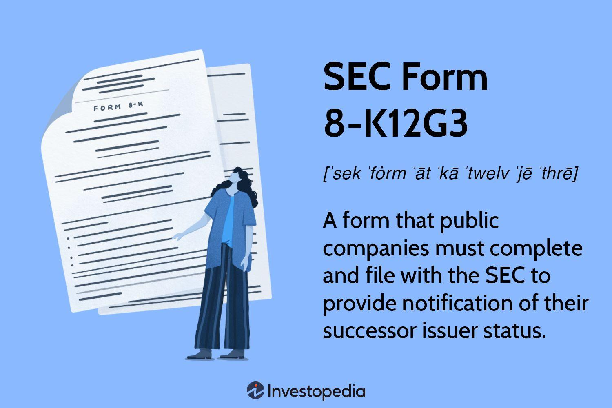

In the financial world, transparency and timely information are crucial for investors and stakeholders. The SEC Form 8-K12G3 plays a significant role in this process by acting as a notification mechanism for new issuers of registered securities following mergers or acquisitions. This article aims to explore the significance of SEC Form 8-K12G3, its importance, filing implications, and its effects on stakeholders. 

As algorithmic trading and financial technology expand, proper reporting through mechanisms like SEC filings becomes increasingly important. Algorithmic trading strategies often depend on accurately timed and factual disclosures to function optimally. Emphasis is placed on examining the connection between SEC Form 8-K12G3 and these algorithmic trading strategies, as well as understanding the influence of regulatory frameworks on such trading techniques.



The connection between regulatory filings and algorithmic trading is particularly compelling. Traders use algorithms that rely on data extracted from these filings to make informed decisions. Efficient market hypothesis presupposes that stock prices reflect all available information, making timely and accurate regulatory filings imperative. As such, SEC Form 8-K12G3 doesn't merely fulfill compliance obligations. It also deeply influences pricing mechanisms and trading activities, necessitating a robust grasp of its role and impact.

## Table of Contents

## What is SEC Form 8-K12G3?

SEC Form 8-K12G3 is a designated filing utilized by companies to inform the Securities and Exchange Commission (SEC) about the emergence of a new issuer following events such as corporate mergers or acquisitions. This form is a crucial element of regulatory compliance mandated by the Securities Exchange Act of 1934, a landmark piece of legislation enacted to govern securities transactions and protect investors by promoting transparency and fairness in financial markets.

The primary function of Form 8-K12G3 is to provide a notification mechanism for changes in the issuer status of securities. Such changes typically occur when one company takes over another or when two companies merge, resulting in a newly formed entity that becomes responsible for the securities previously issued by the individual companies. The transparency ensured by the filing of this form is essential for maintaining investor confidence, as it publicly discloses material changes in ownership and control of securities.

This filing is critical during the transition of securities authority, where the responsibility for the securities may shift from one corporate entity to another. This shift is a key aspect of maintaining market integrity, as it assures investors and regulators that the new issuer will adhere to the same regulatory requirements and disclosures as the predecessor entities. By doing so, it helps to prevent any potential disruptions in market operations or loss of investor confidence resulting from insufficiently communicated changes in corporate structure.

The importance of this form is underscored by its role in fulfilling the SEC's overarching mission to maintain orderly and efficient markets. Ensuring the continuous flow of honest and complete information to investors is vital for the proper functioning of capital markets. Consequently, filings like SEC Form 8-K12G3 play a strategic role in upholding the principles of transparency and accountability that are fundamental to the securities regulatory framework.

## Important Aspects of SEC Form 8-K12G3

Understanding the reporting requirements and significance of SEC Form 8-K12G3 is crucial for companies engaged in mergers and acquisitions. This form originates from the need to ensure that significant changes in company ownership are communicated clearly to the SEC and the public. 

Unlike the regular Form 8-K, which serves a broader purpose by covering various corporate events, Form 8-K12G3 is tailored specifically for situations where there is a new issuer of a registered security due to a merger or acquisition. This form is designed to facilitate a seamless transition by notifying the change in the entity responsible for the security, thus upholding transparency and reducing the risk of information asymmetry in the market.

Filing Form 8-K12G3 ensures that the new issuer inherits and acknowledges the responsibilities of reporting and compliance as mandated by the SEC. This is critical because it maintains the regulatory framework that governs market operations, ensuring that the new entity adheres to existing legal and financial disclosure standards. By standardizing the reporting process, this form helps in maintaining a level playing field, reassuring investors of the continuity and integrity of their investments.

For companies undergoing organizational changes, understanding the nuances of Form 8-K12G3 is indispensable. Accurate and timely disclosure of pertinent information not only fulfills legal obligations but also strengthens investor confidence. By ensuring that all stakeholders have access to the same information at the same time, Form 8-K12G3 plays a vital role in fostering a fair and efficient market environment.

## Events Triggering Form 8-K12G3 Filing

Key events necessitating the filing of SEC Form 8-K12G3 primarily include corporate mergers and acquisitions, along with significant shifts in company control or management structure. These situations trigger the need for this specific filing as they signify crucial modifications in the issuer of securities—a matter requiring disclosure to the Securities and Exchange Commission (SEC).

Corporate mergers and acquisitions represent scenarios where one company absorbs another, or two companies combine to form a new entity. Such events necessitate the submission of SEC Form 8-K12G3 to notify the SEC and investors about the transition of issuing obligations from the original company to the newly merged or acquired entity. This form ensures that investors are informed of the changes and understand the continuity in securities' legal responsibility, maintaining market integrity and investor trust.

Additionally, substantial alterations in company control or changes within the management structure can also trigger the need for this filing. These changes could entail a shift in the decision-making hierarchy, significantly affecting company operations, governance, and, consequently, its financial reporting obligations. By filing Form 8-K12G3, the company reaffirms its compliance with SEC rules, providing transparency in its governance and shareholding changes.

The primary purpose of Form 8-K12G3 is to detail the new issuer's obligations regarding any relevant agreements following such corporate changes. This transparency ensures that all stakeholders are aware of any modifications or continuations in agreements that might affect investor interests. It helps in securing investor confidence and meeting regulatory compliance by making all material changes accessible to the public and investors alike.

## Implications for Algorithmic Trading

Algorithmic trading, which leverages advanced computational algorithms to execute trades at high speeds and volumes, requires access to timely and accurate corporate information to effectively assess market conditions and trends. SEC Form 8-K12G3 filings, which document significant changes in corporate control and security issuances due to mergers or acquisitions, provide crucial real-time data that can influence trading decisions.

Traders and algorithmic systems benefit from these filings by using [artificial intelligence](/wiki/ai-artificial-intelligence) (AI) and [machine learning](/wiki/machine-learning) (ML) techniques to swiftly interpret and react to these updates. AI systems are trained to parse extensive financial reports, extracting meaningful insights that can signal potential trading opportunities. For instance, a sudden increase in merger activities, as identified through frequent 8-K12G3 filings, might prompt algorithms to adjust their trading strategies in anticipation of market [volatility](/wiki/volatility-trading-strategies) or price shifts.

To demonstrate this process, consider a simple Python script leveraging natural language processing (NLP) to analyze the content of an SEC Form 8-K12G3:

```python
import nltk
from sklearn.feature_extraction.text import CountVectorizer
from sklearn.naive_bayes import MultinomialNB

# Sample Form 8-K12G3 text
form_text = """On October 1, 2023, XYZ Corporation completed its acquisition of ABC Inc., resulting in a change of control."""

# Tokenize and vectorize the text
vectorizer = CountVectorizer()
text_vector = vectorizer.fit_transform([form_text])

# Load a pre-trained model (hypothetical)
model = MultinomialNB()
model.fit(text_vector, [1])  # Assume 1 indicates 'significant corporate change'

# Predict significance based on new filing
prediction = model.predict(text_vector)

if prediction[0] == 1:
    print("Significant corporate event detected: Trading strategy adjustment recommended.")
```

This example showcases how algorithms can be designed to detect and respond to corporate changes without human input, enabling more efficient and informed trading actions. Continuous refinement of such models, based on evolving SEC reporting rules and corporate event datasets, enhances the precision and responsiveness of [algorithmic trading](/wiki/algorithmic-trading) systems.

Understanding the nuances and regulatory shifts related to SEC filings is essential for developers working on these algorithms. Developers must ensure that their systems remain compliant with legal standards, which involves regular updates to account for new filing requirements or changes in data availability from the SEC. This not only supports regulatory adherence but also improves the competitive edge of trading platforms by ensuring that their strategic decisions are informed by the most current and comprehensive data available.

## Common Pitfalls and Best Practices

Companies must ensure accuracy and completeness in their SEC filings to avoid regulatory penalties. Errors or omissions in SEC filings can lead to significant consequences, including financial penalties, loss of shareholder trust, and potential legal liabilities. Therefore, adhering to best practices is critical.

One of the most effective strategies is the implementation of detailed internal reviews. This involves setting up a robust internal control system where multiple levels of a company’s hierarchy participate in the scrutiny of filing documents. Regular audits and checks can help detect discrepancies early and guarantee that all required information is comprehensively covered before submission.

Moreover, consultation with legal advisors is highly recommended. Legal advisors bring expertise in SEC regulations and can provide guidance on complex regulatory requirements, ensuring that companies remain in compliance and avoid common pitfalls. They can help interpret the nuanced aspects of financial regulations, offering insights that may not be immediately evident to company executives or accountants.

Technology solutions play an increasingly important role in ensuring compliance with SEC filing requirements. Tools for real-time compliance monitoring, such as software platforms that track regulatory changes and assess a company’s filing status, can prevent oversights. These platforms often use artificial intelligence and machine learning to provide alerts, report generation, and analytics, thereby streamlining the compliance process.

Timeliness in filing is another critical aspect of best practices. Late filings can undermine a company’s reputation and erode investor trust. Ensuring deadlines are met requires a coordinated effort from all departments involved in the preparation of these documents. Employing project management techniques to schedule and track progress can be beneficial. For instance, using Gantt charts or project management software can provide visual timelines and milestones, aiding teams in staying organized and on schedule.

Ultimately, maintaining accuracy, consulting with legal expertise, utilizing technological advancements, and adhering to deadlines are fundamental to successful SEC filings. These practices not only keep companies compliant but also reinforce their credibility with investors and stakeholders.

## Conclusion

SEC Form 8-K12G3 represents a pivotal element in the financial reporting landscape, especially when handling mergers and acquisitions. It serves as a mechanism for informing stakeholders of new issuers of registered securities, thus playing a fundamental role in ensuring corporate transparency and timely dissemination of information. This transparency is essential for maintaining market fairness and integrity, enabling investors and traders to make informed decisions based on reliable and updated data.

The relevance of SEC Form 8-K12G3 is underscored in the context of algorithmic trading, where high-frequency trading algorithms rely on the continuous inflow of precise information to assess market conditions rapidly. When significant corporate changes are made public through this form, algorithmic strategies can recalibrate based on these disclosures, providing a responsive and dynamic trading environment.

The evolution of financial technology further highlights the importance of understanding and adhering to SEC filing requirements. As markets become more complex and interwoven with technological advancements, the ability to navigate and comply with regulatory standards like those set by the SEC will be a defining [factor](/wiki/factor-investing) for corporate entities. Ensuring compliance not only safeguards against legal repercussions but also fortifies investor confidence, which is paramount for the sustainable growth and stability of financial markets.

In conclusion, as financial markets continue to evolve, the principles embodied by SEC Form 8-K12G3 provide a critical framework for corporate accountability and market transparency. This alignment with regulatory guidelines will remain a cornerstone of fiduciary responsibility and operational integrity in the financial sector.

## References & Further Reading

[1]: Johnson, S. (2009). ["How Algorithms Came to Rule Our World."](https://archive.org/details/automatethishowa0000stei) Wired.

[2]: SEC Division of Corporation Finance. (2020). ["Exchange Act Form 8-K Compliance and Disclosure Interpretations."](https://www.sec.gov/rules-regulations/staff-guidance/compliance-disclosure-interpretations/exchange-act-form-8-k) U.S. Securities and Exchange Commission.

[3]: Aldridge, I. (2013). ["High-Frequency Trading: A Practical Guide to Algorithmic Strategies and Trading Systems"](https://www.amazon.com/High-Frequency-Trading-Practical-Algorithmic-Strategies/dp/1118343506) by Irene Aldridge.

[4]: Hull, J. C. (2018). ["Options, Futures, and Other Derivatives"](https://www.semanticscholar.org/paper/Options%2C-Futures%2C-and-Other-Derivatives-Hull/89bdee500c8623864fc9eb7a471546aa713acc44) (10th Edition). Pearson.

[5]: Malkiel, B. G. (2015). ["A Random Walk Down Wall Street: The Time-Tested Strategy for Successful Investing"](https://www.amazon.com/Random-Walk-Down-Wall-Street/dp/0393330338) (11th Edition). W.W. Norton & Company.